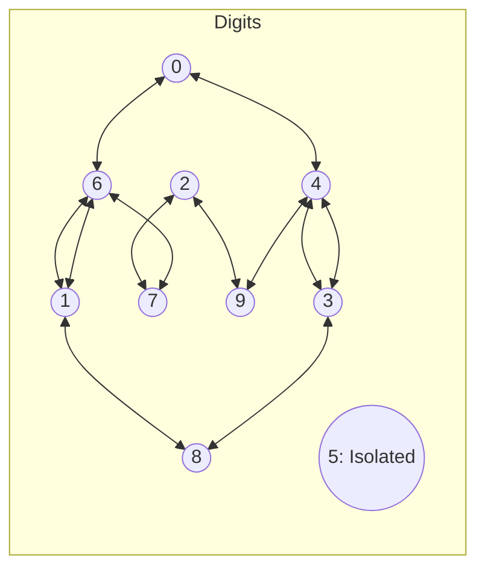

# Guided Example: Knight Dialer

We trace the step-by-step state propagation of chess knight jumps on the numeric keypad, prove the Directed Adjacency Flow Invariant across digit equivalence classes, and evaluate distinct sequence counts on representative path lengths:

- **Representative Instance 1 (Unit Length Baseline):**
  $$
  n = 1
  $$
- **Required Output:** `10`
  - A phone number of length $1$ requires $0$ jumps.
  - The knight can start on any of the $10$ digits $\{0, 1, 2, 3, 4, 5, 6, 7, 8, 9\}$:
    $$
    f = [1, 1, 1, 1, 1, 1, 1, 1, 1, 1] \implies \sum f = \mathbf{10}
    $$

- **Representative Instance 2 (Single Jump Transitions):**
  $$
  n = 2
  $$
- **Required Output:** `20`
  - Outgoing knight jumps from each starting digit:
    - From $0$: jumps to $\{4, 6\}$ ($2$ paths).
    - From $1$: jumps to $\{6, 8\}$ ($2$ paths).
    - From $2$: jumps to $\{7, 9\}$ ($2$ paths).
    - From $3$: jumps to $\{4, 8\}$ ($2$ paths).
    - From $4$: jumps to $\{0, 3, 9\}$ ($3$ paths).
    - From $5$: isolated cell, no legal moves ($0$ paths).
    - From $6$: jumps to $\{0, 1, 7\}$ ($3$ paths).
    - From $7$: jumps to $\{2, 6\}$ ($2$ paths).
    - From $8$: jumps to $\{1, 3\}$ ($2$ paths).
    - From $9$: jumps to $\{2, 4\}$ ($2$ paths).
  - Total numbers of length $2$:
    $$
    2 + 2 + 2 + 2 + 3 + 0 + 3 + 2 + 2 + 2 = \mathbf{20}
    $$

- **Representative Instance 3 (Two Jump Sequences):**
  $$
  n = 3 \implies \text{output} = \mathbf{46}
  $$

---

## 1. Instance & Teaching Goal

The chess knight moves on a standard numeric keypad:
```text
1   2   3
4   5   6
7   8   9
*   0   #
```
The knight can stand on any numeric cell, but cannot place its hooves on `*` or `#`.
Given an integer $n$, return the number of distinct phone numbers of length $n$ we can dial.
Because the answer may be very large, return it modulo $10^9 + 7$.

```text
Keypad Jump Graph:
  0 <---> { 4, 6 }
  1 <---> { 6, 8 }
  2 <---> { 7, 9 }
  3 <---> { 4, 8 }
  4 <---> { 0, 3, 9 }
  5 <---> { }  (Isolated: 0 edges!)
  6 <---> { 0, 1, 7 }
  7 <---> { 2, 6 }
  8 <---> { 1, 3 }
  9 <---> { 2, 4 }
```

A brute-force DFS enumerates paths of length $n$ recursively. Since branching factor averages $\approx 2$, the recursion tree has size $\mathcal{O}(10 \cdot 2^n)$. For $n = 5{,}000$, $2^{5000}$ operations causes immediate freeze.

The decisive pedagogical goal is the **Markov Adjacency Transition Invariant**:
- Let $f[d]$ denote the number of valid dialed sequences of length $k$ terminating on digit $d$.
- A sequence of length $k + 1$ ending on digit $d$ is formed by extending any sequence of length $k$ that ended on a valid knight neighbor $u \in \text{adj}(d)$.
- Thus:
  $$
  g[d] = \sum_{u \in \text{predecessors}(d)} f[u] \pmod{10^9 + 7}
  $$
- The state space is fixed at exactly $10$ values, running in $\mathcal{O}(n)$ time and $\mathcal{O}(1)$ auxiliary space.

---

## 2. Conceptual Foundation & The Adjacency Flow Invariant



### The Transition Equations

For each step from path length $k$ to $k + 1$:
$$
\begin{aligned}
g[0] &= f[4] + f[6] \\
g[1] &= f[6] + f[8] \\
g[2] &= f[7] + f[9] \\
g[3] &= f[4] + f[8] \\
g[4] &= f[0] + f[3] + f[9] \\
g[5] &= 0 \\
g[6] &= f[0] + f[1] + f[7] \\
g[7] &= f[2] + f[6] \\
g[8] &= f[1] + f[3] \\
g[9] &= f[2] + f[4]
\end{aligned}
$$
Because the keypad graph is undirected, the predecessors of $d$ are identical to the neighbors of $d$.
Digit $5$ has degree $0$, meaning $g[5] = 0$ for all $n > 1$.

---

## 3. Step-by-Step Worked Execution: $n = 3$

### Step 1: Base State ($k = 1$)
Each digit represents $1$ sequence of length $1$:
$$
f = [1, 1, 1, 1, 1, 1, 1, 1, 1, 1], \quad \sum f = 10
$$

---

### Step 2: First Jump ($k = 2$)
Evaluate transitions:
- $g[0] = f[4] + f[6] = 1 + 1 = 2$
- $g[1] = f[6] + f[8] = 1 + 1 = 2$
- $g[2] = f[7] + f[9] = 1 + 1 = 2$
- $g[3] = f[4] + f[8] = 1 + 1 = 2$
- $g[4] = f[0] + f[3] + f[9] = 1 + 1 + 1 = 3$
- $g[5] = 0$
- $g[6] = f[0] + f[1] + f[7] = 1 + 1 + 1 = 3$
- $g[7] = f[2] + f[6] = 1 + 1 = 2$
- $g[8] = f[1] + f[3] = 1 + 1 = 2$
- $g[9] = f[2] + f[4] = 1 + 1 = 2$
Vector after $k = 2$:
$$
f = [2, 2, 2, 2, 3, 0, 3, 2, 2, 2], \quad \sum f = 20
$$

---

### Step 3: Second Jump ($k = 3$)
Evaluate transitions using $f$:
- $g[0] = f[4] + f[6] = 3 + 3 = \mathbf{6}$
- $g[1] = f[6] + f[8] = 3 + 2 = \mathbf{5}$
- $g[2] = f[7] + f[9] = 2 + 2 = \mathbf{4}$
- $g[3] = f[4] + f[8] = 3 + 2 = \mathbf{5}$
- $g[4] = f[0] + f[3] + f[9] = 2 + 2 + 2 = \mathbf{6}$
- $g[5] = 0$
- $g[6] = f[0] + f[1] + f[7] = 2 + 2 + 2 = \mathbf{6}$
- $g[7] = f[2] + f[6] = 2 + 3 = \mathbf{5}$
- $g[8] = f[1] + f[3] = 2 + 2 = \mathbf{4}$
- $g[9] = f[2] + f[4] = 2 + 3 = \mathbf{5}$
Vector after $k = 3$:
$$
f = [6, 5, 4, 5, 6, 0, 6, 5, 4, 5]
$$
Sum:
$$
6 + 5 + 4 + 5 + 6 + 0 + 6 + 5 + 4 + 5 = \mathbf{46}
$$

Output: **`46`**.

---

## 4. Complete DP State Evolution Table

| Path Length $k$ | $d=0$ | $d=1$ | $d=2$ | $d=3$ | $d=4$ | $d=5$ | $d=6$ | $d=7$ | $d=8$ | $d=9$ | Total Dialed Sequences $\sum f$ |
|:---:|:---:|:---:|:---:|:---:|:---:|:---:|:---:|:---:|:---:|:---:|:---:|
| **$1$ (Base)** | $1$ | $1$ | $1$ | $1$ | $1$ | $1$ | $1$ | $1$ | $1$ | $1$ | $\mathbf{10}$ |
| **$2$** | $2$ | $2$ | $2$ | $2$ | $3$ | $0$ | $3$ | $2$ | $2$ | $2$ | $\mathbf{20}$ |
| **$3$** | $6$ | $5$ | $4$ | $5$ | $6$ | $0$ | $6$ | $5$ | $4$ | $5$ | $\mathbf{46}$ |
| **$4$** | $12$ | $10$ | $10$ | $10$ | $16$ | $0$ | $16$ | $10$ | $10$ | $10$ | $\mathbf{104}$ |

---

## 5. Algorithmic Correctness

### Soundness & Completeness
1. **Soundness:**
   Every transition $g[d] = \sum_{u \in \text{adj}(d)} f[u]$ strictly respects the geometric movement of a chess knight on the keypad. Because any path of length $k + 1$ ending on $d$ must have arrived from some knight-accessible neighbor $u$ at step $k$, summing the distinct ways to reach each neighbor guarantees valid path construction.
2. **Completeness:**
   All legal starting digits are accounted for in base state $k = 1$. At each step, all allowable knight moves are evaluated across all digits. No valid phone sequence is omitted. Modulo arithmetic operations maintain correctness under large numbers.

---

## 6. Boundary Cases & Traps

| Scenario | Input | Behavior | Trapped Risk |
|---|---|---|---|
| Single Digit ($n = 1$) | $n = 1$ | Returns $10$; loops $0$ times; digit $5$ is counted. | Mistakenly setting $5$ to $0$ when $n = 1$. |
| Isolated Cell $5$ | $n \ge 2$ | $g[5] = 0$; digit $5$ can never be reached after start. | Allowing illegal jumps from/to $5$. |
| Large $n$ Modulo | $n = 5000$ | Arithmetic operations bounded by $10^9 + 7$. | 32-bit integer overflow before modulo. |
| Keypad Boundaries | `*` and `#` | Not present in transition graph; knight never lands on them. | Handling keypad non-digits dynamically. |

---

## 7. Complexity Derivation

- **Time Complexity:** $\mathcal{O}(n)$.
  - The loop iterates $n - 1$ times.
  - In each iteration, exactly $10$ constant-time algebraic additions are computed.
  - Total operations: at most $20n$, completing in $< 0.005\text{ s}$ for $n = 5{,}000$.
  - (Can alternatively be solved in $\mathcal{O}(\log n)$ via $10 \times 10$ matrix exponentiation).
- **Auxiliary Space Complexity:** $\mathcal{O}(1)$ strictly.
  - The state vector $f$ and next-state vector $g$ have fixed size $10$, using negligible auxiliary memory.
