[TOC]

## Solution

---

### Approach 1: Top-Down Dynamic Programming

**Intuition**

> **Note.** For this approach, we assume that you already know the fundamentals of dynamic programming and are figuring out how to apply it to a wide range of problems, such as this one. If you are not yet at this stage, we recommend checking out our relevant [Explore Card content on dynamic programming](https://leetcode.com/explore/featured/card/dynamic-programming/) before coming back to this problem.

Let's start by considering which squares we can jump to from each square, using this picture as reference.

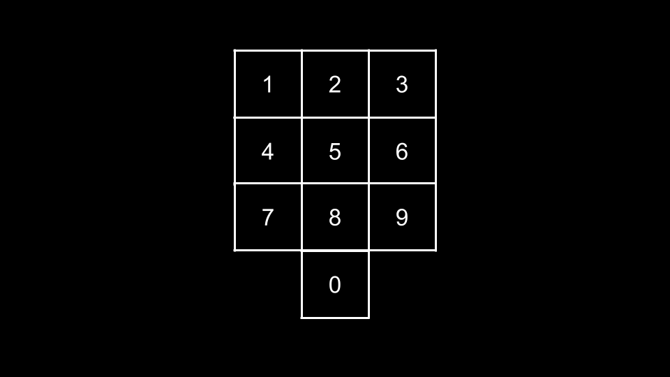
<br>

| From | Can Jump To
|:---:|:---:|
|  0  | 4, 6 |
|  1  | 6, 8 |
|  2  | 7, 9 |
|  3  | 4, 8 |
|  4  | 3, 9, 0 |
|  5  |   |
|  6  | 1, 7, 0 |
|  7  | 2, 6 |
|  8  | 1, 3 |
|  9  | 2, 4 |

<br>

We can see that the phone pad is a graph. From square `0`, we can jump to squares `4, 6` etc.

As an example, let's say the knight is currently on square `7` and we need to make `5` more jumps. How many ways can we finish these `5` jumps? We have two possibilities:

1. Jump to square `2`. Now, we're on square `2` and need to make `4` more jumps.
2. Jump to square `6`. Now, we're on square `6` and need to make `4` more jumps.

Both options create a similar subproblem - we still need to determine how many ways we can finish the jumps, we're just on a different square and have fewer jumps remaining. Let's define a function `dp(remain, square)`. It will return the number of ways to finish `remain` jumps if we're currently on `square`.

The base case of this function is when $remain = 0$. We have finished the task, so we can just `return 1`.

Otherwise, we must calculate the value of `dp(remain, square)`. Consider all squares that we could jump to from `square` (which we can find from the table above). For each `nextSquare`, jumping to `nextSquare` would yield $dp(remain - 1, nextSquare)$ ways to finish the jumps. The answer to `dp(remain, square)` is the sum of all these options.

> We will use a 2d array `jumps` to store the information from the table above, where $\text{jumps}[square]$ contains all the `nextSquare` squares we could jump to from `square`.

So what is the answer to our original problem? The problem description states that we can place the knight on any starting square. Thus, we must consider all squares as the starting square. Given a starting `square`, we must make $n - 1$ jumps. This is because the starting square automatically contributes `1` toward our path of length `n`, and each jump will contribute `1` more. Thus, we need to make $n - 1$ jumps.

Overall, the answer to the problem is the sum of $dp(n - 1, square)$ for all values of `square` in the range `[0, 9]`.

Lastly, don't forget that we need to memoize our `dp` function. Many states of `remain, square` will overlap as each call to `dp` can create up to three more calls to `dp`. To avoid an exponential amount of repeated computation, we will cache the answer to each state. Before calculating a state `remain, square`, we will first check if we have already cached the value.

**Algorithm**

Note: to avoid integer overflow, all arithmetic should be done mod $10^9 + 7$.

1. Define an array `jumps` where $\text{jumps}[square]$ contains a list of all squares that you can jump to from `square`.
2. Define a memoized function `dp(remain, square)`:
- If $remain = 0$, return `1`.
- Initialize $ans = 0$.
- Iterate `nextSquare` over $\text{jumps}[square]$:
- Add $dp(remain - 1, nextSquare)$ to `ans`.
- Return `ans`.
3. Initialize $ans = 0$.
4. Iterate `square` from `0` to `9`:
- Add $dp(n - 1, square)$ to `ans`.
5. Return `ans`.

**Implementation**

```python
class Solution:
    def knightDialer(self, n: int) -> int:
        @cache
        def dp(remain, square):
            if remain == 0:
                return 1

            ans = 0
            for next_square in jumps[square]:
                ans = (ans + dp(remain - 1, next_square)) % MOD

            return ans

        jumps = [
            [4, 6],
            [6, 8],
            [7, 9],
            [4, 8],
            [3, 9, 0],
            [],
            [1, 7, 0],
            [2, 6],
            [1, 3],
            [2, 4]
        ]

        ans = 0
        MOD = 10 ** 9 + 7
        for square in range(10):
            ans = (ans + dp(n - 1, square)) % MOD

        return ans
```

**Complexity Analysis**

* Time complexity: $O(n)$

    If $k$ is the size of the phone pad, then there are $O(n \cdot k)$ states to our DP. Because $k = 10$ in this problem, we can treat $k$ as a constant and thus there are $O(n)$ states to our DP.

    Due to memoization, we never calculate a state more than once. Since the number of `nextSquare` is no more than `3` for each square, calculating each state is done in $O(1)$ as we simply perform a for loop that never iterates more than `3` times.

    Overall, we calculate $O(n)$ states with each state costing $O(1)$ to calculate. Thus, our time complexity is $O(n)$.

* Space complexity: $O(n)$

    The recursion call stack will grow to a size of $O(n)$. With memoization, we also store the results to every DP state. As there are $O(n)$ states, we require $O(n)$ space to store all the results.

<br/>

---

### Approach 2: Bottom-Up Dynamic Programming

**Intuition**

The same algorithm from the previous approach can be implemented iteratively.

The "answer states" are the states that represent the answer to the original problem. With the way we defined `dp`, the answer states exist when $remain = n - 1$. In the previous approach, we started at the answer state and made recursive calls down to the base case ($remain = 0$).

In this approach, we will start at the base case and iterate toward the answer states. The base case and recurrence relation remain the same. We will simply use a 2d array `dp` instead of a function. Note that in this approach, $\text{dp}[remain][square]$ is equal to `dp(remain, square)` from the previous approach.

Using two nested loops, we iterate over all states of `remain, square`. Each iteration is analogous to a function call from the previous approach, as we have isolated a state. We use the same process in this nested for loop to calculate the answer for `remain, square`:

$\text{dp}[remain][square] = sum(dp[remain - 1][nextSquare])$ for all `nextSquare` in $\text{jumps}[sqaure]$

We start by setting the base case: $\text{dp}[0][square] = 1$ for all values of `square`. We then iterate the states from the base case toward the answer states, i.e. we will start with $remain = 1$ and go until $remain = n - 1$.

Once `dp` is fully populated, we can find the answer to the original problem by taking the sum of $dp[n - 1][square]$ for all `square`.

**Algorithm**

Note: to avoid integer overflow, all arithmetic should be done mod $10^9 + 7$.

1. Define an array `jumps` where $\text{jumps}[square]$ contains a list of all squares that you can jump to from `square`.
2. Initialize a 2d array `dp` of size $n * 10$.
3. Set the base case: $\text{dp}[0][square] = 1$ for all `square` from `0` to `9`.
4. Iterate `remain` from `1` until `n`:
- Iterate `square` from `1` to `9`:
- Initialize $ans = 0$.
- Iterate `nextSquare` over $\text{jumps}[square]$:
- Add $dp[remain - 1][nextSquare]$ to `ans`.
- Set $\text{dp}[remain][square] = ans$.
5. Initialize $ans = 0$.
6. Iterate `square` from `0` to `9`:
- Add $dp[n - 1][square]$ to `ans`.
7. Return `ans`.

**Implementation**

```python
class Solution:
    def knightDialer(self, n: int) -> int:
        jumps = [
            [4, 6],
            [6, 8],
            [7, 9],
            [4, 8],
            [3, 9, 0],
            [],
            [1, 7, 0],
            [2, 6],
            [1, 3],
            [2, 4]
        ]

        MOD = 10 ** 9 + 7
        dp = [[0] * 10 for _ in range(n)]
        for square in range(10):
            dp[0][square] = 1

        for remain in range(1, n):
            for square in range(10):
                ans = 0
                for next_square in jumps[square]:
                    ans = (ans + dp[remain - 1][next_square]) % MOD

                dp[remain][square] = ans

        ans = 0
        for square in range(10):
            ans = (ans + dp[n - 1][square]) % MOD

        return ans
```

**Complexity Analysis**

* Time complexity: $O(n)$

    If $k$ is the size of the phone pad, then there are $O(n \cdot k)$ states to our DP. Because $k = 10$ in this problem, we can treat $k$ as a constant and thus there are $O(n)$ states to our DP.

    Since the number of `nextSquare` is no more than `3` for each square, calculating each state is done in $O(1)$ as we simply perform a for loop that never iterates more than `3` times.

    Overall, we calculate $O(n)$ states with each state costing $O(1)$ to calculate. Thus, our time complexity is $O(n)$.

* Space complexity: $O(n)$

    The `dp` table has a size of $O(10n) = O(n)$.

<br/>

---

### Approach 3: Space-Optimized Dynamic Programming

**Intuition**

You may notice that in our recurrence relation from the previous approach, when calculating the values in $\text{dp}[remain]$, we are only concerned with values in $dp[remain - 1]$.

For example, let's say we are trying to calculate $\text{dp}[17][2]$. The values we require are $\text{dp}[16][7]$ and $\text{dp}[16][9]$. Values in $\text{dp}[15], \text{dp}[14], \text{dp}[13]$ etc. are no longer required.

We can use this observation to save some space. Instead of keeping `n` rows of length `10`, we will only keep two.

1. `dp` will represent the row `remain`.
2. `prevDp` will represent the row $remain - 1$.

Note that here, `dp` is analogous to $\text{dp}[remain]$ from the previous approach and `prevDp` is analogous to $dp[remain - 1]$ from the previous approach. For example, $\text{dp}[3]$ would be $\text{dp}[remain][3]$ from the previous approach and $\text{prevDp}[7]$ would be $dp[remain - 1][7]$ from the previous approach.

To calculate $\text{dp}[square]$, we take the sum of $\text{prevDp}[nextSquare]$ for all `nextSquare` in $\text{jumps}[square]$.

Because the first value of `remain` we iterate on is `1`, `prevDp` initially represents $\text{dp}[0]$ from the previous approach, which is our base case. Thus, we will initialize `prevDp` with values of `1`.

At the beginning of each iteration on `remain`, we will reset `dp`. We will then calculate `dp` for the current value of `remain`. Once we are finished, we update $prevDp = dp$ so that in the next iteration, `prevDp` will be holding the correct values.

For example, let's say $remain = 4$. We calculate `dp` using the values in `prevDp`, which represents the row for $remain = 3$. Once we are finished, we move on to $remain = 5$. Now, we require the row for $remain = 4$, which is what we calculated in `dp` in the previous step. Thus, we must update `prevDp` before moving on.

**Algorithm**

Note: to avoid integer overflow, all arithmetic should be done mod $10^9 + 7$.

1. Define an array `jumps` where $\text{jumps}[square]$ contains a list of all squares that you can jump to from `square`.
2. Initialize a two arrays of size `10`: `dp` and `prevDp`. The values of `prevDp` should be `1`.
3. Iterate `remain` from `1` until `n`:
- Reset `dp`.
- Iterate `square` from `1` to `9`:
- Initialize $ans = 0$.
- Iterate `nextSquare` over $\text{jumps}[square]$:
- Add $\text{prevDp}[nextSquare]$ to `ans`.
- Set $\text{dp}[square] = ans$.
- Update $prevDp = dp$.
4. Initialize $ans = 0$.
5. Iterate `square` from `0` to `9`:
- Add $\text{prevDp}[square]$ to `ans`.
6. Return `ans`.

**Implementation**

> General implementation steps that applies to many dynamic programming problems when optimizing space:
>
> - First, implement the bottom-up solution.
> - Make sure `dp` and `prevDp` are initialized to the proper size and with the base cases.
> - Replace all $\text{dp}[remain]$ with `dp`.
> - Replace all$dp[remain - 1]$ with `prevDp`.
> - Reset `dp` at the start of each outer for loop iteration.
> - Update $prevDp = dp$ at the end of each outer for loop iteration.

```python
class Solution:
    def knightDialer(self, n: int) -> int:
        jumps = [
            [4, 6],
            [6, 8],
            [7, 9],
            [4, 8],
            [3, 9, 0],
            [],
            [1, 7, 0],
            [2, 6],
            [1, 3],
            [2, 4]
        ]

        MOD = 10 ** 9 + 7
        dp = [0] * 10
        prev_dp = [1] * 10

        for remain in range(1, n):
            dp = [0] * 10
            for square in range(10):
                ans = 0
                for next_square in jumps[square]:
                    ans = (ans + prev_dp[next_square]) % MOD

                dp[square] = ans

            prev_dp = dp

        ans = 0
        for square in range(10):
            ans = (ans + prev_dp[square]) % MOD

        return ans
```

**Complexity Analysis**

* Time complexity: $O(n)$

    If $k$ is the size of the phone pad, then there are $O(n \cdot k)$ states to our DP. Because $k = 10$ in this problem, we can treat $k$ as a constant and thus there are $O(n)$ states to our DP.

    Since the number of `nextSquare` is no more than `3` for each square, calculating each state is done in $O(1)$ as we simply perform a for loop that never iterates more than `3` times.

    Overall, we calculate $O(n)$ states with each state costing $O(1)$ to calculate. Thus, our time complexity is $O(n)$.

* Space complexity: $O(1)$

    We are only using two arrays `dp` and `prevDp`. Both have a fixed size of $10$, and thus use constant space.

<br/>

---

### Approach 4: Efficient Iteration On States

**Intuition**

The previous dynamic programming approaches did not make use of the fact that the phone pad has some symmetry. Some squares can be considered identical, and we can form some groups, so that all the squares belonging to the same group can be calculated together, reducing the number of states we need to take into account.

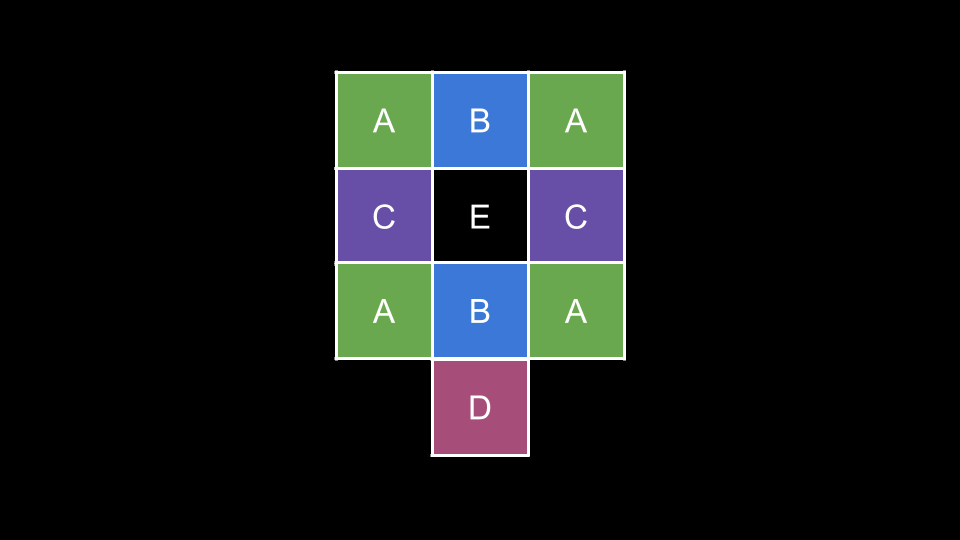
<br>

Every square in group `A` can be considered the same state because each square has identical jump options: go to state `B` or state `C`. The following table lists all possible jumps.

| From | Can Jump To
|:---:|:---:|
|  A  | B, C |
|  B  | A |
|  C  | A, D |
|  D  | C |
|  E  |  |

<br>

Note that it is impossible to form any path with `E` as you cannot reach nor leave `E`. The only case when `E` is relevant is $n = 1$ (which we will explicitly cover later). We can therefore exclude the state `E`, further reducing the potential states. This leaves us with four possible states: `A, B, C, D`.

Let's declare four integers `A, B, C, D`. Each integer represents its respective group and answers the question: "how many ways could we have reached this state?" after some number of jumps. Initially, we have:

- $A = 4$
- $B = 2$
- $C = 2$
- $D = 1$

These initial values come from considering each state as the starting square. As there are `4` squares with state `A`, we could start in state `A` four different ways, and so on for `B, C, D`.

Now, we simulate $n - 1$ jumps and update `A, B, C, D` at each iteration. How do we update these variables? For an arbitrary state `x`, we must consider: "how could we have reached `x`?". For example, when updating `A`, we must consider "how could we have reached `A`?".

This is where it gets a little tricky. You may be thinking: we could arrive at `A` by jumping from `B` or `C`. Thus, we update $A = B + C$. This is almost correct, but we must consider that from `B` or `C`, we had multiple ways to reach `A`.

We will analyze each of the four states separately, starting with `A`. We can reach `A` from `B` or `C`. Consider an arbitrary square from each group:

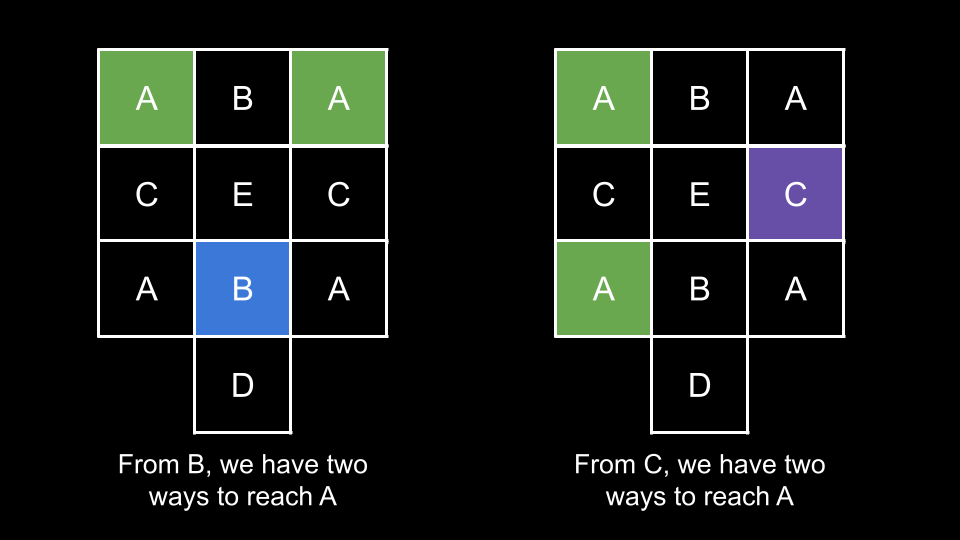
<br>

As you can see from the above image, from state `B` we have two ways to reach state `A`. Similarly, there are two ways to reach state `A` from state `C`. Thus, `A` is actually calculated as $2B + 2C = 2 * (B + C)$.

Next, let's calculate `B`. We can reach `B` only from `A`. Considering an arbitrary `A`:

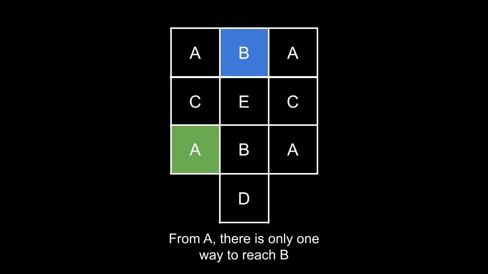
<br>

From a given state of `A`, we have only one way to reach the `B` state. Thus, `B` can simply be updated as $B = A$.

Next, we calculate `C`. We can reach `C` from `A` or `D`.

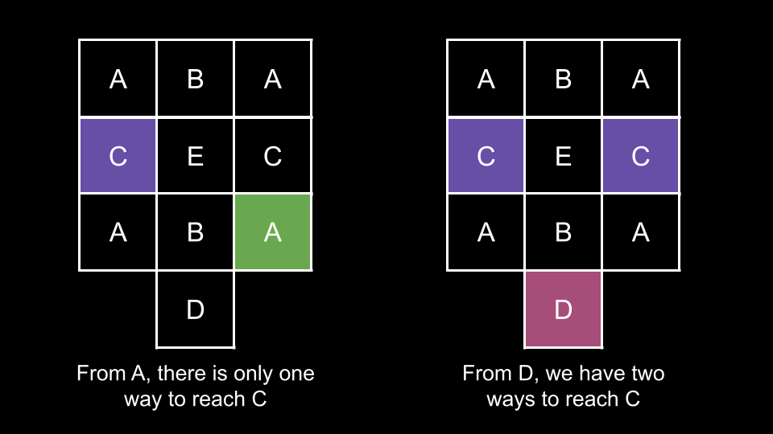
<br>

From `A`, we have one way to reach `C`. From `D`, we have two ways to reach `C`. Thus, we update `C` as $C = A + 2D$.

Lastly, we calculate `D`. We can reach `D` from `C`.

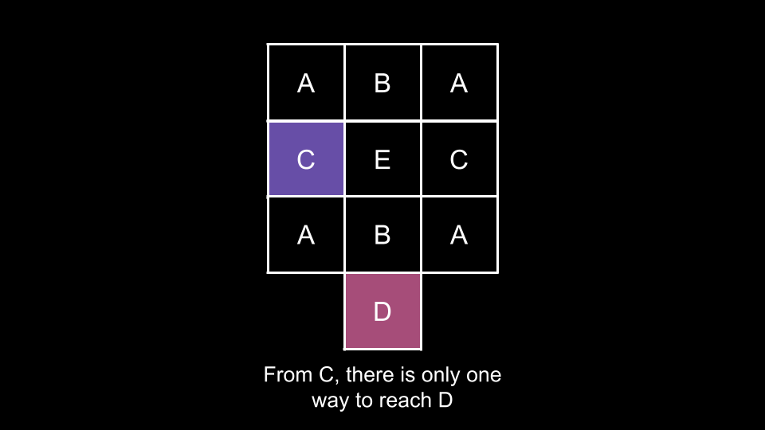
<br>

From `C`, we only have one way to reach `D`. Thus, we can update `D` as $D = C$.

To summarize, we have the following state transitions:

- $A = 2 * (B + C)$
- $B = A$
- $C = A + 2 * D$
- $D = C$

We just need to perform these updates $n - 1$ times. At the end, $A + B + C + D$ is our answer.

> Note: in Python, we can perform a simultaneous update. In other languages, we should use temporary variables to save the values of `A, B, C, D` to use in the update calculations.
>
> Why is this necessary? Let's say we update `A` first. We "lost" the old value of `A` which is required to update `B` and `C`. As such, we must save the old value of `A` in a temporary variable. We can calculate `B` and `C` using this temporary variable.

We mentioned earlier that the $n = 1$ case is different. Our algorithm does not work for $n = 1$ because no jumps will be made, and the initial value of $A + B + C + D$ is `9`, whereas the answer is `10`! This is because when $n = 1$, placing the knight on state `E` is valid. Thus, we will explicitly check for the $n = 1$ case.

**Algorithm**

Note: to avoid integer overflow, all arithmetic should be done mod $10^9 + 7$.

1. If $n = 1$, return `10`.
2. Initialize $A = 4$, $B = 2$, $C = 2$, $D = 1$.
3. Iterate $n - 1$ times:
- Perform the following updates simultaneously:
- $A = 2 * (B + C)$
- $B = A$
- $C = A + 2 * D$
- $D = C$
4. Return $A + B + C + D$.

**Implementation**

```python
class Solution:
    def knightDialer(self, n: int) -> int:
        if n == 1:
            return 10

        A = 4
        B = 2
        C = 2
        D = 1
        MOD = 10 ** 9 + 7

        for _ in range(n - 1):
            A, B, C, D = (2 * (B + C)) % MOD, A, (A + 2 * D) % MOD, C

        return (A + B + C + D) % MOD
```

**Complexity Analysis**

* Time complexity: $O(n)$

    We iterate $n - 1$ times, performing $O(1)$ work at each iteration.

    Note that while this algorithm has the same time complexity as the first three approaches, it runs much faster practically as there is far less overhead. From testing, this solution runs 10-20x faster than the first approach, despite having the same time complexity!

* Space complexity: $O(1)$

    We only use a few integer variables.

<br/>

---

### Approach 5: Linear Algebra

**Intuition**

> This approach is out of scope for an interview and you would not be expected to come up with it on your own. We have included it in this article for the sake of completeness.

As this approach is very advanced and not expected in an interview, we will assume you are already familiar with the basics of matrices and linear algebra.

We mentioned at the beginning that the phone pad is like a graph. Another way to represent this graph is with an adjacency matrix `matrix`. If we can jump from square `i` to square `j`, let $\text{matrix}[i][j] = 1$; if not, let $\text{matrix}[i][j] = 0$. Note that the jumps are symmetric: jumping from `i` to `j` necessarily implies that we can also jump from `j` to `i`, which means all edges in the graph are undirected, i.e. $\text{matrix}[i][j] = \text{matrix}[j][i]$.

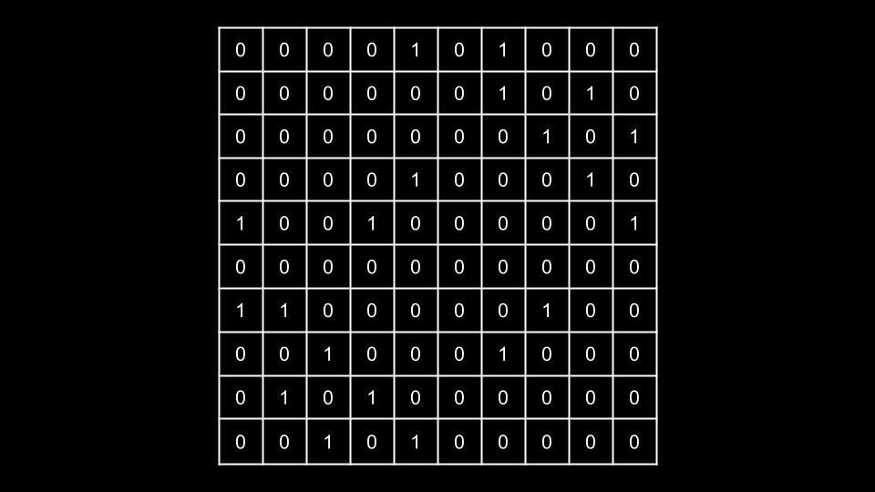
<br>

In this `matrix`, each `row` represents the squares that we can jump to. For example, if we look at the $0^{th}$ row, there is a `1` in each position that we can jump to from square `0`. Another way to look at this is: the sum of the $i^{th}$ row is the number of squares we can jump to from square `i`.

Let's say we have a vector $v = [1, 1, 1, 1, 1, 1, 1, 1, 1, 1]$ (ten ones). If we multiply `matrix` with `v`, the resulting vector will describe how many jumps are available from each square.

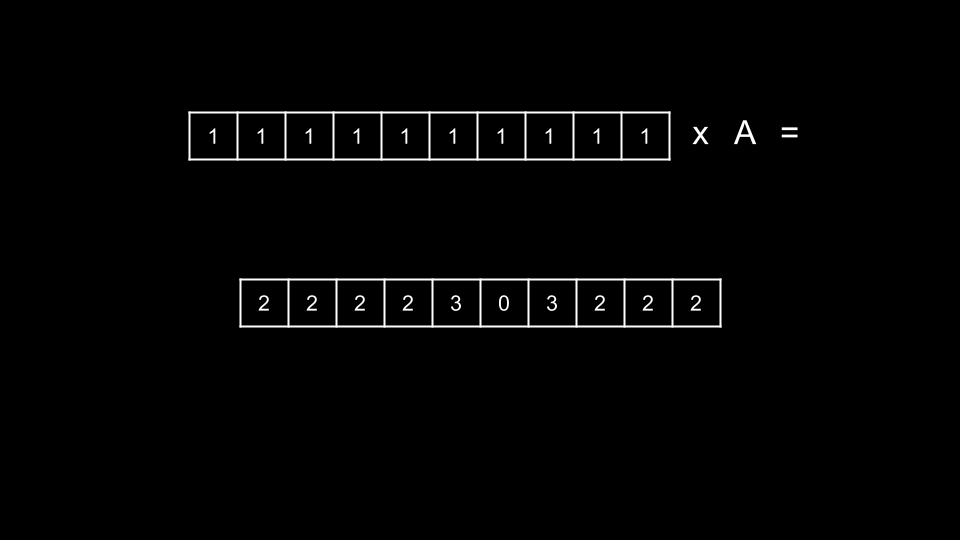
<br>

As you can see, the resulting vector is `[2, 2, 2, 2, 3, 0, 3, 2, 2, 2]`. What would happen if we were to multiply `matrix` with this resulting vector?

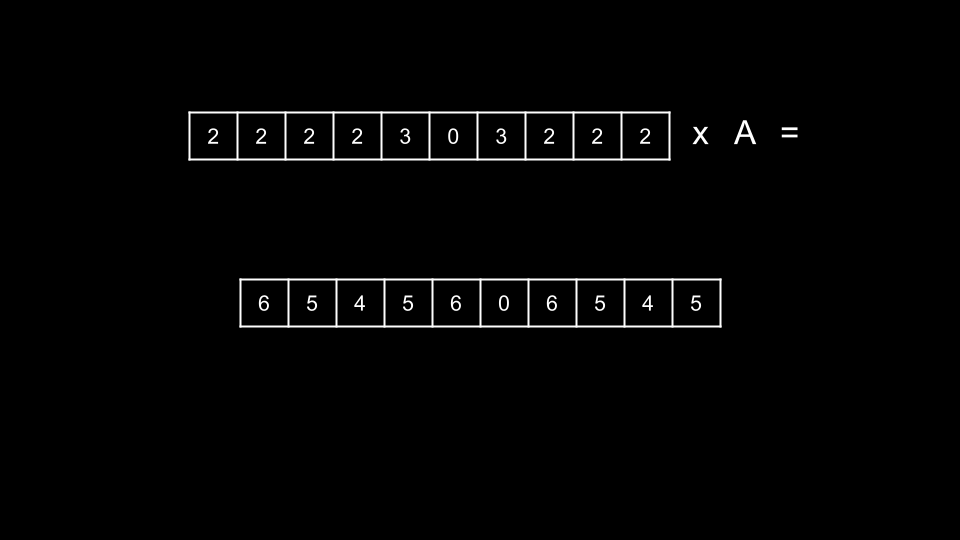
<br>

The new result is `[6, 5, 4, 5, 6, 0, 6, 5, 4, 5]`. You may notice something here: $v[square]$ represents the number of paths we can create starting from `square`, and each multiplication represents a jump! Why?

With matrix multiplication, we multiply each element in a row with the corresponding element in `v`, then sum those values. This is **exactly** simulating the DP recurrence from the first three approaches. For example, after 3 multiplications, $v[3]$ is the number of paths with 3 jumps that we could create if we initially placed the knight on square `3`. The only rows in `matrix` that have $\text{row}[3] = 1$ are rows `4` and `8`, which are the squares that we can jump to from `3`. Thus, if we were to multiply `matrix` with `v`, rows `4` and `8` would both have $v[3]$ added to their respective sums.

This is directly analogous to the DP process of adding $dp[remain - 1][nextSquare]$ for each `nextSquare` in $\text{jump}[square]$, because from the perspective of the resulting vector, `v` is the previous vector ($remain - 1$).

Initially, we set `v` to be a vector with only `1` because that represents how many ways there are to perform `0` jumps. The only way to perform `0` jumps is to simply place the knight on the square, hence the values of `v` are all `1`. Each time we multiply the resulting vector with `matrix`, we simulate another jump.

After $n - 1$ jumps, the sum of `v` is the answer to the problem. But this is still $O(n)$, since we would need to perform $n - 1$ matrix multiplications. What was the point of this?

Let $A$ denote `matrix`. We have matrix `A` and the current state vector `v`, we can compute the next vector $v_2$ after one jump as follows:

$v_2 = v \cdot A$

The next vector after $v_2$ is computed as:

$v_3 = v_2 \cdot A = (v \cdot A) \cdot A$

Here, we need to use the associativity property of matrix multiplication, which states that if $A, B, C$ are matrices, then $A\cdot (B\cdot C) = (A\cdot B)\cdot C$

So, $v_3 = (v \cdot A) \cdot A = v \cdot (A \cdot A)$

Without loss of generality, the $k^{\text{th}}$ state after $k - 1$ jumps can be represented as $v_k = v \cdot (\underbrace{A\ ...\ A}_{k - 1})$, and the answer to the problem is the sum of $v_n$.

We can perform this exponentiation process $\underbrace{A\ ...\ A}_{k - 1}$ in logarithmic time! Let's say that $n = 9$ and we need to perform `8` jumps. Instead of performing $A * A * A * A * A * A * A * A$ (multiply `A` by itself seven times), it would be better to square the resulting matrix three times.

- Start with $A$ and square it to get $A \times A = A^2$.
- Square it again to get $A^2 \times A^2 = A^4$.
- Square it again to get $A^4 \times A^4 = A^8$.

Instead of a linear number of multiplications, we only need to perform a logarithmic number of multiplications.

But what do we do if $n - 1$ is not a power of two? Let's think about the binary representation of $n - 1$. There will be some bits set and some bits not set. For example, let's say $n = 20$ and thus we need to perform `19` jumps. The binary representation of `19` is $10011$. What does each bit represent?

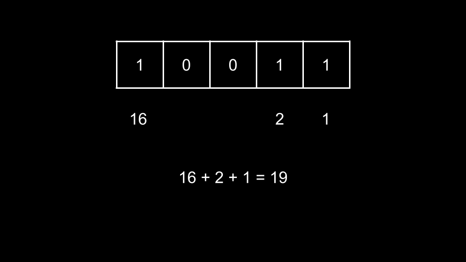
<br>

As you can see, we can sum the value of each bit to make the number `19`. We will use this idea to multiply $v$ with $A$ $n - 1$ times.

We will iterate over the bits of $n - 1$, starting from the rightmost bit. At the end of each iteration, we will square $A$ with itself. What will this accomplish?

> Iterations are 0-indexed here to correspond with the value each bit represents (the first bit represents $2^0$).

- At the start of the 0th iteration, we have $A$.
- At the start of the 1st iteration, we have $A^2$.
- At the start of the 2nd iteration, we have $A^4$.
- At the start of the 3rd iteration, we have $A^8$.

At each bit, we have $A^k$, where $k$ represents the value of the current bit! Thus, we simply need to multiply $v$ with whatever we currently have if the current bit is set. Using this strategy, $v$ will be multiplied by the original $A$ $n - 1$ times.

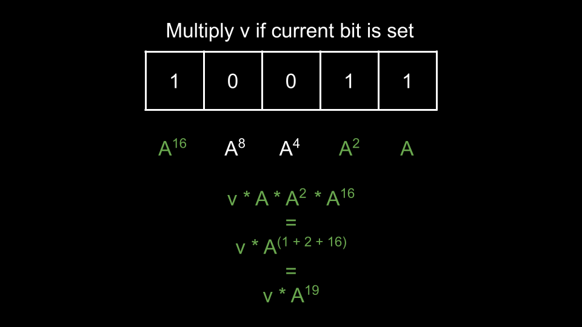
<br>

**Algorithm**

Note: all arithmetic should be done mod $10^9 + 7$.

1. If $n = 1$, return `1`.
2. Define a `multiply(A, B)` function that performs a matrix multiplication between `A` and `B`.
3. Initialize $A$ and $v$.
4. Subtract `1` from `n`. Then, perform the following until $n = 0$:
- If `n & 1`, i.e. the current bit is set, update $v = multiply(v, A)$.
- Update $A = multiply(A, A)$.
- Right shift `n`.
5. Return the sum of elements in $v$.

**Implementation**

```python
class Solution:
    def knightDialer(self, n: int) -> int:
        if n == 1:
            return 10

        def multiply(A, B):
            result = [[0] * len(B[0]) for _ in range(len(A))]

            for i in range(len(A)):
                for j in range(len(B[0])):
                    for k in range(len(B)):
                        result[i][j] = (result[i][j] + A[i][k] * B[k][j]) % MOD

            return result

        A = [
            [0, 0, 0, 0, 1, 0, 1, 0, 0, 0],
            [0, 0, 0, 0, 0, 0, 1, 0, 1, 0],
            [0, 0, 0, 0, 0, 0, 0, 1, 0, 1],
            [0, 0, 0, 0, 1, 0, 0, 0, 1, 0],
            [1, 0, 0, 1, 0, 0, 0, 0, 0, 1],
            [0, 0, 0, 0, 0, 0, 0, 0, 0, 0],
            [1, 1, 0, 0, 0, 0, 0, 1, 0, 0],
            [0, 0, 1, 0, 0, 0, 1, 0, 0, 0],
            [0, 1, 0, 1, 0, 0, 0, 0, 0, 0],
            [0, 0, 1, 0, 1, 0, 0, 0, 0, 0]
        ]

        v = [[1] * 10]
        MOD = 10 ** 9 + 7

        n -= 1
        while n:
            if n & 1:
                v = multiply(v, A)

            A = multiply(A, A)
            n >>= 1

        return sum(v[0]) % MOD
```

**Complexity Analysis**

* Time complexity: $O(\log{}n)$

    Each call to `multiply` runs in $O(1)$ because the size of our matrices is fixed. We call `multiply` $O(\log{}n)$ times.

    Note that we used three nested loops for matrix multiplication which has a cubic time complexity, but we still treat it as $O(1)$ because of the fixed size of the matrices. There also exist faster algorithms that offer more efficient ways to perform matrix multiplication, reducing time complexity for larger matrix sizes. However, we will not delve into these advanced techniques. Interested readers are recommended to explore efficient matrix computation algorithms further.

* Space complexity: $O(1)$

    We use extra space for the matrices, but the size of the matrices is fixed, thus we use constant space.

<br/>

---