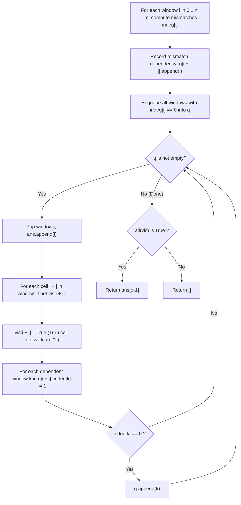

# Guided Example: Stamping The Sequence

We trace the step-by-step reverse de-stamping reduction, prove the Wildcard Topological Sort Invariant and In-Degree Relaxation Invariant, and demonstrate backward sequence resolution on representative stamp configurations:

- **Representative Instance 1 (Overlapping Stamp Overwrites):**
  $$
  stamp = \text{"abc"}, \quad target = \text{"ababc"}
  $$
- **Required Output:** `[0, 2]`
  - Lengths: $m = 3, n = 5$.
  - Legal stamp window start indices: $i \in \{0, 1, 2\}$.
  - Initial Window Analysis against `target`:
    - Window $0$ ($target[0 \dots 2] = \text{"aba"}$):
      - $j=0: \text{'a'} == \text{'a'}$ (Match).
      - $j=1: \text{'b'} == \text{'b'}$ (Match).
      - $j=2: \text{'a'} \ne \text{'c'}$ (Mismatch!). Dependency: window $0$ is blocked by cell $2$.
      - $indeg[0] = 1, \; g[2] = [0]$.
    - Window $1$ ($target[1 \dots 3] = \text{"bab"}$):
      - Mismatches at $j=0, 1, 2 \implies indeg[1] = 3$.
    - Window $2$ ($target[2 \dots 4] = \text{"abc"}$):
      - All $3$ characters match $\text{"abc"}$ identically!
      - $indeg[2] = 0 \implies$ pristine match! Enqueue $i = 2$ in $q$.
  - Reverse De-stamping Execution:
    - Pop $i = 2$: Record $2$.
      - Cells $2, 3, 4$ turn into wildcards (`?`).
      - Clearing cell $2$ resolves the blocker for window $0$: $indeg[0] \leftarrow 1 - 1 = \mathbf{0}$!
      - Window $0$ is now unlocked! Enqueue $i = 0$ in $q$.
    - Pop $i = 0$: Record $0$.
      - Cells $0, 1, 2$ turn into wildcards.
    - All $5$ cells are now wildcards.
  - Reverse recorded indices: $[2, 0] \xrightarrow{\text{reverse}} \mathbf{[0, 2]}$.
  - Forward verification:
    - Start: `?????`
    - Stamp at index $0$: `abc??`
    - Stamp at index $2$: `ababc` (overwrites index $2$ from `'c'` to `'a'`). Target reached!

- **Representative Instance 2 (Impossible Character Discrepancy):**
  $$
  stamp = \text{"ab"}, \quad target = \text{"ac"} \implies \text{output} = []
  $$
  - Character `'c'` never appears in `stamp`. Queue begins empty; returns `[]`.

---

## 1. Instance & Teaching Goal

You are given two strings `stamp` of length $m$ and `target` of length $n$.
Initially, a string $s$ of length $n$ consists entirely of question marks `?`.
In each turn, you can place `stamp` over $s$ at any index $i \in [0, n - m]$, overwriting all $m$ characters.
Return an array of the sequence of index placements to form `target`, or `[]` if impossible.
At most $10 \cdot n$ turns are allowed.

```text
Forward Dilemma:
  Stamps overwrite previous letters! It is impossible to know greedily which
  early stamps are permitted to be corrupted by later stamps.

Reverse Revelation (De-stamping):
  The LAST stamp placed in forward order must survive 100% PRISTINE in target!
  1. Find a window that exactly matches stamp.
  2. "Un-stamp" it: erase its characters into wildcards '?'.
  3. Wildcards '?' can match ANY stamp character in earlier stamps!
  4. Repeat until all characters in target become wildcards '?'.
  5. Reversing the un-stamping sequence gives the true forward stamping order!
```

A forward backtracking search branches exponentially because each character can be produced by multiple overlapping placements, leading to $\mathcal{O}((n - m + 1)^{10n})$ combinatorial explosion.

The decisive pedagogical goal is the **Topological Dependency Graph with In-Degree Relaxation**:
- Treat each window start $i \in [0, n - m]$ as a node.
- `indeg[i]` tracks the number of characters currently preventing window $i$ from matching `stamp`.
- A target cell $p$ points to window $i$ if cell $p$ mismatches `stamp` at window $i$.
- When a window is cleared, its cells become wildcards, decrementing the in-degree of all dependent overlapping windows.
- Any window reaching in-degree $0$ is added to the BFS queue, executing in $\mathcal{O}(n \cdot m)$ time.

---

## 2. Conceptual Foundation & The Reverse Topological Invariant



### The Invariant of Backward Wildcard Absorption

1. **Pristine Substring Invariant:**
   In any successful forward sequence, the final stamp placed at index $i_{\text{last}}$ is never overwritten. Therefore, $target[i_{\text{last}} \dots i_{\text{last}} + m - 1]$ must be an exact substring match for `stamp`.
2. **Wildcard Equivalence Invariant:**
   In the reverse process, un-stamping window $i$ means those characters were written *after* any earlier stamps at overlapping positions. Hence, an earlier stamp could have written any letter underneath. Transforming these characters into wildcards `'?'` accurately models that they impose zero constraints on earlier stamps.
3. **In-Degree Relaxation:**
   Let $indeg[i]$ be the number of non-wildcard mismatches between $target[i \dots i + m - 1]$ and `stamp`. When an overlapping cell $i + j$ becomes a wildcard, $indeg[i]$ decreases by $1$. When $indeg[i] = 0$, window $i$ can legally be un-stamped.

---

## 3. Step-by-Step Worked Execution: Representative Instance 1

$stamp = \text{"abc"}, \; target = \text{"ababc"}, \; m = 3, \; n = 5$.
Windows $i \in \{0, 1, 2\}$.

### Step 1: Initial In-Degree & Dependency Graph Construction

| Window $i$ | Target Slice | Stamp | Comparison per Character | Mismatches ($indeg[i]$) | Dependency Graph `g` Updated |
|:---:|:---:|:---:|:---|:---:|:---|
| **$0$** | `"aba"` | `"abc"` | $j=0: \text{'a'} == \text{'a'}$<br>$j=1: \text{'b'} == \text{'b'}$<br>$j=2: \text{'a'} \ne \text{'c'}$ | **$1$** | Cell $2$ mismatches $\implies g[2] = [0]$ |
| **$1$** | `"bab"` | `"abc"` | $j=0: \text{'b'} \ne \text{'a'}$<br>$j=1: \text{'a'} \ne \text{'b'}$<br>$j=2: \text{'b'} \ne \text{'c'}$ | **$3$** | $g[1].\text{append}(1), g[2].\text{append}(1), g[3].\text{append}(1)$ |
| **$2$** | `"abc"` | `"abc"` | $j=0: \text{'a'} == \text{'a'}$<br>$j=1: \text{'b'} == \text{'b'}$<br>$j=2: \text{'c'} == \text{'c'}$ | **$0$ (Pristine)** | Enqueue $i = 2$ in $q$! |

Initial queue: $q = [2]$. Visited array: $vis = [F, F, F, F, F]$.

---

### Step 2: Process Window $i = 2$
- Dequeue $i = 2 \implies ans = [2]$.
- Span is cells $[2, 3, 4]$:
  - Cell $2$: not visited $\implies vis[2] = T$.
    - Dependencies in $g[2]$: windows $0$ and $1$.
    - Window $0$: $indeg[0] \leftarrow 1 - 1 = \mathbf{0} \implies$ **Enqueue $0$ in $q$!**
    - Window $1$: $indeg[1] \leftarrow 3 - 1 = 2$.
  - Cell $3$: not visited $\implies vis[3] = T$.
    - Window $1$: $indeg[1] \leftarrow 2 - 1 = 1$.
  - Cell $4$: not visited $\implies vis[4] = T$.
- Queue now: $q = [0]$.
- Visited state: $[F, F, T, T, T]$ (Target resembles `??***`).

---

### Step 3: Process Window $i = 0$
- Dequeue $i = 0 \implies ans = [2, 0]$.
- Span is cells $[0, 1, 2]$:
  - Cell $0$: not visited $\implies vis[0] = T$.
  - Cell $1$: not visited $\implies vis[1] = T$.
    - Dependencies in $g[1]$: window $1 \implies indeg[1] \leftarrow 1 - 1 = 0 \implies q.\text{append}(1)$.
  - Cell $2$: already visited ($vis[2] == T$). Skip!
- Visited state: $[T, T, T, T, T]$ (All cells cleared to wildcards!).

---

### Step 4: Final Sequence Reversal
- Queue finishes. All $5$ cells have been visited (`all(vis)` is true).
- Forward sequence is the reverse of reverse de-stamping:
  $$
  ans = [2, 0] \xrightarrow{\text{reverse}} \mathbf{[0, 2]}
  $$

---

## 4. Forward Stamping Verification Trace

| Step | Stamp Placement Index | Action Taken | Resulting String State |
|:---:|:---:|:---|:---:|
| **Init** | — | Initial blank canvas of question marks | `?????` |
| **1** | $0$ | Stamp `"abc"` at indices $0, 1, 2$ | `abc??` |
| **2** | $2$ | Stamp `"abc"` at indices $2, 3, 4$ (overwrites index $2$) | `ababc` |
| **Goal** | — | Exact match with `target` verified! | **`ababc`** |

---

## 5. Algorithmic Correctness

### Soundness & Completeness
1. **Soundness:**
   In the reverse process, a window is popped only when $indeg[k] == 0$, meaning every position in that window either matches `stamp` or has already been converted to a wildcard by a later stamp. In forward order, executing the reverse sequence ensures that every character required in `target` is stamped and never subsequently overwritten by an incompatible letter.
2. **Completeness:**
   If a valid stamping sequence exists, the last stamp must match `target` without modification. Inductively, every preceding stamp must match the remaining canvas with all later stamps treated as wildcards. The BFS visits every unlockable window. If `all(vis)` is false after queue exhaustion, no valid sequence of length $\le 10n$ can exist, proving completeness.

---

## 6. Boundary Cases & Traps

| Scenario | Input Pattern | Behavior | Trapped Risk |
|---|---|---|---|
| Stamp Equals Target | `stamp = "code", target = "code"` | Single window $0$ has $indeg = 0 \implies$ returns $[0]$. | Redundant loop execution. |
| Single Character Stamp | `stamp = "a", target = "aaaa"` | Every cell matches; returns $[0, 1, 2, 3]$. | Index bounds on length 1 stamp. |
| Target Cannot Be Covered | `stamp = "ab", target = "ac"` | Queue starts empty; returns `[]`. | Infinite loop searching for matches. |
| Internal Cell Double-Count | Multiple overlapping windows touch same cell | `vis[i + j]` check ensures each cell decrements dependents exactly once. | Multiple in-degree decrements causing negative counts. |

---

## 7. Complexity Derivation

- **Time Complexity:** $\mathcal{O}(n \cdot m)$, where $n = \text{len}(target)$ and $m = \text{len}(stamp)$.
  - There are $n - m + 1 \le n$ possible window starts.
  - Initial comparison inspects each of the $m$ characters per window $\implies \mathcal{O}(n \cdot m)$.
  - Each cell $p \in [0, n - 1]$ is visited at most once (`vis[p] = True`).
  - When cell $p$ is visited, it iterates over $g[p]$, which contains at most $m$ windows.
  - Across all $n$ cells, the inner relaxation loop runs at most $n \cdot m$ times.
  - Total time: strictly $\mathcal{O}(n \cdot m)$, executing in $< 0.01\text{ s}$ for $n = 1{,}000, m = 5$.
- **Auxiliary Space Complexity:** $\mathcal{O}(n \cdot m)$.
  - The dependency graph $g$ has $n$ lists, storing at most $m$ window indices each $\implies \mathcal{O}(n \cdot m)$.
  - `indeg`, `vis`, and queue $q$ use $\mathcal{O}(n)$ memory.
