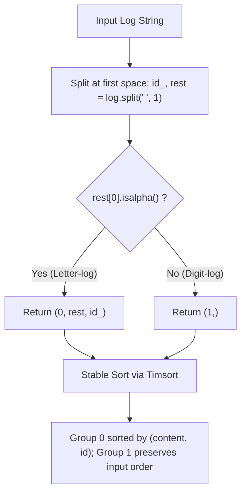

# Guided Example: Reorder Data in Log Files

We trace the step-by-step construction of the composite sorting key tuple, prove the Category-Priority and Equivalence-Class Stability Invariants, and evaluate log sequence transformations on representative log streams:

- **Representative Instance 1 (Mixed Letter and Digit Logs):**
  $$
  logs = [
    \text{"dig1 8 1 5 1"}, \;
    \text{"let1 art can"}, \;
    \text{"dig2 3 6"}, \;
    \text{"let2 own kit dig"}, \;
    \text{"let3 art zero"}
  ]
  $$
- **Required Output:**
  $$
  [
    \text{"let1 art can"}, \;
    \text{"let3 art zero"}, \;
    \text{"let2 own kit dig"}, \;
    \text{"dig1 8 1 5 1"}, \;
    \text{"dig2 3 6"}
  ]
  $$
- **Sorting Key Evaluation:**
  - `"dig1 8 1 5 1"`: content starts with `'8'` (digit) $\implies \mathbf{(1,)}$.
  - `"let1 art can"`: content starts with `'a'` (letter) $\implies \mathbf{(0, \text{"art can"}, \text{"let1"})}$.
  - `"dig2 3 6"`: content starts with `'3'` (digit) $\implies \mathbf{(1,)}$.
  - `"let2 own kit dig"`: content starts with `'o'` (letter) $\implies \mathbf{(0, \text{"own kit dig"}, \text{"let2"})}$.
  - `"let3 art zero"`: content starts with `'a'` (letter) $\implies \mathbf{(0, \text{"art zero"}, \text{"let3"})}$.
- **Tuple Sorting Order:**
  1. $(0, \text{"art can"}, \text{"let1"})$
  2. $(0, \text{"art zero"}, \text{"let3"})$
  3. $(0, \text{"own kit dig"}, \text{"let2"})$
  4. $(1,)$ (preserves `"dig1 8 1 5 1"` from input order)
  5. $(1,)$ (preserves `"dig2 3 6"` from input order)

- **Representative Instance 2 (Identical Content Identifier Tie-Break):**
  $$
  logs = [\text{"b same text"}, \; \text{"a same text"}]
  $$
  - Key for `"b same text"`: $(0, \text{"same text"}, \text{"b"})$
  - Key for `"a same text"`: $(0, \text{"same text"}, \text{"a"})$
  - Contents are identical (`"same text" == "same text"`).
  - Identifier tie-breaker applies: $\text{"a"} < \text{"b"}$.
  - Required Output: `["a same text", "b same text"]`.

---

## 1. Instance & Teaching Goal

You are given an array of space-delimited string `logs`.
The first word of each log is its **identifier**.
- **Letter-logs:** All words (except the identifier) consist of lowercase English letters.
- **Digit-logs:** All words (except the identifier) consist of digits.

Reorder the logs according to three strict rules:
1. All **letter-logs** must appear before all **digit-logs**.
2. **Letter-logs** are ordered lexicographically by their contents. If contents are identical, order them lexicographically by their identifiers.
3. **Digit-logs** must maintain their original relative order from the input.

```text
Log String:           "let1 art can"
Split once at ' ':    id = "let1", rest = "art can"
Type Check:           rest[0] is letter -> LETTER-LOG!
Sort Key:             (0, "art can", "let1")

Log String:           "dig1 8 1 5 1"
Split once at ' ':    id = "dig1", rest = "8 1 5 1"
Type Check:           rest[0] is digit -> DIGIT-LOG!
Sort Key:             (1,)  <- All digit logs share identical key!
```

A manual multi-pass approach partitions logs into separate lists, sorts the letter list with custom comparators, and concatenates the two lists, requiring extra intermediate list allocations and boilerplate branching.

The decisive pedagogical goal is the **Composite Key Tuple & Stable Sort Invariant**:
By designing a single projection function:
$$
f(log) =
\begin{cases}
(0, \; rest, \; id\_) & \text{if } rest[0]\text{ is alphabetic} \\
(1,) & \text{if } rest[0]\text{ is numeric}
\end{cases}
$$
and sorting with a **stable sort** (e.g. Python's Timsort), all three requirements are simultaneously satisfied in $\mathcal{O}(N \log N)$ string comparisons.

---

## 2. Conceptual Foundation & The Key Tuple Invariants



### The Three Invariants Guaranteed by the Key Tuple

1. **Category Priority Invariant:**
   In tuple comparison, the first element takes precedence.
   Because $0 < 1$, every letter-log (keyed with leading $0$) strictly precedes every digit-log (keyed with leading $1$).
2. **Content & Identifier Tie-Breaking Invariant:**
   Within group $0$, elements are compared lexicographically:
   - First by $rest$ (the complete text following the identifier).
   - If $rest$ is identical, by $id\_$ (the identifier).
3. **Equivalence-Class Stability Invariant:**
   Within group $1$, every digit-log returns the exact same key: `(1,)`.
   In any stable sorting algorithm, elements with identical keys are guaranteed never to change their relative input order. Thus, digit-logs automatically preserve their original sequence without secondary indexing.

---

## 3. Step-by-Step Worked Execution: Representative Instance 1

Logs:
$$
logs = [\text{"dig1 8 1 5 1"}, \; \text{"let1 art can"}, \; \text{"dig2 3 6"}, \; \text{"let2 own kit dig"}, \; \text{"let3 art zero"}]
$$

### Step 1: Compute Sort Keys for Each Log

| Index | Raw Log String | Identifier $id\_$ | Content $rest$ | Type Detected | Generated Sort Key |
|:---:|:---|:---:|:---|:---:|:---|
| **0** | `"dig1 8 1 5 1"` | `"dig1"` | `"8 1 5 1"` | Digit (`'8'`) | `(1,)` |
| **1** | `"let1 art can"` | `"let1"` | `"art can"` | Letter (`'a'`) | `(0, "art can", "let1")` |
| **2** | `"dig2 3 6"` | `"dig2"` | `"3 6"` | Digit (`'3'`) | `(1,)` |
| **3** | `"let2 own kit dig"` | `"let2"` | `"own kit dig"` | Letter (`'o'`) | `(0, "own kit dig", "let2")` |
| **4** | `"let3 art zero"` | `"let3"` | `"art zero"` | Letter (`'a'`) | `(0, "art zero", "let3")` |

---

### Step 2: Stable Sort Resolution

1. Compare Group $0$ (Letter-logs):
   - Candidate A: `(0, "art can", "let1")`
   - Candidate B: `(0, "art zero", "let3")`
   - Candidate C: `(0, "own kit dig", "let2")`
   - Comparing contents: `"art can" < "art zero" < "own kit dig"`.
   - Ordered:
     1. `"let1 art can"`
     2. `"let3 art zero"`
     3. `"let2 own kit dig"`
2. Compare Group $1$ (Digit-logs):
   - Both have identical key `(1,)`.
   - Stability rule: original relative order preserved:
     4. `"dig1 8 1 5 1"` (appeared at index 0)
     5. `"dig2 3 6"` (appeared at index 2)

---

### Final Ordered Array
$$
[
  \text{"let1 art can"}, \;
  \text{"let3 art zero"}, \;
  \text{"let2 own kit dig"}, \;
  \text{"dig1 8 1 5 1"}, \;
  \text{"dig2 3 6"}
]
$$

---

## 4. Execution Trace Table: Identifier Tie-Breaking

| Log Input | $id\_$ | $rest$ | Key Tuple | Lexicographical Comparison | Output Rank |
|:---|:---:|:---:|:---:|:---:|:---:|
| `"b same text"` | `"b"` | `"same text"` | `(0, "same text", "b")` | Same content; `"b" > "a"` | Rank 2 |
| `"a same text"` | `"a"` | `"same text"` | `(0, "same text", "a")` | Same content; `"a" < "b"` | **Rank 1** |

Result: `["a same text", "b same text"]`.

---

## 5. Algorithmic Correctness

### Soundness & Completeness
1. **Soundness:**
   The classification `rest[0].isalpha()` is sound because problem constraints guarantee that non-identifier words in a log consist entirely of letters or entirely of digits. Python tuple comparison natively enforces lexicographic hierarchy.
2. **Completeness:**
   Every log receives a valid key. The sort exhaustively orders all elements without discarding or omitting any input string. By mathematical properties of stable sorting, digit-log positions never invert.

---

## 6. Boundary Cases & Traps

| Scenario | Input Pattern | Behavior | Trapped Risk |
|---|---|---|---|
| Single Space Delimiter | `log.split(" ", 1)` | Splits only at the first space; preserves all content spaces verbatim. | Splitting on all spaces requiring costly string re-joins. |
| Numbers in Identifier | `"123 alpha beta"` | Classified by `rest[0]` (`'a'`), NOT identifier. | Misclassifying letter-logs that have numeric identifiers. |
| All Digit Logs | All entries digits | All keys equal `(1,)`; returns array in exact original order. | Accidentally sorting digit logs by content. |
| Prefix Content Match | `"art"`, `"art can"` | Shorter prefix `"art"` precedes longer string `"art can"`. | String comparison length mismatch bugs. |

---

## 7. Complexity Derivation

- **Time Complexity:** $\mathcal{O}(S \cdot \log N)$, where $N$ is the number of logs and $S$ is the maximum length of a single log string.
  - Splitting each log at the first space takes $\mathcal{O}(S)$ time $\implies \mathcal{O}(N \cdot S)$ total key preparation.
  - Comparing two keys during sorting takes at most $\mathcal{O}(S)$ character comparisons.
  - Timsort performs at most $\mathcal{O}(N \log N)$ comparisons.
  - Total time: $\mathcal{O}(S \cdot N \log N)$, executing in $< 0.005\text{ s}$ for $100$ logs of length $100$.
- **Auxiliary Space Complexity:** $\mathcal{O}(N \cdot S)$.
  - Storing the key tuples and temporary references for $N$ logs requires memory proportional to the input size.
