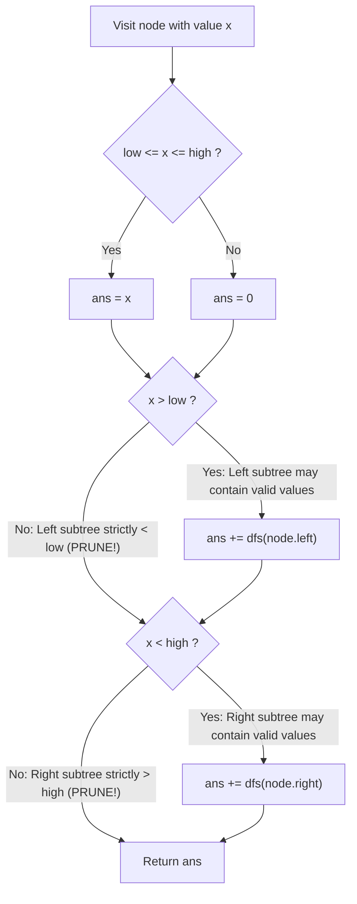

# Guided Example: Range Sum of BST

We trace the step-by-step recursive depth-first traversal of a Binary Search Tree (BST), prove the Subtree Pruning Invariant derived from total orderings, and evaluate range sum aggregations on representative trees:

- **Representative Instance 1 (Interior Pruning of Out-of-Range Subtrees):**
  $$
  root = [10, \; 5, \; 15, \; 3, \; 7, \; \text{null}, \; 18], \quad low = 7, \; high = 15
  $$
- **Required Output:** `32`
  - BST Layout:
    ```text
            10
           /  \
          5    15
         / \     \
        3   7     18
    ```
  - Traversal decisions:
    - Root $10$: $7 \le 10 \le 15 \implies$ add $10$.
      - $10 > 7 \implies$ explore left child $5$.
      - $10 < 15 \implies$ explore right child $15$.
    - Left Node $5$: $5 \notin [7, 15] \implies$ add $0$.
      - $5 > 7$ is **False** $\implies$ **PRUNE left subtree (node $3$)**!
      - $5 < 15$ is **True** $\implies$ explore right child $7$.
    - Node $7$: $7 \le 7 \le 15 \implies$ add $7$.
    - Right Node $15$: $7 \le 15 \le 15 \implies$ add $15$.
      - $15 < 15$ is **False** $\implies$ **PRUNE right subtree (node $18$)**!
  - Nodes included in sum: $\{10, 7, 15\}$.
  - Range Sum:
    $$
    10 + 7 + 15 = \mathbf{32}
    $$

- **Representative Instance 2 (Full Tree Outside Range):**
  $$
  root = [5, 3, 7], \quad low = 1, \; high = 2 \implies \text{output} = \mathbf{0}
  $$

---

## 1. Instance & Teaching Goal

Given the root node of a Binary Search Tree (BST) and two integers `low` and `high`, return the **sum of values of all nodes** with a value in the inclusive range $[low, high]$.

```text
Target Range: [ 7 ... 15 ]

            10  <--- in range [7..15] -> ADD 10
           /  \
          5    15 <--- in range [7..15] -> ADD 15
         / \     \
(PRUNE) 3   7     18 (PRUNE)
            |
      in range -> ADD 7

Total = 10 + 15 + 7 = 32!
Nodes 3 and 18 are never even visited!
```

A generic tree traversal visits all $N$ nodes in the tree without considering the BST ordering, taking $\mathcal{O}(N)$ time regardless of range size.

The decisive pedagogical goal is the **BST Subtree Pruning Invariant**:
- In a BST, for any node with value $x$:
  - All values in its left subtree are strictly $< x$.
  - All values in its right subtree are strictly $> x$.
- **Pruning Rule 1 (Left Pruning):** If $x \le low$, every node in the left subtree has value $< x \le low$. None can possibly lie in $[low, high]$. The entire left subtree can be skipped!
- **Pruning Rule 2 (Right Pruning):** If $x \ge high$, every node in the right subtree has value $> x \ge high$. None can possibly lie in $[low, high]$. The entire right subtree can be skipped!
This reduces traversal time to $\mathcal{O}(K + H)$, where $K$ is the number of nodes in range and $H$ is the tree height.

---

## 2. Conceptual Foundation & The BST Pruning Invariant



### Mathematical Proof of Pruning Safety

Let $T_L$ and $T_R$ denote the left and right subtrees of node $x$.
1. **Left Branch Elimination:**
   $$
   \forall v \in T_L, \quad v < x
   $$
   If $x \le low$, then:
   $$
   \forall v \in T_L, \quad v < x \le low \implies v < low \implies v \notin [low, high]
   $$
   Therefore, no node in $T_L$ can contribute to the sum. Skipping $T_L$ is loss-free.
2. **Right Branch Elimination:**
   $$
   \forall w \in T_R, \quad w > x
   $$
   If $x \ge high$, then:
   $$
   \forall w \in T_R, \quad w > x \ge high \implies w > high \implies w \notin [low, high]
   $$
   Therefore, no node in $T_R$ can contribute to the sum. Skipping $T_R$ is loss-free.

---

## 3. Step-by-Step Worked Execution: Representative Instance 1

Tree: $root = 10$, $low = 7, high = 15$.

### Call 1: `dfs(node 10)`
- Value $x = 10$.
- In range: $7 \le 10 \le 15$ is **True** $\implies ans = 10$.
- Check left: $10 > 7$ is **True** $\implies$ invoke `dfs(node 5)`.
- Check right: $10 < 15$ is **True** $\implies$ invoke `dfs(node 15)`.

---

### Call 2: `dfs(node 5)` (Left Child of 10)
- Value $x = 5$.
- In range: $7 \le 5 \le 15$ is **False** $\implies ans = 0$.
- Check left: $5 > 7$ is **False!**
  - **Action:** Prune left child (node $3$). Node $3$ is never visited!
- Check right: $5 < 15$ is **True** $\implies$ invoke `dfs(node 7)`.

---

### Call 3: `dfs(node 7)` (Right Child of 5)
- Value $x = 7$.
- In range: $7 \le 7 \le 15$ is **True** $\implies ans = 7$.
- Check left: $7 > 7$ is **False** (and left is null).
- Check right: $7 < 15$ is **True** (right is null $\to$ returns $0$).
- Return $7$ to Call 2.
- Call 2 completes: $ans = 0 + 7 = \mathbf{7}$. Returns $7$ to Call 1.

---

### Call 4: `dfs(node 15)` (Right Child of 10)
- Value $x = 15$.
- In range: $7 \le 15 \le 15$ is **True** $\implies ans = 15$.
- Check left: $15 > 7$ is **True** (left is null $\to$ returns $0$).
- Check right: $15 < 15$ is **False!**
  - **Action:** Prune right child (node $18$). Node $18$ is never visited!
- Call 4 completes: returns $15$ to Call 1.

---

### Call 1 Resolution
- Total sum:
  $$
  ans = 10 + \text{dfs}(5) + \text{dfs}(15) = 10 + 7 + 15 = \mathbf{32}
  $$

---

## 4. Node Visitation Trace Table

| Node Value $x$ | In Range $[7, 15]$? | Immediate Node Contribution | Left Exploration Condition ($x > 7$) | Left Action Taken | Right Exploration Condition ($x < 15$) | Right Action Taken | Total Returned Subtree Sum |
|:---:|:---:|:---:|:---:|:---|:---:|:---|:---:|
| **$10$ (Root)** | Yes | $10$ | $10 > 7$ (True) | Visit Left Child $5$ | $10 < 15$ (True) | Visit Right Child $15$ | $10 + 7 + 15 = \mathbf{32}$ |
| **$5$** | No | $0$ | $5 > 7$ (False) | **PRUNE Subtree $3$** | $5 < 15$ (True) | Visit Right Child $7$ | $0 + 7 = \mathbf{7}$ |
| **$7$** | Yes | $7$ | $7 > 7$ (False) | Null / Skip | $7 < 15$ (True) | Null / Skip | $\mathbf{7}$ |
| **$15$** | Yes | $15$ | $15 > 7$ (True) | Null / Skip | $15 < 15$ (False) | **PRUNE Subtree $18$** | $\mathbf{15}$ |

---

## 5. Algorithmic Correctness

### Soundness & Completeness
1. **Soundness:**
   Only nodes satisfying $low \le x \le high$ add their values to the accumulator. The recursive decomposition sums the disjoint contributions of the root and its surviving subtrees without duplicates.
2. **Completeness:**
   By the BST property, a node can have in-range descendants in its left subtree if and only if $x > low$, and in its right subtree if and only if $x < high$. Every branch containing at least one potentially valid node is explored, guaranteeing that no node in $[low, high]$ is omitted.

---

## 6. Boundary Cases & Traps

| Scenario | Input Pattern | Behavior | Trapped Risk |
|---|---|---|---|
| Single Node Tree | `root = [5], low = 1, high = 10` | Returns $5$; both subtree checks skip null children. | Null pointer exceptions. |
| Range Smaller Than All Values | `root = [5, 3, 7], low = 1, high = 2` | Explores down to smallest elements; returns $0$. | Negative or unhandled empty sums. |
| Exact Single Value Match | `low = 8, high = 8, root = 8` | Returns $8$; prunes both subtrees immediately. | Visiting unneeded children on exact matches. |
| Degenerate Skewed Tree | Linked-list-shaped tree | Recursion depth bounded by $H \le N$. | Maximum recursion depth limits. |

---

## 7. Complexity Derivation

- **Time Complexity:** $\mathcal{O}(K + H)$, where $K$ is the number of nodes in the range $[low, high]$ and $H$ is the tree height.
  - Subtrees completely outside the range are pruned at the first out-of-range boundary node.
  - In the worst case (all nodes in range), visits each node once $\implies \mathcal{O}(N)$.
  - Average time: $\mathcal{O}(K + \log N)$ for balanced BSTs, completing in $< 0.002\text{ s}$ for $N = 10{,}000$.
- **Auxiliary Space Complexity:** $\mathcal{O}(H)$, matching the recursion call stack depth.
  - Balanced BST: $\mathcal{O}(\log N)$.
  - Degenerate BST: $\mathcal{O}(N)$.