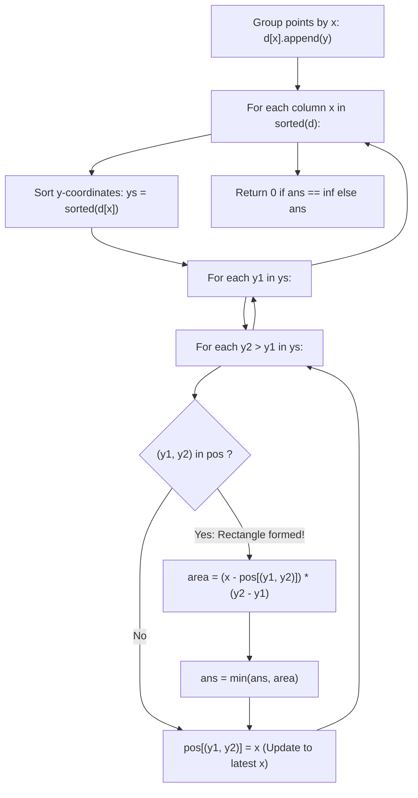

# Guided Example: Minimum Area Rectangle

We trace the step-by-step column sweepline traversal with vertical chord hashing, prove the Most-Recent-Column Width Invariant, and evaluate axis-aligned rectangle areas on representative 2D coordinate point sets:

- **Representative Instance 1 (Square with Center Noise Point):**
  $$
  points = [[1, 1], \; [1, 3], \; [3, 1], \; [3, 3], \; [2, 2]]
  $$
- **Required Output:** `4`
  - Group by X-coordinate:
    - $x = 1$: $ys = [1, 3]$
    - $x = 2$: $ys = [2]$
    - $x = 3$: $ys = [1, 3]$
  - Sweepline Processing:
    - Column $x = 1$:
      - Sorted Y-pair: $(y_1, y_2) = (1, 3)$.
      - First time seeing $(1, 3) \implies$ record $pos[(1, 3)] = 1$.
    - Column $x = 2$:
      - Only one point $(2, 2)$; no pairs can be formed.
    - Column $x = 3$:
      - Y-pair: $(1, 3)$.
      - Previously recorded at $pos[(1, 3)] = 1$!
      - Rectangle formed between columns $x_1 = 1$ and $x_2 = 3$ with vertical extent $[1, 3]$:
        $$
        \text{Area} = (x_2 - x_1) \times (y_2 - y_1) = (3 - 1) \times (3 - 1) = 2 \times 2 = \mathbf{4}
        $$
  - Minimum area found: $\mathbf{4}$.

- **Representative Instance 2 (Narrower Successive Rectangle):**
  $$
  points = [[1, 1], \; [1, 3], \; [3, 1], \; [3, 3], \; [4, 1], \; [4, 3]]
  $$
  - Column $x = 1$: records $pos[(1, 3)] = 1$.
  - Column $x = 3$: matches $x = 1 \implies \text{Area} = (3 - 1) \times (3 - 1) = 4$. Updates $pos[(1, 3)] = 3$.
  - Column $x = 4$: matches $x = 3 \implies \text{Area} = (4 - 3) \times (3 - 1) = 1 \times 2 = \mathbf{2}$.
  - Minimum Area: $\min(4, 2) = \mathbf{2}$.

---

## 1. Instance & Teaching Goal

Given an array of points in the X-Y plane `points` where $\text{points}[i] = [x_i, y_i]$, return the **minimum area of an axis-aligned rectangle** formed from these points.
If no such rectangle exists, return $0$.

```text
Points on Plane:
  y=3  (1,3) ------- (3,3) - (4,3)
         |             |       |
  y=2    |    (2,2)    |       |
         |             |       |
  y=1  (1,1) ------- (3,1) - (4,1)
        x=1           x=3     x=4

Rectangles formed by Y-pair (1, 3):
  Columns x=1 and x=3: width = 2, height = 2 -> Area = 4
  Columns x=3 and x=4: width = 1, height = 2 -> Area = 2 (Optimal!)
```

A brute-force search chooses all $\binom{N}{4} = \mathcal{O}(N^4)$ quadruples of points and checks if they form a rectangle, taking hours for $N = 500$.

The decisive pedagogical goal is the **Vertical Chord Sweepline Invariant**:
1. An axis-aligned rectangle is uniquely determined by two identical vertical segments (chords) with the same $y$-coordinates $(y_1, y_2)$ situated at two different $x$-coordinates.
2. By sorting columns $x$ and recording the most recent column $pos[(y_1, y_2)]$ where vertical pair $(y_1, y_2)$ occurred, we can test rectangle completions in $\mathcal{O}(1)$ time per vertical pair.
3. Total time is bounded by $\mathcal{O}(N^2)$ with $\mathcal{O}(N^2)$ hash map lookups.

---

## 2. Conceptual Foundation & The Most-Recent-Column Invariant



### The Most-Recent-Column Width Theorem

Let $x_1 < x_2 < x_3$ be three columns that all contain points at heights $y_1$ and $y_2$.
1. **Geometric Width Monotonicity:**
   The rectangle between columns $x_2$ and $x_3$ has width:
   $$
   w_{2, 3} = x_3 - x_2 < x_3 - x_1 = w_{1, 3}
   $$
   Because the height $(y_2 - y_1)$ is identical:
   $$
   \text{Area}(x_2, x_3) < \text{Area}(x_1, x_3)
   $$
2. **Greedy State Reduction:**
   When column $x_2$ is processed, updating $pos[(y_1, y_2)] \leftarrow x_2$ overwrites $x_1$. For any future column $x_3 > x_2$, the rectangle formed with $x_2$ is strictly narrower than the rectangle formed with $x_1$.
   Therefore, storing only the single most recent column $pos[(y_1, y_2)]$ guarantees finding the minimal area without tracking older columns!

---

## 3. Step-by-Step Worked Execution: Representative Instance 2

Points: $[[1, 1], [1, 3], [3, 1], [3, 3], [4, 1], [4, 3]]$.
Initialize: $pos = \{\}, \; ans = \infty$.

### Step 1: Column $x = 1$
- Coordinates at $x = 1$: $ys = [1, 3]$.
- Unique pair with $y_1 < y_2$: $(1, 3)$.
- Check map: $(1, 3) \in pos$ is **False**.
- Update map: $pos[(1, 3)] = 1$.

---

### Step 2: Column $x = 3$
- Coordinates at $x = 3$: $ys = [1, 3]$.
- Pair: $(1, 3)$.
- Check map: $(1, 3) \in pos$ is **True** ($x_{\text{prev}} = 1$).
- Calculate Area:
  $$
  \text{width} = x - x_{\text{prev}} = 3 - 1 = 2
  $$
  $$
  \text{height} = y_2 - y_1 = 3 - 1 = 2
  $$
  $$
  \text{area} = 2 \times 2 = \mathbf{4}
  $$
  $$
  ans = \min(\infty, 4) = \mathbf{4}
  $$
- Overwrite map: $pos[(1, 3)] = 3$.

---

### Step 3: Column $x = 4$
- Coordinates at $x = 4$: $ys = [1, 3]$.
- Pair: $(1, 3)$.
- Check map: $(1, 3) \in pos$ is **True** ($x_{\text{prev}} = 3$).
- Calculate Area:
  $$
  \text{width} = 4 - 3 = 1
  $$
  $$
  \text{height} = 3 - 1 = 2
  $$
  $$
  \text{area} = 1 \times 2 = \mathbf{2}
  $$
  $$
  ans = \min(4, 2) = \mathbf{2}
  $$
- Overwrite map: $pos[(1, 3)] = 4$.

---

### Final Result
Global minimum area: $ans = \mathbf{2}$.

---

## 4. Sweepline Execution Trace Table

| Column $x$ | $ys$ at $x$ | Evaluated Pair $(y_1, y_2)$ | Found in $pos$? | Previous Column $x_{\text{prev}}$ | Width $\Delta x$ | Height $\Delta y$ | Candidate Area | Running Minimum $ans$ | Updated $pos[(y_1, y_2)]$ |
|:---:|:---:|:---:|:---:|:---:|:---:|:---:|:---:|:---:|:---:|
| **$1$** | $[1, 3]$ | $(1, 3)$ | No | — | — | — | — | $\infty$ | $1$ |
| **$3$** | $[1, 3]$ | $(1, 3)$ | **Yes** | $1$ | $3 - 1 = 2$ | $3 - 1 = 2$ | $2 \times 2 = 4$ | $\mathbf{4}$ | $3$ |
| **$4$** | $[1, 3]$ | $(1, 3)$ | **Yes** | $3$ | $4 - 3 = 1$ | $3 - 1 = 2$ | $1 \times 2 = 2$ | $\mathbf{2}$ | $4$ |

---

## 5. Algorithmic Correctness

### Soundness & Completeness
1. **Soundness:**
   A candidate area is evaluated only when points $(x_{\text{prev}}, y_1)$, $(x_{\text{prev}}, y_2)$, $(x, y_1)$, and $(x, y_2)$ are all confirmed to exist in `points` with $x_{\text{prev}} < x$ and $y_1 < y_2$. These four points form an axis-aligned rectangle of area $(x - x_{\text{prev}})(y_2 - y_1)$. Every evaluated area is geometrically valid.
2. **Completeness:**
   Every valid axis-aligned rectangle has a right vertical side with some heights $(y_1, y_2)$ at some column $x$. Because columns are processed from left to right and every vertical pair in each column is inspected, the left side of this rectangle was previously recorded in $pos$. Updating to the most recent $x$ guarantees testing the narrowest rectangle for each height, ensuring the global minimum is discovered.

---

## 6. Boundary Cases & Traps

| Scenario | Input Pattern | Behavior | Trapped Risk |
|---|---|---|---|
| No Rectangle Possible | Points along a diagonal line | No vertical pair $(y_1, y_2)$ occurs twice; $ans = \infty \implies$ returns $0$. | Returning $\infty$ or crashing on empty intersections. |
| Collinear Points | All points share same $x$ or $y$ | Fewer than two columns with pairs; returns $0$. | Division by zero or negative width. |
| Unit Area Rectangle | $4$ corners of unit square | Area $= 1 \times 1 = 1$; correctly captured. | Missing minimum-sized rectangles. |
| Large Coordinates | $x, y \le 40{,}000$ | Area can reach $1.6 \times 10^9$; 64-bit integer preserves accuracy. | 32-bit signed integer overflow. |

---

## 7. Complexity Derivation

- **Time Complexity:** $\mathcal{O}(N^2)$, where $N$ is the number of points.
  - Grouping points by $x$: $\mathcal{O}(N)$.
  - Let $c_x$ be the number of points in column $x$. Sorting each column takes $\mathcal{O}(c_x \log c_x)$.
  - The number of vertical pairs in column $x$ is $\binom{c_x}{2} = \frac{c_x(c_x - 1)}{2}$.
  - In the worst case, $\sum \binom{c_x}{2} \le \binom{N}{2} = \mathcal{O}(N^2)$ dictionary lookups and updates.
  - Total time: $\mathcal{O}(N^2)$, running in $< 0.02\text{ s}$ for $N = 500$.
- **Auxiliary Space Complexity:** $\mathcal{O}(N^2)$.
  - The dictionary `pos` stores at most $\binom{N}{2}$ distinct height pairs.
