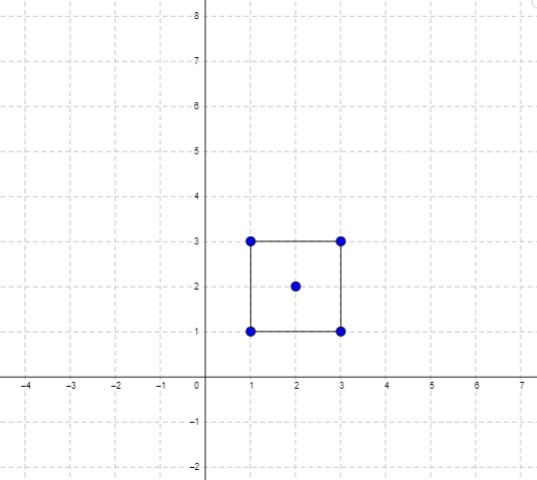
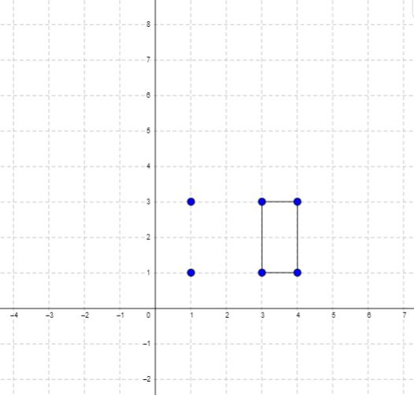

### 1. Description

You are given an array of points in the **X-Y** plane `points` where $\text{points}[i] = [x_{i}, y_{i}]$.

Return *the minimum area of a rectangle formed from these points, with sides parallel to the X and Y axes*. If there is not any such rectangle, return `0`.

### 2. Function Contract

- `n`: Input parameter.
- Returns expected result.

### 3. Examples

#### Example 1

- **Input:** $points = [[1,1],[1,3],[3,1],[3,3],[2,2]]$
- **Output:** `4`
#### Example 2

- **Input:** $points = [[1,1],[1,3],[3,1],[3,3],[4,1],[4,3]]$
- **Output:** `2`

### 4. Constraints

- $1 \le \text{points.length} \le 500$

- $\text{points}[i].length = 2$

- $0 \le x_{i}, y_{i} \le 4 * 10^{4}$

- All the given points are **unique**.