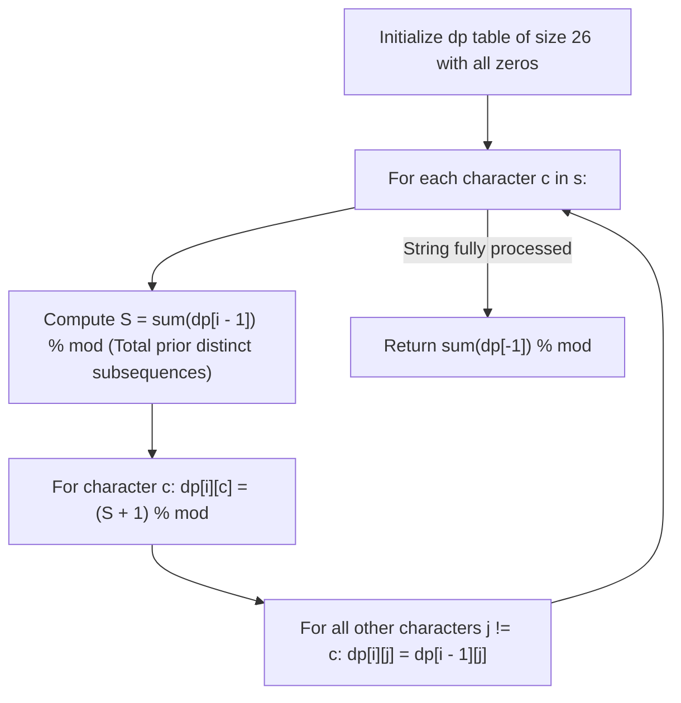

# Guided Example: Distinct Subsequences II

We trace the step-by-step evolution of the terminal-character state vector, prove the Prefix Extension and Overwrite Deduplication Invariant, and evaluate distinct subsequence counts on representative character strings:

- **Representative Instance 1 (All Distinct Characters):**
  $$
  s = \text{"abc"}
  $$
- **Required Output:** `7`
  - Step-by-step state evolution:
    1. Character `'a'`: forms single-character subsequence `"a"`.
       $dp['a'] = 0 + 1 = \mathbf{1}$. Total $= 1$.
    2. Character `'b'`: appends to `"a"` (gives `"ab"`), or stands alone (`"b"`).
       $dp['b'] = 1 + 1 = \mathbf{2}$. Total $= 1 + 2 = 3$.
    3. Character `'c'`: appends to all $3$ prior subsequences (`"ac"`, `"bc"`, `"abc"`), or stands alone (`"c"`).
       $dp['c'] = 3 + 1 = \mathbf{4}$. Total $= 3 + 4 = \mathbf{7}$.
  - The $7$ distinct subsequences:
    $$
    \{\text{"a"}, \; \text{"b"}, \; \text{"c"}, \; \text{"ab"}, \; \text{"ac"}, \; \text{"bc"}, \; \text{"abc"}\} \implies \text{Count} = \mathbf{7}
    $$
  - Formula matches $2^3 - 1 = 7$.

- **Representative Instance 2 (Repeated Separated Characters & Deduplication):**
  $$
  s = \text{"aba"}
  $$
- **Required Output:** `6`
  - Step 1 (`'a'`): $dp['a'] = 1$. Total $= 1$ (`"a"`).
  - Step 2 (`'b'`): $dp['b'] = 1 + 1 = 2$. Total $= 3$ (`"a"`, `"b"`, `"ab"`).
  - Step 3 (`'a'`):
    - Sum of prior distinct subsequences is $3$.
    - New distinct subsequences ending in `'a'`: `"a"`, `"aa"`, `"ba"`, `"aba"` $\implies 3 + 1 = \mathbf{4}$.
    - Overwriting $dp['a'] \leftarrow 4$:
      Total distinct subsequences:
      $$
      dp['a'] + dp['b'] = 4 + 2 = \mathbf{6}
      $$
    - Notice: the standalone single letter `"a"` is not counted twice!

- **Representative Instance 3 (All Identical Characters):**
  $$
  s = \text{"aaa"} \implies \text{subsequences: } \{\text{"a"}, \text{"aa"}, \text{"aaa"}\} \implies \text{output} = \mathbf{3}
  $$

---

## 1. Instance & Teaching Goal

Given a string `s`, return the number of **distinct non-empty subsequences** of `s`.
Because the answer can be very large, return it modulo $10^9 + 7$.

```text
Processing "aba":
  Char 'a': New endings in 'a' -> { "a" }                                       (dp['a'] = 1)
  Char 'b': New endings in 'b' -> { "b", "ab" }                                 (dp['b'] = 2)
  Char 'a': Append 'a' to all previous { "a", "b", "ab" } + standalone "a":
            -> { "aa", "ba", "aba", "a" }                                       (dp['a'] = 4)

Total distinct subsequences = dp['a'] + dp['b'] = 4 + 2 = 6!
```

A brute-force approach generates all $2^n$ subsequences and stores them in a hash set to remove duplicates, requiring $\mathcal{O}(2^n \cdot n)$ time and space, causing immediate failure for $n = 2{,}000$.

The decisive pedagogical goal is the **Last-Character DP Transition with Automatic Overwrite**:
- Partition all distinct non-empty subsequences by their **terminal character** $c \in \{'a' \dots 'z'\}$.
- Let $dp[c]$ be the number of distinct subsequences ending with $c$.
- When a new character $c$ appears in the string:
  1. $c$ can append to *any* existing distinct subsequence: $\sum_{x \in \Sigma} dp[x]$ ways.
  2. $c$ can stand alone as a length-1 subsequence: $+ 1$ way.
  3. The new total ending in $c$ is:
     $$
     dp[c] \leftarrow \left( \sum_{x \in \Sigma} dp[x] + 1 \right) \pmod{10^9 + 7}
     $$
- Because this new count completely supersedes any previous subsequences ending with an earlier occurrence of $c$, directly overwriting $dp[c]$ eliminates all duplicate combinations in $\mathcal{O}(26 \cdot n)$ time and $\mathcal{O}(26)$ space.

---

## 2. Conceptual Foundation & The Terminal-Character Invariant



### Mathematical Proof of Deduplication

Let $S_{k}$ denote the set of all distinct non-empty subsequences formed by prefix $s[1 \dots k]$.
Suppose character $s[k + 1] = c$.
1. **Subsequences not ending in $c$:**
   Any subsequence not ending in $c$ cannot use the newly arrived character $c$ as its last element. Its count remains identical to its count in $S_k$:
   $$
   dp_{k+1}[j] = dp_k[j], \quad \forall j \ne c
   $$
2. **Subsequences ending in $c$:**
   Any non-empty subsequence ending in $c$ within $s[1 \dots k + 1]$ has the form:
   - Either $t \parallel c$ where $t \in S_k$ (any non-empty subsequence formed earlier).
   - Or the single-character string $c$.
   Notice that if $c$ appeared earlier in $s[1 \dots k]$, any old subsequence that ended in that earlier $c$ is *already* in $S_k$, and is therefore represented as some $t \in S_k$.
   Appending $c$ to every element in $S_k \cup \{\varepsilon\}$ generates the exact, complete, and duplicate-free set of all possible subsequences ending in $c$ using characters from $s[1 \dots k + 1]$.
   Therefore:
   $$
   dp_{k+1}[c] = |S_k| + 1 = \sum_{x \in \Sigma} dp_k[x] + 1
   $$
   Overwriting the old count $dp_k[c]$ with $dp_{k+1}[c]$ leaves zero duplicates. $\blacksquare$

---

## 3. Step-by-Step Worked Execution: $s = \text{"aba"}$

Modulo: $mod = 10^9 + 7$.
Alphabet tracking vector of size $26$. Initial state: all $0$.

### Step 1: Character $c = \text{'a'}$ (Index 1)
- Prior total: $S = \sum dp_0 = 0$.
- Update $'a'$:
  $$
  dp_1['a'] = S + 1 = 0 + 1 = \mathbf{1}
  $$
- Subsequences ending in $'a'$: `["a"]`.
- Total count: $1$.

---

### Step 2: Character $c = \text{'b'}$ (Index 2)
- Prior total: $S = \sum dp_1 = dp_1['a'] = 1$.
- Update $'b'$:
  $$
  dp_2['b'] = S + 1 = 1 + 1 = \mathbf{2}
  $$
- Retain $'a'$: $dp_2['a'] = dp_1['a'] = 1$.
- Subsequences ending in $'b'$: `["b", "ab"]`.
- Total count: $1 + 2 = \mathbf{3}$.

---

### Step 3: Character $c = \text{'a'}$ (Index 3, Duplicate Letter)
- Prior total: $S = \sum dp_2 = dp_2['a'] + dp_2['b'] = 1 + 2 = 3$.
- Update $'a'$:
  $$
  dp_3['a'] = S + 1 = 3 + 1 = \mathbf{4}
  $$
- Retain $'b'$: $dp_3['b'] = dp_2['b'] = 2$.
- Subsequences ending in $'a'$:
  - From empty: `"a"`
  - From `"a"`: `"aa"`
  - From `"b"`: `"ba"`
  - From `"ab"`: `"aba"`
  Total $4$ distinct subsequences ending in `'a'`.
- Total count:
  $$
  \sum dp_3 = dp_3['a'] + dp_3['b'] = 4 + 2 = \mathbf{6}
  $$

Final answer: **`6`**.

---

## 4. State Evolution Trace Table

| Step $i$ | Processed Char $c$ | Prior Total $S = \sum dp_{i-1}$ | New Value for $c$: $S + 1$ | $dp['a']$ | $dp['b']$ | $dp['c']$ | Total Distinct Subsequences $\sum dp$ |
|:---:|:---:|:---:|:---:|:---:|:---:|:---:|:---:|
| **Init** | — | — | — | $0$ | $0$ | $0$ | $0$ |
| **1** | `'a'` | $0$ | $0 + 1 = 1$ | **$1$** | $0$ | $0$ | $1$ (`"a"`) |
| **2** | `'b'` | $1$ | $1 + 1 = 2$ | $1$ | **$2$** | $0$ | $3$ (`"a"`, `"b"`, `"ab"`) |
| **3** | `'a'` | $3$ | $3 + 1 = 4$ | **$4$** | $2$ | $0$ | $\mathbf{6}$ (`"a"`, `"b"`, `"ab"`, `"aa"`, `"ba"`, `"aba"`) |

---

## 5. Algorithmic Correctness

### Soundness & Completeness
1. **Soundness:**
   Every newly formed string is constructed by appending character $c$ to an already confirmed distinct subsequence (or is $c$ itself). Subsequences ending in different letters are naturally distinct. Subsequences ending in the same letter are distinct because they correspond bijectively to distinct prefixes.
2. **Completeness:**
   Every subsequence of $s$ must end at the last occurrence of its final character in some prefix. By processing each character from left to right, every possible distinct subsequence is captured in the corresponding bucket of the state array. Modulo arithmetic operations maintain correctness throughout.

---

## 6. Boundary Cases & Traps

| Scenario | Input Pattern | Behavior | Trapped Risk |
|---|---|---|---|
| All Identical Letters | `"aaaa"` | Each step $i$ sets $dp = i$; returns $4$ (`"a", "aa", "aaa", "aaaa"`). | Exponential double-counting on repeated characters. |
| All Distinct Letters | `"abc"` | Doubles plus one at each step ($1 \to 3 \to 7$); returns $2^n - 1$. | Off-by-one initial base case. |
| Single Character | `"z"` | $S = 0 \implies dp['z'] = 1$; returns $1$. | Index bounds or empty string errors. |
| Modulo Wrapping | Long input strings ($n = 2000$) | Arithmetic additions perform `% (10^9 + 7)`. | Integer overflow before modulo. |

---

## 7. Complexity Derivation

- **Time Complexity:** $\mathcal{O}(|\Sigma| \cdot n)$, where $|\Sigma| = 26$ is the alphabet size and $n = \text{len}(s)$.
  - The outer loop runs $n$ times.
  - In each iteration, computing the sum takes $\mathcal{O}(|\Sigma|)$ and updating the row takes $\mathcal{O}(|\Sigma|)$.
  - Total operations: at most $52n$, executing in $< 0.008\text{ s}$ for $n = 2{,}000$.
- **Auxiliary Space Complexity:** $\mathcal{O}(|\Sigma| \cdot n)$ (or $\mathcal{O}(|\Sigma|)$ with rolling 1D state).
  - The DP matrix uses $26 \times (n + 1)$ integers, requiring $< 1\text{ MB}$ of memory.