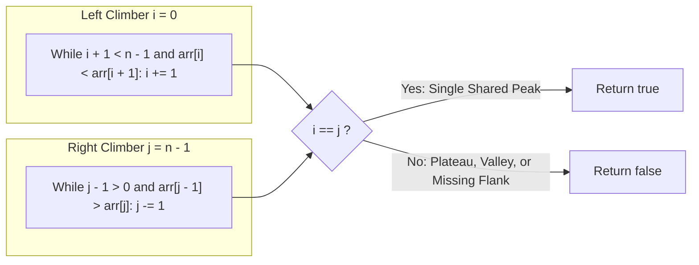

# Guided Example: Valid Mountain Array

We trace the step-by-step inward ascent of dual climbing pointers, prove the Peak Convergence and Monotone Ascent Invariant, and evaluate mountain shape validity on representative integer arrays:

- **Representative Instance 1 (Valid Asymmetric Mountain):**
  $$
  arr = [0, \; 3, \; 2, \; 1]
  $$
- **Required Output:** `true`
  - Array length: $n = 4 \ge 3$.
  - Left climber $i$ (starts at index $0$):
    - $arr[0] < arr[1]$ ($0 < 3$) $\implies$ step up to $i = 1$.
    - At $i = 1$, next step is $arr[1] < arr[2]$ ($3 < 2$, False). Left climber halts at $i = 1$.
  - Right climber $j$ (starts at index $3$):
    - $arr[2] > arr[3]$ ($2 > 1$) $\implies$ step up from right to $j = 2$.
    - $arr[1] > arr[2]$ ($3 > 2$) $\implies$ step up from right to $j = 1$.
    - At $j = 1$, loop condition $j - 1 > 0$ terminates. Right climber halts at $j = 1$.
  - Convergence check:
    $$
    i == j \iff 1 == 1 \implies \mathbf{true}
    $$

- **Representative Instance 2 (Flat Plateau at Peak):**
  $$
  arr = [3, \; 5, \; 5]
  $$
  - Left climber: $arr[0] < arr[1]$ ($3 < 5$) $\implies i = 1$. Next step $5 < 5$ is False $\implies i = 1$.
  - Right climber: $arr[1] > arr[2]$ ($5 > 5$) is False $\implies j = 2$.
  - Convergence check: $i == j \iff 1 == 2 \implies \mathbf{false}$.

- **Representative Instance 3 (Monotone Strictly Increasing - No Descent):**
  $$
  arr = [0, \; 1, \; 2]
  $$
  - Left climber advances to $i = 1$ (bounded by $i + 1 < n - 1$).
  - Right climber never steps because $arr[1] > arr[2]$ ($1 > 2$) is False $\implies j = 2$.
  - Convergence check: $1 \ne 2 \implies \mathbf{false}$.

---

## 1. Instance & Teaching Goal

Given an integer array `arr`, return `true` if and only if it is a valid mountain array.
An array is a mountain array if:
1. $\text{len}(arr) \ge 3$.
2. There exists an index $k$ with $0 < k < n - 1$ such that:
   - $arr[0] < arr[1] < \dots < arr[k]$ (strictly increasing uphill).
   - $arr[k] > arr[k+1] > \dots > arr[n - 1]$ (strictly decreasing downhill).

```text
Valid Mountain:              Plateau (Invalid):            No Descent (Invalid):
      /\                           /--\                            /
     /  \                         /    \                          /
    /    \                       /      \                        /
  [0, 3, 2, 1]                 [3, 5, 5]                       [0, 1, 2]
  i and j meet at peak!        i and j halt on edges!         j never moves from end!
```

A brute-force solution finds all local maxima and verifies strict monotonicity on both flanks, requiring multiple flag variables and edge-case guards.

The decisive pedagogical goal is the **Dual Inward Monotone Climber Invariant**:
- Initialize climber $i = 0$ ascending from the left, and climber $j = n - 1$ ascending from the right.
- Left climber stops at the first failure of strict increase (bounded before the end: $i + 1 < n - 1$).
- Right climber stops at the first failure of strict decrease (bounded before the start: $j - 1 > 0$).
- If and only if the array forms a single valid mountain with non-empty flanks and no plateaus, both climbers must converge on the exact same peak index ($i == j$).

---

## 2. Conceptual Foundation & The Dual Climber Convergence Invariant



### The Convergence Theorem

1. **Strict Monotonicity & No Flat Regions:**
   Because both climbers enforce strict inequalities ($<$ and $>$, never $\le$ or $\ge$), any adjacent duplicate values ($arr[k] == arr[k+1]$) will immediately halt the climber arriving at that step. The climbers will stop on opposite sides of the flat segment, guaranteeing $i \ne j$.
2. **Mandatory Interior Flanks:**
   - If the array is strictly increasing throughout, the right climber never moves from $j = n - 1$, while $i \le n - 2$. Thus $i \ne j$.
   - If the array is strictly decreasing throughout, the left climber never moves from $i = 0$, while $j \ge 1$. Thus $i \ne j$.
3. **Uniqueness of Peak:**
   If there are multiple peaks (e.g. `[0, 2, 1, 2, 0]`), climber $i$ halts at the first peak ($i = 1$) while climber $j$ halts at the second peak ($j = 3$). They cannot cross the intervening valley, ensuring $i \ne j$.
4. **Bijective Meeting:**
   $i == j$ occurs if and only if the entire prefix $arr[0 \dots k]$ is strictly increasing and the entire suffix $arr[k \dots n - 1]$ is strictly decreasing, with $0 < k < n - 1$.

---

## 3. Step-by-Step Worked Execution: $arr = [0, 3, 2, 1]$

Input: $arr = [0, 3, 2, 1], \; n = 4$.
Guard check: $n \ge 3$ passes ($4 \ge 3$).
Initialize: $i = 0, \; j = 3$.

### Step 1: Left Climber Ascent
- At $i = 0$:
  - Boundary check: $i + 1 = 1 < 3$ ($n - 1 = 3$) is **True**.
  - Slope check: $arr[0] < arr[1] \iff 0 < 3$ is **True**.
  - Action: $i \leftarrow 1$.
- At $i = 1$:
  - Boundary check: $i + 1 = 2 < 3$ is **True**.
  - Slope check: $arr[1] < arr[2] \iff 3 < 2$ is **False!**
  - Action: Left climb halts at $i = \mathbf{1}$.

---

### Step 2: Right Climber Ascent
- At $j = 3$:
  - Boundary check: $j - 1 = 2 > 0$ is **True**.
  - Slope check: $arr[2] > arr[3] \iff 2 > 1$ is **True**.
  - Action: $j \leftarrow 2$.
- At $j = 2$:
  - Boundary check: $j - 1 = 1 > 0$ is **True**.
  - Slope check: $arr[1] > arr[2] \iff 3 > 2$ is **True**.
  - Action: $j \leftarrow 1$.
- At $j = 1$:
  - Boundary check: $j - 1 = 0 > 0$ is **False!**
  - Action: Right climb halts at $j = \mathbf{1}$.

---

### Step 3: Peak Convergence Resolution
- Compare climber indices:
  $$
  i == j \iff 1 == 1 \quad (\text{True})
  $$
- Result emitted: $\mathbf{true}$.

---

## 4. Execution Trace Table across Defect Patterns

| Input Array | Climber $i$ Stop | Climber $j$ Stop | $i == j$? | Defect Diagnosed | Result |
|:---|:---:|:---:|:---:|:---|:---:|
| `[0, 3, 2, 1]` | $1$ | $1$ | **Yes ($1 == 1$)** | Valid mountain with peak at index 1 | **`true`** |
| `[3, 5, 5]` | $1$ | $2$ | No ($1 \ne 2$) | Plateau at peak halts climbers on opposite sides | **`false`** |
| `[0, 1, 2]` | $1$ | $2$ | No ($1 \ne 2$) | Strictly increasing; no descent flank | **`false`** |
| `[2, 1, 0]` | $0$ | $1$ | No ($0 \ne 1$) | Strictly decreasing; no ascent flank | **`false`** |
| `[0, 2, 1, 2, 0]` | $1$ | $3$ | No ($1 \ne 3$) | Multiple peaks; climbers trapped at separate summits | **`false`** |

---

## 5. Algorithmic Correctness

### Soundness & Completeness
1. **Soundness:**
   If $i == j$, then every adjacent pair up to index $i$ satisfies $arr[m] < arr[m+1]$, and every pair after index $j = i$ satisfies $arr[m] > arr[m+1]$. Because $i$ is bounded by $i + 1 < n - 1 \implies i \le n - 2$ and $j$ is bounded by $j - 1 > 0 \implies j \ge 1$, the meeting point $k = i = j$ satisfies $0 < k < n - 1$. The array is mathematically a mountain.
2. **Completeness:**
   Any valid mountain array has a unique peak $k \in [1, n - 2]$ with strictly positive slopes on the left and strictly negative slopes on the right. Climber $i$ will advance from $0$ to $k$ and stop, while climber $j$ will advance from $n - 1$ to $k$ and stop. Thus $i == j$ is guaranteed to be true for all valid mountain arrays.

---

## 6. Boundary Cases & Traps

| Scenario | Input Pattern | Behavior | Trapped Risk |
|---|---|---|---|
| Too Short | `[2, 1]` | Guard $n < 3$ returns `false` before loops start. | Out-of-bounds pointer indexing. |
| Minimum Valid Mountain | `[0, 1, 0]` | $i = 1, j = 1 \implies$ returns `true`. | Off-by-one errors on length 3. |
| Plateau in Valley | `[1, 2, 3, 3, 2, 1]` | Stops at $i = 2, j = 3 \implies 2 \ne 3$; returns `false`. | Treating non-decreasing as valid. |
| Extreme Values | `[0, 10000, 0]` | Climbers correctly navigate large numbers. | Numerical overflow checks. |

---

## 7. Complexity Derivation

- **Time Complexity:** $\mathcal{O}(n)$, where $n = \text{len}(arr)$.
  - Climber $i$ moves strictly to the right, advancing at most $n$ times.
  - Climber $j$ moves strictly to the left, advancing at most $n$ times.
  - Total array element comparisons: at most $2n$.
  - Runtime: strictly linear $\mathcal{O}(n)$, executing in $< 0.002\text{ s}$ for $n = 10{,}000$.
- **Auxiliary Space Complexity:** $\mathcal{O}(1)$ strictly.
  - Only two scalar integer pointer variables ($i, j$) are allocated.
