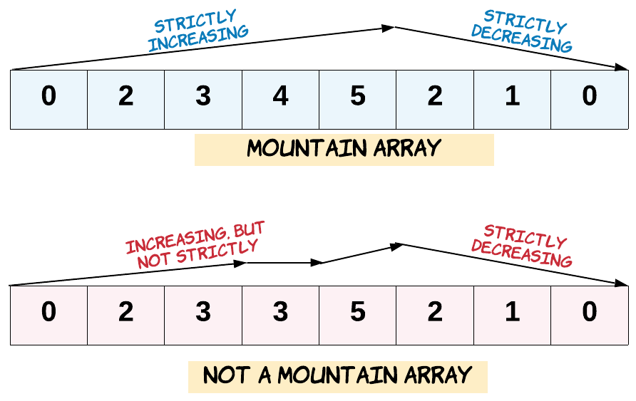

### 1. Description

Given an array of integers `arr`, return *`true` if and only if it is a valid mountain array*.

Recall that arr is a mountain array if and only if:

- $\text{arr.length} \ge 3$

- There exists some `i` with $0 < i < \text{arr.length} - 1$ such that:

		<li>$\text{arr}[0] < \text{arr}[1] < ... < arr[i - 1] < \text{arr}[i]$

- $\text{arr}[i] > arr[i + 1] > ... > arr[\text{arr.length} - 1]$

	</li>

### 2. Function Contract

- `n`: Input parameter.
- Returns expected result.

### 3. Examples

#### Example 1

- **Input:** `arr = [2,1]`
- **Output:** `false`
#### Example 2

- **Input:** `arr = [3,5,5]`
- **Output:** `false`
#### Example 3

- **Input:** `arr = [0,3,2,1]`
- **Output:** `true`

### 4. Constraints

- $1 \le \text{arr.length} \le 10^{4}$

- $0 \le \text{arr}[i] \le 10^{4}$