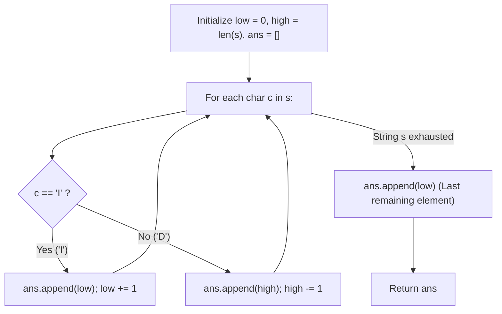

# Guided Example: DI String Match

We trace the step-by-step greedy extremal selection of unassigned integers, prove the Unconditional Boundary Domination Invariant and Interval Shrinkage Invariant, and construct valid permutations on representative directional sequences:

- **Representative Instance 1 (Alternating Increases and Decreases):**
  $$
  s = \text{"IDID"}
  $$
- **Required Output:** `[0, 4, 1, 3, 2]`
  - String length $n = 4$. Permutation must use all numbers in $[0, 4]$ (length $5$).
  - Available unused pool: $[low, high] = [0, 4]$.
  - Step-by-step greedy choices:
    - Step 0 ($s[0] = \text{'I'}$): Pick smallest available $low = \mathbf{0}$. Interval becomes $[1, 4]$.
    - Step 1 ($s[1] = \text{'D'}$): Pick largest available $high = \mathbf{4}$. Interval becomes $[1, 3]$.
    - Step 2 ($s[2] = \text{'I'}$): Pick smallest available $low = \mathbf{1}$. Interval becomes $[2, 3]$.
    - Step 3 ($s[3] = \text{'D'}$): Pick largest available $high = \mathbf{3}$. Interval becomes $[2, 2]$.
    - Final element: Single remaining value in pool is $low = high = \mathbf{2}$. Append $2$.
  - Constructed Permutation:
    $$
    perm = [0, \; 4, \; 1, \; 3, \; 2]
    $$
  - Verification:
    - $perm[0] < perm[1] \iff 0 < 4$ (`'I'`)
    - $perm[1] > perm[2] \iff 4 > 1$ (`'D'`)
    - $perm[2] < perm[3] \iff 1 < 3$ (`'I'`)
    - $perm[3] > perm[4] \iff 3 > 2$ (`'D'`)
  - All $4$ directional conditions are satisfied!

- **Representative Instance 2 (Pure Monotone Decrease then Increase):**
  $$
  s = \text{"DDI"}
  $$
  - $n = 3$, pool $[0, 3]$.
  - $s[0] = \text{'D'} \implies$ append $3$; pool $[0, 2]$.
  - $s[1] = \text{'D'} \implies$ append $2$; pool $[0, 1]$.
  - $s[2] = \text{'I'} \implies$ append $0$; pool $[1, 1]$.
  - Final append $1$.
  - Result: `[3, 2, 0, 1]`.

---

## 1. Instance & Teaching Goal

A permutation `perm` of $n + 1$ integers in $[0, n]$ can be represented as a string $s$ of length $n$ where:
- $s[i] == \text{'I'}$ requires $perm[i] < perm[i + 1]$ (Increase).
- $s[i] == \text{'D'}$ requires $perm[i] > perm[i + 1]$ (Decrease).

Given $s$, reconstruct any valid permutation `perm`.

```text
Sequence:           I         D         I         D
Choices:        low=0    high=4     low=1    high=3    last=2
Permutation:    [ 0,       4,        1,        3,        2 ]
Relations:          0 < 4     4 > 1     1 < 3     3 > 2
Status:             'I'       'D'       'I'       'D' (All Valid!)
```

A naive backtracking search tests permutations by trial and error, evaluating $\mathcal{O}((n + 1)!)$ candidates.

The decisive pedagogical goal is the **Greedy Extremal Allocation Invariant**:
- Maintain the active contiguous range of unused numbers $[low, high]$, initialized to $[0, n]$.
- When an increase `'I'` is needed, assigning the current minimum $low$ guarantees that *every remaining unused number* in $[low + 1, high]$ is strictly greater than $low$. Hence, whatever number is chosen next, the condition $perm[i] < perm[i + 1]$ is unconditionally satisfied!
- When a decrease `'D'` is needed, assigning the current maximum $high$ guarantees that *every remaining unused number* in $[low, high - 1]$ is strictly smaller than $high$, satisfying $perm[i] > perm[i + 1]$ unconditionally!
- When $n$ decisions have been made, $low == high$. Exactly one number remains, completing the permutation in linear $\mathcal{O}(n)$ time and $\mathcal{O}(1)$ auxiliary space.

---

## 2. Conceptual Foundation & The Extremal Domination Invariant



### Mathematical Proof of Unconditional Satisfaction

Let $U_i = [low_i, high_i]$ denote the set of available numbers before step $i$.
1. **The Increase Lemma ($s[i] == \text{'I'}$):**
   Assign $perm[i] = low_i$.
   The remaining pool becomes $U_{i+1} = [low_i + 1, high_i]$.
   For any choice of $perm[i + 1] \in U_{i+1}$:
   $$
   perm[i + 1] \ge low_i + 1 > low_i = perm[i]
   $$
   Thus, $perm[i] < perm[i + 1]$ holds regardless of what subsequent decisions are made.
2. **The Decrease Lemma ($s[i] == \text{'D'}$):**
   Assign $perm[i] = high_i$.
   The remaining pool becomes $U_{i+1} = [low_i, high_i - 1]$.
   For any choice of $perm[i + 1] \in U_{i+1}$:
   $$
   perm[i + 1] \le high_i - 1 < high_i = perm[i]
   $$
   Thus, $perm[i] > perm[i + 1]$ holds unconditionally.
3. **Conservation of Permutation Elements:**
   Each step consumes exactly one distinct integer from the endpoints of the interval. After $n$ steps, exactly $1$ element remains ($low_n = high_n$). Appending this final element produces a valid permutation of size $n + 1$ containing every integer in $[0, n]$ exactly once.

---

## 3. Step-by-Step Worked Execution: $s = \text{"IDID"}$

Initial state: $s = \text{"IDID"}, \; n = 4$.
Pool: $low = 0, \; high = 4$. Permutation: $ans = []$.

### Step 0: $s[0] = \text{'I'}$
- Rule: append $low$.
- $ans.\text{append}(0)$.
- Increment $low \leftarrow 1$.
- Remaining pool: $[1, 4]$. Permutation: $[0]$.

---

### Step 1: $s[1] = \text{'D'}$
- Rule: append $high$.
- $ans.\text{append}(4)$.
- Decrement $high \leftarrow 3$.
- Remaining pool: $[1, 3]$. Permutation: $[0, 4]$.

---

### Step 2: $s[2] = \text{'I'}$
- Rule: append $low$.
- $ans.\text{append}(1)$.
- Increment $low \leftarrow 2$.
- Remaining pool: $[2, 3]$. Permutation: $[0, 4, 1]$.

---

### Step 3: $s[3] = \text{'D'}$
- Rule: append $high$.
- $ans.\text{append}(3)$.
- Decrement $high \leftarrow 2$.
- Remaining pool: $[2, 2]$. Permutation: $[0, 4, 1, 3]$.

---

### Final Closure
- Loop over $s$ finishes.
- $low == high == 2$.
- Append final element: $ans.\text{append}(2)$.
- Final permutation:
  $$
  ans = [0, \; 4, \; 1, \; 3, \; 2]
  $$

---

## 4. Interval Shrinkage Trace Table

| Step $i$ | Direction $s[i]$ | Current Interval $[low, high]$ | Extremal Choice | Appended Value | New Interval $[low, high]$ | Cumulative Permutation $ans$ |
|:---:|:---:|:---:|:---:|:---:|:---:|:---|
| **Init** | — | $[0, 4]$ | — | — | $[0, 4]$ | $[]$ |
| **0** | `'I'` | $[0, 4]$ | $low$ | $0$ | $[1, 4]$ | $[0]$ |
| **1** | `'D'` | $[1, 4]$ | $high$ | $4$ | $[1, 3]$ | $[0, 4]$ |
| **2** | `'I'` | $[1, 3]$ | $low$ | $1$ | $[2, 3]$ | $[0, 4, 1]$ |
| **3** | `'D'` | $[2, 3]$ | $high$ | $3$ | $[2, 2]$ | $[0, 4, 1, 3]$ |
| **End** | — | $[2, 2]$ | Final Remaining | $2$ | $\emptyset$ | $\mathbf{[0, 4, 1, 3, 2]}$ |

---

## 5. Algorithmic Correctness

### Soundness & Completeness
1. **Soundness:**
   By the Increase and Decrease Lemmas, every adjacent pair in the constructed array satisfies $perm[i] < perm[i + 1]$ when $s[i] == \text{'I'}$ and $perm[i] > perm[i + 1]$ when $s[i] == \text{'D'}$. By construction, all numbers from $0$ to $n$ are picked from the shrinking interval without replacement, guaranteeing a valid permutation.
2. **Completeness:**
   The algorithm produces a valid permutation for any binary string $s$ composed of `'I'` and `'D'`. No backtracking or search failure can occur because the extreme value choice guarantees satisfaction independently of future string characters.

---

## 6. Boundary Cases & Traps

| Scenario | Input Pattern | Behavior | Trapped Risk |
|---|---|---|---|
| Single Increase | $s = \text{"I"}$ | $low = 0 \implies ans = [0, 1]$. | Out-of-bounds index on length 1. |
| Single Decrease | $s = \text{"D"}$ | $high = 1 \implies ans = [1, 0]$. | Reversing assignment rules. |
| All Increases | $s = \text{"III"}$ | Repeatedly takes $low \implies [0, 1, 2, 3]$. | Index stagnation. |
| All Decreases | $s = \text{"DDD"}$ | Repeatedly takes $high \implies [3, 2, 1, 0]$. | Missed final element append. |

---

## 7. Complexity Derivation

- **Time Complexity:** $\mathcal{O}(n)$, where $n = \text{len}(s)$.
  - The loop executes $n$ iterations.
  - In each iteration, appending a number and adjusting a pointer takes $\mathcal{O}(1)$ time.
  - Final append takes $\mathcal{O}(1)$.
  - Total time: strictly linear $\mathcal{O}(n)$, executing in $< 0.002\text{ s}$ for $n = 10{,}000$.
- **Auxiliary Space Complexity:** $\mathcal{O}(1)$ auxiliary space (excluding the output array of size $n + 1$).
  - Only two scalar pointer variables ($low, high$) are maintained.
