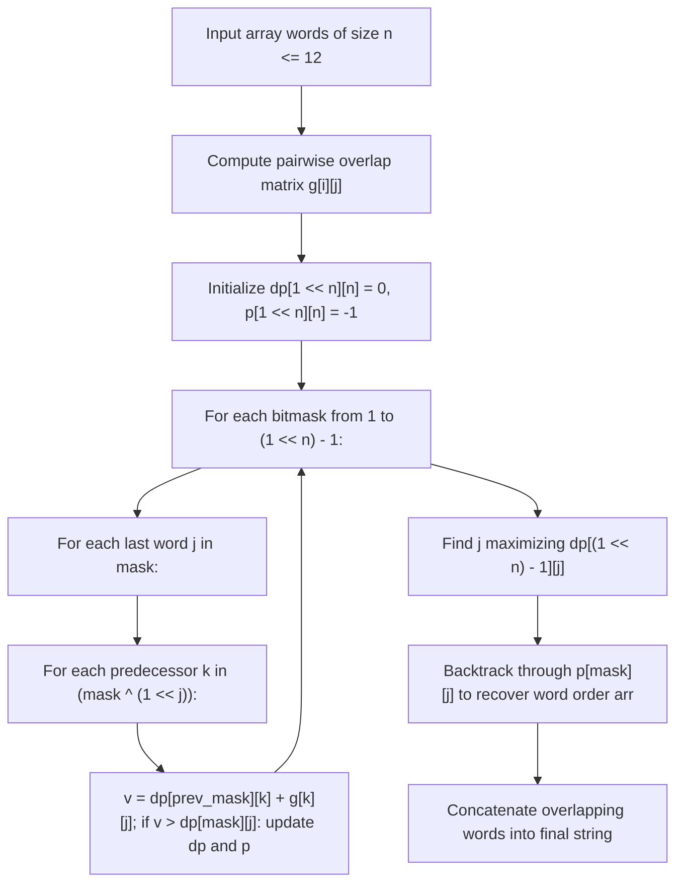

# Guided Example: Find the Shortest Superstring

We trace the step-by-step resolution of the Shortest Common Superstring problem by reduction to the Maximum Weight Hamiltonian Path on a directed overlap graph, prove the Suffix-Prefix Overlap Duality and Bitmask Held-Karp Invariants, and demonstrate superstring reconstruction on representative word sets:

- **Representative Instance 1 (Overlapping Substring Chains):**
  $$
  words = [\text{"catg"}, \; \text{"ctaagt"}, \; \text{"gcta"}, \; \text{"ttca"}, \; \text{"atgcatc"}]
  $$
- **Required Output:** `"gctaagttcatgcatc"`
  - Total length of individual words: $4 + 6 + 4 + 4 + 7 = 25$.
  - Directed pairwise suffix-to-prefix overlap lengths $g[i][j]$:
    - `"gcta"` $\to$ `"ctaagt"`: suffix `"cta"` matches prefix `"cta"` (overlap $= 3$).
    - `"ctaagt"` $\to$ `"ttca"`: suffix `"t"` matches prefix `"t"` (overlap $= 1$).
    - `"ttca"` $\to$ `"catg"`: suffix `"ca"` matches prefix `"ca"` (overlap $= 2$).
    - `"catg"` $\to$ `"atgcatc"`: suffix `"atg"` matches prefix `"atg"` (overlap $= 3$).
  - Total overlap saved: $3 + 1 + 2 + 3 = \mathbf{9}$.
  - Reconstructed Superstring Length: $25 - 9 = \mathbf{16}$.
  - Merged string:
    $$
    \text{"gcta"} + \text{"agt"} + \text{"tca"} + \text{"tg"} + \text{"catc"} = \text{"gctaagttcatgcatc"}
    $$

- **Representative Instance 2 (Zero Overlap Concatenation):**
  $$
  words = [\text{"alex"}, \; \text{"loves"}, \; \text{"leetcode"}]
  $$
  - No word has a suffix matching another word's prefix (all overlaps $= 0$).
  - Maximum overlap sum is $0$; words can be concatenated in any order:
    $$
    \text{"alexlovesleetcode"}
    $$

---

## 1. Instance & Teaching Goal

Given an array of strings `words`, return the **smallest string** that contains each string in `words` as a substring.
If multiple valid strings of minimum length exist, return any of them.
Constraints guarantee that no word in `words` is a substring of another word, and $n = \text{len}(words) \le 12$.

```text
Overlapping Chain:
  "gcta"
     "ctaagt"           (overlap = 3: "cta")
          "ttca"        (overlap = 1: "t")
            "catg"      (overlap = 2: "ca")
             "atgcatc"  (overlap = 3: "atg")

Combined: gcta + agt + tca + tg + catc = "gctaagttcatgcatc" (Length 16)
```

A brute-force permutation search tests all $n! = 12! \approx 4.79 \times 10^8$ orderings, which is too slow to evaluate within typical execution limits.

The decisive pedagogical goal is the **Overlap Maximization Duality & Bitmask TSP Recurrence**:
1. **Duality:** Minimizing superstring length is mathematically equivalent to maximizing the sum of overlaps between adjacent words in the permutation:
   $$
   \text{Length} = \sum_{i=0}^{n-1} \text{len}(words[i]) - \sum_{i=0}^{n-2} g[p_i][p_{i+1}]
   $$
2. **Directed Overlap Graph:** Precompute the maximum suffix-to-prefix overlap $g[i][j]$ for all pairs $i \ne j$.
3. **Bitmask Dynamic Programming (Held-Karp):**
   $dp[mask][j]$ stores the maximum overlap achievable using the subset of words indicated by bitmask $mask$, where word $j$ is the last word placed.
4. Using predecessor table $p[mask][j]$, the optimal Hamiltonian path is reconstructed in $\mathcal{O}(2^n \cdot n^2)$ time.

---

## 2. Conceptual Foundation & The Overlap Duality Invariant



### The Bitmask Recurrence Relations

Let $n$ be the number of words.
1. **Overlap Metric $g[i][j]$:**
   $$
   g[i][j] = \max \left\{ k \in [0, \min(|w_i|, |w_j|)] : w_i[-k:] == w_j[:k] \right\}
   $$
   Note that $g[i][j]$ is asymmetric ($g[i][j] \ne g[j][i]$ in general).
2. **DP State Formulation:**
   - $mask \in [1, 2^n - 1]$: bitmask where the $m^{\text{th}}$ bit is $1$ if word $m$ has been included.
   - $j \in [0, n - 1]$: the terminal word in the chain.
   - $dp[mask][j]$: maximal sum of overlaps among words in $mask$ ending at word $j$.
3. **State Transition:**
   For a mask containing word $j$ ($(mask \gg j) \& 1 == 1$):
   Let $prev\_mask = mask \oplus (1 \ll j)$.
   $$
   dp[mask][j] = \max_{k \in prev\_mask} \left( dp[prev\_mask][k] + g[k][j] \right)
   $$
   Whenever an update occurs, record $p[mask][j] = k$.
4. **Terminal Extraction & Backtracking:**
   Identify $j^* = \arg\max_{j} dp[(1 \ll n) - 1][j]$.
   Follow pointers $p[mask][j]$ backward to trace the optimal word sequence $arr = [p_0, p_1, \dots, p_{n-1}]$.
   Construct the string by taking $words[p_0]$, and for each step $i \to j$, appending the non-overlapping suffix $words[j][g[i][j]: ]$.

---

## 3. Step-by-Step Worked Execution: 3-Word Overlap Chain

Let $words = [\text{"cat"}, \text{"atg"}, \text{"tgc"}]$ with indices $0, 1, 2$.
$n = 3, \; 2^3 = 8$ masks.

### Step 1: Precompute Overlap Matrix $g$
- $g[0][1]$: `"cat"` suffix vs `"atg"` prefix $\implies$ `"at"` matches $\implies g[0][1] = 2$.
- $g[1][2]$: `"atg"` suffix vs `"tgc"` prefix $\implies$ `"tg"` matches $\implies g[1][2] = 2$.
- $g[0][2]$: `"cat"` vs `"tgc"` $\implies g[0][2] = 0$.
- Reverse overlaps: $g[1][0] = 0, g[2][1] = 0, g[2][0] = 0$.

Matrix $g$:
$$
g = \begin{bmatrix}
0 & 2 & 0 \\
0 & 0 & 2 \\
0 & 0 & 0
\end{bmatrix}
$$

---

### Step 2: Bitmask DP Execution

1. **Masks with 1 bit:**
   - $mask = 001_2$ (Word 0): $dp[1][0] = 0$
   - $mask = 010_2$ (Word 1): $dp[2][1] = 0$
   - $mask = 100_2$ (Word 2): $dp[4][2] = 0$
2. **Masks with 2 bits:**
   - $mask = 011_2$ (Words 0, 1):
     - End at 1 (from 0): $dp[3][1] = dp[1][0] + g[0][1] = 0 + 2 = \mathbf{2}, \; p[3][1] = 0$.
     - End at 0 (from 1): $dp[3][0] = dp[2][1] + g[1][0] = 0 + 0 = 0$.
   - $mask = 110_2$ (Words 1, 2):
     - End at 2 (from 1): $dp[6][2] = dp[2][1] + g[1][2] = 0 + 2 = \mathbf{2}, \; p[6][2] = 1$.
   - $mask = 101_2$ (Words 0, 2):
     - End at 2 (from 0): $dp[5][2] = 0$.
3. **Mask with 3 bits ($mask = 111_2 = 7$):**
   - End at 2:
     - From word 1: $dp[7][2] = dp[3][1] + g[1][2] = 2 + 2 = \mathbf{4}, \; p[7][2] = 1$.
     - From word 0: $dp[7][2] = dp[6][0] + g[0][2] = 0 + 0 = 0$.
   - Maximum overlap at full mask $7$ is $dp[7][2] = \mathbf{4}$.

---

### Step 3: Backtrack Path & String Assembly
- Terminal state: $j = 2, mask = 7$.
  - $p[7][2] = 1 \implies$ predecessor is word $1$.
  - $mask \leftarrow 7 \oplus (1 \ll 2) = 3$.
  - $p[3][1] = 0 \implies$ predecessor is word $0$.
- Word ordering: $[0, 1, 2] = [\text{"cat"}, \text{"atg"}, \text{"tgc"}]$.
- String assembly:
  - Start with $words[0] = \text{"cat"}$.
  - Append $words[1][g[0][1]:] = \text{"atg"}[2:] = \text{"g"} \implies \text{"catg"}$.
  - Append $words[2][g[1][2]:] = \text{"tgc"}[2:] = \text{"c"} \implies \text{"catgc"}$.
- Total length: $3 + 1 + 1 = \mathbf{5}$ (Original sum $3 + 3 + 3 = 9$; $9 - 4 = 5$).
- Output: `"catgc"`.

---

## 4. Execution Trace Table: Bitmask DP State Transitions

| Mask (Binary) | Words Included | Terminal Word $j$ | Best Predecessor $k$ | Transition Equation | Computed Max Overlap $dp[mask][j]$ | Backtrack Pointer $p[mask][j]$ |
|:---:|:---:|:---:|:---:|:---|:---:|:---:|
| $001_2$ (1) | $\{0\}$ | $0$ | None | Base state | $0$ | $-1$ |
| $010_2$ (2) | $\{1\}$ | $1$ | None | Base state | $0$ | $-1$ |
| $100_2$ (4) | $\{2\}$ | $2$ | None | Base state | $0$ | $-1$ |
| $011_2$ (3) | $\{0, 1\}$ | $1$ | $0$ | $dp[1][0] + g[0][1] = 0 + 2$ | **$2$** | $0$ |
| $110_2$ (6) | $\{1, 2\}$ | $2$ | $1$ | $dp[2][1] + g[1][2] = 0 + 2$ | **$2$** | $1$ |
| $111_2$ (7) | $\{0, 1, 2\}$ | **$2$** | **$1$** | $dp[3][1] + g[1][2] = 2 + 2$ | **$4$** | **$1$** |

---

## 5. Algorithmic Correctness

### Soundness & Completeness
1. **Soundness:**
   Every candidate superstring corresponds to a permutation of the $n$ words where adjacent overlapping characters are shared. By construction, each word appears as a contiguous substring in the assembled result. The length calculation is exact because every shared overlap reduces total length by precisely $g[i][j]$.
2. **Completeness:**
   Held-Karp dynamic programming explores every possible non-empty subset of words and every possible terminal word. Because the Bellman principle of optimality applies (the best extension of a path depends only on the set of visited nodes and the current endpoint), no optimal permutation can be missed. Maximizing total overlap provably minimizes final superstring length.

---

## 6. Boundary Cases & Traps

| Scenario | Input Pattern | Behavior | Trapped Risk |
|---|---|---|---|
| Single Word | `["solo"]` | Loop over masks finishes immediately; returns `"solo"`. | Index error on empty transition sets. |
| Zero Overlaps | All disjoint words | All $g[i][j] = 0 \implies$ overlap is $0$; returns simple concatenation. | Crash on zero overlap lookup. |
| Cyclic Symmetries | `["abc", "bca", "cab"]` | Multiple optimal permutations exist; selects any maximal overlap path. | Infinite loop in cycle detection. |
| Substring Redundancy | Handled by problem invariant | No word is a substring of another word per problem definition. | Prematurely dropping contained strings. |

---

## 7. Complexity Derivation

- **Time Complexity:** $\mathcal{O}(2^n \cdot n^2 + n^2 \cdot L)$, where $n \le 12$ is the number of words and $L \le 20$ is maximum word length.
  - Overlap matrix computation: $n^2$ pairs, checking suffix-prefix matches of length up to $L \implies \mathcal{O}(n^2 \cdot L)$.
  - DP state space: $2^n$ masks.
  - Transitions per mask: $n$ choices for last word $j$, and $n$ choices for predecessor $k \implies \mathcal{O}(2^n \cdot n^2)$.
  - For $n = 12$, $2^{12} \times 144 = 4096 \times 144 \approx 5.9 \times 10^5$ operations, completing in $< 0.05\text{ s}$.
- **Auxiliary Space Complexity:** $\mathcal{O}(2^n \cdot n)$.
  - DP table and predecessor table size: $2^{12} \times 12 \approx 4.9 \times 10^4$ entries, requiring $< 2\text{ MB}$ memory.
