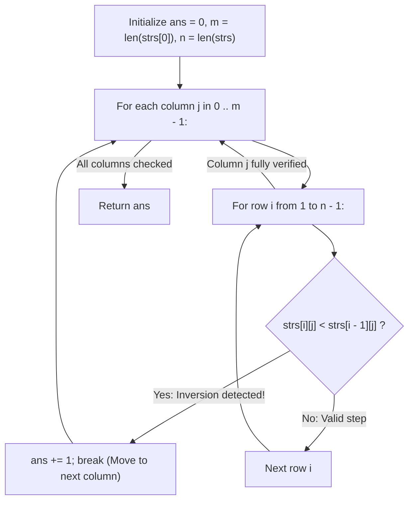

# Guided Example: Delete Columns to Make Sorted

We trace the step-by-step column-major inspection of character matrices, prove the Column Orthogonality Invariant and Local Transitivity Inversion Invariant, and evaluate column deletion decisions on representative string grids:

- **Representative Instance 1 (Single Inverted Column):**
  $$
  strs = [\text{"cba"}, \; \text{"daf"}, \; \text{"ghi"}]
  $$
- **Required Output:** `1`
  - Grid dimensions: $n = 3$ rows, $m = 3$ columns.
  - Matrix layout:
    $$
    \begin{matrix}
    \text{Row 0:} & \mathbf{c} & \mathbf{b} & \mathbf{a} \\
    \text{Row 1:} & \mathbf{d} & \mathbf{a} & \mathbf{f} \\
    \text{Row 2:} & \mathbf{g} & \mathbf{h} & \mathbf{i}
    \end{matrix}
    $$
  - Column evaluations:
    - **Column 0:** characters `'c', 'd', 'g'`.
      - Row 0 $\to$ 1: $'c' \le 'd'$ (Valid).
      - Row 1 $\to$ 2: $'d' \le 'g'$ (Valid).
      - Sorted $\implies$ **Keep**.
    - **Column 1:** characters `'b', 'a', 'h'`.
      - Row 0 $\to$ 1: $'a' < 'b'$ (**Inversion Violation!**).
      - Halts inspection immediately $\implies$ **Delete!**
    - **Column 2:** characters `'a', 'f', 'i'`.
      - Row 0 $\to$ 1: $'a' \le 'f'$ (Valid).
      - Row 1 $\to$ 2: $'f' \le 'i'$ (Valid).
      - Sorted $\implies$ **Keep**.
  - Total columns deleted: $\mathbf{1}$.

- **Representative Instance 2 (All Columns Inverted):**
  $$
  strs = [\text{"zyx"}, \; \text{"wvu"}, \; \text{"tsr"}]
  $$
  - Every column strictly decreases from top to bottom.
  - All $3$ columns deleted $\implies \mathbf{3}$.

- **Representative Instance 3 (Identical Repeated Characters):**
  $$
  strs = [\text{"aaa"}, \; \text{"aaa"}, \; \text{"aaa"}] \implies \mathbf{0}
  $$
  - Equal characters satisfy non-decreasing order ($'a' \le 'a'$); $0$ deletions needed.

---

## 1. Instance & Teaching Goal

You are given an array of $n$ strings `strs`, each of the same length $m$.
Arrange them as a grid where each string is a row.
A column is **sorted** if its characters appear in non-decreasing lexicographical order from top to bottom:
$$
strs[0][j] \le strs[1][j] \le \dots \le strs[n-1][j]
$$
Return the **number of columns that must be deleted** so that all remaining columns are sorted.

```text
Grid Representation:
  Col 0    Col 1    Col 2
    c        b        a    (Row 0)
    d        a        f    (Row 1)
    g        h        i    (Row 2)

Col 0: c <= d <= g  -> SORTED (Keep)
Col 1: b > a        -> INVERSION at row 1! (Delete Column 1)
Col 2: a <= f <= i  -> SORTED (Keep)

Total deletions required = 1
```

A naive approach transposes the matrix into column strings and executes full lexicographical sorting on each string, incurring unnecessary $\mathcal{O}(m \cdot n \log n)$ overhead and extensive string allocations.

The decisive pedagogical goal is the **Column Orthogonality & Early-Exit Inversion Invariant**:
1. **Orthogonality:** Deleting column $j$ has zero effect on the vertical ordering of characters in any other column $k \ne j$. Each column is completely decoupled.
2. **Local Transitivity:** A column is sorted if and only if every adjacent vertical step satisfies $strs[i-1][j] \le strs[i][j]$.
3. The first adjacent pair satisfying $strs[i][j] < strs[i-1][j]$ certifies that column $j$ must be deleted, allowing immediate short-circuiting (`break`) in $\mathcal{O}(1)$ extra space.

---

## 2. Conceptual Foundation & The Local Transitivity Invariant



### The Invariant of Independent Inversion Detection

1. **Decoupled Column Independent Property:**
   Let $C_j = (strs[0][j], strs[1][j], \dots, strs[n-1][j])$ be the sequence of characters in column $j$.
   The problem demands deleting the minimal subset of columns such that every surviving column $C_j$ is sorted.
   Because the sorting criterion applies strictly within each column $C_j$ and involves no cross-column interactions:
   $$
   \text{Minimal Deletions} = \sum_{j=0}^{m-1} \mathbb{I}(C_j\text{ is unsorted})
   $$
2. **Adjacent Pair Sufficiency:**
   By the transitive property of total orders, $c_0 \le c_1 \le \dots \le c_{n-1}$ holds if and only if:
   $$
   c_{i-1} \le c_i, \quad \forall i \in [1, n - 1]
   $$
   The occurrence of a single index $i$ where $c_i < c_{i-1}$ is both necessary and sufficient to mandate deletion.

---

## 3. Step-by-Step Worked Execution: Representative Instance 1

Matrix: $strs = [\text{"cba"}, \text{"daf"}, \text{"ghi"}], \; n = 3, m = 3$.
Initialize: $ans = 0$.

### Column $j = 0$
- Row $i = 1$: compare $strs[1][0] = \text{'d'}$ with $strs[0][0] = \text{'c'}$.
  - $'d' < 'c'$ is **False** ($'c' \le 'd'$).
- Row $i = 2$: compare $strs[2][0] = \text{'g'}$ with $strs[1][0] = \text{'d'}$.
  - $'g' < 'd'$ is **False** ($'d' \le 'g'$).
- Column $0$ verified sorted. $ans$ remains $0$.

---

### Column $j = 1$
- Row $i = 1$: compare $strs[1][1] = \text{'a'}$ with $strs[0][1] = \text{'b'}$.
  - $'a' < 'b'$ is **True!**
  - **Inversion found at row $1$!**
  - Action: $ans \leftarrow 0 + 1 = \mathbf{1}$.
  - Short-circuit: `break` out of row loop immediately (row $2$ is never checked).

---

### Column $j = 2$
- Row $i = 1$: compare $strs[1][2] = \text{'f'}$ with $strs[0][2] = \text{'a'}$.
  - $'f' < 'a'$ is **False** ($'a' \le 'f'$).
- Row $i = 2$: compare $strs[2][2] = \text{'i'}$ with $strs[1][2] = \text{'f'}$.
  - $'i' < 'f'$ is **False** ($'f' \le 'i'$).
- Column $2$ verified sorted.

---

### Final Count
Total deleted columns: $ans = \mathbf{1}$.

---

## 4. Grid Column Inspection Trace Table

| Column Index $j$ | Column Elements $strs[\cdot][j]$ | Step $i = 1$ Check | Step $i = 2$ Check | Inversion Detected? | Early Exit? | Action Taken | Cumulative $ans$ |
|:---:|:---:|:---:|:---:|:---:|:---:|:---|:---:|
| **$0$** | `['c', 'd', 'g']` | $'c' \le 'd'$ (Pass) | $'d' \le 'g'$ (Pass) | No | No | Keep Column | $0$ |
| **$1$** | `['b', 'a', 'h']` | $'b' > 'a'$ (**Fail!**) | — (Skipped) | **Yes (Row 1)** | **Yes** | **Delete Column** | **$1$** |
| **$2$** | `['a', 'f', 'i']` | $'a' \le 'f'$ (Pass) | $'f' \le 'i'$ (Pass) | No | No | Keep Column | $1$ |

---

## 5. Algorithmic Correctness

### Soundness & Completeness
1. **Soundness:**
   A column is counted toward $ans$ only if there exists some adjacent pair $strs[i][j] < strs[i-1][j]$. In any valid solution, an unsorted column cannot remain. Each increment of $ans$ corresponds to an unavoidably defective column.
2. **Completeness:**
   Every column $j \in [0, m - 1]$ is inspected. If a column contains any violation, the top-to-bottom scan will encounter the first pair where a decrease occurs. No invalid column can escape detection.

---

## 6. Boundary Cases & Traps

| Scenario | Input Pattern | Behavior | Trapped Risk |
|---|---|---|---|
| Single Row | `["leetcode"]` | $n = 1 \implies$ inner loop for $i \in [1, 0]$ runs $0$ times; returns $0$. | Index out-of-bounds on $i - 1$. |
| Identical Characters | `["aaa", "aaa", "aaa"]` | Equality $'a' == 'a'$ passes non-decreasing test; returns $0$. | Enforcing strict inequality ($<$). |
| Single Column | `["a", "b"]` | $m = 1 \implies$ checks single column; returns $0$. | Premature exit on single string. |
| Inversion at Final Row | Inversion at $i = n - 1$ | Scans all rows before failing; accurately increments $ans$. | Truncating row search early. |

---

## 7. Complexity Derivation

- **Time Complexity:** $\mathcal{O}(n \cdot m)$, where $n = \text{len}(strs)$ and $m = \text{len}(strs[0])$.
  - There are $m$ columns.
  - In each column, at most $n - 1$ character comparisons are performed.
  - Worst case (all columns sorted): exactly $(n - 1) \cdot m$ comparisons.
  - Best case (all columns inverted at row 1): exactly $m$ comparisons.
  - Total time: strictly $\mathcal{O}(n \cdot m)$, executing in $< 0.003\text{ s}$ for $n = 100, m = 1{,}000$.
- **Auxiliary Space Complexity:** $\mathcal{O}(1)$ strictly.
  - Matrix elements are accessed directly by index $(i, j)$ without allocating auxiliary arrays, transposed copies, or substring buffers.
