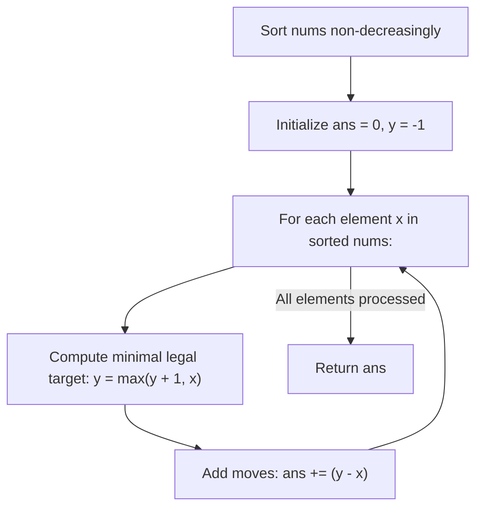

# Guided Example: Minimum Increment to Make Array Unique

We trace the step-by-step resolution of value collisions on a sorted sequence, prove the Pointwise Minimal Allocation Invariant and Monotone Floor Elevation Invariant, and evaluate move counts on representative integer arrays:

- **Representative Instance 1 (Chained Collisions and Carries):**
  $$
  nums = [3, \; 2, \; 1, \; 2, \; 1, \; 7]
  $$
- **Required Output:** `6`
  - Sort in non-decreasing order:
    $$
    nums_{\text{sorted}} = [1, \; 1, \; 2, \; 2, \; 3, \; 7]
    $$
  - Sequential minimal target allocation ($y_{-1} = -1$):
    1. $x = 1$: $y = \max(-1 + 1, 1) = \mathbf{1}$. Cost: $1 - 1 = 0$. ($y = 1$)
    2. $x = 1$: $y = \max(1 + 1, 1) = \mathbf{2}$. Cost: $2 - 1 = 1$. ($y = 2$)
    3. $x = 2$: $y = \max(2 + 1, 2) = \mathbf{3}$. Cost: $3 - 2 = 1$. ($y = 3$)
    4. $x = 2$: $y = \max(3 + 1, 2) = \mathbf{4}$. Cost: $4 - 2 = 2$. ($y = 4$)
    5. $x = 3$: $y = \max(4 + 1, 3) = \mathbf{5}$. Cost: $5 - 3 = 2$. ($y = 5$)
    6. $x = 7$: $y = \max(5 + 1, 7) = \mathbf{7}$. Cost: $7 - 7 = 0$. ($y = 7$)
  - Final unique array: $[1, 2, 3, 4, 5, 7]$.
  - Total moves:
    $$
    0 + 1 + 1 + 2 + 2 + 0 = \mathbf{6}
    $$

- **Representative Instance 2 (All Identical Elements):**
  $$
  nums = [0, \; 0, \; 0, \; 0]
  $$
  - Targets assigned: $[0, 1, 2, 3]$.
  - Increments: $(0 - 0) + (1 - 0) + (2 - 0) + (3 - 0) = 0 + 1 + 2 + 3 = \mathbf{6}$.

---

## 1. Instance & Teaching Goal

Given an integer array `nums`, you may increment any element `nums[i]` by `1` in each move.
Return the **minimum number of moves** to make every value in `nums` unique.

```text
Original sorted: [ 1,   1,   2,   2,   3,   7 ]
Collisions push:   |    |    |    |    |    |
Target values:   [ 1,   2,   3,   4,   5,   7 ]
Increments:        0 +  1 +  1 +  2 +  2 +  0 = 6 moves!
```

A naive approach increments each duplicated element step-by-step while querying a hash set of occupied numbers, causing $\mathcal{O}(n^2)$ time in dense duplicate clusters.

The decisive pedagogical goal is the **Pointwise Minimal Allocation Invariant**:
- Sort `nums` non-decreasingly: $x_0 \le x_1 \le \dots \le x_{n-1}$.
- For each element $x_i$, its assigned unique value $y_i$ must satisfy two lower bounds:
  1. **Non-decreasing increment guarantee:** $y_i \ge x_i$ (numbers cannot be decremented).
  2. **Strict uniqueness guarantee:** $y_i \ge y_{i-1} + 1$ (must exceed previous assigned value).
- Therefore, the minimal possible valid choice is:
  $$
  y_i = \max(y_{i-1} + 1, \; x_i)
  $$
- Minimizing each $y_i$ independently minimizes the global cost $\sum (y_i - x_i)$ in $\mathcal{O}(n \log n)$ time and $\mathcal{O}(1)$ extra space.

---

## 2. Conceptual Foundation & The Pointwise Minimality Theorem



### The Pointwise Minimality Proof

Let $x_0 \le x_1 \le \dots \le x_{n-1}$ be the sorted elements.
Any valid assignment of distinct integers $u_0 < u_1 < \dots < u_{n-1}$ with $u_i \ge x_i$ must satisfy:
$$
u_0 \ge x_0 \implies u_0 \ge y_0 = x_0
$$
Assume by induction that $u_{i-1} \ge y_{i-1}$.
Because $u$ is strictly increasing:
$$
u_i \ge u_{i-1} + 1 \ge y_{i-1} + 1
$$
Additionally, because moves only permit increments:
$$
u_i \ge x_i
$$
Combining both lower bounds:
$$
u_i \ge \max(y_{i-1} + 1, \; x_i) = y_i
$$
Therefore, for every index $i$, $u_i \ge y_i$.
The total move cost for assignment $u$ satisfies:
$$
\sum_{i=0}^{n-1} (u_i - x_i) \ge \sum_{i=0}^{n-1} (y_i - x_i)
$$
Hence, greedy choice $y_i = \max(y_{i-1} + 1, x_i)$ achieves the absolute global minimum of moves across all possible valid unique permutations. $\blacksquare$

---

## 3. Step-by-Step Worked Execution: Representative Instance 1

Input: $nums = [3, 2, 1, 2, 1, 7]$.
Sorted: $nums = [1, 1, 2, 2, 3, 7]$.
Initial state: $ans = 0, \; y = -1$.

### Step 1: Element $x = 1$ (Index 0)
- Compute minimal legal destination:
  $$
  y = \max(-1 + 1, 1) = \max(0, 1) = \mathbf{1}
  $$
- Increment cost: $y - x = 1 - 1 = 0$.
- Running total: $ans = 0$. Target assigned: $1$.

---

### Step 2: Element $x = 1$ (Index 1, Duplicate)
- Compute minimal legal destination:
  $$
  y = \max(1 + 1, 1) = \max(2, 1) = \mathbf{2}
  $$
- Increment cost: $y - x = 2 - 1 = \mathbf{1}$.
- Running total: $ans = 0 + 1 = \mathbf{1}$. Target assigned: $2$.

---

### Step 3: Element $x = 2$ (Index 2)
- Compute minimal legal destination:
  $$
  y = \max(2 + 1, 2) = \max(3, 2) = \mathbf{3}
  $$
- Increment cost: $y - x = 3 - 2 = \mathbf{1}$.
- Running total: $ans = 1 + 1 = \mathbf{2}$. Target assigned: $3$.

---

### Step 4: Element $x = 2$ (Index 3, Duplicate)
- Compute minimal legal destination:
  $$
  y = \max(3 + 1, 2) = \max(4, 2) = \mathbf{4}
  $$
- Increment cost: $y - x = 4 - 2 = \mathbf{2}$.
- Running total: $ans = 2 + 2 = \mathbf{4}$. Target assigned: $4$.

---

### Step 5: Element $x = 3$ (Index 4)
- Compute minimal legal destination:
  $$
  y = \max(4 + 1, 3) = \max(5, 3) = \mathbf{5}
  $$
- Increment cost: $y - x = 5 - 3 = \mathbf{2}$.
- Running total: $ans = 4 + 2 = \mathbf{6}$. Target assigned: $5$.

---

### Step 6: Element $x = 7$ (Index 5, Gap in Values)
- Compute minimal legal destination:
  $$
  y = \max(5 + 1, 7) = \max(6, 7) = \mathbf{7}
  $$
- Increment cost: $y - x = 7 - 7 = 0$.
- Running total: $ans = 6 + 0 = \mathbf{6}$. Target assigned: $7$.

---

### Final Result
Total minimum moves required: $ans = \mathbf{6}$.

---

## 4. Sequential Collision Trace Table

| Index $i$ | Current $x_i$ | Previous Assigned $y_{i-1}$ | Floor $y_{i-1} + 1$ | Target $y_i = \max(y_{i-1} + 1, x_i)$ | Moves Expended $y_i - x_i$ | Collision Type | Running Total $ans$ |
|:---:|:---:|:---:|:---:|:---:|:---:|:---|:---:|
| **$0$** | $1$ | $-1$ | $0$ | **$1$** | $0$ | None (Base) | $0$ |
| **$1$** | $1$ | $1$ | $2$ | **$2$** | $1$ | Direct duplicate of $1$ | $1$ |
| **$2$** | $2$ | $2$ | $3$ | **$3$** | $1$ | Shifted by prior allocation of $2$ | $2$ |
| **$3$** | $2$ | $3$ | $4$ | **$4$** | $2$ | Direct duplicate of $2$ pushed to $4$ | $4$ |
| **$4$** | $3$ | $4$ | $5$ | **$5$** | $2$ | Cascade collision pushed to $5$ | $6$ |
| **$5$** | $7$ | $5$ | $6$ | **$7$** | $0$ | Gap: $x > \text{floor}$ (Zero cost) | **$6$** |

---

## 5. Algorithmic Correctness

### Soundness & Completeness
1. **Soundness:**
   Every value $y_i$ satisfies $y_i \ge x_i$, so all moves are valid increments of $+1$. Furthermore, $y_i \ge y_{i-1} + 1 > y_{i-1}$, guaranteeing strict monotonicity and uniqueness across the entire assigned array.
2. **Completeness:**
   By the Pointwise Minimality Theorem, any alternative configuration that achieves distinct values with non-decreasing increments must satisfy $u_i \ge y_i$ for all $i$. No legal assignment of unique values can have fewer total moves than $\sum (y_i - x_i)$.

---

## 6. Boundary Cases & Traps

| Scenario | Input Pattern | Behavior | Trapped Risk |
|---|---|---|---|
| Single Value | `[0]` | $y = \max(-1 + 1, 0) = 0 \implies$ moves $= 0$. | Out-of-bounds index on length 1. |
| Already Unique | `[0, 2, 4, 8]` | At each step $x > y_{i-1} + 1 \implies y = x$, moves $= 0$. | Spurious increments on sparse arrays. |
| All Zeroes | `[0, 0, 0, 0]` | Base $y = -1$ correctly permits $0$ to stay $0$; targets $[0, 1, 2, 3]$. | Forbidding $0$ by bad base initialization. |
| Upper Bound Collisions | `[100000, 100000, 100000]` | Targets become $100000, 100001, 100002$. | Fixed-size array allocation bounds. |

---

## 7. Complexity Derivation

- **Time Complexity:** $\mathcal{O}(n \log n)$, where $n = \text{len}(nums)$.
  - In-place sorting of `nums`: $\mathcal{O}(n \log n)$.
  - Single linear pass through sorted values: $\mathcal{O}(n)$, performing one `max` and arithmetic update per element.
  - Total time: $\mathcal{O}(n \log n)$, executing in $< 0.015\text{ s}$ for $n = 100{,}000$.
- **Auxiliary Space Complexity:** $\mathcal{O}(1)$ beyond the sorting space $\mathcal{O}(\log n)$.
  - Only two scalar integers ($ans, y$) are tracked.
