[TOC]

## Solution

---

### Approach 1: Sorting

#### Intuition

Our first strategy to make every element in the array unique is to identify the duplicates, which we can do more efficiently by sorting the array. If an element is a duplicate of the one before it, we increment it just enough to make it larger. The total number of increments will be the minimum number of moves needed to make each character unique.

The following slideshow demonstrates this process.

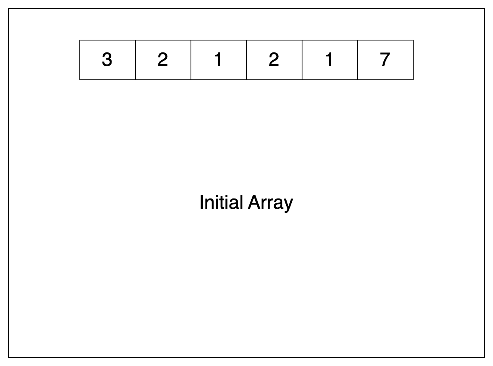

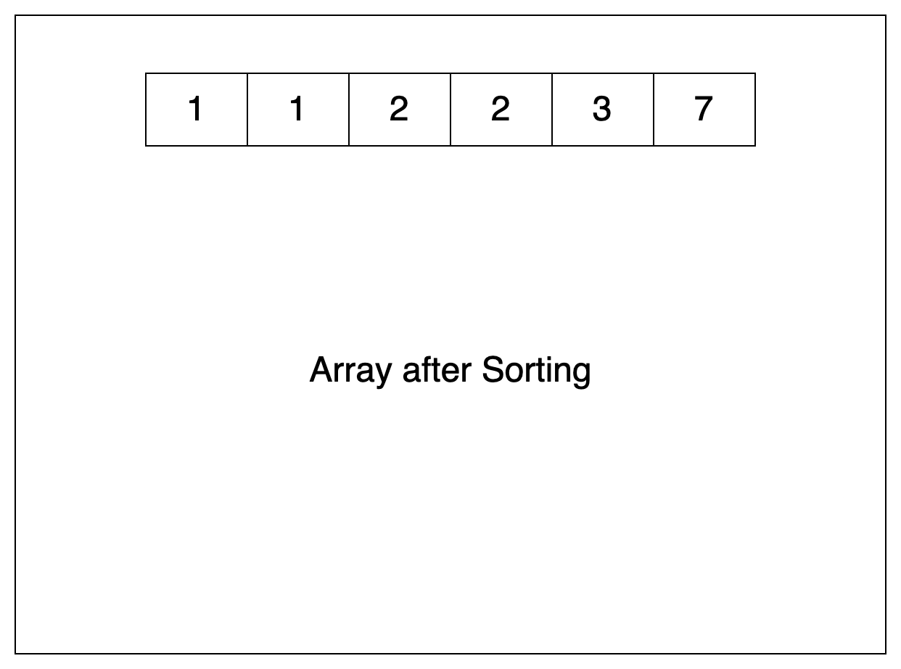

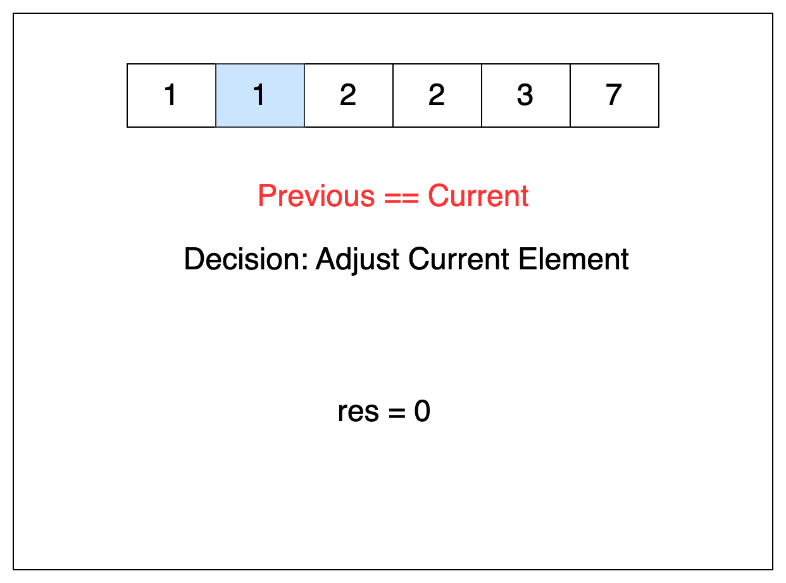

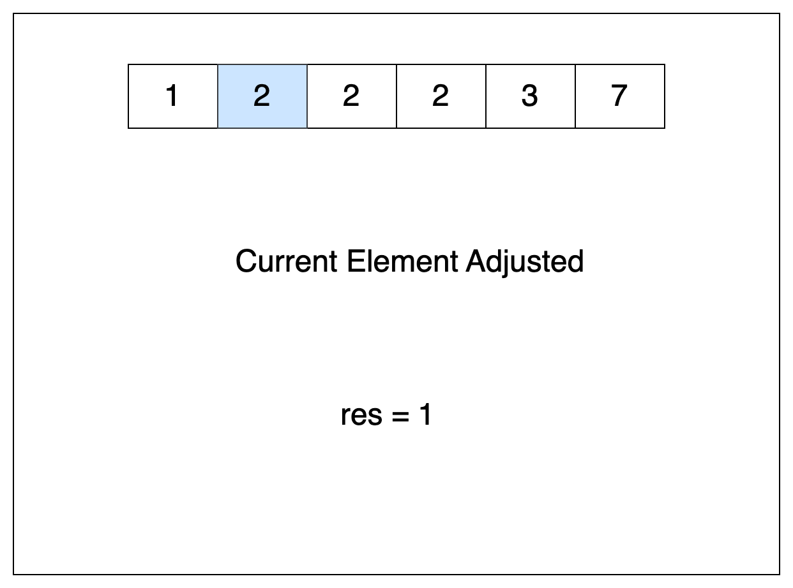

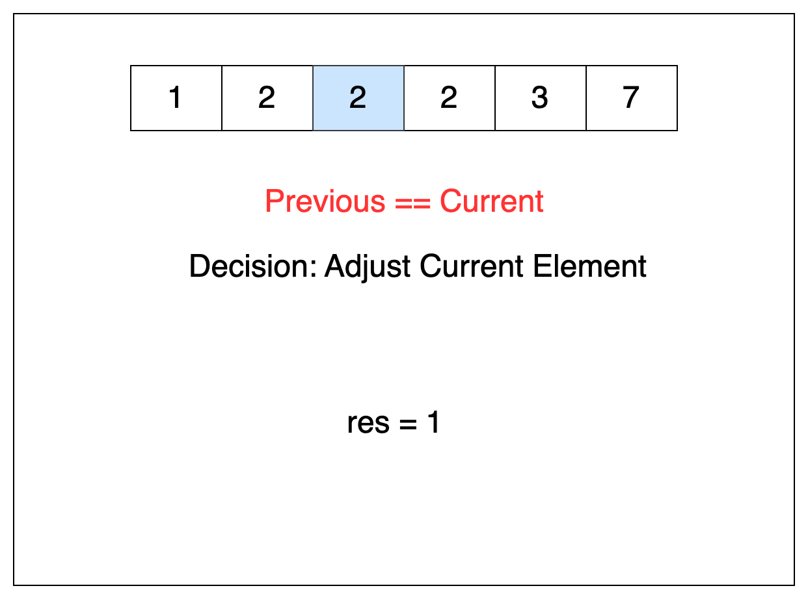

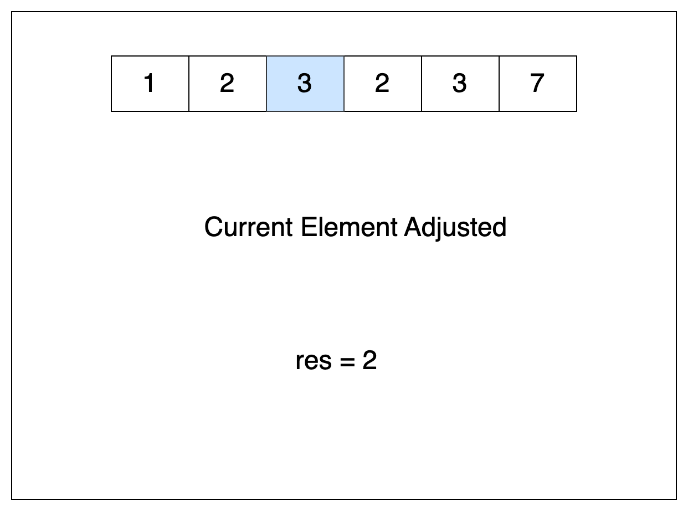

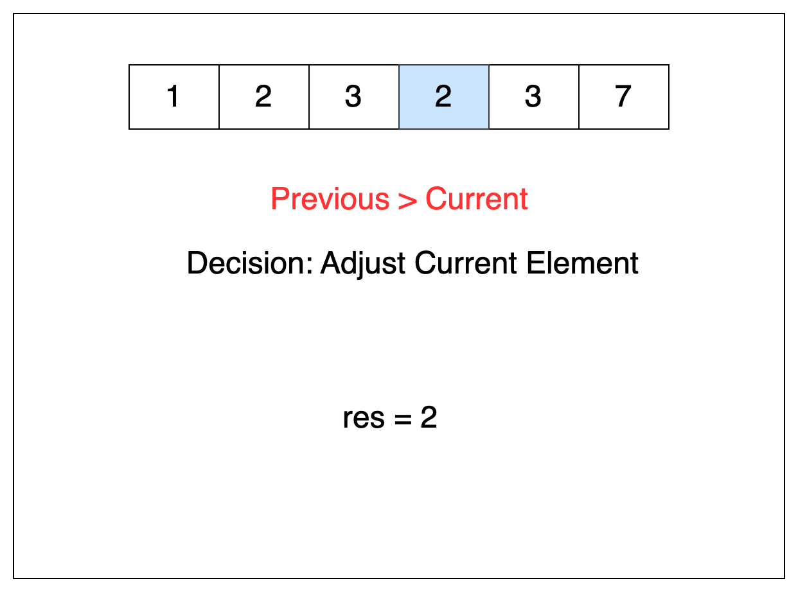

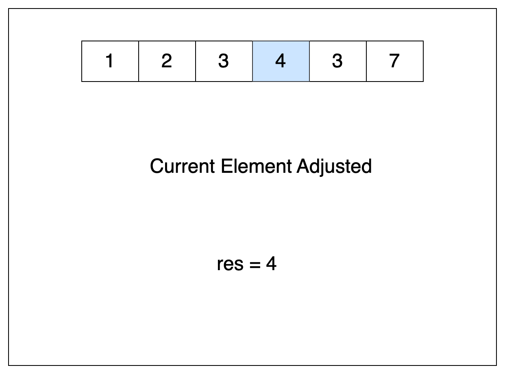

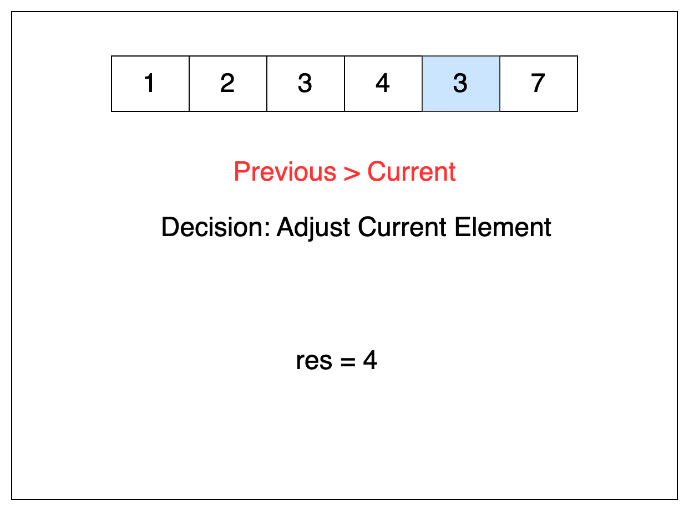

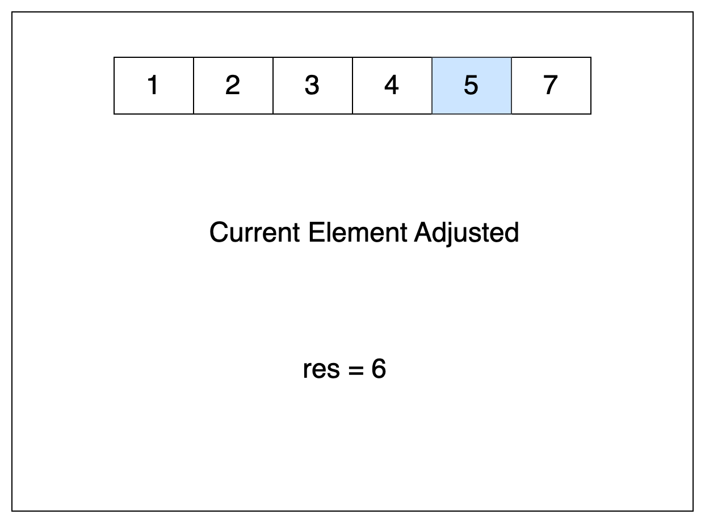

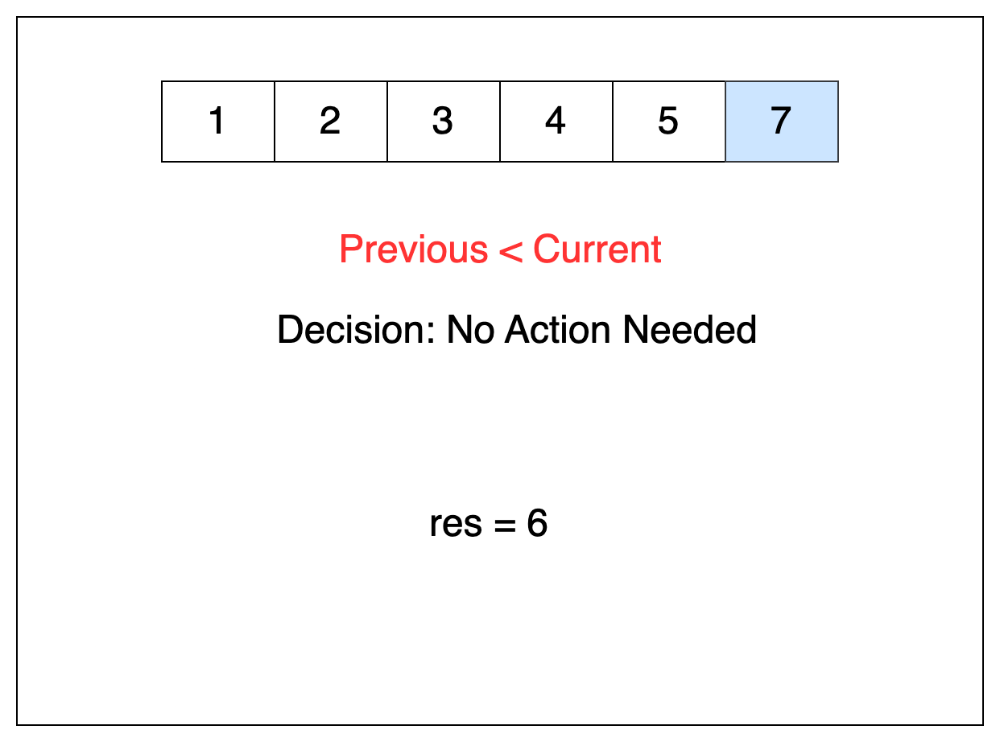

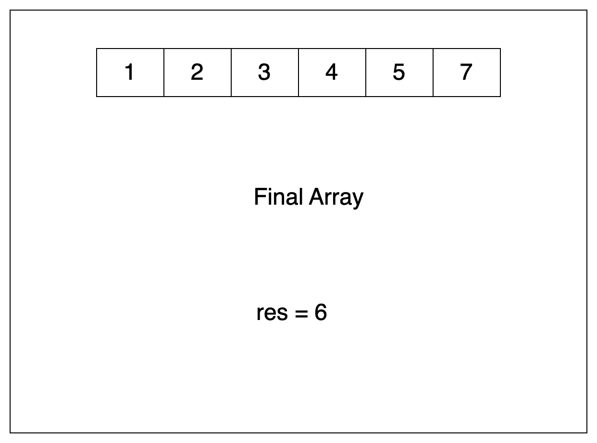

#### Algorithm

- Initialize a variable `minIncrements` to store the total number of increments needed.
- Sort `nums`.
- Iterate through `nums` starting from the second element to the last. For each element:
  - If the current element is less than or equal to the previous element:
- Set `increment` to the difference between the previous and the current element, plus one.
- Add `increment` to `minIncrements`.
- Update the current element to be one more than the previous element.
- Return `minIncrements`, which holds the minimum number of increments.

#### Implementation

```python
class Solution:
    def minIncrementForUnique(self, nums: List[int]) -> int:
        min_increments = 0

        nums.sort()

        for i in range(1, len(nums)):
            # Ensure each element is greater than its previous
            if nums[i] <= nums[i - 1]:
                # Add the required increment to minIncrements
                increment = nums[i - 1] + 1 - nums[i]
                min_increments += increment

                # Set the element to be greater than its previous
                nums[i] = nums[i - 1] + 1

        return min_increments
```

#### Complexity Analysis

Let $n$ be the length of the array `nums`.

- Time complexity: $O(n \cdot \log n)$

    Sorting the array requires $O(n \cdot \log n)$ time and a single traversal over the entire array takes $O(n)$ time. This leads to an overall time complexity of $O(n \cdot \log n) + O(n)$, which simplifies to a $O(n \cdot \log n)$ time complexity.

- Space complexity: $O(n)$ or $O(\log n)$

    Sorting arrays in place requires some additional space. The space complexity of sorting algorithms varies depending on the programming language being used:

- Python's sort method employs the Tim Sort algorithm, which is a combination of Merge Sort and Insertion Sort. This algorithm has a space complexity of $\mathcal{O}(n)$.
- In C++, the sort() function is a hybrid implementation that incorporates Quick Sort, Heap Sort, and Insertion Sort. Its worst-case space complexity is $\mathcal{O}(\log n)$.
- Java's Arrays.sort() method uses a variation of the Quick Sort algorithm. When sorting two arrays, it has a space complexity of $\mathcal{O}(\log n)$.

---

### Approach 2: Counting

#### Intuition

Another way to track duplicates is to use an array called `frequencyCount`. In this array, each index represents a unique value from our given array, `nums`, and the value at each index represents the count of occurrences of that value in `nums`.

For example: if `3` appears in `nums` twice, $\text{frequencyCount}[3]$ would equal `2`.
```
nums = [1,3,3,5,5]
frequencyCount = [0, 1, 0, 2, 0, 2]
```

We know `nums` contains all unique values when none of the values in `frequencyCount` is greater than `1`.

Once we've created the `frequencyCount` array from `nums`, we can iterate through it and simulate the process used in Approach 1 to increment each duplicate value until all values become unique.

So elements with a count of 1 or less will remain unchanged. Upon encountering a duplicate, we'll calculate the surplus of elements with that value, carry that count to the next index, and set the current index value to `1`.

We'll keep a running count for the number that we carry over to the next index; that equals how many moves it will take to make each value of `nums` unique.

We want to initialize `frequencyCount` with the largest possible range that could be needed to solve the problem. How do we determine this range?

The minimum length of `frequencyCount` would be the largest value in `nums`, and it must be long enough to hold the new values we get from incrementing any duplicates. Keep in mind that the maximum number of duplicates that we could possibly have is equal to the length of `nums`.

In problems like this, we can determine the longest possible length needed by considering a worst-case scenario. For instance, take the edge case where `nums = [4, 4, 4, 4, 4]`.

The `frequencyCount` array for this would be:
```
frequencyCount = [0, 0, 0, 0, 5]
```
If we make every element unique, the `frequencyCount` array transforms to:
```
frequencyCount = [0, 0, 0, 0, 1, 1, 1, 1, 1]
```

As you can observe, the size of the `frequencyCount` array is 9, which equals the length of the original `nums`(5) array plus the largest value found in `nums`(4).

#### Algorithm

 - Initialize variables:
   - `n` as the length of `nums`.
   - `max` to store the maximum value in `nums`.
   - `minIncrements` to store the total number of increments needed.
 - Find the maximum value in `nums`.
 - Create an array `frequencyCount` to store the frequency of each element.
 - Loop over `nums` and populate `frequencyCount`.
 - Loop over the `frequencyCount` array. For each element:
   - If the frequency is less than or equal to one, continue with the next iteration.
   - Add the duplicates to the frequency of the next element.
   - Set the frequency of the current element to one.
   - Update `minIncrements` to account for the movement of the duplicates.
 - Return `minIncrements`.

#### Implementation

```python
class Solution:
    def minIncrementForUnique(self, nums: List[int]) -> int:
        n = len(nums)
        max_val = max(nums)
        min_increments = 0

        # Create a frequencyCount array to store the frequency of each value in nums
        frequency_count = [0] * (n + max_val)

        # Populate frequencyCount array with the frequency of each value in nums
        for val in nums:
            frequency_count[val] += 1

        # Iterate over the frequencyCount array to make all values unique
        for i in range(len(frequency_count)):
            if frequency_count[i] <= 1:
                continue

            # Determine excess occurrences, carry them over to the next value,
            # ensure single occurrence for current value, and update min_increments.
            duplicates = frequency_count[i] - 1
            frequency_count[i + 1] += duplicates
            frequency_count[i] = 1
            min_increments += duplicates

        return min_increments
```

#### Complexity Analysis

Let $n$ be the length of `nums` and $max$ be the maximum element in `nums`.

* Time complexity: $O(n+max)$

    The algorithm initially iterates over `nums` twice, each iteration taking $O(n)$ time. To find the number of increments, it then loops over the `frequencyCount` array, which has a time complexity of $O(n + \text{max})$. Thus, the total time complexity is $2 \cdot$\mathcal{O}(n)$+ O(n + \text{max})$, simplifying to $O(n + \text{max})$.

* Space complexity: $O(n+max)$

    The only additional space used by the algorithm is the `frequencyCount` array, which has a size of $n + \text{max}$. Therefore, the space complexity is $O(n + \text{max})$.

---