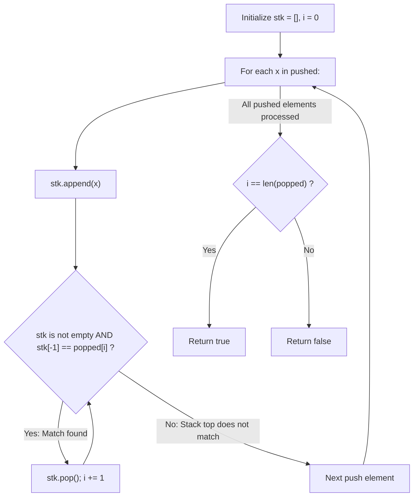

# Guided Example: Validate Stack Sequences

We trace the step-by-step physical stack simulation with greedy forced popping, prove the Forced-Pop Feasibility Invariant and LIFO Inversion Obstruction Principle, and validate stack sequences on representative permutations:

- **Representative Instance 1 (Valid Interleaved Schedule):**
  $$
  pushed = [1, \; 2, \; 3, \; 4, \; 5], \quad popped = [4, \; 5, \; 3, \; 2, \; 1]
  $$
- **Required Output:** `true`
  - Step-by-step simulation:
    - Push $1 \implies stk = [1]$
    - Push $2 \implies stk = [1, 2]$
    - Push $3 \implies stk = [1, 2, 3]$
    - Push $4 \implies stk = [1, 2, 3, 4]$. Top is $4 == popped[0]$.
      - **Forced pop:** pop $4 \implies stk = [1, 2, 3]$, target pointer advances to $popped[1] = 5$.
    - Push $5 \implies stk = [1, 2, 3, 5]$. Top is $5 == popped[1]$.
      - **Cascading pops:**
        - Pop $5 \implies stk = [1, 2, 3]$, next target $popped[2] = 3$.
        - Top $3 == popped[2] \implies$ pop $3 \implies stk = [1, 2]$, next target $popped[3] = 2$.
        - Top $2 == popped[3] \implies$ pop $2 \implies stk = [1]$, next target $popped[4] = 1$.
        - Top $1 == popped[4] \implies$ pop $1 \implies stk = []$, target pointer reaches index $5$.
  - All $5$ elements in `popped` matched $\implies \mathbf{true}$.

- **Representative Instance 2 (Blocked LIFO Obstruction):**
  $$
  pushed = [1, \; 2, \; 3, \; 4, \; 5], \quad popped = [4, \; 3, \; 5, \; 1, \; 2]
  $$
  - Push $1, 2, 3, 4 \implies$ pop $4$, pop $3$. Stack remaining: $[1, 2]$.
  - Push $5 \implies$ pop $5$. Stack remaining: $[1, 2]$.
  - Next required pop is $popped[3] = 1$.
  - But stack top is $2$! Element $1$ is buried beneath $2$.
  - In a LIFO stack, $2$ must be popped before $1$, contradicting the requirement that $1$ pops before $2$.
  - Execution stalls with $i = 3 \ne 5 \implies \mathbf{false}$.

---

## 1. Instance & Teaching Goal

Given two integer arrays `pushed` and `popped` with distinct values, return `true` if and only if this could have resulted from a sequence of push and pop operations on an initially empty stack.

```text
Simulation of [1, 2, 3, 4, 5] -> [4, 5, 3, 2, 1]:
  Push 1, 2, 3, 4:   | 4 | <- Matches popped[0]=4! POP!
                     | 3 |
                     | 2 |
                     | 1 |
  Push 5:            | 5 | <- Matches popped[1]=5! POP!
                     | 3 | <- Matches popped[2]=3! POP!
                     | 2 | <- Matches popped[3]=2! POP!
                     | 1 | <- Matches popped[4]=1! POP!
  Stack is empty, all 5 popped! -> TRUE
```

A naive search branches between pushing and popping at every step, creating an exponential state explosion.

The decisive pedagogical goal is the **Greedy Forced-Pop Invariant**:
- Push elements strictly in the order prescribed by `pushed`.
- Whenever the current top of the stack matches `popped[i]`, popping it immediately is **strictly necessary and optimal**:
  - If we delayed popping and pushed another element $z$ onto the stack, $z$ would sit above `popped[i]`.
  - Under Last-In-First-Out (LIFO) discipline, $z$ would have to pop before `popped[i]`.
  - But the desired output specifies that `popped[i]` must pop before $z$, an inescapable contradiction!
- By eagerly popping whenever $stk[-1] == popped[i]$, the entire simulation runs deterministically in linear $\mathcal{O}(n)$ time and $\mathcal{O}(n)$ space.

---

## 2. Conceptual Foundation & The Forced-Pop Invariant



### The Forced-Pop Optimality Lemma

Let the target pop sequence be $P = [p_0, p_1, \dots, p_{n-1}]$.
Suppose after pushing an element, the stack top is $T = stk[-1]$, and the next requested pop is $p_i$.
1. **Case 1 ($T == p_i$):**
   Can we achieve a valid schedule by postponing this pop?
   If we do not pop $T$ now, the only alternative legal operation is to push the next element $x$ from `pushed`.
   The stack top becomes $x$, placing $T$ beneath $x$.
   To pop $T$, we must first pop $x$.
   This implies that $x$ is emitted into the output sequence before $T$.
   However, $T = p_i$ is required to be emitted next, before any subsequent elements.
   Because all elements are distinct, this violates the prescribed sequence $P$.
   Therefore, whenever $T == p_i$, popping immediately is the *only* possible move that preserves validity.
2. **Case 2 ($T \ne p_i$):**
   Because $T \ne p_i$, popping $T$ now would emit the wrong element ($T$ instead of $p_i$).
   The only legal option is to push the next element from `pushed`.

Together, Cases 1 and 2 establish that the operation sequence is entirely deterministic. No backtracking is ever required.

---

## 3. Step-by-Step Worked Execution: Representative Instance 1

Pushed: $[1, 2, 3, 4, 5]$, Popped: $[4, 5, 3, 2, 1]$.
Initialize: $stk = [], \; i = 0$.

### Push 1: $x = 1$
- Append $1 \implies stk = [1]$.
- Check pop: $stk[-1] = 1 \ne popped[0] = 4$. Proceed.

---

### Push 2: $x = 2$
- Append $2 \implies stk = [1, 2]$.
- Check pop: $stk[-1] = 2 \ne 4$. Proceed.

---

### Push 3: $x = 3$
- Append $3 \implies stk = [1, 2, 3]$.
- Check pop: $stk[-1] = 3 \ne 4$. Proceed.

---

### Push 4: $x = 4$
- Append $4 \implies stk = [1, 2, 3, 4]$.
- Check pop: $stk[-1] = 4 == popped[0] = 4$ (**Match!**).
  - Pop $4 \implies stk = [1, 2, 3]$.
  - Increment $i \leftarrow 1$.
  - Check pop: $stk[-1] = 3 \ne popped[1] = 5$. While loop breaks.

---

### Push 5: $x = 5$
- Append $5 \implies stk = [1, 2, 3, 5]$.
- Check pop: $stk[-1] = 5 == popped[1] = 5$ (**Match!**).
  - Pop $5 \implies stk = [1, 2, 3], \; i \leftarrow 2$.
- Check pop: $stk[-1] = 3 == popped[2] = 3$ (**Match!**).
  - Pop $3 \implies stk = [1, 2], \; i \leftarrow 3$.
- Check pop: $stk[-1] = 2 == popped[3] = 2$ (**Match!**).
  - Pop $2 \implies stk = [1], \; i \leftarrow 4$.
- Check pop: $stk[-1] = 1 == popped[4] = 1$ (**Match!**).
  - Pop $1 \implies stk = [], \; i \leftarrow 5$.
- Stack is empty. While loop breaks.

---

### Final Evaluation
- Loop over `pushed` complete.
- $i == \text{len}(popped) \iff 5 == 5 \implies \mathbf{true}$.

---

## 4. Stack Evolution Trace Table

| Event | Element Processed | Stack State Before Pop | Target $popped[i]$ | Action Taken | Stack State After Pop | Pop Index $i$ |
|:---:|:---:|:---:|:---:|:---|:---:|:---:|
| Push | $1$ | $[1]$ | $4$ | No pop ($1 \ne 4$) | $[1]$ | $0$ |
| Push | $2$ | $[1, 2]$ | $4$ | No pop ($2 \ne 4$) | $[1, 2]$ | $0$ |
| Push | $3$ | $[1, 2, 3]$ | $4$ | No pop ($3 \ne 4$) | $[1, 2, 3]$ | $0$ |
| Push | $4$ | $[1, 2, 3, 4]$ | $4$ | **Pop $4$** | $[1, 2, 3]$ | $1$ |
| Push | $5$ | $[1, 2, 3, 5]$ | $5$ | **Pop $5$** | $[1, 2, 3]$ | $2$ |
| Cascade | — | $[1, 2, 3]$ | $3$ | **Pop $3$** | $[1, 2]$ | $3$ |
| Cascade | — | $[1, 2]$ | $2$ | **Pop $2$** | $[1]$ | $4$ |
| Cascade | — | $[1]$ | $1$ | **Pop $1$** | $[]$ | $\mathbf{5}$ |

---

## 5. Algorithmic Correctness

### Soundness & Completeness
1. **Soundness:**
   Every performed operation is a valid stack push or pop. Pushes occur in the exact input sequence, and pops occur only when the stack top matches the next required output element. If $i == \text{len}(popped)$, the sequence of simulated operations is a witness proving that `popped` is achievable.
2. **Completeness:**
   By the Forced-Pop Optimality Lemma, eager popping never eliminates any feasible sequence. If a valid schedule exists, the greedy simulation is guaranteed to find it. Stalling with $i < \text{len}(popped)$ mathematically proves no valid schedule exists.

---

## 6. Boundary Cases & Traps

| Scenario | Input Pattern | Behavior | Trapped Risk |
|---|---|---|---|
| Single Element | `pushed = [0], popped = [0]` | Pushes $0$, pops $0 \implies i = 1$; returns `true`. | Loop boundary off-by-one. |
| Immediate Pops | `[1, 2, 3]`, `[1, 2, 3]` | Each element pops immediately after its push; returns `true`. | Stack underflow on consecutive pops. |
| Full Reverse Order | `[1, 2, 3]`, `[3, 2, 1]` | All elements push, then all pop consecutively; returns `true`. | Premature loop exit. |
| Buried Inversion | `[1, 2, 3]`, `[3, 1, 2]` | Pops $3$, but $2$ sits above $1$; halts at $i = 1$, returns `false`. | Accidental pop of non-top elements. |

---

## 7. Complexity Derivation

- **Time Complexity:** $\mathcal{O}(n)$, where $n = \text{len}(pushed) = \text{len}(popped)$.
  - Each element is pushed onto the stack exactly once ($n$ pushes total).
  - Each element is popped from the stack at most once ($n$ pops total).
  - Both inner and outer loop statements execute at most $2n$ times.
  - Runtime: strictly $\mathcal{O}(n)$, running in $< 0.003\text{ s}$ for $n = 1{,}000$.
- **Auxiliary Space Complexity:** $\mathcal{O}(n)$ to store the explicit simulation stack `stk`.
