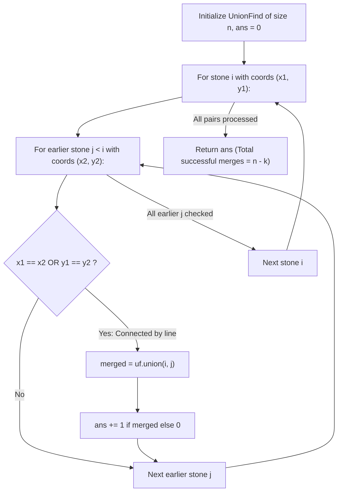

# Guided Example: Most Stones Removed with Same Row or Column

We trace the step-by-step construction of the stone intersection graph via Disjoint Set Union (DSU), prove the Spanning Tree Leaf Elimination Lemma and Component-Removals Conservation Law, and evaluate stone removals on representative 2D coordinate configurations:

- **Representative Instance 1 (Single Fully Connected Component):**
  $$
  stones = [[0, 0], \; [0, 1], \; [1, 0], \; [1, 2], \; [2, 1], \; [2, 2]]
  $$
- **Required Output:** `5`
  - Total stones: $n = 6$.
  - Shared coordinates define adjacency edges:
    - $(0, 0)$ shares row with $(0, 1)$ and column with $(1, 0)$.
    - $(0, 1)$ shares column with $(2, 1)$.
    - $(1, 0)$ shares row with $(1, 2)$.
    - $(1, 2)$ shares column with $(2, 2)$.
    - $(2, 1)$ shares row with $(2, 2)$.
  - All $6$ stones belong to a single connected component $C_1$ ($k = 1$).
  - Spanning tree leaf peeling allows removing $|C_1| - 1 = 6 - 1 = \mathbf{5}$ stones.
  - Exactly $1$ stone remains as an anchor.

- **Representative Instance 2 (Component with Isolated Stone):**
  $$
  stones = [[0, 0], \; [0, 2], \; [1, 1], \; [2, 0], \; [2, 2]]
  $$
  - Stones $(0, 0), (0, 2), (2, 0), (2, 2)$ form component $C_1$ of size $4$.
  - Stone $(1, 1)$ shares neither row nor column with any other stone, forming component $C_2$ of size $1$.
  - Number of connected components: $k = 2$.
  - Total stones removable:
    $$
    (|C_1| - 1) + (|C_2| - 1) = (4 - 1) + (1 - 1) = 3 + 0 = \mathbf{3}
    $$
  - Formula: $n - k = 5 - 2 = \mathbf{3}$.

---

## 1. Instance & Teaching Goal

On a 2D plane, $n$ stones are placed at integer coordinates.
A stone can be removed if it shares either the same row or the same column as another stone that has not been removed.
Return the **largest possible number of stones that can be removed**.

```text
Component C1 (Size 4):           Isolated Stone C2 (Size 1):
  (0,0) ------- (0,2)                       .
    |             |
    |             |                       (1,1)
    |             |
  (2,0) ------- (2,2)

Removals from C1 = 4 - 1 = 3              Removals from C2 = 1 - 1 = 0
Total Removals = 3 + 0 = 3
```

A greedy simulation that picks stones to delete arbitrarily risks severing the connection between remaining stones, isolating them prematurely and undercounting removals.

The decisive pedagogical goal is the **Spanning Tree Leaf Elimination Theorem**:
- View stones as vertices in an undirected graph, where an edge exists between two stones if they share a row or column.
- In any connected component $C$ of size $|C|$, we can construct a spanning tree $T$.
- By repeatedly picking a leaf node of $T$ and deleting it, the remaining stones always stay connected.
- Thus, exactly $|C| - 1$ stones can be safely removed from each component, leaving exactly $1$ stone behind.
- Across $k$ connected components, the maximum number of removable stones is:
  $$
  \text{Max Removals} = \sum_{j=1}^k (|C_j| - 1) = n - k
  $$
- In DSU, every successful `union` operation merges two previously disjoint components, reducing $k$ by $1$.
- Therefore, the number of successful unions `ans += uf.union(i, j)` is identically equal to $n - k$.

---

## 2. Conceptual Foundation & The Leaf Peeling Invariant



### The Spanning Tree Leaf Elimination Lemma

Let $G = (V, E)$ be a connected graph representing a single component of stones with $|V| \ge 2$.
1. **Existence of Spanning Tree:**
   Because $G$ is connected, there exists a spanning tree $T \subseteq G$ containing all $|V|$ stones and $|V| - 1$ edges.
2. **Existence of a Removable Leaf:**
   Any tree with $|V| \ge 2$ vertices contains at least two leaves.
   Let $u$ be a leaf of $T$, and let $v$ be its unique neighbor (parent) in $T$.
   Because $(u, v) \in E$, stones $u$ and $v$ share either a row or a column.
   If stone $v$ has not yet been removed, stone $u$ is legally eligible for removal!
3. **Inductive Invariant:**
   Removing leaf $u$ leaves $T' = T \setminus \{u\}$ as a connected spanning tree of size $|V| - 1$.
   No edges between the remaining $|V| - 1$ stones are disturbed.
   By induction on $|V|$, we can continue peeling leaves until only the root of $T$ remains.
4. **Conclusion:**
   For any connected component $C_j$, exactly $|C_j| - 1$ stones can be removed without ever violating the rule. Summing over all $k$ components yields $\sum (|C_j| - 1) = n - k$. $\blacksquare$

---

## 3. Step-by-Step Worked Execution: Representative Instance 2

Stones: $[s_0: (0, 0), \; s_1: (0, 2), \; s_2: (1, 1), \; s_3: (2, 0), \; s_4: (2, 2)]$.
$n = 5$ stones.
Initialize: $ans = 0$, $p = [0, 1, 2, 3, 4]$.

### Step 1: Pairwise Inspections for Stone 1: $(0, 2)$
- Compare with $s_0: (0, 0)$: shares row $x = 0$.
- `uf.union(1, 0)`: merge roots $1$ and $0$ $\implies$ returns `True`.
- $ans \leftarrow 0 + 1 = \mathbf{1}$.

---

### Step 2: Pairwise Inspections for Stone 2: $(1, 1)$
- Compare with $s_0: (0, 0)$: $x \ne 0, y \ne 0$. No edge.
- Compare with $s_1: (0, 2)$: $x \ne 0, y \ne 2$. No edge.
- Stone $2$ remains isolated. $ans = 1$.

---

### Step 3: Pairwise Inspections for Stone 3: $(2, 0)$
- Compare with $s_0: (0, 0)$: shares column $y = 0$.
- `uf.union(3, 0)`: merge roots $3$ and $\{0, 1\}$ $\implies$ returns `True`.
- $ans \leftarrow 1 + 1 = \mathbf{2}$.
- Compare with $s_1: (0, 2)$: different coords.
- Compare with $s_2: (1, 1)$: different coords.

---

### Step 4: Pairwise Inspections for Stone 4: $(2, 2)$
- Compare with $s_0: (0, 0)$: different coords.
- Compare with $s_1: (0, 2)$: shares column $y = 2$.
- `uf.union(4, 1)`: root of $4$ is $4$, root of $1$ is $0$. Merges $\implies$ returns `True`.
- $ans \leftarrow 2 + 1 = \mathbf{3}$.
- Compare with $s_2: (1, 1)$: different coords.
- Compare with $s_3: (2, 0)$: shares row $x = 2$.
  - `uf.union(4, 3)`: both $4$ and $3$ already belong to root $0$!
  - `find(4) == find(3)` $\implies$ returns `False`.
  - Redundant cycle edge does not increment $ans$.

---

### Final Result
Total successful unions: $ans = \mathbf{3}$.
$n - k = 5 - 2 = \mathbf{3}$.

---

## 4. DSU Merge and Component Evolution Table

| Stone Pair $(i, j)$ | Coords $s_i$ and $s_j$ | Shared Axis? | `find(i)` | `find(j)` | Merge Result | Component Count $k$ | Cumulative Removals $ans$ |
|:---:|:---:|:---:|:---:|:---:|:---:|:---:|:---:|
| **Init** | — | — | — | — | — | $5$ | $0$ |
| $(1, 0)$ | $(0, 2) \leftrightarrow (0, 0)$ | Row $0$ | $1$ | $0$ | **Merged (True)** | $4$ | $1$ |
| $(2, 0), (2, 1)$ | $(1, 1) \leftrightarrow \dots$ | None | $2$ | $0$ | Disjoint | $4$ | $1$ |
| $(3, 0)$ | $(2, 0) \leftrightarrow (0, 0)$ | Col $0$ | $3$ | $0$ | **Merged (True)** | $3$ | $2$ |
| $(4, 1)$ | $(2, 2) \leftrightarrow (0, 2)$ | Col $2$ | $4$ | $0$ | **Merged (True)** | **$2$** | **$3$** |
| $(4, 3)$ | $(2, 2) \leftrightarrow (2, 0)$ | Row $2$ | $0$ | $0$ | Cycle (False) | $2$ | $3$ |

---

## 5. Algorithmic Correctness

### Soundness & Completeness
1. **Soundness:**
   A removal schedule is realizable if and only if each removed stone shares a line with at least one simultaneously present stone. By the Spanning Tree Leaf Elimination Lemma, peeling leaves in reverse topological order from any spanning tree guarantees this condition at every removal step until exactly one stone per connected component remains.
2. **Completeness:**
   A stone in component $A$ cannot enable the removal of a stone in component $B$ if no path of shared coordinates connects them. Thus, each connected component must leave behind at least $1$ stone. The bound $n - k$ is mathematically tight and cannot be exceeded.

---

## 6. Boundary Cases & Traps

| Scenario | Input Pattern | Behavior | Trapped Risk |
|---|---|---|---|
| Single Stone | `[[0, 0]]` | $n = 1 \implies$ loop range empty; returns $0$. | Division by zero or negative removals. |
| All Isolated Stones | `[[0, 0], [1, 1], [2, 2]]` | $k = n \implies n - k = 0$; returns $0$. | Spurious unions on disjoint diagonals. |
| All in Same Row | `[[5, 0], [5, 1], [5, 2]]` | All merge into single component; returns $n - 1 = 2$. | Miscounting parallel stones. |
| Redundant Cycles | 4 stones forming a square | 4th edge returns `False`; avoids overcounting removals. | Assuming edge count equals removals. |

---

## 7. Complexity Derivation

- **Time Complexity:** $\mathcal{O}(n^2 \cdot \alpha(n))$, where $n = \text{len}(stones)$ and $\alpha$ is the Inverse Ackermann function.
  - Checking all pairs of stones takes $\binom{n}{2} = \frac{n(n - 1)}{2}$ comparisons.
  - For each pair sharing a row or column, `find` and `union` with path compression and union-by-size execute in nearly constant $\mathcal{O}(\alpha(n))$ time.
  - Total time: $\mathcal{O}(n^2 \alpha(n))$, running in $< 0.015\text{ s}$ for $n = 1{,}000$.
- **Auxiliary Space Complexity:** $\mathcal{O}(n)$ to store DSU parent array $p$ and size array $size$.
