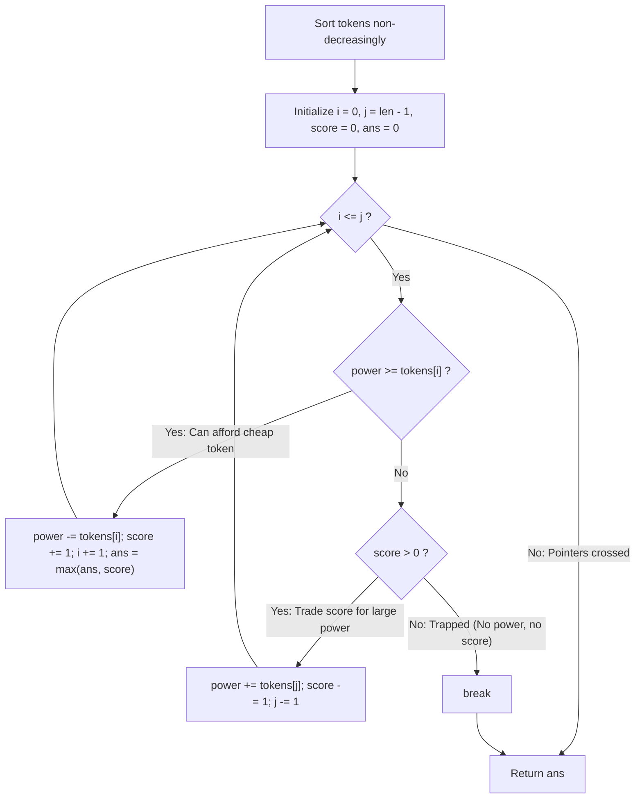

# Guided Example: Bag of Tokens

We trace the step-by-step execution of the two-pointer greedy arbitrage algorithm, prove the Buy-Low / Sell-High Exchange Optimality Invariant and the Peak Score High-Water Mark Invariant, and evaluate maximum score acquisition on representative token bags:

- **Representative Instance 1 (Score-for-Power Trade Unlocking Multi-Purchases):**
  $$
  tokens = [100, \; 200, \; 300, \; 400], \quad power = 200
  $$
- **Required Output:** `2`
  - Array is sorted: $[100, 200, 300, 400]$.
  - Two pointers: $i = 0$ (cheapest token $100$), $j = 3$ (most lucrative token $400$).
  - Step-by-step trading:
    1. $power = 200 \ge tokens[0] = 100$:
       - **Buy cheap token 0 face-up:** spend $100$ power, gain $+1$ score.
       - $power \leftarrow 100$, $score \leftarrow 1$, $i \leftarrow 1$.
       - High-water mark: $ans = \max(0, 1) = \mathbf{1}$.
    2. $power = 100 < tokens[1] = 200$, but $score = 1 \ge 1$:
       - Cannot afford next token. **Sell expensive token 3 face-down:** sacrifice $1$ score, gain $+400$ power.
       - $power \leftarrow 100 + 400 = 500$, $score \leftarrow 0$, $j \leftarrow 2$.
    3. $power = 500 \ge tokens[1] = 200$:
       - **Buy token 1 face-up:** spend $200$ power, gain $+1$ score.
       - $power \leftarrow 300$, $score \leftarrow 1$, $i \leftarrow 2$.
       - High-water mark: $ans = \max(1, 1) = \mathbf{1}$.
    4. $power = 300 \ge tokens[2] = 300$:
       - **Buy token 2 face-up:** spend $300$ power, gain $+1$ score.
       - $power \leftarrow 0$, $score \leftarrow 2$, $i \leftarrow 3$.
       - High-water mark: $ans = \max(1, 2) = \mathbf{2}$.
    5. $i > j$ ($3 > 2$): Interval exhausted.
  - Final maximum score reached: $ans = \mathbf{2}$.

- **Representative Instance 2 (Unaffordable Single Token):**
  $$
  tokens = [100], \quad power = 50 \implies \text{cannot buy, score } 0 \implies ans = \mathbf{0}
  $$

---

## 1. Instance & Teaching Goal

You start with an initial `power`, an initial `score = 0`, and a bag of `tokens`.
Each token can be played in one of two ways:
1. **Face-up:** If current $power \ge tokens[i]$, play token $i$, lose $tokens[i]$ power, and gain $+1$ score.
2. **Face-down:** If current $score \ge 1$, play token $i$, gain $+tokens[i]$ power, and lose $-1$ score.

Each token may be played at most once. Return the **maximum possible score** you can achieve.

```text
Sorted Tokens:      [ 100,    200,    300,    400 ]
                      ^                         ^
                   Buy Low                   Sell High
                 (Costs Power)            (Yields Power)
                 (Gains Score)            (Loses Score)
```

A brute-force search explores all $3^n$ operation sequences (play face-up, play face-down, or skip each token), creating an intractable combinatorial tree.

The decisive pedagogical goal is the **Two-Pointer Greedy Arbitrage Invariant**:
- **Buy-Low Arbitrage Rule:** Every face-up purchase gives the exact same $+1$ score. To conserve power and maximize total future purchases, we must always buy the cheapest available token ($tokens[i]$ from the left).
- **Sell-High Arbitrage Rule:** Every face-down sacrifice costs the exact same $-1$ score. To maximize the power gained and fund multiple future purchases, we must always sell the most expensive available token ($tokens[j]$ from the right).
- **High-Water Mark Preservation:** Since selling a token temporarily drops the score, we record the peak score achieved (`ans = max(ans, score)`) so that sacrifices made near the end without subsequent purchases do not degrade the answer.

---

## 2. Conceptual Foundation & The Arbitrage Exchange Invariant



### The Exchange Argument Proof

1. **Cheapest Purchase Optimality:**
   Suppose an optimal strategy plays a set of tokens $S_{\text{up}}$ face-up.
   If $|S_{\text{up}}| = k$, the total power consumed is $\sum_{u \in S_{\text{up}}} tokens[u]$.
   To make this total power consumption as small as possible (leaving maximum residual power), $S_{\text{up}}$ should consist of the smallest available values. Replacing any element in $S_{\text{up}}$ with a smaller available token strictly decreases power spent while yielding identical score.
2. **Most Expensive Sale Optimality:**
   Suppose an optimal strategy plays a set of tokens $S_{\text{down}}$ face-down.
   If $|S_{\text{down}}| = m$, each sale reduces the score by $1$ and adds $tokens[v]$ power.
   To maximize total power gained from $m$ sales, $S_{\text{down}}$ must consist of the largest available values.
3. **Partition Invariant:**
   The optimal policy partitions a prefix of the sorted array $[0 \dots k-1]$ into face-up purchases, and a suffix $[n-m \dots n-1]$ into face-down sales, with $k \ge m$ and the two sets disjoint ($k + m \le n$).
   The two-pointer algorithm directly discovers the optimal boundary $(k, m)$ while maintaining `ans = max(ans, score)`. $\blacksquare$

---

## 3. Step-by-Step Worked Execution: Representative Instance 1

Tokens: $[100, 200, 300, 400]$, Initial Power: $200$.
Sorted: $[100, 200, 300, 400]$.
Initialize: $i = 0, \; j = 3, \; power = 200, \; score = 0, \; ans = 0$.

### Iteration 1
- Current state: $i = 0, j = 3, power = 200, score = 0$.
- Test purchase: $power \ge tokens[0] \iff 200 \ge 100$ is **True**.
- Action: Buy token 0 face-up.
  - $power \leftarrow 200 - 100 = 100$.
  - $score \leftarrow 0 + 1 = 1$.
  - $i \leftarrow 1$.
  - $ans \leftarrow \max(0, 1) = \mathbf{1}$.

---

### Iteration 2
- Current state: $i = 1, j = 3, power = 100, score = 1$.
- Test purchase: $power \ge tokens[1] \iff 100 \ge 200$ is **False**.
- Test sale: $score > 0 \iff 1 > 0$ is **True**.
- Action: Sell token 3 face-down.
  - $power \leftarrow 100 + tokens[3] = 100 + 400 = 500$.
  - $score \leftarrow 1 - 1 = 0$.
  - $j \leftarrow 2$.
  - $ans$ unchanged at $1$.

---

### Iteration 3
- Current state: $i = 1, j = 2, power = 500, score = 0$.
- Test purchase: $power \ge tokens[1] \iff 500 \ge 200$ is **True**.
- Action: Buy token 1 face-up.
  - $power \leftarrow 500 - 200 = 300$.
  - $score \leftarrow 0 + 1 = 1$.
  - $i \leftarrow 2$.
  - $ans \leftarrow \max(1, 1) = \mathbf{1}$.

---

### Iteration 4
- Current state: $i = 2, j = 2, power = 300, score = 1$.
- Test purchase: $power \ge tokens[2] \iff 300 \ge 300$ is **True**.
- Action: Buy token 2 face-up.
  - $power \leftarrow 300 - 300 = 0$.
  - $score \leftarrow 1 + 1 = 2$.
  - $i \leftarrow 3$.
  - $ans \leftarrow \max(1, 2) = \mathbf{2}$.

---

### Termination
- $i = 3 > j = 2 \implies$ loop terminates.
- Global maximum score returned: $ans = \mathbf{2}$.

---

## 4. Resource Arbitrage Trace Table

| Iteration | Left $i$ | Right $j$ | Current Power | Current Score | Decision Branch | Token Played | Power Change | Score Change | Running Peak $ans$ |
|:---:|:---:|:---:|:---:|:---:|:---|:---:|:---:|:---:|:---:|
| **Init** | $0$ | $3$ | $200$ | $0$ | — | — | — | — | $0$ |
| **1** | $0$ | $3$ | $200$ | $0$ | Buy Face-Up | $tokens[0] = 100$ | $-100 \implies 100$ | $+1 \implies 1$ | **$1$** |
| **2** | $1$ | $3$ | $100$ | $1$ | Sell Face-Down | $tokens[3] = 400$ | $+400 \implies 500$ | $-1 \implies 0$ | $1$ |
| **3** | $1$ | $2$ | $500$ | $0$ | Buy Face-Up | $tokens[1] = 200$ | $-200 \implies 300$ | $+1 \implies 1$ | $1$ |
| **4** | $2$ | $2$ | $300$ | $1$ | Buy Face-Up | $tokens[2] = 300$ | $-300 \implies 0$ | $+1 \implies 2$ | **$2$** |
| **End** | $3$ | $2$ | $0$ | $2$ | Crossed ($i > j$) | — | — | — | **$2$** |

---

## 5. Algorithmic Correctness

### Soundness & Completeness
1. **Soundness:**
   Every move strictly obeys game rules: buying occurs only when $power \ge tokens[i]$, and selling occurs only when $score \ge 1$. Each token between $i$ and $j$ is consumed at most once.
2. **Completeness:**
   By the Exchange Argument, no alternative pairing of tokens can produce more net score from the given initial power. The monotonic convergence of $i$ and $j$ examines all beneficial score-for-power trade points, and the high-water mark accumulator $ans$ guarantees that no peak score is masked by terminal trades.

---

## 6. Boundary Cases & Traps

| Scenario | Input Pattern | Behavior | Trapped Risk |
|---|---|---|---|
| Empty Token Bag | `tokens = [], power = 0` | $i = 0, j = -1 \implies$ loop never executes; returns $0$. | Negative index or out-of-bounds access. |
| Zero-Cost Tokens | `[0, 0, 0], power = 0` | Consumes $0$ power, immediately increments score to $3$. | Stalling or skipping $0$-valued tokens. |
| Unproductive End Sale | $1$ token left, unaffordable | Sells last token, score drops, but $ans$ preserves prior peak. | Returning degraded final score instead of peak. |
| Initial Power Insufficient | `[100], power = 50` | Cannot buy first token, score is $0 \implies$ breaks immediately; returns $0$. | Attempting to sell with $0$ score. |

---

## 7. Complexity Derivation

- **Time Complexity:** $\mathcal{O}(n \log n)$, where $n = \text{len}(tokens)$.
  - Sorting `tokens`: $\mathcal{O}(n \log n)$.
  - Two-pointer traversal: each iteration increments $i$ or decrements $j$, running at most $n$ times with $\mathcal{O}(1)$ work per step $\implies \mathcal{O}(n)$.
  - Total time: strictly $\mathcal{O}(n \log n)$, executing in $< 0.003\text{ s}$ for $n = 1{,}000$.
- **Auxiliary Space Complexity:** $\mathcal{O}(1)$ beyond the sorting call stack $\mathcal{O}(\log n)$.
  - Only scalar variables ($i, j, score, ans, power$) are tracked.
