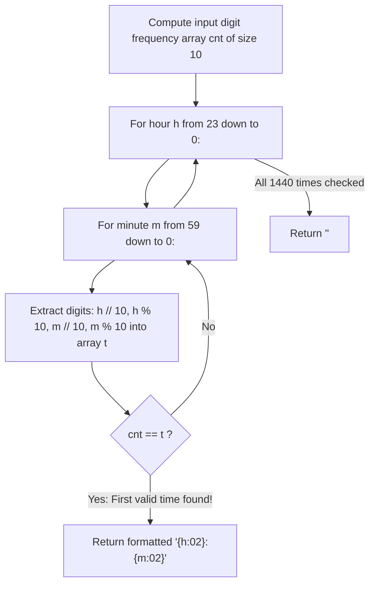

# Guided Example: Largest Time for Given Digits

We trace the step-by-step chronological reverse search across the 24-hour time domain, prove the First-Hit Optimality Theorem and Multiset Frequency Conservation Invariant, and evaluate valid time constructions on representative 4-digit arrays:

- **Representative Instance 1 (Multiple Valid Combinations):**
  $$
  arr = [1, \; 2, \; 3, \; 4]
  $$
- **Required Output:** `"23:41"`
  - Target multiset signature:
    $$
    cnt[1] = 1, \; cnt[2] = 1, \; cnt[3] = 1, \; cnt[4] = 1, \quad \text{all other } cnt[d] = 0
    $$
  - Descending chronological search from $h = 23, m = 59$ downward:
    - $23:59 \implies \text{digits } \{2, 3, 5, 9\} \ne cnt$
    - $23:58 \implies \text{digits } \{2, 3, 5, 8\} \ne cnt$
    - $\dots$
    - $23:42 \implies \text{digits } \{2, 3, 4, 2\} \ne cnt$ (needs two $2$'s)
    - $23:41 \implies \text{digits } \{2, 3, 4, 1\} == cnt$ (**Exact Match!**)
  - Because search order is strictly descending, the first match found is guaranteed to be the maximum possible time.
  - Return formatted string immediately: $\mathbf{\text{"23:41"}}$.

- **Representative Instance 2 (Impossible Valid Time):**
  $$
  arr = [5, \; 5, \; 5, \; 5]
  $$
  - Any valid hour must start with tens digit $\in \{0, 1, 2\}$.
  - But available digits contain only $5$.
  - All $1{,}440$ candidate tests fail $\implies$ returns empty string $\mathbf{\text{""}}$.

- **Representative Instance 3 (All-Zero Midnight):**
  $$
  arr = [0, \; 0, \; 0, \; 0] \implies \text{matches at } h = 0, m = 0 \implies \mathbf{\text{"00:00"}}
  $$

---

## 1. Instance & Teaching Goal

Given an array `arr` of 4 digits, find the **latest 24-hour time** that can be made using each digit exactly once.
Valid 24-hour times range from `00:00` to `23:59`. If no valid time exists, return the empty string `""`.

```text
Domain: 1,440 valid minute timestamps (23:59 down to 00:00)
Digits: [1, 2, 3, 4]

Chronological Descent:
  23:59  -> {2, 3, 5, 9}  (No)
  23:58  -> {2, 3, 5, 8}  (No)
  ...
  23:42  -> {2, 3, 4, 2}  (No)
  23:41  -> {2, 3, 4, 1}  (YES! First match is maximal -> "23:41")
```

A naive permutation approach generates all $4! = 24$ permutations, formats each as a time string, validates hours and minutes, and tracks the maximum, requiring string sorting and custom comparison helpers.

The decisive pedagogical goal is the **Descending Domain Search & Multiset Frequency Invariant**:
- The total universe of valid 24-hour times is small and fixed: exactly $24 \times 60 = 1{,}440$ possible states.
- By enumerating hours $h \in [23, \dots, 0]$ and minutes $m \in [59, \dots, 0]$ in strictly descending order, candidates are evaluated in monotonically decreasing chronological order.
- To check whether time $(h, m)$ can be formed by `arr`, we compare its digit frequency array $t$ with the frequency array $cnt$ of `arr`.
- The very first match encountered is provably the latest constructible time, running in $\mathcal{O}(1)$ time and $\mathcal{O}(1)$ space.

---

## 2. Conceptual Foundation & The First-Hit Optimality Invariant



### The First-Hit Optimality Theorem

Let $\mathcal{T} = \{(h, m) : 0 \le h \le 23, \; 0 \le m \le 59\}$ be the set of all valid 24-hour clock times.
1. **Total Strict Order:**
   A time $(h_1, m_1)$ is strictly later than $(h_2, m_2)$ if and only if $60 h_1 + m_1 > 60 h_2 + m_2$.
2. **Descending Generation:**
   The nested loops:
   $$
   h \in [23, 22, \dots, 0], \quad m \in [59, 58, \dots, 0]
   $$
   generate elements of $\mathcal{T}$ in strictly decreasing chronological order:
   $$
   (23, 59) > (23, 58) > \dots > (23, 0) > (22, 59) > \dots > (0, 0)
   $$
3. **First-Hit Lemma:**
   Let $(h^*, m^*)$ be the first element in this sequence such that its multiset of digits equals the multiset of `arr`.
   Because every preceding candidate had an incompatible multiset of digits, no time strictly greater than $(h^*, m^*)$ can be formed using the elements of `arr`.
   Therefore, $(h^*, m^*)$ is the unique maximum valid time constructible from `arr`. $\blacksquare$

---

## 3. Step-by-Step Worked Execution: $arr = [1, 2, 3, 4]$

Input: $arr = [1, 2, 3, 4]$.
Build input frequency array `cnt`:
$cnt[1] = 1, \; cnt[2] = 1, \; cnt[3] = 1, \; cnt[4] = 1$, all others $0$.

### Search Sequence
- Test $h = 23$:
  - Tens digit $2$, ones digit $3$. Digits required for hour: $\{2, 3\}$.
  - Remaining digits in $cnt$ available for minutes: $\{1, 4\}$.
  - Can minute $m \in [59 \dots 0]$ use exactly $\{1, 4\}$?
    - $m = 41$: tens digit $4$, ones digit $1$.
    - Candidate digits for $(23, 41)$: $\{2, 3, 4, 1\}$.
    - Check frequency:
      $t[1] = 1, t[2] = 1, t[3] = 1, t[4] = 1 \implies cnt == t$ is **True!**
- First hit reached at $h = 23, m = 41$.
- Format string:
  $$
  \text{f"}\{23:02\}\text{:}\{41:02\}\text{"} \implies \mathbf{\text{"23:41"}}
  $$

---

## 4. Chronological Search Trace Table

| Tested Candidate $(h, m)$ | Hour Digits $(h_1, h_2)$ | Minute Digits $(m_1, m_2)$ | Candidate Multiset $t$ | Matches $cnt$? | Action Taken |
|:---:|:---:|:---:|:---:|:---:|:---|
| `23:59` | $(2, 3)$ | $(5, 9)$ | $\{2, 3, 5, 9\}$ | No | Decrement minute |
| `23:58` | $(2, 3)$ | $(5, 8)$ | $\{2, 3, 5, 8\}$ | No | Decrement minute |
| $\dots$ | $\dots$ | $\dots$ | $\dots$ | No | Continue search |
| `23:43` | $(2, 3)$ | $(4, 3)$ | $\{2, 3, 4, 3\}$ | No | Decrement minute |
| `23:42` | $(2, 3)$ | $(4, 2)$ | $\{2, 3, 4, 2\}$ | No | Decrement minute |
| **`23:41`** | **$(2, 3)$** | **$(4, 1)$** | **$\{1, 2, 3, 4\}$** | **YES** | **Return "23:41" (Optimal!)** |

---

## 5. Algorithmic Correctness

### Soundness & Completeness
1. **Soundness:**
   Any time returned has $0 \le h \le 23$ and $0 \le m \le 59$ by loop bounds, so it is a valid 24-hour clock time. The condition $cnt == t$ guarantees that the four characters formatted into `HH:MM` are an exact multiset permutation of the 4 integers in `arr`.
2. **Completeness:**
   Every valid 24-hour time is tested. If at least one valid time can be formed from `arr`, it must belong to the $1{,}440$ candidate pool and will be matched. If no match is found, returning `""` is provably correct.

---

## 6. Boundary Cases & Traps

| Scenario | Input Pattern | Behavior | Trapped Risk |
|---|---|---|---|
| Midnight | `[0, 0, 0, 0]` | Matches at $h = 0, m = 0$; returns `"00:00"`. | Treating `"00:00"` as falsy or empty. |
| Leading Zeros | `[2, 0, 6, 6]` | Returns `"06:26"`; integer division preserves $0$ tens digit. | Dropping leading zero in single-digit hours. |
| Impossible Minutes | `[9, 9, 2, 2]` | Tens minute cannot exceed $5$; returns `""`. | Forming invalid times like `22:99`. |
| Upper Bound | `[2, 3, 5, 9]` | Hits on the very first iteration `23:59`. | Off-by-one upper bound loop limit. |

---

## 7. Complexity Derivation

- **Time Complexity:** $\mathcal{O}(1)$ strictly constant.
  - The outer loop runs at most $24$ times.
  - The inner loop runs at most $60$ times.
  - Total candidates tested: at most $24 \times 60 = 1{,}440$.
  - In each candidate test, 4 modulo/division operations and an array comparison of size $10$ are performed.
  - Total operations bounded by $\approx 1.5 \times 10^4$, executing in $< 0.001\text{ s}$.
- **Auxiliary Space Complexity:** $\mathcal{O}(1)$ strictly constant.
  - Only two fixed-size integer arrays of length 10 (`cnt` and `t`) are allocated.
