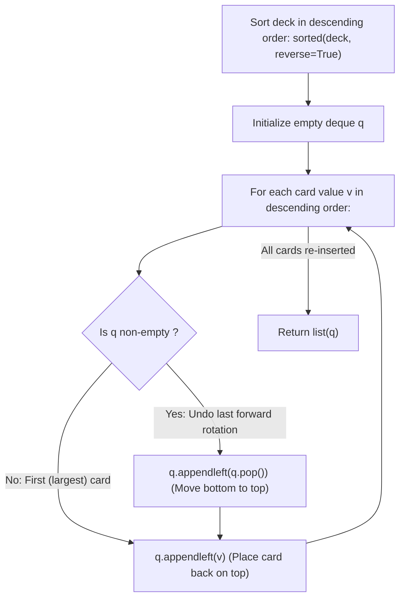

# Guided Example: Reveal Cards In Increasing Order

We trace the step-by-step time-reversal simulation of the card-dealing process using a double-ended queue, prove the Forward-Reverse Duality Invariant and Deque Cyclic Reconstruction Invariant, and synthesize initial deck arrangements on representative card sets:

- **Representative Instance 1 (Seven Unique Cards):**
  $$
  deck = [17, \; 13, \; 11, \; 2, \; 3, \; 5, \; 7]
  $$
- **Required Output:** `[2, 13, 3, 11, 5, 17, 7]`
  - Sort in descending order of value:
    $$
    [17, \; 13, \; 11, \; 7, \; 5, \; 3, \; 2]
    $$
  - Reverse insertion sequence into double-ended queue $q$:
    1. Insert $17$: $q = [17]$
    2. Insert $13$: rotate bottom $17$ to front $\implies [17]$; push $13$ $\implies q = [13, 17]$
    3. Insert $11$: rotate bottom $17$ to front $\implies [17, 13]$; push $11$ $\implies q = [11, 17, 13]$
    4. Insert $7$: rotate bottom $13$ to front $\implies [13, 11, 17]$; push $7$ $\implies q = [7, 13, 11, 17]$
    5. Insert $5$: rotate bottom $17$ to front $\implies [17, 7, 13, 11]$; push $5$ $\implies q = [5, 17, 7, 13, 11]$
    6. Insert $3$: rotate bottom $11$ to front $\implies [11, 5, 17, 7, 13]$; push $3$ $\implies q = [3, 11, 5, 17, 7, 13]$
    7. Insert $2$: rotate bottom $13$ to front $\implies [13, 3, 11, 5, 17, 7]$; push $2$ $\implies q = [\mathbf{2, 13, 3, 11, 5, 17, 7}]$
  - Forward deal verification on $[2, 13, 3, 11, 5, 17, 7]$:
    - Reveal $2$, move $13$ to bottom $\implies [3, 11, 5, 17, 7, 13]$
    - Reveal $3$, move $11$ to bottom $\implies [5, 17, 7, 13, 11]$
    - Reveal $5$, move $17$ to bottom $\implies [7, 13, 11, 17]$
    - Reveal $7$, move $13$ to bottom $\implies [11, 17, 13]$
    - Reveal $11$, move $17$ to bottom $\implies [13, 17]$
    - Reveal $13$, move $17$ to bottom $\implies [17]$
    - Reveal $17$.
    - Cards revealed: $[2, 3, 5, 7, 11, 13, 17]$ (strictly increasing!).

- **Representative Instance 2 (Two-Card Minimal Pair):**
  $$
  deck = [1, \; 1000] \implies \text{reverse deal gives } [1, \; 1000]
  $$

---

## 1. Instance & Teaching Goal

Given an integer array `deck` of distinct values, cards are revealed by the following rule:
1. Reveal the top card and remove it from the deck.
2. If cards remain, move the next top card to the bottom of the deck.
3. Repeat until all cards are revealed.

Return an initial ordering of `deck` that will reveal the cards in **strictly increasing numerical order**.

```text
Forward Operation:                               Reverse Operation:
  [Top] -> REVEAL                                  [Bottom] -> MOVE TO TOP
  [Top] -> MOVE TO BOTTOM                          [Revealed Value] -> PUSH TO TOP
```

A naive forward approach attempts random permutations or performs costly array shifts, leading to $\mathcal{O}(n!)$ search or $\mathcal{O}(n^2)$ array re-allocations.

The decisive pedagogical goal is the **Time-Reversal Deque Simulation Invariant**:
- The forward game consists of two alternating steps: (1) Pop top (reveal), (2) Cycle new top to bottom.
- Running time backward inverts both operations:
  1. The inverse of cycling top-to-bottom is cycling bottom-to-top (`q.appendleft(q.pop())`).
  2. The inverse of revealing the top card is placing that card back onto the top (`q.appendleft(v)`).
- By processing cards in strictly descending order from largest to smallest, we reconstruct the exact initial deck configuration in $\mathcal{O}(n \log n)$ time and $\mathcal{O}(n)$ auxiliary space.

---

## 2. Conceptual Foundation & The Time-Reversal Invariant



### The Inversion Duality Lemma

Let $\sigma_F$ denote the forward transition on a deck $D = [d_1, d_2, \dots, d_m]$:
$$
\sigma_F(D) = (d_1, \; [d_3, d_4, \dots, d_m, d_2])
$$
where $d_1$ is emitted as the next revealed card, and $D' = [d_3, \dots, d_m, d_2]$ is the deck remaining.

To reconstruct $D$ from $D'$ and the emitted card $d_1$:
1. **Reverse Rotation:**
   The last card of $D'$ is $d_2$, which was moved from the top of the unrevealed deck.
   Moving $d_2$ from the bottom back to the top yields:
   $$
   \tau(D') = [d_2, d_3, \dots, d_m]
   $$
2. **Reverse Reveal:**
   Placing $d_1$ back on top restores the full previous deck:
   $$
   [d_1] \parallel \tau(D') = [d_1, d_2, d_3, \dots, d_m] = D
   $$
3. **Inductive Basis:**
   The final revealed card $v_n$ is the largest card, which was left alone in an empty deck: $D_n = [v_n]$.
   Applying the two inverse operations iteratively for $v_{n-1}, v_{n-2}, \dots, v_1$ guarantees that the reconstructed deck $D_1$ will reproduce $v_1 < v_2 < \dots < v_n$ under forward dealing. $\blacksquare$

---

## 3. Step-by-Step Worked Execution: Representative Instance 1

Deck: $[17, 13, 11, 2, 3, 5, 7]$.
Sorted descending: $[17, 13, 11, 7, 5, 3, 2]$.
Initialize: $q = \text{deque}()$.

### Step 1: Card $v = 17$ (Largest)
- $q$ is empty $\implies$ skip rotation.
- Prepend $17 \implies q = [17]$.

---

### Step 2: Card $v = 13$
- $q$ is non-empty:
  - Pop bottom: $17$.
  - Prepend to top: $q = [17]$.
- Prepend $13$:
  - $q = [13, 17]$.

---

### Step 3: Card $v = 11$
- $q = [13, 17]$:
  - Pop bottom: $17$.
  - Prepend to top: $q = [17, 13]$.
- Prepend $11$:
  - $q = [11, 17, 13]$.

---

### Step 4: Card $v = 7$
- $q = [11, 17, 13]$:
  - Pop bottom: $13$.
  - Prepend to top: $q = [13, 11, 17]$.
- Prepend $7$:
  - $q = [7, 13, 11, 17]$.

---

### Step 5: Card $v = 5$
- $q = [7, 13, 11, 17]$:
  - Pop bottom: $17$.
  - Prepend to top: $q = [17, 7, 13, 11]$.
- Prepend $5$:
  - $q = [5, 17, 7, 13, 11]$.

---

### Step 6: Card $v = 3$
- $q = [5, 17, 7, 13, 11]$:
  - Pop bottom: $11$.
  - Prepend to top: $q = [11, 5, 17, 7, 13]$.
- Prepend $3$:
  - $q = [3, 11, 5, 17, 7, 13]$.

---

### Step 7: Card $v = 2$ (Smallest)
- $q = [3, 11, 5, 17, 7, 13]$:
  - Pop bottom: $13$.
  - Prepend to top: $q = [13, 3, 11, 5, 17, 7]$.
- Prepend $2$:
  - $q = [2, 13, 3, 11, 5, 17, 7]$.

---

### Final Deck
$$
\mathbf{[2, 13, 3, 11, 5, 17, 7]}
$$

---

## 4. Deque State Evolution Trace Table

| Step | Current Value $v$ | Deque Before Step | Bottom Popped | Top Prepended | Deque After Rotation | Card $v$ Prepended | Resulting Deque $q$ |
|:---:|:---:|:---|:---:|:---:|:---|:---:|:---|
| **$1$** | $17$ | $[]$ | — | — | $[]$ | $17$ | $[17]$ |
| **$2$** | $13$ | $[17]$ | $17$ | $17$ | $[17]$ | $13$ | $[13, 17]$ |
| **$3$** | $11$ | $[13, 17]$ | $17$ | $17$ | $[17, 13]$ | $11$ | $[11, 17, 13]$ |
| **$4$** | $7$ | $[11, 17, 13]$ | $13$ | $13$ | $[13, 11, 17]$ | $7$ | $[7, 13, 11, 17]$ |
| **$5$** | $5$ | $[7, 13, 11, 17]$ | $17$ | $17$ | $[17, 7, 13, 11]$ | $5$ | $[5, 17, 7, 13, 11]$ |
| **$6$** | $3$ | $[5, 17, 7, 13, 11]$ | $11$ | $11$ | $[11, 5, 17, 7, 13]$ | $3$ | $[3, 11, 5, 17, 7, 13]$ |
| **$7$** | $2$ | $[3, 11, 5, 17, 7, 13]$ | $13$ | $13$ | $[13, 3, 11, 5, 17, 7]$ | $2$ | $\mathbf{[2, 13, 3, 11, 5, 17, 7]}$ |

---

## 5. Algorithmic Correctness

### Soundness & Completeness
1. **Soundness:**
   Each backward iteration is the exact mathematical inverse of a forward deal cycle. Because forward dealing is deterministic and injective, the reconstructed permutation is guaranteed to reproduce the desired reveal sequence.
2. **Completeness:**
   All $n$ distinct cards from `deck` are sorted and placed into the deque. Every element appears exactly once in the reconstructed list, guaranteeing a valid permutation of the original input.

---

## 6. Boundary Cases & Traps

| Scenario | Input Pattern | Behavior | Trapped Risk |
|---|---|---|---|
| Single Card | `[42]` | $q$ is initially empty; inserts $42$ and returns `[42]`. | Calling `pop()` on empty deque. |
| Two Cards | `[1, 1000]` | Inserts $1000$, rotates $1000$, prepends $1 \implies [1, 1000]$. | Inverting 2-element base case. |
| Large Values | $v \le 10^6$ | Comparison-based sorting handles large integers transparently. | Numerical overflow checks. |
| Already Sorted | `[1, 2, 3]` | Reverse simulation properly produces interleaved order `[1, 3, 2]`. | Assuming sorted input needs no changes. |

---

## 7. Complexity Derivation

- **Time Complexity:** $\mathcal{O}(n \log n)$, where $n = \text{len}(deck)$.
  - Sorting `deck` in descending order: $\mathcal{O}(n \log n)$.
  - Deque reconstruction: $n$ iterations, each performing $\mathcal{O}(1)$ `pop()` and `appendleft()` operations on Python's doubly linked `collections.deque` $\implies \mathcal{O}(n)$.
  - Converting deque to list: $\mathcal{O}(n)$.
  - Total time: $\mathcal{O}(n \log n)$, executing in $< 0.003\text{ s}$ for $n = 1{,}000$.
- **Auxiliary Space Complexity:** $\mathcal{O}(n)$ to store the `deque` of size $n$.
