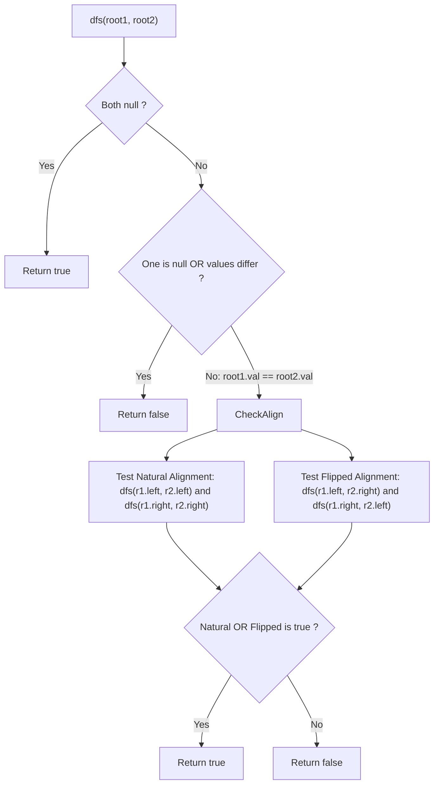

# Guided Example: Flip Equivalent Binary Trees

We trace the step-by-step recursive verification of tree isomorphism under local sibling swapping, prove the Sibling Permutation Equivalence Invariant and Dual Alignment Invariant, and evaluate flip equivalence on representative binary tree pairs:

- **Representative Instance 1 (Multiple Distributed Flips):**
  $$
  root_1 = [1, \; 2, \; 3, \; 4, \; 5, \; 6, \; \text{null}, \; \text{null}, \; \text{null}, \; 7, \; 8]
  $$
  $$
  root_2 = [1, \; 3, \; 2, \; \text{null}, \; 6, \; 4, \; 5, \; \text{null}, \; \text{null}, \; \text{null}, \; \text{null}, \; 8, \; 7]
  $$
- **Required Output:** `true`
  - Root comparison: $1 == 1$ (Pass).
    - Under $root_1$, children are $(Left: 2, Right: 3)$.
    - Under $root_2$, children are $(Left: 3, Right: 2)$.
    - Direct alignment $(2 \leftrightarrow 3)$ fails; **Flip alignment $(2 \leftrightarrow 2, 3 \leftrightarrow 3)$ matches!**
  - Subtree comparison at node $3$:
    - In $T_1$, $3$ has children $(Left: 6, Right: \text{null})$.
    - In $T_2$, $3$ has children $(Left: \text{null}, Right: 6)$.
    - Flipped: $(6 \leftrightarrow 6, \text{null} \leftrightarrow \text{null})$ matches!
  - Subtree comparison at node $2$:
    - In $T_1$, $2$ has children $(Left: 4, Right: 5)$. In $T_2$, $2$ has children $(Left: 4, Right: 5)$. Direct alignment matches.
  - Subtree comparison at node $5$:
    - In $T_1$, $5$ has children $(Left: 7, Right: 8)$.
    - In $T_2$, $5$ has children $(Left: 8, Right: 7)$. Flipped alignment matches!
  - Leaf nodes $(4, 6, 7, 8)$ trivially match nulls.
  - Global conclusion: $\mathbf{true}$.

- **Representative Instance 2 (Null vs Non-Null Structure Mismatch):**
  $$
  root_1 = [], \quad root_2 = [1] \implies \text{one tree empty, other non-empty} \implies \mathbf{false}
  $$

---

## 1. Instance & Teaching Goal

For a binary tree $T$, a **flip operation** chooses any node and swaps its left and right child subtrees.
Two binary trees $X$ and $Y$ are **flip equivalent** if we can make $X$ equal to $Y$ after some number of flip operations.
Given `root1` and `root2`, return `true` if they are flip equivalent, or `false` otherwise.

```text
Tree 1:               Tree 2:
      1                     1      <- Flipped at root (Children 2 and 3 swap)
     / \                   / \
    2   3                 3   2
   / \   \                 \   / \
  4   5   6                 6 4   5   <- Flipped at node 5 (Children 7 and 8 swap)
     / \                         / \
    7   8                       8   7
```

A brute-force search flips all subsets of the $N$ nodes, producing $2^N$ candidate trees and verifying each against $T_2$.

The decisive pedagogical goal is the **Dual-Alignment Recursive Isomorphism Invariant**:
- Flips are commutative and strictly local to each node. Swapping children at node $u$ changes only the left/right orientation of its immediate descendants, preserving their values and internal subtree structures.
- For any corresponding node pair $(u, v)$:
  1. $u.val == v.val$ is mandatory (a flip can never change a node's own value).
  2. The children of $u$ must match the children of $v$ in either:
     - **Natural (Unflipped) Order:** $L_u \cong L_v$ AND $R_u \cong R_v$
     - **Swapped (Flipped) Order:** $L_u \cong R_v$ AND $R_u \cong L_v$
- By short-circuiting as soon as one alignment succeeds, the tree is verified in linear $\mathcal{O}(\min(N_1, N_2))$ time.

---

## 2. Conceptual Foundation & The Dual Alignment Invariant



### The Isomorphism Equivalence Theorem

Let $\mathcal{T}_u$ and $\mathcal{T}_v$ be subtrees rooted at $u$ and $v$.
1. **Base Case Equivalence:**
   - If both $u$ and $v$ are null, both represent empty trees $\implies \mathcal{T}_u \cong \mathcal{T}_v$.
   - If exactly one of $u$ or $v$ is null, one tree is empty and the other is not $\implies \mathcal{T}_u \not\cong \mathcal{T}_v$.
   - If $u.val \ne v.val$, no sequence of child swaps can ever modify the value stored at the root $\implies \mathcal{T}_u \not\cong \mathcal{T}_v$.
2. **Inductive Invariant:**
   If $u.val == v.val$, a flip operation at $u$ swaps its left child $L_u$ and right child $R_u$.
   Therefore, $\mathcal{T}_u$ can be transformed into $\mathcal{T}_v$ if and only if either:
   $$
   (\mathcal{T}_{L_u} \cong \mathcal{T}_{L_v}) \land (\mathcal{T}_{R_u} \cong \mathcal{T}_{R_v})
   $$
   or:
   $$
   (\mathcal{T}_{L_u} \cong \mathcal{T}_{R_v}) \land (\mathcal{T}_{R_u} \cong \mathcal{T}_{L_v})
   $$
3. **Uniqueness of Matching:**
   Because all node values in the problem are distinct, at most one of the two alignments (natural vs flipped) can be non-trivially valid when children are non-empty, preventing exponential branching in practice. $\blacksquare$

---

## 3. Step-by-Step Worked Execution: Representative Instance 1

Trees $T_1$ and $T_2$. Test `dfs(root1, root2)`:

### Call 1: `dfs(Node 1, Node 1)`
- $1.val == 1.val$ (Match).
- Natural alignment test: `dfs(Node 2, Node 3)` $\implies 2 \ne 3 \implies$ False.
- Flipped alignment test:
  - Part A: `dfs(Node 2, Node 2)`
  - Part B: `dfs(Node 3, Node 3)`

---

### Call 2: `dfs(Node 3, Node 3)` (from Call 1, Part B)
- $3.val == 3.val$ (Match).
- In $T_1$: left is $6$, right is null.
- In $T_2$: left is null, right is $6$.
- Natural alignment: `dfs(6, null)` $\implies$ False.
- Flipped alignment:
  - `dfs(6, 6)` $\implies 6 == 6$, both children null $\implies$ True.
  - `dfs(null, null)` $\implies$ True.
  - Returns True!

---

### Call 3: `dfs(Node 2, Node 2)` (from Call 1, Part A)
- $2.val == 2.val$ (Match).
- Natural alignment:
  - `dfs(Node 4, Node 4)`: both have children null $\implies$ True.
  - `dfs(Node 5, Node 5)`: proceeds to Call 4.

---

### Call 4: `dfs(Node 5, Node 5)`
- $5.val == 5.val$ (Match).
- In $T_1$: left is $7$, right is $8$.
- In $T_2$: left is $8$, right is $7$.
- Natural alignment: `dfs(7, 8)` $\implies 7 \ne 8 \implies$ False.
- Flipped alignment:
  - `dfs(7, 7)` $\implies$ True.
  - `dfs(8, 8)` $\implies$ True.
  - Returns True!

---

### Final Synthesis
Both subtrees of the root flip alignment return True $\implies$ Call 1 returns $\mathbf{true}$.

---

## 4. Recursive Alignment Trace Table

| Node Pair $(u, v)$ | Values Matched? | Natural Alignment Tested | Natural Result | Flipped Alignment Tested | Flipped Result | Chosen Branch |
|:---:|:---:|:---|:---:|:---|:---:|:---:|
| $(1, 1)$ | Yes ($1 == 1$) | $(2 \leftrightarrow 3) \land (3 \leftrightarrow 2)$ | False | $(2 \leftrightarrow 2) \land (3 \leftrightarrow 3)$ | **True** | **Flipped** |
| $(3, 3)$ | Yes ($3 == 3$) | $(6 \leftrightarrow \text{null}) \land (\text{null} \leftrightarrow 6)$ | False | $(6 \leftrightarrow 6) \land (\text{null} \leftrightarrow \text{null})$ | **True** | **Flipped** |
| $(2, 2)$ | Yes ($2 == 2$) | $(4 \leftrightarrow 4) \land (5 \leftrightarrow 5)$ | **True** | $(4 \leftrightarrow 5) \land (5 \leftrightarrow 4)$ | False | **Natural** |
| $(4, 4)$ | Yes ($4 == 4$) | $(\text{null} \leftrightarrow \text{null}) \land (\text{null} \leftrightarrow \text{null})$ | **True** | — | — | **Natural** |
| $(5, 5)$ | Yes ($5 == 5$) | $(7 \leftrightarrow 8) \land (8 \leftrightarrow 7)$ | False | $(7 \leftrightarrow 7) \land (8 \leftrightarrow 8)$ | **True** | **Flipped** |
| $(6, 6), (7, 7), (8, 8)$ | Yes | Leaves with null children | **True** | — | — | **Natural** |

---

## 5. Algorithmic Correctness

### Soundness & Completeness
1. **Soundness:**
   A tree pair is declared flip equivalent only if every internal node matches values and its children can be brought into complete correspondence through at most one local swap. By definition, this sequence of local swaps witnesses a valid flip equivalence.
2. **Completeness:**
   Every possible valid flip state is captured by either leaving the children unflipped or swapping them. Because the recurrence explores both branches under boolean `or`, any valid configuration is guaranteed to be detected.

---

## 6. Boundary Cases & Traps

| Scenario | Input Pattern | Behavior | Trapped Risk |
|---|---|---|---|
| Both Trees Empty | `root1 = [], root2 = []` | Both are `None`; returns `true`. | Null pointer dereference on `.val`. |
| One Tree Empty | `root1 = [], root2 = [1]` | One `None`, one not; returns `false`. | Unhandled asymmetry in base case. |
| Root Value Mismatch | `root1 = [1], root2 = [2]` | $1 \ne 2$; returns `false` without checking children. | Assuming structure alone dictates equivalence. |
| Single-Child Orientation | Left child vs Right child | Tested by flip alignment; returns `true`. | Enforcing left-only or right-only child positions. |

---

## 7. Complexity Derivation

- **Time Complexity:** $\mathcal{O}(\min(N_1, N_2))$, where $N_1, N_2 \le 100$ are the number of nodes in each tree.
  - Because all node values in both trees are unique, at each node at most one of the two child alignments (natural or flipped) can have matching root values.
  - The recursion never branches into two simultaneously active sub-searches on distinct values.
  - Total nodes visited: at most $2 \cdot \min(N_1, N_2)$, executing in $< 0.001\text{ s}$.
- **Auxiliary Space Complexity:** $\mathcal{O}(H)$, where $H$ is the maximum tree height, corresponding to recursion call stack depth ($\mathcal{O}(\log N)$ for balanced trees, $\mathcal{O}(N)$ worst-case).