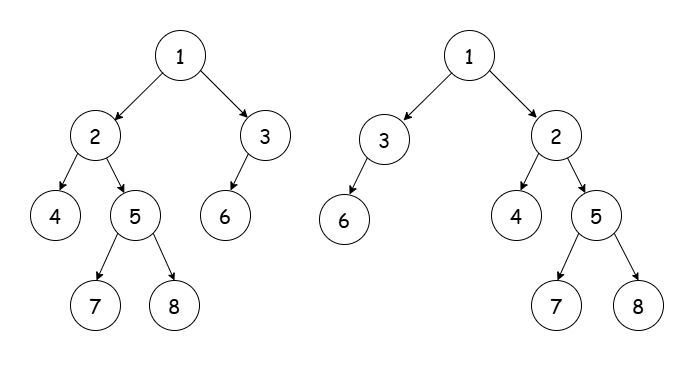

[TOC]

## Solution

---

### Overview

We are given the roots of two [binary trees](https://leetcode.com/explore/learn/card/data-structure-tree/) and we are asked to determine whether they are flip equivalent. To clarify, let’s break down the two key terms involved:

1. Flip Operation:

A flip operation involves selecting any node in the tree and swapping its left and right subtrees. The node's value and the internal structure of its subtrees remain unchanged. The only modification is that the positions of the node's direct children are swapped.

For example, consider the tree below. The tree on the left shows the initial structure, and the tree on the right shows the result after performing a flip on node 1.



2. Equivalent Trees:

Two binary trees are considered equivalent if they satisfy the following conditions:

-   Same structure: The arrangement of nodes and their subtrees (left and right) are identical.
-   Same node values: Every corresponding node in both trees has the same value.

In this context, we want to determine whether two given binary trees can become equivalent by applying flip operations as needed.

---

### Approach 1: Recursion (Top-down Traversal)

#### Intuition

Since binary trees are inherently recursive structures, a recursive approach is intuitive.

For each node, we have two possible options: either we swap its left and right subtrees, or we leave them as they are. We explore both possibilities for every node, starting from the root. If any sequence of flips results in the two trees becoming equivalent, our function will return `true`, indicating that the trees are flip equivalent. If no valid sequence leads to equivalence, the function returns `false`.

#### Algorithm

-   If both `root1` and `root2` are empty trees, they are considered flip equivalent according to the definition provided; return true.
-   If only one of `root1` or `root2` is empty, they are **not** flip equivalent, as they do not satisfy the structural property of equivalence; return false.
-   If `root1` and `root2` have different node values, the trees are **not** flip equivalent, since this means their corresponding nodes differ; return false.

-   Recursively check two scenarios for flip equivalence:

-   No Swap: Check if the left subtree of `root1` is flip equivalent to the left subtree of `root2` and the right subtree of `root1` is flip equivalent to the right subtree of `root2`.
-   Swap: Check if the left subtree of `root1` is flip equivalent to the right subtree of `root2` and the right subtree of `root1` is flip equivalent to the left subtree of `root2`.

-   Return `true` if either the `noSwap` or `swap` conditions are satisfied, as this confirms flip equivalence for the current nodes and their subtrees.

#### Implementation

```python
class Solution:
    def flipEquiv(
        self, root1: Optional[TreeNode], root2: Optional[TreeNode]
    ) -> bool:
        # Both trees are empty
        if not root1 and not root2:
            return True
        # Just one of the trees is empty
        if not root1 or not root2:
            return False
        # Corresponding values differ
        if root1.val != root2.val:
            return False

        # Check if corresponding subtrees are flip equivalent
        no_swap = self.flipEquiv(root1.left, root2.left) and self.flipEquiv(
            root1.right, root2.right
        )

        # Check if opposite subtrees are flip equivalent
        swap = self.flipEquiv(root1.left, root2.right) and self.flipEquiv(
            root1.right, root2.left
        )

        return no_swap or swap
```

#### Complexity Analysis

Let $N$ be the number of nodes in the smaller tree.

-   Time Complexity: $O(N)$.

    This is because the recursion stops at the leaf nodes or when a mismatch occurs. In the worst case, every node in the smaller tree will be visited.

-   Space Complexity: $O(N)$.

    This is due to the recursion stack. In the worst case, the recursion goes as deep as the tree's height, which can be $O(N)$ in the case of a skewed tree (a tree in which every internal node has only one child). For a balanced tree, the space complexity will be $O(\log N)$ because the tree's height would be logarithmic relative to the number of nodes.

---

### Approach 2: Iterative DFS (using a Stack)

#### Intuition

While a recursive method is intuitive, it can lead to issues such as stack overflow for very deep trees.

By using an iterative DFS approach with a stack, we can simulate the recursive process while maintaining control over the stack size. The idea is to push pairs of nodes onto the stack and evaluate their equivalence in a structured manner, ultimately determining if the trees can be made equivalent through flips.

#### Algorithm

-   Define a helper function `checkNodeValues` to verify if two nodes should be considered equivalent:
-   If both `node1` and `node2` are `nullptr`, return `true`.
-   If both nodes are not `nullptr` and their values match, return `true`.
-   Otherwise, return `false`.
-   In the `flipEquiv` main function:
-   Initialize a stack `s` to store pairs of nodes (`node1`, `node2`) from `root1` and `root2`.
-   Push the root nodes of both trees onto the stack.
-   While the stack is not empty:
-   Pop the top pair of nodes from the stack.
-   If both `node1` and `node2` are `nullptr`, continue to the next iteration.
-   If only one of the nodes is `nullptr`, return `false` (trees are not equivalent).
-   If the values of `node1` and `node2` do not match, return `false`.
-   Check both configurations for equivalence:
-   If the left child of `node1` matches the left child of `node2` and the right child of `node1` matches the right child of `node2`, push these pairs onto the stack for further examination.
-   If the left child of `node1` matches the right child of `node2` and the right child of `node1` matches the left child of `node2`, push these pairs onto the stack.
-   If neither configuration is satisfied, return `false`.
-   If the stack is emptied without returning `false`, return `true`, indicating that the two trees are flip equivalent.

#### Implementation

```python
class Solution:

    # Checks whether the given pair of nodes should be examined -
    # be pushed into the stack
    def check_node_values(self, node_1: TreeNode, node_2: TreeNode) -> bool:
        if not node_1 and not node_2:
            return True
        if node_1 and node_2 and node_1.val == node_2.val:
            return True
        return False

    def flipEquiv(self, root1: TreeNode, root2: TreeNode) -> bool:
        # Initialize stack to store pairs of nodes
        node_pair_stack = []
        node_pair_stack.append((root1, root2))

        # While the stack is not empty:
        while node_pair_stack:
            node_1, node_2 = node_pair_stack.pop()

            if not node_1 and not node_2:
                continue
            if not node_1 or not node_2:
                return False
            if node_1.val != node_2.val:
                return False

            # Check both configurations: no swap and swap
            if self.check_node_values(
                node_1.left, node_2.left
            ) and self.check_node_values(node_1.right, node_2.right):
                node_pair_stack.append((node_1.left, node_2.left))
                node_pair_stack.append((node_1.right, node_2.right))
            elif self.check_node_values(
                node_1.left, node_2.right
            ) and self.check_node_values(node_1.right, node_2.left):
                node_pair_stack.append((node_1.left, node_2.right))
                node_pair_stack.append((node_1.right, node_2.left))
            else:
                return False
        return True
```

#### Complexity Analysis

Let $N$ be the number of nodes in the smaller tree.

-   Time Complexity: $O(N)$.

    Each node in the smaller tree will enter the stack at most twice (one with swap and one without). Therefore, the loop will run $O(N)$ times. Since the operations within the loop have a constant time complexity of $O(1)$, the overall time complexity is $O(N)$.

-   Space Complexity: $O(N)$.

    The size of the stack can reach at most twice the number of nodes in the smaller tree, as each node can be pushed onto the stack in up to two configurations.

---

### Approach 3: Canonical Forms

#### Intuition

We observe that the choice of tree for the flip operation does not affect the outcome. In fact, we can simultaneously perform flips on both trees to check for flip equivalence, and the result will remain unchanged.

This raises the question: what if we could apply flip operations to transform each tree into a standardized format that makes it easier to determine whether they are equivalent? This idea underpins the solution for determining flip equivalent binary trees using their canonical forms.

##### Canonical Form of a Binary Tree

A binary tree is in its canonical form if, for each node, one of the following conditions holds:

-   The node has no children.
-   The node has only a left child.
-   The left child's value is greater than the right child's value.

Interestingly, it turns out that two binary trees are flip-equivalent if and only if they have the same canonical form.

#### Algorithm

-   `findCanonicalForm(TreeNode* root)` function:
-   If `root` is null, return immediately (base case).
-   Perform a post-order traversal:
-   Recursively call `findCanonicalForm` on `root->left`.
-   Recursively call `findCanonicalForm` on `root->right`.
-   If `root->right` is null, return as no further action is required.
-   If `root->left` is null, swap `root->left` and `root->right`, then set `root->right` to null to ensure `root->left` is non-empty. No further action is required; return.
-   If both `left` and `right` are non-null, swap them if `left->val` is greater than `right->val` to place them in a canonical order.
-   `areEquivalent(TreeNode* root1, TreeNode* root2)` function:

-   If both `root1` and `root2` are null, return `true` (both trees are equivalent).
-   If one is null and the other is not, return `false` (they are not equivalent).
-   If the values of `root1` and `root2` are different, return `false` (they are not equivalent).
-   Recursively call `areEquivalent` for `root1->left` and `root2->left`, and for `root1->right` and `root2->right`, returning `true` only if both subtrees are equivalent.

-   `flipEquiv(TreeNode* root1, TreeNode* root2)` function:
-   Call `findCanonicalForm` on `root1` to convert it to its canonical form.
-   Call `findCanonicalForm` on `root2` to convert it to its canonical form.
-   Return the result of `areEquivalent(root1, root2)` to determine if the two trees are equivalent.

#### Implementation

```python
class Solution:
    def find_canonical_form(self, root: TreeNode) -> None:
        if not root:
            return

        # Post-order traversal: first bring subtrees into their canonical form
        self.find_canonical_form(root.left)
        self.find_canonical_form(root.right)

        if not root.right:
            return

        # Swap subtrees, so that left is non-empty
        if not root.left:
            root.left = root.right
            root.right = None
            return
        left = root.left
        right = root.right

        # Swap subtrees
        if left.val > right.val:
            root.left, root.right = root.right, root.left

    def are_equivalent(self, root1: TreeNode, root2: TreeNode) -> bool:
        if not root1 and not root2:
            return True
        if not root1 or not root2:
            return False
        if root1.val != root2.val:
            return False
        return self.are_equivalent(
            root1.left, root2.left
        ) and self.are_equivalent(root1.right, root2.right)

    def flipEquiv(self, root1: TreeNode, root2: TreeNode) -> bool:
        self.find_canonical_form(root1)
        self.find_canonical_form(root2)
        return self.are_equivalent(root1, root2)
```

#### Complexity Analysis

Let $N$ be the number of nodes in the bigger tree.

-   Time Complexity: $O(N)$.

    The `findCanonicalForm` function processes each node in the tree exactly once, and since its inner operations, such as comparisons and swaps, have constant time complexity, the overall time complexity of this function is $O(N)$.

    Similarly, the `areEquivalent` function performs a depth-first search (DFS) on both trees, also visiting each node once. Therefore, its time complexity is $O(N)$.

    As both functions run independently and sequentially, the overall time complexity of the algorithm remains $O(N)$.

-   Space Complexity: $O(N)$.

    This is due to the recursion stack. In the worst case, the recursion goes as deep as the height of the tree, which can be $O(N)$ in the case of a skewed tree (a tree in which every internal node has only one child). For a balanced tree, the space complexity will be $O(\log N)$ because the height of the tree would be logarithmic relative to the number of nodes.

---