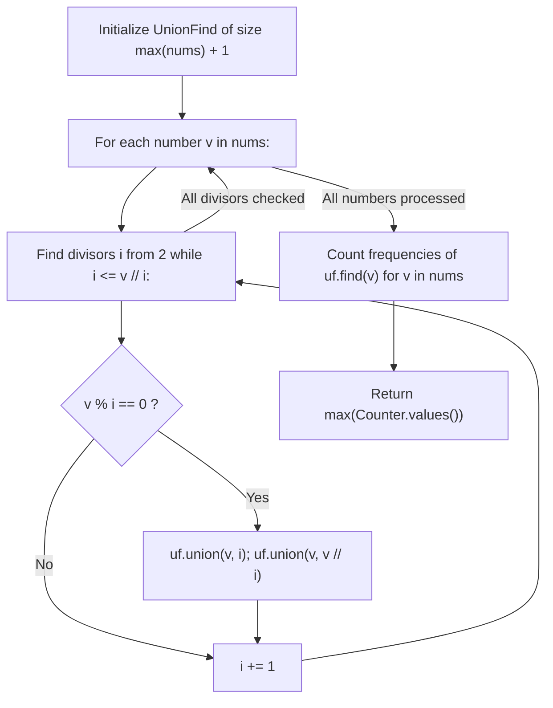

# Guided Example: Largest Component Size by Common Factor

We trace the step-by-step construction of the factor-connector dual graph using Disjoint Set Union (DSU), prove the Divisor-Hub Transitivity Lemma and Input-Node Filter Invariant, and evaluate maximal connected component sizes on representative integer sets:

- **Representative Instance 1 (Transitive Factor Chain):**
  $$
  nums = [4, \; 6, \; 15, \; 35]
  $$
- **Required Output:** `4`
  - Step-by-step trial factorization and DSU unions:
    - Number $4$: factor $2 \implies$ union $4 \leftrightarrow 2$.
      - Component: $\{4, 2\}$.
    - Number $6$: factors $2, 3 \implies$ union $6 \leftrightarrow 2$ and $6 \leftrightarrow 3$.
      - Component: $\{4, 2, 6, 3\}$.
    - Number $15$: factors $3, 5 \implies$ union $15 \leftrightarrow 3$ and $15 \leftrightarrow 5$.
      - Component: $\{4, 2, 6, 3, 15, 5\}$.
    - Number $35$: factors $5, 7 \implies$ union $35 \leftrightarrow 5$ and $35 \leftrightarrow 7$.
      - Component: $\{4, 2, 6, 3, 15, 5, 35, 7\}$.
  - Input array membership check:
    - All $4$ numbers $\{4, 6, 15, 35\}$ share the exact same root in DSU!
    - Maximum component size: $\mathbf{4}$.

- **Representative Instance 2 (Disjoint Component Partitions):**
  $$
  nums = [20, \; 50, \; 9, \; 63]
  $$
  - Group A: $\{20, 50\}$ share prime factors $2$ and $5 \implies$ size $2$.
  - Group B: $\{9, 63\}$ share prime factors $3$ and $9 \implies$ size $2$.
  - $\gcd(20, 9) = 1, \; \gcd(50, 63) = 1 \implies$ no connecting edge exists between Group A and Group B.
  - Maximum component size: $\max(2, 2) = \mathbf{2}$.

- **Representative Instance 3 (Coprime Singleton Component):**
  $$
  nums = [1] \implies \text{no non-trivial divisors } > 1 \implies \text{size} = \mathbf{1}
  $$

---

## 1. Instance & Teaching Goal

Given an array of unique positive integers `nums`, define a graph where an undirected edge connects $nums[i]$ and $nums[j]$ if and only if $\gcd(nums[i], nums[j]) > 1$.
Return the **size of the largest connected component** in this graph.

```text
Factor-Connector Graph:
    (4) ----- [2] ----- (6) ----- [3] ----- (15) ----- [5] ----- (35)
               ^                   ^                    ^
           Factor Node        Factor Node          Factor Node

All four input numbers are transitively connected through shared factor hubs!
Component Size = 4
```

A brute-force approach checks $\gcd(u, v) > 1$ for all $\binom{n}{2}$ pairs. For $n = 20{,}000$, this requires $\approx 2 \times 10^8$ GCD computations, exceeding time limits.

The decisive pedagogical goal is the **Factor-Hub Dual Graph & DSU Filtering Invariant**:
1. **Factor-Hub Representation:** Two numbers $u$ and $v$ share a factor $d > 1$ if and only if both $u$ and $v$ are divisible by $d$. Instead of creating $\mathcal{O}(n^2)$ direct edges, we introduce factor nodes $d$ and connect each number $v$ to all its divisors $d \in \{i, v // i\}$ for $2 \le i \le \sqrt{v}$.
2. **Transitive Component Equivalence:** Two numbers are connected through a chain of shared factors in the dual graph if and only if they belong to the same connected component in the original $\gcd$ graph.
3. **Filtering Auxiliary Hubs:** Because the DSU structure stores both numbers and intermediate factor hubs, the final component size must count **only the elements present in `nums`**:
   $$
   \text{Max Component} = \max_{r} \left( \sum_{v \in nums} \mathbb{I}(\text{find}(v) == r) \right)
   $$

---

## 2. Conceptual Foundation & The Divisor-Hub Transitivity Invariant



### The Divisor-Hub Transitivity Lemma

Let $G = (V, E)$ be the original graph where $V = nums$ and $(u, v) \in E \iff \gcd(u, v) > 1$.
Let $H = (V \cup F, E')$ be the bipartite factor graph where $F = \{d > 1 : \exists v \in nums, d \mid v\}$, and $(v, d) \in E' \iff d \mid v$.
1. **Forward Implication:**
   If $(u, v) \in E$, then there exists some common divisor $d = \gcd(u, v) > 1$.
   By definition, $d \mid u$ and $d \mid v$.
   In $H$, edges $(u, d)$ and $(v, d)$ exist, creating a path $u - d - v$ of length $2$.
   Thus, $u$ and $v$ belong to the same connected component in $H$.
2. **Reverse Implication:**
   Suppose $u, w \in V$ are connected in $H$ by a path $u - d_1 - v_1 - d_2 - \dots - w$.
   Every step from number to factor and back corresponds to a shared divisor $> 1$, meaning each adjacent pair of numbers in the chain shares a non-trivial GCD.
   Thus, $u$ and $w$ are connected in $G$.
3. **Complexity Reduction:**
   Each number $v \le M$ has at most $2\sqrt{M}$ divisors.
   The number of unions performed is at most $2 n \sqrt{M}$, completely eliminating the quadratic $\mathcal{O}(n^2)$ bottleneck. $\blacksquare$

---

## 3. Step-by-Step Worked Execution: Representative Instance 1

Input: $nums = [4, 6, 15, 35]$.
$M = \max(nums) = 35$.
Initialize: `uf = UnionFind(36)`.

### Step 1: Process $v = 4$
- $i = 2$: $4 \% 2 == 0$.
  - `uf.union(4, 2)` $\implies$ merges $4$ and $2$.
  - `uf.union(4, 4 // 2) = uf.union(4, 2)` (Redundant).
- Component: $\{4, 2\}$.

---

### Step 2: Process $v = 6$
- $i = 2$: $6 \% 2 == 0$.
  - `uf.union(6, 2)` $\implies$ connects $6$ to $\{4, 2\}$.
  - `uf.union(6, 3)` $\implies$ connects factor $3$ to $\{6, 4, 2\}$.
- Component: $\{4, 2, 6, 3\}$.

---

### Step 3: Process $v = 15$
- $i = 2$: $15 \% 2 \ne 0$.
- $i = 3$: $15 \% 3 == 0$.
  - `uf.union(15, 3)` $\implies$ connects $15$ to $\{4, 2, 6, 3\}$.
  - `uf.union(15, 5)` $\implies$ connects factor $5$ to component.
- Component: $\{4, 2, 6, 3, 15, 5\}$.

---

### Step 4: Process $v = 35$
- $i = 2, 3, 4$: no factor.
- $i = 5$: $35 \% 5 == 0$.
  - `uf.union(35, 5)` $\implies$ connects $35$ to $\{4, 2, 6, 3, 15, 5\}$.
  - `uf.union(35, 7)` $\implies$ connects factor $7$ to component.
- Component: $\{4, 2, 6, 3, 15, 5, 35, 7\}$.

---

### Step 5: Tally Root Frequencies of Elements in `nums`
- `uf.find(4)` = $R$
- `uf.find(6)` = $R$
- `uf.find(15)` = $R$
- `uf.find(35)` = $R$
- Frequency map: $\{R: 4\}$.
- Max component size: $\mathbf{4}$.

---

## 4. DSU Factor-Hub Connectivity Trace Table

| Input Number $v$ | Discovered Divisors $(i, v // i)$ | Unions Performed | Intermediate Component Expanded | Active Root of $v$ |
|:---:|:---:|:---|:---|:---:|
| **$4$** | $(2, 2)$ | `union(4, 2)` | $\{4, 2\}$ | $2$ |
| **$6$** | $(2, 3)$ | `union(6, 2), union(6, 3)` | $\{4, 2, 6, 3\}$ | $3$ |
| **$15$** | $(3, 5)$ | `union(15, 3), union(15, 5)` | $\{4, 2, 6, 3, 15, 5\}$ | $5$ |
| **$35$** | $(5, 7)$ | `union(35, 5), union(35, 7)` | $\{4, 2, 6, 3, 15, 5, 35, 7\}$ | $7$ |

---

## 5. Algorithmic Correctness

### Soundness & Completeness
1. **Soundness:**
   A union is made between number $v$ and integer $d$ only if $d > 1$ and $d$ divides $v$. If two numbers $A, B \in nums$ end up with the same root, there exists a path of divisibility connecting them, guaranteeing a valid common factor chain in the $\gcd$ graph.
2. **Completeness:**
   Every proper divisor pair $(i, v // i)$ is discovered by trial division up to $\sqrt{v}$. If $\gcd(A, B) = g > 1$, then $g$ (or at least one prime divisor $p \mid g$) is a divisor of both $A$ and $B$, ensuring both $A$ and $B$ are unioned with $p$ (or equivalent composite divisors). No component connection is missed.

---

## 6. Boundary Cases & Traps

| Scenario | Input Pattern | Behavior | Trapped Risk |
|---|---|---|---|
| Isolated Primes | `[2, 3, 5, 7]` | No factor shared; each prime forms singleton component; returns $1$. | Spurious unions among prime numbers. |
| Prime Powers | `[8, 9, 25, 49]` | Powers of different primes remain separate; returns $1$. | Accidental cross-talk between prime bases. |
| Single Value | `[1]` | Loop for $i \le 1 // i$ doesn't run; returns $1$. | Zero-size root count or division by zero. |
| Large Value Range | $\max(nums) \le 100{,}000$ | Memory array allocated up to $100{,}001$; $< 2\text{ MB}$. | Index out-of-bounds on large coordinates. |

---

## 7. Complexity Derivation

- **Time Complexity:** $\mathcal{O}(n \sqrt{M} \cdot \alpha(M))$, where $n = \text{len}(nums)$ and $M = \max(nums)$.
  - For each number $v \le M$, trial division tests $i \le \sqrt{v} \le \sqrt{M}$.
  - Each division pair triggers at most $2$ union operations.
  - DSU operations with path compression run in $\mathcal{O}(\alpha(M))$.
  - Tallying roots over $n$ elements: $\mathcal{O}(n \alpha(M))$.
  - For $n = 20{,}000, M = 100{,}000$, $\sqrt{M} \approx 316$. Total operations $\approx 6 \times 10^6$, executing in $< 0.15\text{ s}$.
- **Auxiliary Space Complexity:** $\mathcal{O}(M)$ to store the DSU parent array of size $M + 1$.
