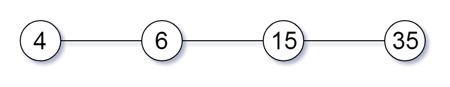
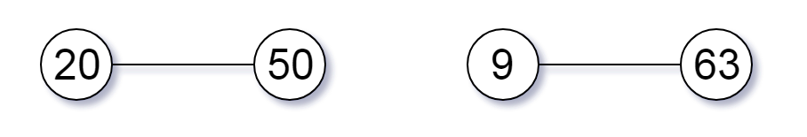
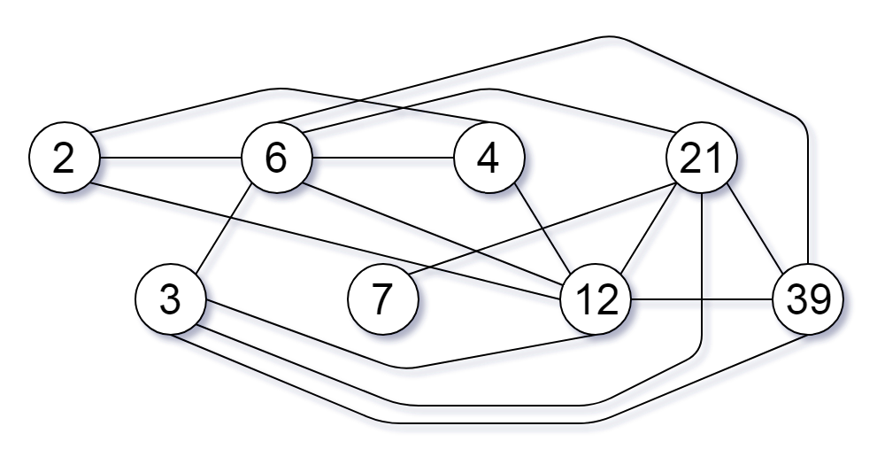

## Description

You are given an integer array of unique positive integers `nums`. Consider the following graph:

- There are `nums.length` nodes, labeled $\text{nums}[0]$ to $nums[\text{nums.length} - 1]$,

- There is an undirected edge between $\text{nums}[i]$ and $\text{nums}[j]$ if $\text{nums}[i]$ and $\text{nums}[j]$ share a common factor greater than `1`.

Return *the size of the largest connected component in the graph*.
### Function Contract

- `n`: Input parameter.
- Returns expected result.

### Examples
#### Example 1

- **Input:** `nums = [4,6,15,35]`
- **Output:** `4`
#### Example 2

- **Input:** `nums = [20,50,9,63]`
- **Output:** `2`
#### Example 3

- **Input:** `nums = [2,3,6,7,4,12,21,39]`
- **Output:** `8`
### Constraints

- $1 \le \text{nums.length} \le 2 * 10^{4}$

- $1 \le \text{nums}[i] \le 10^{5}$

- All the values of `nums` are **unique**.