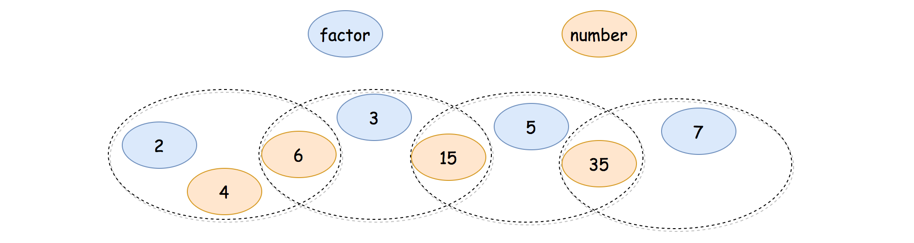
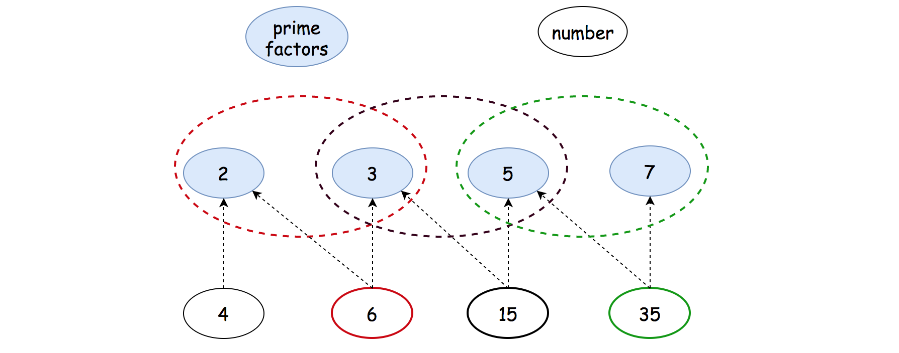

## Solution

---
### Overview

We could consider this problem as a graph partition problem.

>Each number represents a node in a graph.
We are asked to partition the nodes into several groups and find the largest one.

Suppose that we have a means to determine and assign each node to a proper group, then we could easily solve the problem with a single iteration.

We could summarize the algorithm with the following Python pseudo code, where literally we count the appearance of each group.

```python
    group_count = {}
    for num in number_list:
        group_id = group(num)
        group_count[group_id] += 1
    return max(group_count.values())
```

>The key to the above algorithm lies in the questions on how we define a group and how we assign an element to a group.

Given the above intuition, it might remind you one of the most well-known data structures in computer science called [Disjoint Set](https://en.wikipedia.org/wiki/Disjoint-set_data_structure), which tracks a set of elements partitioned into a number of *disjoint* (non-overlapping) subsets.

**Union-Find Algorithm**

Indeed, the Disjoint-Set data structure would be the essential building block to solve this problem.

The Disjoint-Set data structure is also known as the Union-Find data structure. Because it mainly consists of two operations: `Union()` and `Find()` defined as follows:

- `Find(x)`: get the identity of the group that the element `x` belongs to.

- `Union(x, y)`: merge the two groups that the two elements belong to respectively.

Here are the sample implementation of the Union-Find data structure, following the [pseudo-code](https://en.wikipedia.org/wiki/Disjoint-set_data_structure) presented on the wiki page.

```python
class DisjointSetUnion(object):

    def __init__(self, size):
        # initially, each node is an independent component
        self.parent = [i for i in range(size+1)]
        # keep the size of each component
        self.size = [1] * (size+1)

    def find(self, x):
        """ return the component id that the element x belongs to. """
        if self.parent[x] != x:
            self.parent[x] = self.find(self.parent[x])
        return self.parent[x]

    def union(self, x, y):
        """ merge the two components that x, y belongs to respectively,
              and return the merged component id as the result.
        """
        px, py = self.find(x), self.find(y)

        # the two nodes share the same set
        if px == py:
            return px

        # otherwise, connect the two sets (components)
        if self.size[px] > self.size[py]:
            # add the node to the union with less members
            # keeping px as the index of the smaller component
            px, py = py, px
        # add the smaller component to the larger one
        self.parent[px] = py
        self.size[py] += self.size[px]
        # return the final (merged) group
        return py
```

As one can see, the code is actually surprisingly concise, yet powerful.
It could be even more concise, if we did not care about the load balancing during the merge of groups in the `Union()` function.

We would use the implementation of this Union-Find data structure in the following approaches.

---
### Approach 1: Union-Find via Factors

**Intuition**

Now that we are equipped with the Union-Find structure, which greatly facilitates the group identification and group merge operations,
we can now reformulate the problem with the help of Union-Find.

>As we stated before, the problem can be considered as a _graph partition_ problem where we group nodes into a list of subsets.

Each number in the input list is represented as a node in the graph.
The connection between the nodes (_i.e._ edge) can happen, if and only if the two nodes share a **common factor** greater than one.

One naive idea would be that we enumerate all pairs of nodes, in order to partition the nodes into groups, with the help of Union-Find data structure as we implemented. This could pass some test cases, though it would exceed the time limit for tougher cases, since the algorithm has a quadratic time complexity.

>A more efficient idea would be that we build groups led by each of the common factors of the numbers. This can be done in a single iteration over each of the number.

For each number, we enumerate all factors that can divide the number, and then we **attribute** the number to each group led by the factor, _i.e._ `Union(num, factor)`.



As one can see in the above example, essentially we build a [Venn diagram](https://en.wikipedia.org/wiki/Venn_diagram), where each subset contains a series of numbers as well as factors.
Take the input number `6` as an example, it can be divided both by the factors of `2` and `3`.
As a result, it can be attributed to both groups that has the factors respectively.
And thanks to the number `6`, eventually the groups led by `2` and `3` respectively can be merged together.
At the end, all the input numbers can be attributed to a single big group, thanks to all the joints among the subgroups.

**Algorithm**

With the above intuition, we could implement the algorithm in two general steps:

- Step 1). Attribute each number to a series of groups that are led by each of its factors.

- We iterate through each number, denoted as `num`. For each number, we iterate from 2 to `sqrt(num)` to find out all the factors.

- For each `factor` of `num`, we merge the groups of that possess the element `num` and `factor` respectively, _i.e._ `Union(num, factor)`.

- In addition, we perform the same union operation on the complement factor as well, _i.e._ $Union(num, num / factor)$.

- Step 2). Iterate through each number a second time, to find out the final group that the number belongs to.

- With the mapping between the number and its group ID, _i.e._ ${num -> \text{group}_{id}$}, it is intuitive to find out the group that has the most elements.

```python
class Solution:
    def largestComponentSize(self, A: List[int]) -> int:

        dsu = DisjointSetUnion(max(A))

        # attribute each element in A
        #   to all the groups that lead by its factors.
        for a in A:
            for factor in range(2, int(sqrt(a))+1):
                if a % factor == 0:
                    dsu.union(a, factor)
                    dsu.union(a, a // factor)

        # count the size of group one by one
        max_size = 0
        group_count = defaultdict(int)
        for a in A:
            group_id = dsu.find(a)
            group_count[group_id] += 1
            max_size = max(max_size, group_count[group_id])

        return max_size

class DisjointSetUnion(object):

    def __init__(self, size):
        # initially, each node is an independent component
        self.parent = [i for i in range(size+1)]
        # keep the size of each component
        self.size = [1] * (size+1)

    def find(self, x):
        """ return the component id that the element x belongs to. """
        if self.parent[x] != x:
            self.parent[x] = self.find(self.parent[x])
        return self.parent[x]

    def union(self, x, y):
        """ merge the two components that x, y belongs to respectively,
              and return the merged component id as the result.
        """
        px, py = self.find(x), self.find(y)

        # the two nodes share the same set
        if px == py:
            return px

        # otherwise, connect the two sets (components)
        if self.size[px] > self.size[py]:
            # add the node to the union with less members.
            # keeping px as the index of the smaller component
            px, py = py, px
        # add the smaller component to the larger one
        self.parent[px] = py
        self.size[py] += self.size[px]
        # return the final (merged) group
        return py
```

**Note:** One might encounter *TLE* (Time Limit Exceeded) exception with the above solution (especially in Python), when the online judge is under load.
But under the normal circumstance, the solution would be accepted, which is even faster than 30% of submissions.

**Complexity Analysis**

Since we applied the Union-Find data structure in our algorithm, we would like to start with a statement on the time complexity of the data structure, as follows:

>**Statement**: If $M$ operations, either Union or Find, are applied to $N$ elements, the total run time is $\mathcal{O}(M \cdot \log^{*}{N})$, where $\log^{*}$ is the [iterated logarithm](https://en.wikipedia.org/wiki/Iterated_logarithm).

One can refer to the [proof of Union-Find complexity](https://en.wikipedia.org/wiki/Proof_of_O(log*n)_time_complexity_of_union%E2%80%93find) for more details.

In our case, the number of elements in the Union-Find data structure is equal to the maximum number of the input list, _i.e._ `max(A)`.

Let $N$ be the number of elements in the input list, and $M$ be the maximum value of the input list.

- Time Complexity: $\mathcal{O}(N \cdot \sqrt{M} \cdot \log^{*}{M})$

- The number of factors for a given number is bounded by $\mathcal{O}(\sqrt{M})$. Assuming that any number that is less than $\sqrt{M}$ can be divided by $M$, we would then have $2 \cdot \sqrt{M}$ pairs of factors.

- In the first step, we iterate through each number (_i.e._ $N$ iterations), and for each number, we iterate through all its factors (_i.e._ up to $2 \cdot \sqrt{M}$ iterations). As a result, the time complexity of this step would be $\mathcal{O}(N \cdot \sqrt{M} \cdot \log^{*}{M})$.

- In the second step, we iterate through each number again.
    But this time, for each iteration we perform only once the Union-Find operation.
    Hence, the time complexity for this step would be $\mathcal{O}(N \cdot \log^{*}{M})$.

- To sum up, the overall complexity of the algorithm would be $\mathcal{O}(N \cdot \sqrt{M} \cdot \log^{*}{M}) + \mathcal{O}(N \cdot \log^{*}{M}) = \mathcal{O}(N \cdot \sqrt{M} \cdot \log^{*}{M})$.

- Space Complexity: $\mathcal{O}(M + N)$

- The space complexity of the Union-Find data structure is $\mathcal{O}(M)$.

- In the main algorithm, we use a hash table to keep track of the account for each group. In the worst case, each number forms an individual group. Therefore, the space complexity of this hash table is $\mathcal{O}(N)$.

- To sum up, the overall space complexity of the algorithm is $\mathcal{O}(M) + \mathcal{O}(N) = \mathcal{O}(M + N)$.
<br/>
<br/>

---
### Approach 2: Union-Find on Prime Factors

**Intuition**

One might notice that in the above algorithm, we would enumerate through a series of **_non-essential_** factors for a number.

For instance, for the number 12, we have a number of factors as `[2, 3, 4, 6]`.
In this case, the factors of `[4, 6]` are not essential, since they have been _covered_ by the _prime factors_ of `[2, 3]`.
If there is another number (say `30`) that has a common factor with the number `12`, then this common factor is either one of the prime factors of `[2, 3]` or it can be further divided by these prime factors.

>The intuition is that the prime factors of a number can represent all of its factors, _i.e._ the integer can be characterized by a series of prime factors.

Indeed, _"By the fundamental theorem of arithmetic, every positive integer has a unique [prime factorization](https://en.wikipedia.org/wiki/Prime_number#Unique_factorization)",_  as we quote from [wikipedia](https://en.wikipedia.org/wiki/Integer_factorization).

Each positive integer (except 1) can be decomposed into a series of prime numbers, _e.g._ $12 = 2 * 2 * 3$.

>With the above theories, rather than enumerating all the factors of a number, we just need to enumerate the **prime factors** of a number, in our Union-Find data structure.

**Sieve Method**

Before proceeding to the main algorithm for this problem, let us briefly list the algorithm to decompose a number into a series of prime factors, which itself is not an easy problem.

Here we apply the [sieve of Eratosthenes](https://en.wikipedia.org/wiki/Sieve_of_Eratosthenes) (let's call it sieve method for short), an ancient algorithm to calculate all prime factors up to any given limit.

```python
def primeDecompose(num):
        """ decompose any positive number into
                a series of prime factors.
            e.g. 12 = 2 * 2 * 3
        """
    factor = 2
    prime_factors = []
    while num >= factor * factor:
        if num % factor == 0:
            prime_factors.append(factor)
            num = num // factor
        else:
            factor += 1
    prime_factors.append(num)
    return prime_factors
```

**Algorithm**

Now that we know how to decompose a number into a series of prime factors, we can simply replace common factors in the previous approach with the prime factors. This could work.

However, there is another arguably more efficient method, which is that rather than Union-Find on all numbers together with its prime factors, we do the Union-Find **solely** on the prime factors, excluding the numbers.

We could therefore have much smaller set of elements for the Union-Find operations.
We illustrate how it could work on the same example before in the following graph.



Similar with the previous approach, we could implement the algorithm in two general steps:

- Step 1). Decompose each number into its prime factors and apply `Union()` operations on the series of prime factors.

- We iterate through each number, denoted as `num`. For each number, we decompose it into prime factors.

- We join all groups that possess these prime factors, by applying `Union()` operation on each adjacent pair of prime factors.

- In addition, we use a hash table to keep the mapping between each number and its any of prime factors. Later, we would use this table to find out which group that each number belongs to.

- Step 2). Iterate through each number a second time, to find out the final group that the number belongs to.

- Since we build Union-Find sets solely on the prime factors, we could find out which group that each prime factor belongs to, _i.e._ $\text{prime}_{factor} -> \text{group}_{id}$.

- Thanks to the mapping between the number and its prime factor, _i.e._ ${num -> \text{prime}_{factor}$}, we could now find out which group that each number belongs with the above Union-Find sets, _i.e._ $num -> \text{prime}_{factor} -> \text{group}_{id}$.

```python
class Solution:
    """ slower than the enumeration of all factors ?!
    """
    def largestComponentSize(self, A: List[int]) -> int:

        dsu = DisjointSetUnion(max(A))
        num_factor_map = {}

        for num in A:
            prime_factors = list(set(self.primeDecompose(num)))
            # map a number to its first prime factor
            num_factor_map[num] = prime_factors[0]
            # merge all groups that contain the prime factors.
            for i in range(0, len(prime_factors)-1):
                dsu.union(prime_factors[i], prime_factors[i+1])

        max_size = 0
        group_count = defaultdict(int)
        for num in A:
            group_id = dsu.find(num_factor_map[num])
            group_count[group_id] += 1
            max_size = max(max_size, group_count[group_id])

        return max_size

    def primeDecompose(self, num):
        """ decompose any positive number into
                a series of prime factors.
            e.g. 12 = 2 * 2 * 3
        """
        factor = 2
        prime_factors = []
        while num >= factor * factor:
            if num % factor == 0:
                prime_factors.append(factor)
                num = num // factor
            else:
                factor += 1
        prime_factors.append(num)
        return prime_factors

class DisjointSetUnion(object):

    def __init__(self, size):
        # initially, each node is an independent component
        self.parent = [i for i in range(size+1)]
        # keep the size of each component
        self.size = [1] * (size+1)

    def find(self, x):
        """ return the component id that the element x belongs to. """
        if self.parent[x] != x:
            self.parent[x] = self.find(self.parent[x])
        return self.parent[x]

    def union(self, x, y):
        """ merge the two components that x, y belongs to respectively,
              and return the merged component id as the result.
        """
        px, py = self.find(x), self.find(y)

        # the two nodes share the same set
        if px == py:
            return px

        # otherwise, connect the two sets (components)
        if self.size[px] > self.size[py]:
            # add the node to the union with less members.
            # keeping px as the index of the smaller component
            px, py = py, px
        # add the smaller component to the larger one
        self.parent[px] = py
        self.size[py] += self.size[px]
        # return the final (merged) group
        return py
```

**Complexity Analysis**

Let $N$ be the number of elements in the input list, and $M$ be the maximum value of the input list.

- Time Complexity: $\mathcal{O}\big(N \cdot (\log_{2}{M} \cdot \log^{*}{M} + \sqrt{M}) \big)$

- First of all, the time complexity of the sieve method to calculate the prime factors of is $\mathcal{O}(\sqrt{M})$.

- It is hard to estimate the number of prime factors for a given number. Since the smallest prime number is 2, a coarse upper bound for the number of the prime factors is $\log_{2}{M}$, _e.g._ $8 = 2 * 2 * 2$.

- In the first step, we iterate through each number (_i.e._ $N$ iterations), and for each number, we iterate through all its factors (_i.e._ up to $\log_{2}{M}$ iterations). As a result, together with the calculation of prime factors, the time complexity of this step would be $\mathcal{O}(N \cdot \log_{2}{M} \cdot \log^{*}{M}) + \mathcal{O}(N \cdot \sqrt{M}) = \mathcal{O}\big(N \cdot (\log_{2}{M} \cdot \log^{*}{M} + \sqrt{M}) \big)$.

- In the second step, we iterate through each number again.
    But this time, for each iteration we perform only once the Union-Find operation, _i.e._ $\mathcal{O}(N \cdot \log^{*}{M})$.

- To sum up, the overall complexity of the algorithm would be $\mathcal{O}\big(N \cdot (\log_{2}{M} \cdot \log^{*}{M} + \sqrt{M}) \big)$.

- As one might notice that, the asymptotic complexity of this approach seems to be inferior than the previous approach, due to the calculation of prime factors. However, in reality, the saving we gain on the Union-Find operations could outweigh the cost of prime factor calculation.

- Space Complexity: $\mathcal{O}(M + N)$

- The space complexity of the Union-Find data structure is $\mathcal{O}(M)$.

- In the main algorithm, we use a hash table to keep track of the count for each group. In the worst case, each number forms an individual group. Therefore, the space complexity of this hash table is $\mathcal{O}(N)$.

- In addition, we keep a map between each number and one of its prime factors. Hence the space complexity of this map is $\mathcal{O}(N)$.

- To sum up, the overall space complexity of the algorithm is $\mathcal{O}(M) + \mathcal{O}(N) + \mathcal{O}(N) = \mathcal{O}(M + N)$.

<br/>

---