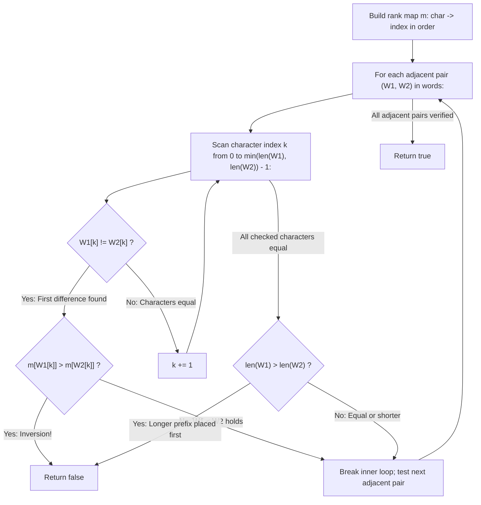

# Guided Example: Verifying an Alien Dictionary

We trace the step-by-step lexicographical verification of string sequences under arbitrary alphabet permutations, prove the First-Difference Decisiveness Invariant and Adjacent Pair Transitivity Invariant, and evaluate dictionary orderings on representative alien word lists:

- **Representative Instance 1 (First Character Decisive):**
  $$
  words = [\text{"hello"}, \; \text{"leetcode"}], \quad order = \text{"hlabcdefgijkmnopqrstuvwxyz"}
  $$
- **Required Output:** `true`
  - Alien character rank map $m$:
    $$
    m[\text{'h'}] = 0, \quad m[\text{'l'}] = 1, \quad m[\text{'a'}] = 2, \dots
    $$
  - Compare adjacent pair $W_1 = \text{"hello"}$ vs $W_2 = \text{"leetcode"}$:
    - First character comparison:
      $$
      m[W_1[0]] = m[\text{'h'}] = 0
      $$
      $$
      m[W_2[0]] = m[\text{'l'}] = 1
      $$
    - Because $0 < 1$, $W_1 <_{\text{alien}} W_2$ is established at index $0$.
    - Subsequent characters are irrelevant.
  - Result: $\mathbf{true}$.

- **Representative Instance 2 (Later Character Inversion Violation):**
  $$
  words = [\text{"word"}, \; \text{"world"}, \; \text{"row"}], \quad order = \text{"worldabcefghijkmnpqstuvxyz"}
  $$
  - Compare $W_1 = \text{"word"}$ vs $W_2 = \text{"world"}$:
    - Index 0: $'w' == 'w'$ (Tie)
    - Index 1: $'o' == 'o'$ (Tie)
    - Index 2: $'r' == 'r'$ (Tie)
    - Index 3: $W_1[3] = \text{'d'}, \; W_2[3] = \text{'l'}$.
    - Look up ranks in $order$:
      $$
      m[\text{'d'}] = 4, \quad m[\text{'l'}] = 3
      $$
    - Because $4 > 3$, $W_1$ is strictly greater than $W_2$!
    - Lexicographical order violated $\implies \mathbf{false}$.

- **Representative Instance 3 (Prefix Length Violation):**
  $$
  words = [\text{"apple"}, \; \text{"app"}], \quad order = \text{"abcdefghijklmnopqrstuvwxyz"}
  $$
  - $W_2 = \text{"app"}$ is a proper prefix of $W_1 = \text{"apple"}$, but $W_1$ appears first!
  - Under dictionary ordering, shorter prefix must precede longer word $\implies \mathbf{false}$.

---

## 1. Instance & Teaching Goal

In an alien language, words are written using lowercase English letters, but their alphabetical `order` is a custom permutation of the 26 letters.
Given an array `words` and the string `order`, return `true` if and only if `words` is sorted lexicographically according to the alien language rules.

```text
Alien Alphabet:  h  l  a  b  c  d  e  f  g  i  j  k  m  n  o  p  q  r  s  t  u  v  w  x  y  z
Rank:            0  1  2  3  4  5  6  7  8  9 10 11 12 13 14 15 16 17 18 19 20 21 22 23 24 25

Comparison of "hello" and "leetcode":
  Index 0: 'h' (rank 0) vs 'l' (rank 1) -> 0 < 1 -> VALID!
```

A naive approach converts all words into custom objects or sorts the entire list, taking $\mathcal{O}(N \log N \cdot L)$ time.

The decisive pedagogical goal is the **Adjacent Pair First-Difference Invariant**:
1. **Transitivity of Total Order:** A sequence of $N$ elements is sorted if and only if every adjacent pair satisfies $W_i \le_{\text{alien}} W_{i+1}$ for all $0 \le i < N - 1$.
2. **First-Difference Rule:** To compare two words $A$ and $B$:
   - Scan characters at index $k = 0, 1, \dots$ until the first position where $A[k] \ne B[k]$.
   - If $m[A[k]] > m[B[k]]$, the sequence is invalid (`return False`).
   - If $m[A[k]] < m[B[k]]$, word $A < B$ is strictly satisfied; proceed to next pair.
   - If all compared characters match and one word ends, the shorter word must precede: $\text{len}(A) \le \text{len}(B)$.
3. This early-exit pairwise comparison runs in linear $\mathcal{O}(S)$ time, where $S$ is the total number of characters across all words.

---

## 2. Conceptual Foundation & The First-Difference Invariant



### The Lexicographical Comparison Lemma

Let $\Sigma$ be an alphabet with strict total order $<_{\Sigma}$, and let $A, B \in \Sigma^*$ be two strings.
1. **Canonical Definition:**
   $A \le_{\text{alien}} B$ if and only if:
   - Either $A$ is a prefix of $B$ (i.e. $|A| \le |B|$ and $A[k] = B[k]$ for all $0 \le k < |A|$).
   - Or there exists some index $k < \min(|A|, |B|)$ such that $A[j] = B[j]$ for all $j < k$, and $A[k] <_{\Sigma} B[k]$.
2. **Pairwise Transitivity:**
   Because $<_{\text{alien}}$ is a strict partial order extended to a total order on strings, if $W_i \le W_{i+1}$ for all $0 \le i < N - 1$, then $W_i \le W_j$ for all $i < j$.
   Testing adjacent pairs is both necessary and sufficient. $\blacksquare$

---

## 3. Step-by-Step Worked Execution: Representative Instance 2

Words: $W_1 = \text{"word"}, \; W_2 = \text{"world"}, \; W_3 = \text{"row"}$.
Alphabet: `worldabcefghijkmnpqstuvxyz`.
Rank table $m$:
$'w': 0, \; 'o': 1, \; 'r': 2, \; 'l': 3, \; 'd': 4, \; 'a': 5, \dots$

### Adjacent Pair 1: $W_1 = \text{"word"}$ vs $W_2 = \text{"world"}$
- $\min(\text{len}(W_1), \text{len}(W_2)) = \min(4, 5) = 4$.
- $k = 0$: $W_1[0] = \text{'w'}, W_2[0] = \text{'w'} \implies m[\text{'w'}] = 0 == 0$ (Equal).
- $k = 1$: $W_1[1] = \text{'o'}, W_2[1] = \text{'o'} \implies m[\text{'o'}] = 1 == 1$ (Equal).
- $k = 2$: $W_1[2] = \text{'r'}, W_2[2] = \text{'r'} \implies m[\text{'r'}] = 2 == 2$ (Equal).
- $k = 3$: $W_1[3] = \text{'d'}, W_2[3] = \text{'l'}$.
  - $m[\text{'d'}] = 4$.
  - $m[\text{'l'}] = 3$.
  - Compare ranks: $4 > 3$.
  - Inversion detected! $W_1$ cannot precede $W_2$.
- Immediate termination: return $\mathbf{false}$.

---

## 4. Adjacent Pair Comparison Trace Table

| Pair Index | Word $W_i$ | Word $W_{i+1}$ | First Diff Index $k$ | Char $W_i[k]$ (Rank) | Char $W_{i+1}[k]$ (Rank) | Evaluation Result | Action Taken |
|:---:|:---|:---|:---:|:---:|:---:|:---:|:---|
| Sample 1 | `"hello"` | `"leetcode"` | $0$ | `'h'` (Rank 0) | `'l'` (Rank 1) | $0 < 1$ (Valid) | Accept Pair $\to$ **`true`** |
| Sample 2 | `"word"` | `"world"` | $3$ | `'d'` (Rank 4) | `'l'` (Rank 3) | $4 > 3$ (**Invalid**) | Reject $\to$ **`false`** |
| Sample 3 | `"apple"` | `"app"` | None (Prefix) | End of $W_2$ | — | $\lvert W_1 \rvert > \lvert W_2 \rvert$ (**Invalid**) | Reject $\to$ **`false`** |
| Trial 3 | `"app"` | `"apple"` | None (Prefix) | End of $W_1$ | — | $\lvert W_1 \rvert < \lvert W_2 \rvert$ (Valid) | Accept Pair $\to$ **`true`** |

---

## 5. Algorithmic Correctness

### Soundness & Completeness
1. **Soundness:**
   A violation is triggered only when either a differing character has $m[A[k]] > m[B[k]]$ or $A$ is strictly longer than $B$ while sharing an identical prefix. Under standard lexicographical order, both cases are invalid.
2. **Completeness:**
   Every adjacent pair $(W_i, W_{i+1})$ is examined from left to right. Transitivity guarantees that if all adjacent pairs are non-decreasing, the entire sequence is non-decreasing. No out-of-order pair can escape detection.

---

## 6. Boundary Cases & Traps

| Scenario | Input Pattern | Behavior | Trapped Risk |
|---|---|---|---|
| Single Word | `words = ["alone"]` | $N = 1 \implies$ loop over pairs does not run; returns `true`. | Loop bounds error on length 1. |
| Equal Words | `["same", "same"]` | All characters match, lengths equal; returns `true`. | Enforcing strict inequality ($<$). |
| Shorter Prefix First | `["app", "apple"]` | $\lvert W_1 \rvert \le \lvert W_2 \rvert$; returns `true`. | Falsely rejecting prefix matches. |
| Longer Prefix First | `["apple", "app"]` | $\lvert W_1 \rvert > \lvert W_2 \rvert$; returns `false`. | Overlooking prefix length violation. |

---

## 7. Complexity Derivation

- **Time Complexity:** $\mathcal{O}(S + |\Sigma|)$, where $S$ is the total number of characters across all words in `words` and $|\Sigma| = 26$ is the alphabet size.
  - Constructing rank map `m`: $\mathcal{O}(|\Sigma|) = \mathcal{O}(26) = \mathcal{O}(1)$.
  - Comparing adjacent words: each character is examined at most twice (once as right member of pair, once as left member).
  - Total comparisons: at most $2S$, executing in $< 0.001\text{ s}$ for $N = 100$.
- **Auxiliary Space Complexity:** $\mathcal{O}(|\Sigma|) = \mathcal{O}(1)$ to store the 26-element dictionary `m`.
