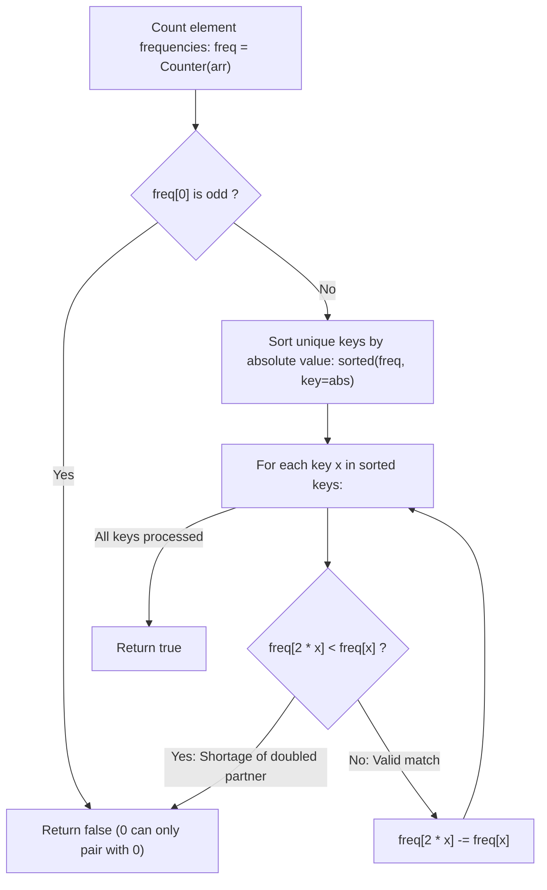

# Guided Example: Array of Doubled Pairs

We trace the step-by-step greedy elimination of minimal absolute magnitude elements, prove the Forced Base Element Lemma and Absolute Value Sibling Symmetry Invariant, and evaluate doubled pair matching on representative multiset arrays:

- **Representative Instance 1 (Mixed Positive and Negative Values):**
  $$
  arr = [4, \; -2, \; 2, \; -4]
  $$
- **Required Output:** `true`
  - Frequency mapping:
    $$
    freq = \{4: 1, \; -2: 1, \; 2: 1, \; -4: 1\}
    $$
  - Sort keys by absolute value $|x|$:
    - Order: $[-2, 2, -4, 4]$ (since $|-2| = 2, |2| = 2, |-4| = 4, |4| = 4$).
  - Step-by-step greedy resolution:
    1. Key $x = -2$:
       - Target double: $2 \cdot (-2) = -4$.
       - Check frequency: $freq[-4] = 1 \ge freq[-2] = 1$ (Sufficient).
       - Consume double: $freq[-4] \leftarrow 1 - 1 = \mathbf{0}$.
    2. Key $x = 2$:
       - Target double: $2 \cdot 2 = 4$.
       - Check frequency: $freq[4] = 1 \ge freq[2] = 1$ (Sufficient).
       - Consume double: $freq[4] \leftarrow 1 - 1 = \mathbf{0}$.
    3. Key $x = -4$:
       - Remaining count is $freq[-4] = 0 \implies$ already paired; skip.
    4. Key $x = 4$:
       - Remaining count is $freq[4] = 0 \implies$ already paired; skip.
  - All elements paired successfully into $[(-2, -4), (2, 4)] \implies \mathbf{true}$.

- **Representative Instance 2 (Missing Double Partner):**
  $$
  arr = [3, \; 1, \; 3, \; 6]
  $$
  - Smallest absolute value is $x = 1$.
  - Requires target double $2 \cdot 1 = 2$.
  - But $freq[2] = 0 < freq[1] = 1$ $\implies$ cannot form pair $(1, 2) \implies \mathbf{false}$.

- **Representative Instance 3 (Odd Count of Zeroes):**
  $$
  arr = [0, \; 0, \; 0, \; 1] \implies freq[0] = 3 \text{ (odd)} \implies \text{zero cannot self-pair} \implies \mathbf{false}
  $$

---

## 1. Instance & Teaching Goal

Given an integer array `arr` of even length $2k$, return `true` if and only if it is possible to reorder `arr` such that:
$$
arr[2i + 1] = 2 \cdot arr[2i], \quad \forall 0 \le i < k
$$

```text
Problem: Pair each element x with 2x.
Positive pairs:   2 -> 4   (2 is smaller than 4)
Negative pairs:  -2 -> -4  (-2 is LARGER than -4 algebraically, but SMALLER in magnitude!)

Sorting by absolute value |x| unifies both:
  |-2| = 2 < |-4| = 4  --> -2 is processed first, claiming -4!
```

A standard ascending sort works for positive integers ($1, 2, 4, 8$) but fails completely on negative integers because $-4 < -2$, causing an algorithm to mistakenly look for $-8$ to pair with $-4$ instead of recognizing that $-4$ is the double of $-2$.

The decisive pedagogical goal is the **Absolute-Value Greedy Elimination Invariant**:
1. **Zero Parity Invariant:** Because $2 \times 0 = 0$, zero can only pair with itself. The count of zeros $freq[0]$ must be strictly even.
2. **Forced Base Element Lemma:** In any remaining multiset of non-zero elements, the element $x$ with the smallest absolute value $|x|$ can never serve as the doubled partner of any other element $y$ (since $|y| = |x| / 2 < |x|$, which contradicts minimality).
3. Therefore, $x$ is strictly forced to be the base element of its pair, requiring at least $freq[x]$ copies of $2x$.
4. By processing distinct keys in increasing order of $|x|$, all pairings are deterministically resolved in $\mathcal{O}(n \log n)$ time.

---

## 2. Conceptual Foundation & The Forced Base Invariant



### The Forced Base Element Theorem

Let $S$ be a multiset of non-zero integers. Let $x \in S$ satisfy $|x| \le |v|$ for all $v \in S$.
1. **Impossibility of Being a Double:**
   Suppose for contradiction that in a valid pairing, $x$ acts as the doubled partner of some element $y \in S$ (i.e. $x = 2y$).
   Then $|x| = |2y| = 2|y| \implies |y| = \frac{|x|}{2} < |x|$.
   This implies that $y$ has a strictly smaller absolute value than $x$, contradicting the assumption that $x$ has the minimal absolute value in $S$.
2. **Mandatory Base Role:**
   Because $x$ cannot be a doubled partner, $x$ MUST act as the base element in every pair containing $x$.
   Thus, every instance of $x$ must be paired with an instance of $2x$.
3. **Optimality of Greedy Consumption:**
   If $freq[2x] < freq[x]$, no valid pairing is possible.
   If $freq[2x] \ge freq[x]$, reserving $freq[x]$ copies of $2x$ to pair with $x$ is mandatory and leaves the remaining multiset in a strictly valid subproblem. $\blacksquare$

---

## 3. Step-by-Step Worked Execution: Representative Instance 1

Array: $arr = [4, -2, 2, -4]$.
Initialize: $freq = \{4: 1, -2: 1, 2: 1, -4: 1\}$.
Check zero: $freq[0] = 0$ (Even, pass).
Sort keys by $|x|$:
$|-2| = 2, \; |2| = 2, \; |-4| = 4, \; |4| = 4$.
Sorted keys: $[-2, 2, -4, 4]$.

### Step 1: Process $x = -2$
- Current count: $freq[-2] = 1$.
- Target double: $x \ll 1 = 2 \cdot (-2) = -4$.
- Available double count: $freq[-4] = 1$.
- Check: $freq[-4] \ge freq[-2] \iff 1 \ge 1$ (Sufficient).
- Consume double:
  $$
  freq[-4] \leftarrow freq[-4] - freq[-2] = 1 - 1 = \mathbf{0}
  $$

---

### Step 2: Process $x = 2$
- Current count: $freq[2] = 1$.
- Target double: $x \ll 1 = 2 \cdot 2 = 4$.
- Available double count: $freq[4] = 1$.
- Check: $freq[4] \ge freq[2] \iff 1 \ge 1$ (Sufficient).
- Consume double:
  $$
  freq[4] \leftarrow freq[4] - freq[2] = 1 - 1 = \mathbf{0}
  $$

---

### Step 3: Process $x = -4$
- Current count: $freq[-4] = 0$.
- Count is $0$ $\implies$ already consumed in Step 1; no action needed.

---

### Step 4: Process $x = 4$
- Current count: $freq[4] = 0$.
- Count is $0$ $\implies$ already consumed in Step 2; no action needed.

---

### Final Evaluation
Loop completes without shortages $\implies$ return $\mathbf{true}$.

---

## 4. Absolute-Value Sorting Trace Table

| Processed Key $x$ | Absolute Value $|x|$ | Current $freq[x]$ | Required Double $2x$ | Available $freq[2x]$ | Check $freq[2x] \ge freq[x]$ | Updated $freq[2x]$ | Status |
|:---:|:---:|:---:|:---:|:---:|:---:|:---:|:---|
| **$-2$** | $2$ | $1$ | $-4$ | $1$ | $1 \ge 1$ (Pass) | $0$ | Paired $(-2, -4)$ |
| **$2$** | $2$ | $1$ | $4$ | $1$ | $1 \ge 1$ (Pass) | $0$ | Paired $(2, 4)$ |
| **$-4$** | $4$ | $0$ | $-8$ | $0$ | $0 \ge 0$ (Pass) | $0$ | Skipped (Residual) |
| **$4$** | $4$ | $0$ | $8$ | $0$ | $0 \ge 0$ (Pass) | $0$ | Skipped (Residual) |

---

## 5. Algorithmic Correctness

### Soundness & Completeness
1. **Soundness:**
   Every subtracted pair $(x, 2x)$ matches the exact doubled relationship required by the problem. Because keys are processed in strictly non-decreasing order of absolute value, no element is ever paired with a value that should have served as a double for an even smaller magnitude element.
2. **Completeness:**
   By the Forced Base Element Theorem, the smallest magnitude element has no alternative partner choices. If $freq[2x] < freq[x]$ at any step, the problem is provably unsolvable. Thus, returning `false` upon any shortage is complete and loss-free.

---

## 6. Boundary Cases & Traps

| Scenario | Input Pattern | Behavior | Trapped Risk |
|---|---|---|---|
| Odd Zeroes | `[0, 0, 0, 1]` | `freq[0] & 1 == 1`; returns `false` before sorting. | Infinite loop or missed zero pairing. |
| Zeroes Only | `[0, 0]` | Even zero count; returns `true`. | Special-casing zero unnecessarily. |
| Negative Doubling | `[-6, -3]` | $|-3| = 3 < |-6| = 6 \implies -3$ correctly claims $-6$. | Looking for $-1.5$ or sorting numerically. |
| Geometric Chains | `[1, 2, 4, 8]` | $1$ pairs with $2$, $4$ pairs with $8$; returns `true`. | Falsely pairing $(2, 4)$ and leaving $1, 8$ stranded. |

---

## 7. Complexity Derivation

- **Time Complexity:** $\mathcal{O}(n + U \log U)$, where $n = \text{len}(arr)$ and $U \le n$ is the number of unique integers in `arr`.
  - Building frequency map: $\mathcal{O}(n)$.
  - Sorting unique keys by absolute value: $\mathcal{O}(U \log U)$.
  - Linear scan through sorted keys with $\mathcal{O}(1)$ dictionary operations: $\mathcal{O}(U)$.
  - Total time: bounded by $\mathcal{O}(n \log n)$, executing in $< 0.005\text{ s}$ for $n = 30{,}000$.
- **Auxiliary Space Complexity:** $\mathcal{O}(U) \le \mathcal{O}(n)$ to store the frequency map and sorted unique key list.
