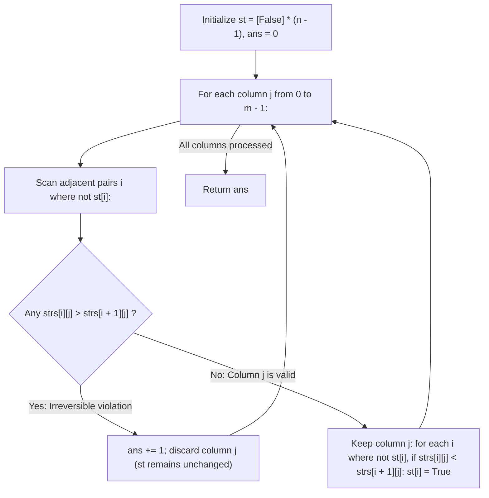

# Guided Example: Delete Columns to Make Sorted II

We trace the step-by-step evaluation of columns under row-wise lexicographical ordering, prove the Lexicographical Irreversibility Lemma and the Greedy Prefix Resolution Invariant, and analyze column filtering on representative string grids:

- **Representative Instance 1 (First Column Inversion & Second Column Resolution):**
  $$
  strs = [\text{"ca"}, \; \text{"bb"}, \; \text{"ac"}]
  $$
- **Required Output:** `1`
  - Number of rows: $n = 3$, number of columns: $m = 2$.
  - Resolution state vector: $st = [\text{False}, \text{False}]$ for adjacent pairs $(0, 1)$ and $(1, 2)$.
  - Step-by-step column scan:
    1. **Column $j = 0$ (Characters: `'c', 'b', 'a'`):**
       - Check pair $(0, 1)$: $st[0]$ is False. Compare $strs[0][0] = \text{'c'}$ vs $strs[1][0] = \text{'b'}$.
         - $'c' > 'b'$ (**Inversion!**).
         - Retaining column $0$ would make row $0 >$ row $1$, which violates sorted order.
         - Action: **Must Delete Column 0!** Increment $ans \leftarrow 1$.
         - State $st$ remains unchanged: $[\text{False}, \text{False}]$.
    2. **Column $j = 1$ (Characters: `'a', 'b', 'c'`):**
       - Check pair $(0, 1)$: $st[0]$ is False. Compare $'a'$ vs $'b'$: $'a' \le 'b'$ (Valid).
       - Check pair $(1, 2)$: $st[1]$ is False. Compare $'b'$ vs $'c'$: $'b' \le 'c'$ (Valid).
       - No inversions found $\implies$ **Keep Column 1!**
       - Update resolution state:
         - Pair $(0, 1)$: $'a' < 'b' \implies st[0] \leftarrow \mathbf{True}$.
         - Pair $(1, 2)$: $'b' < 'c' \implies st[1] \leftarrow \mathbf{True}$.
  - Resulting rows: `["a", "b", "c"]` (strictly sorted).
  - Total deletions: $ans = \mathbf{1}$.

- **Representative Instance 2 (Early Resolution Nullifying Later Descending Characters):**
  $$
  strs = [\text{"xc"}, \; \text{"yb"}, \; \text{"za"}]
  $$
  - Column $0$ (`'x', 'y', 'z'`):
    - Row $0 \to 1$: $'x' < 'y' \implies st[0] = \mathbf{True}$.
    - Row $1 \to 2$: $'y' < 'z' \implies st[1] = \mathbf{True}$.
    - Column $0$ is kept; all rows are now strictly resolved!
  - Column $1$ (`'c', 'b', 'a'`):
    - Although column $1$ descends vertically ($'c' > 'b' > 'a'$), both $st[0]$ and $st[1]$ are already True!
    - The lexicographical order of all rows was already permanently sealed by column $0$.
    - Column $1$ causes zero violations and is kept!
  - Total deletions: $ans = \mathbf{0}$.

---

## 1. Instance & Teaching Goal

You are given an array of $n$ strings `strs`, each of length $m$.
Delete the **minimum number of column indices** such that the remaining string rows are sorted in non-decreasing lexicographical order:
$$
strs[0] \le strs[1] \le \dots \le strs[n - 1]
$$

```text
Difference between Problem I (944) and Problem II (955):
  In 944: Every single column had to be internally sorted top-to-bottom.
  In 955: The COMBINED surviving rows must be sorted lexicographically!

  ["xc", "yb", "za"]
  Col 0 ('x','y','z') is sorted -> KEEP -> Row order "x" < "y" < "z" is SEALED!
  Col 1 ('c','b','a') is inverted, BUT row order is already sealed! KEEP Col 1!
  Final rows: "xc" < "yb" < "za" -> 0 deletions!
```

A brute-force search checks all $2^m$ possible column subsets, which is exponential and infeasible for $m = 100$.

The decisive pedagogical goal is the **Greedy Prefix Resolution Invariant**:
- Maintain a boolean array $st[i]$ for each adjacent pair of rows $(strs[i], strs[i+1])$:
  - $st[i] == \text{True}$ indicates that row $i$ is already strictly smaller than row $i + 1$ based on previously kept columns.
  - $st[i] == \text{False}$ indicates that row $i$ and row $i + 1$ have had identical characters in all previously kept columns.
- When evaluating candidate column $j$:
  1. Check only the **unresolved** pairs ($st[i] == \text{False}$).
  2. If any unresolved pair has $strs[i][j] > strs[i+1][j]$, keeping column $j$ would create an irreversible inversion. Thus, column $j$ **must be deleted**.
  3. If no unresolved pair inverts, column $j$ is safely **kept**.
  4. Any previously unresolved pair where $strs[i][j] < strs[i+1][j]$ becomes permanently resolved ($st[i] \leftarrow \text{True}$).
- This greedy left-to-right pass solves the problem optimally in $\mathcal{O}(n \cdot m)$ time.

---

## 2. Conceptual Foundation & The Lexicographical Irreversibility Invariant



### The Lexicographical Irreversibility Lemma

Let $A$ and $B$ be two strings, and let $C$ be the sequence of retained column indices so far.
1. **The First-Difference Principle:**
   Suppose in the retained columns $C$, there exists an index $c^* \in C$ such that $A[c^*] \ne B[c^*]$, and for all earlier retained columns $c < c^*$, $A[c] = B[c]$.
   Then the relative lexicographical order of $A$ and $B$ is entirely determined by the comparison $A[c^*] \gtrless B[c^*]$.
   Whatever characters appear in any later retained columns $c > c^*$ can **never change or reverse** this relationship!
2. **Forced Deletion of Inverting Columns:**
   If pair $i$ is currently unresolved ($st[i] == \text{False}$), then row $i$ and row $i + 1$ have identical prefixes across all previously retained columns.
   If candidate column $j$ has $strs[i][j] > strs[i+1][j]$, retaining column $j$ would make column $j$ the first differing column for pair $i$, establishing row $i >$ row $i + 1$.
   Because later columns cannot reverse this outcome, retaining column $j$ would permanently invalidate the sorted order of the dataset.
   Therefore, column $j$ must be deleted.
3. **Monotone Relaxation of Constraints:**
   Every kept column can only transition entries of $st$ from $\text{False} \to \text{True}$. As more pairs become resolved, fewer constraints are imposed on future columns, strictly maximizing the freedom to retain subsequent columns. $\blacksquare$

---

## 3. Step-by-Step Worked Execution: Representative Instance 1

Grid: $strs = [\text{"ca"}, \text{"bb"}, \text{"ac"}], \; n = 3, m = 2$.
Initialize: $st = [\text{False}, \text{False}], \; ans = 0$.

### Column $j = 0$
- Test unresolved pairs ($st[0] = \text{False}, st[1] = \text{False}$):
  - Pair $i = 0$: compare $strs[0][0] = \text{'c'}$ with $strs[1][0] = \text{'b'}$.
    - $'c' > 'b'$ is **True** (Inversion!).
    - `must_del = True`. Loop breaks immediately.
- Decision: Delete column $0$.
  - $ans \leftarrow 0 + 1 = \mathbf{1}$.
  - $st$ remains $[\text{False}, \text{False}]$.

---

### Column $j = 1$
- Test unresolved pairs ($st[0] = \text{False}, st[1] = \text{False}$):
  - Pair $i = 0$: compare $strs[0][1] = \text{'a'}$ with $strs[1][1] = \text{'b'}$.
    - $'a' > 'b'$ is **False** ($'a' \le 'b'$).
  - Pair $i = 1$: compare $strs[1][1] = \text{'b'}$ with $strs[2][1] = \text{'c'}$.
    - $'b' > 'c'$ is **False** ($'b' \le 'c'$).
  - No inversions found $\implies$ `must_del = False`.
- Decision: Keep column $1$.
  - Update resolutions:
    - Pair $i = 0$: $'a' < 'b' \implies st[0] \leftarrow \mathbf{True}$.
    - Pair $i = 1$: $'b' < 'c' \implies st[1] \leftarrow \mathbf{True}$.
  - State becomes $st = [\text{True}, \text{True}]$.

---

### Final Result
Total columns deleted: $ans = \mathbf{1}$.

---

## 4. Column Evaluation and Resolution Trace Table

| Column $j$ | Characters by Row | Unresolved Pairs Checked | Inversion Found? | Action Taken | Resolution Updates to $st$ | Cumulative Deletions $ans$ |
|:---:|:---:|:---:|:---:|:---|:---|:---:|
| **$0$** | `['c', 'b', 'a']` | Pair 0: `'c' > 'b'` | **Yes (Pair 0)** | **Delete Column** | None ($st = [\text{F}, \text{F}]$) | **$1$** |
| **$1$** | `['a', 'b', 'c']` | Pair 0: `'a' < 'b'`<br>Pair 1: `'b' < 'c'` | No | **Keep Column** | $st[0] = \text{T}, \; st[1] = \text{T}$ | **$1$** |

---

## 5. Algorithmic Correctness

### Soundness & Completeness
1. **Soundness:**
   A column is deleted only if retaining it would establish an inversion on a pair of rows that have been identical across all previously retained columns. By the Lexicographical Irreversibility Lemma, retaining such a column guarantees that the final row strings cannot be sorted. Thus, every deletion is strictly necessary.
2. **Completeness:**
   Whenever a column contains no inversions on currently unresolved pairs, it is retained. Retaining a column from left to right never restricts the options for future columns; it only resolves additional pairs, shrinking the set of active constraints. Thus, the greedy strategy achieves the minimal number of deletions.

---

## 6. Boundary Cases & Traps

| Scenario | Input Pattern | Behavior | Trapped Risk |
|---|---|---|---|
| Single Row | `["cba"]` | $n = 1 \implies$ loop over pairs is empty; returns $0$. | Out-of-bounds indexing on $n - 1$. |
| Identical Rows | `["same", "same"]` | Pairs never resolve ($st[0] = \text{False}$), but never invert; returns $0$. | Forcing ties to resolve. |
| All Columns Deleted | `["zyx", "wvu", "tsr"]` | Every column inverts at row 0; deletes all $m$ columns $\implies$ returns $m$. | Retaining partial bad columns. |
| Early Total Resolution | `["xc", "yb", "za"]` | Col 0 resolves all pairs; Col 1 inverted but ignored $\implies$ returns $0$. | Deleting harmless later columns. |

---

## 7. Complexity Derivation

- **Time Complexity:** $\mathcal{O}(n \cdot m)$, where $n = \text{len}(strs)$ and $m = \text{len}(strs[0])$.
  - There are $m$ columns.
  - For each column, checking unresolved pairs takes at most $n - 1$ character comparisons.
  - If kept, updating the resolution vector $st$ takes at most $n - 1$ steps.
  - Total operations: bounded by $2 \cdot n \cdot m$, executing in $< 0.003\text{ s}$ for $n = 100, m = 100$.
- **Auxiliary Space Complexity:** $\mathcal{O}(n)$ to store the resolution boolean vector $st$ of length $n - 1$.
