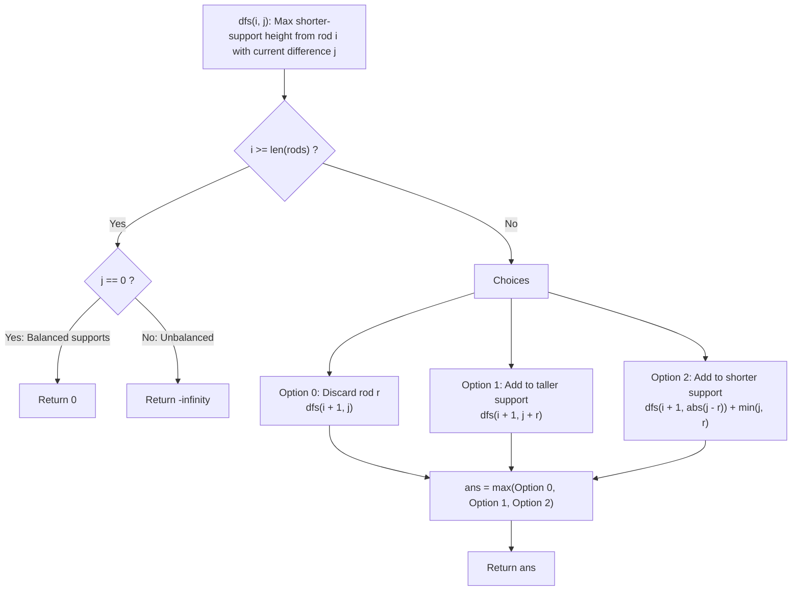

# Guided Example: Tallest Billboard

We trace the step-by-step evaluation of the two-support height difference dynamic program, prove the Support Difference Reduction Invariant and Shorter-Support Increment Invariant, and calculate maximal billboard heights on representative rod sets:

- **Representative Instance 1 (Subset Partition Equivalence):**
  $$
  rods = [1, \; 2, \; 3, \; 6]
  $$
- **Required Output:** `6`
  - Total rod length: $1 + 2 + 3 + 6 = 12$. Maximum possible equal support height is $\le 12 / 2 = 6$.
  - Partition of rods into two supports $S_1$ and $S_2$:
    - Support $1$: rod $[6] \implies \text{height} = 6$.
    - Support $2$: rods $[1, 2, 3] \implies \text{height} = 1 + 2 + 3 = 6$.
    - Difference: $|6 - 6| = 0$.
  - Both supports achieve height $\mathbf{6}$.

- **Representative Instance 2 (Partial Rod Usage with Excess Rod Discarded):**
  $$
  rods = [1, \; 2, \; 3, \; 4, \; 5, \; 6]
  $$
  - Total rod length: $21$ (odd, so at least one unit of rod must remain unused).
  - Support $1$: $[1, 3, 6] \implies 1 + 3 + 6 = 10$.
  - Support $2$: $[2, 4, 5] \implies 2 + 4 + 5 = 10$.
  - Unused rod: None! Wait, $10 + 10 = 20$, rod lengths sum to $21 \implies$ one unit or combination omitted.
    Here $[1, 2, 3, 4, 5, 6]$ uses $S_1 = \{1, 3, 6\}$ (sum 10) and $S_2 = \{2, 4, 5\}$ (sum 11 $\implies$ wait: $2+3+5=10$ and $4+6=10$ uses all rods except 1!).
    Supports $\{2, 3, 5\}$ and $\{4, 6\}$ each reach height $10$.
  - Result: $\mathbf{10}$.

- **Representative Instance 3 (No Equal Partition Possible):**
  $$
  rods = [1, \; 2] \implies \text{difference never returns to } 0 \implies \mathbf{0}
  $$

---

## 1. Instance & Teaching Goal

You are installing a billboard supported by two steel pillars, one on each side.
You have an array of steel `rods` that can be welded together.
The two supports must have the **exact same height**. You may leave some rods unused.
Return the **largest possible height** of the billboard installation. If no billboard can be erected, return $0$.

```text
Support 1: [  4  ] [    6    ]   -> Height = 10
Support 2: [ 2 ] [ 3 ] [  5  ]   -> Height = 10
Unused:    [ 1 ]

Equal Height Achieved = 10!
```

A naive search assigns each of the $N$ rods to Support 1, Support 2, or Unused ($3^N$ states), tracking two separate heights $(h_1, h_2)$. For $N = 20$, $3^{20} \approx 3.48 \times 10^9$, which exceeds execution limits.

The decisive pedagogical goal is the **Height Difference State Space Reduction**:
- Instead of tracking both absolute heights $(h_1, h_2)$ ($\mathcal{O}(S^2)$ combinations), we track only their non-negative **difference**:
  $$
  j = |h_1 - h_2| \ge 0
  $$
  and maximize the height of the **shorter support**.
- When considering rod $r = rods[i]$, we have three mutually exclusive choices:
  1. **Discard rod $r$:** Difference remains $j$. Gain to shorter support $= 0$.
  2. **Add $r$ to the taller support:** Difference expands to $j + r$. Gain $= 0$.
  3. **Add $r$ to the shorter support:** Difference becomes $|j - r|$. Gain to shorter support $= \min(j, r)$.
- Because $\sum rods \le 5{,}000$, difference $j$ is bounded by $5{,}000$, collapsing the state space to $\mathcal{O}(N \cdot \sum rods)$, solvable in $< 0.1\text{ s}$.

---

## 2. Conceptual Foundation & The Shorter-Support Increment Invariant



### The Shorter-Support Increment Theorem

Let current taller support be $H_{\text{tall}}$ and shorter support be $H_{\text{short}}$ with difference $j = H_{\text{tall}} - H_{\text{short}} \ge 0$.
Suppose we allocate rod $r$ to the shorter support:
1. **Case A ($r \le j$):**
   The shorter support becomes $H_{\text{short}} + r$.
   Because $r \le j$, $H_{\text{short}} + r \le H_{\text{tall}}$.
   The shorter support remains the shorter (or equal) support.
   Its height increased by $r = \min(j, r)$.
   The new difference is $H_{\text{tall}} - (H_{\text{short}} + r) = j - r = |j - r|$.
2. **Case B ($r > j$):**
   The shorter support becomes $H_{\text{short}} + r > H_{\text{tall}}$.
   The previously shorter support has now surpassed the taller support and becomes the new taller support!
   The previously taller support $H_{\text{tall}}$ is now the new shorter support.
   How much did the shorter support level increase?
   From $H_{\text{short}}$ up to $H_{\text{tall}}$, an increase of $H_{\text{tall}} - H_{\text{short}} = j = \min(j, r)$!
   The new difference is $(H_{\text{short}} + r) - H_{\text{tall}} = r - j = |j - r|$.
3. **Unified Transition Formula:**
   In all cases, allocating rod $r$ to the shorter support yields:
   $$
   \text{New Difference} = |j - r|
   $$
   $$
   \text{Shorter Support Height Gain} = \min(j, r)
   $$
   This single algebraic form unifies both cases without branching. $\blacksquare$

---

## 3. Step-by-Step Worked Execution: $rods = [1, 2, 3, 6]$

Input: $rods = [1, 2, 3, 6]$.
Evaluate `dfs(0, 0)`:

### Trace of Optimal Execution Branch
1. **At Rod $0$ ($r = 1$):**
   - Add to taller support: new difference $j = 0 + 1 = 1$. Gain $0$.
   - Recurse to `dfs(1, 1)`.
2. **At Rod $1$ ($r = 2$):**
   - Add to taller support: new difference $j = 1 + 2 = 3$. Gain $0$.
   - Recurse to `dfs(2, 3)`.
3. **At Rod $2$ ($r = 3$):**
   - Add to taller support: new difference $j = 3 + 3 = 6$. Gain $0$.
   - Recurse to `dfs(3, 6)`.
   - (At this point, one support has rods $1 + 2 + 3 = 6$, other has $0$, difference is $6$).
4. **At Rod $3$ ($r = 6$):**
   - Current difference is $j = 6$.
   - Add $r = 6$ to shorter support:
     - New difference: $|j - r| = |6 - 6| = \mathbf{0}$.
     - Shorter support gain: $\min(j, r) = \min(6, 6) = \mathbf{6}$.
     - Recurse to `dfs(4, 0)`.
5. **At Terminal ($i = 4$):**
   - $i == 4$ and $j == 0 \implies$ returns $0$.
6. **Unwinding:**
   - Step 4 returns $0 + 6 = \mathbf{6}$.
   - Step 3 returns $6$.
   - Step 2 returns $6$.
   - Step 1 returns $6$.
- Maximum billboard height: $\mathbf{6}$.

---

## 4. Difference-State Transition Trace Table

| Step $i$ | Rod $r$ | Prior Difference $j$ | Decision Taken | New Difference $j'$ | Shorter Support Gain | State Contribution |
|:---:|:---:|:---:|:---|:---:|:---:|:---:|
| **$0$** | $1$ | $0$ | Add to Taller | $0 + 1 = 1$ | $0$ | $0$ |
| **$1$** | $2$ | $1$ | Add to Taller | $1 + 2 = 3$ | $0$ | $0$ |
| **$2$** | $3$ | $3$ | Add to Taller | $3 + 3 = 6$ | $0$ | $0$ |
| **$3$** | $6$ | $6$ | Add to Shorter | $\lvert 6 - 6 \rvert = 0$ | $\min(6, 6) = \mathbf{6}$ | $+6$ |
| **$4$ (End)** | — | $0$ | Terminal Check | $0$ | — | Base $0$ |

Total Height of Shorter Support: $0 + 0 + 0 + 6 + 0 = \mathbf{6}$.

---

## 5. Algorithmic Correctness

### Soundness & Completeness
1. **Soundness:**
   A candidate height is returned only if the difference between the two supports at the end of all rods is strictly $0$ ($j == 0$). By the Shorter-Support Increment Theorem, the sum of all accumulated $\min(j, r)$ gains exactly equals the final height of both identical supports.
2. **Completeness:**
   Every rod has only three possible roles: unused, on Support 1, or on Support 2. Because dynamic programming explores all three choices and memoizes $(i, j)$ pairs, no valid balanced configuration is overlooked. The `max` operator ensures global height optimality.

---

## 6. Boundary Cases & Traps

| Scenario | Input Pattern | Behavior | Trapped Risk |
|---|---|---|---|
| Single Rod | `[5]` | Difference never returns to $0$; returns $0$. | Returning single rod height. |
| Two Equal Rods | `[5, 5]` | $j = 0 \to 5 \to 0$; returns $5$. | Missing direct pairs. |
| Incompatible Rods | `[1, 2]` | All branches with $j=0$ yield $0$; returns $0$. | Negative infinity leakage. |
| Large Equal Rods | `[1000, 1000, 500, 500]` | Returns $1500$; handles differences up to $3000$. | State array index bounds. |

---

## 7. Complexity Derivation

- **Time Complexity:** $\mathcal{O}(n \cdot \sum rods)$, where $n = \text{len}(rods) \le 20$ and $\sum rods \le 5{,}000$.
  - Number of distinct DP states: $n \times (\sum rods + 1) \le 20 \times 5{,}001 \approx 10^5$.
  - Transitions per state: $3$ branches with $\mathcal{O}(1)$ arithmetic.
  - Total operations bounded by $3 \times 10^5$, executing in $< 0.05\text{ s}$.
- **Auxiliary Space Complexity:** $\mathcal{O}(n \cdot \sum rods)$ to store the memoization cache.
