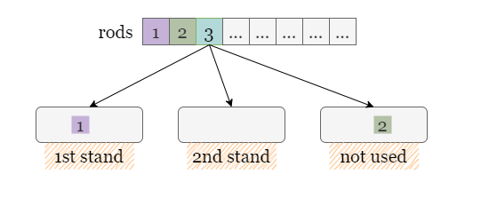
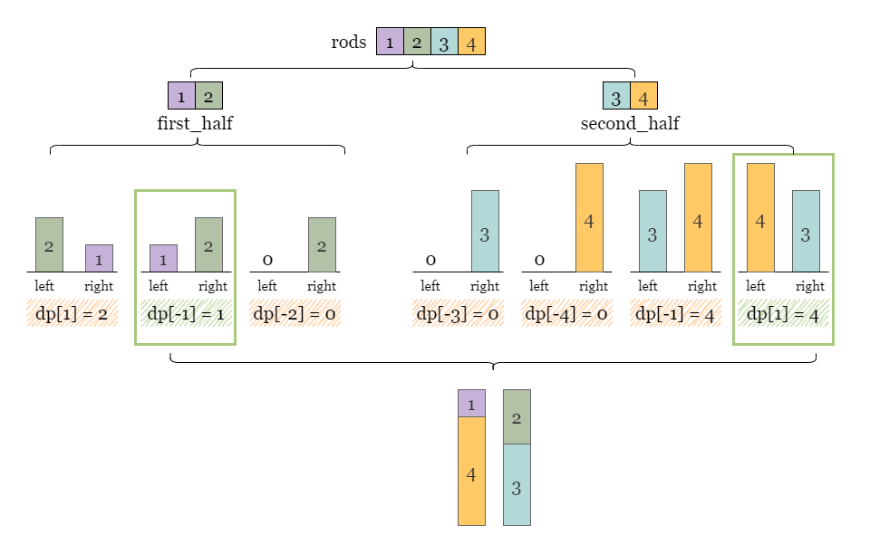
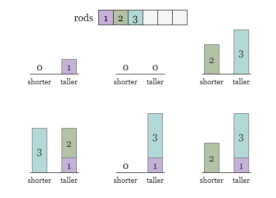
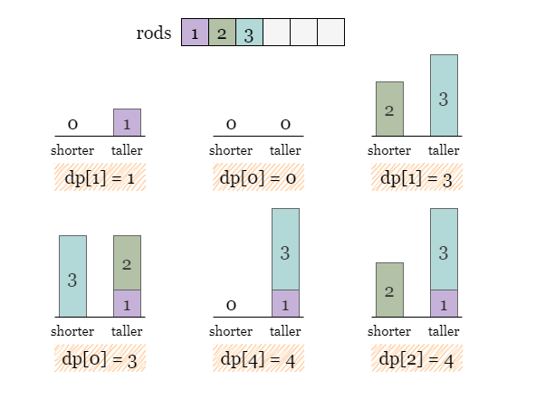
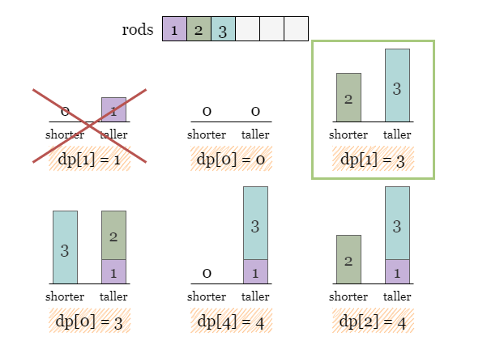
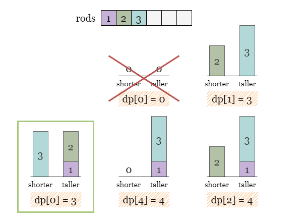
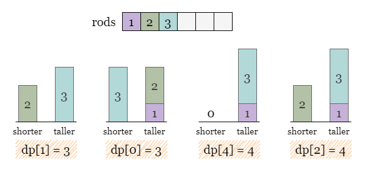
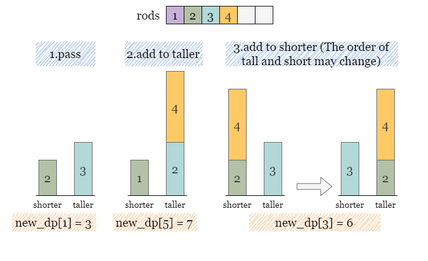

[TOC]

## Solution

---

### Overview

One possible approach to this problem is to generate all possible combinations of the rods and check which ones satisfy the conditions.



However, the number of possible combinations can grow exponentially with $n$, the number of rods given as input, because each rod can be either added to the 1st stand, 2nd stand or not be used at all.

This leads to a time complexity of $O(3^n)$, so this approach would not be feasible for values of about $n > 14$, which implies that we shall look for a better way to filter out eligible cases than the brute-force approach.

---

### Approach 1: Meet in the Middle

#### Intuition

> One possible approach to solve this problem is using a meet-in-the-middle technique, which involves breaking the problem into halves and solving them separately. $2 \cdot O(3 ^ \frac{n}{2})$ is much faster than $O(3^n)$.

Brute force methods applied over the entire `rods` may not be effective when $n > 14$. However, according to the constraints, dividing `rods` into two halves will bring $n$ to an acceptable level.

In this case, we can split the `rods` into two halves and then generate all combinations of the height of the two stands `(left, right)` for **each half** separately.

The steps of building the hash set `states` that stores all distinct combinations from the left half of `rods` are described as follows:

- Begin with $states = {(0, 0)}$, where `(0, 0)` represents the only combination that does not use a rod.

- For the first rod `r1`, there are 3 operations (not using `r1`, adding `r1` to the left stand, and adding `r1` to the right stand) to update each state in `state`, which results in $state = {(0, 0), (r1, 0), (0, r1)}$

- For the second rod `r2`, there are 3 operations to update each state in `state`, which results $state = {(0, 0), (r1, 0), (0, r1), (r2, 0), (0, r2), (r2 + r1, 0), (r1, r2), (r2, r1), (0, r2 + r1)}$.

- This process continues until all rods have been considered. As you can see, the exponential nature causes the number of states to blow up very quickly, which is why it is important to split the input in half to minimize the exponent.

How should we store the states so that we can combine the halves in the end to find the answer? Let's say that we form a combination using rods in the first half where the left rod has a height of `5` and the right rod has a height of `2`. The left rod is taller by `3`, we say $diff = left - right = 3$. The problem states that the rods must be equal in height, so when we combine with the second half, we need to find a combination where the right rod is taller by 3 to compensate. We would need to look for $-diff = -3$ where `diff` is defined as $left - right$.

Therefore, let's store the combinations of the first half in a hashmap $\text{first}_{half}$, where the keys are $diff = left - right$. What should the values be? The value should be either the left or right rod height (it doesn't matter, as long as we choose the same side for both halves). This is because the answer for a combination between the two halves would be either the two left rods or the two right rods summed.

We will store $\text{first}_{half}[left - right] = left$.

Similarly, we collect all combinations of the right half of `rods` and store them in another hash map $\text{second}_{half}$, in the same format of $\text{second}_{half}[left - right] = left$.

After building the hashmaps, we can traverse over $\text{first}_{half}$ and for each combination represented as $\text{first}_{half}[diff] = left$, we check whether $\text{second}_{half}$ contains a combination with the opposite height difference `-diff`. If it does, we take $\text{first}_{half}[diff] + \text{second}_{half}[-diff]$ as a valid billboard height.



We can keep track of the tallest stands of the same height seen so far.

<br>

#### Algorithm

1) Divide `rods` into two halves.

2) Define a helper function to collect every distinct combination `(left, right)` for a given half. We start with a set `states` that holds the first state (no rods) `(0, 0)`. Then we iterate over each rod in the given half. For each rod, we consider each state. For each state, we either add the rod to the left, to the right or skip it. We can use an intermediate set $\text{new}_{states}$. For each rod, we initialize $\text{new}_{states}$ to an empty set. Then we iterate over `states` and add to $\text{new}_{states}$. We then perform a union between `states` and $\text{new}_{states}$ before moving on to the next rod.

3) Once we have all combinations, create a hash map and iterate over the combinations. For each `(left, right)` pair, put it in the hash map with a key of $left - right$ and a value of `left`. Note that for each unique key $left - right$, we only want the **maximum** value. Return the hash map from the helper function.

4) Perform step 2 and 3 on both halves of `rods`. Save the returned hash maps in $\text{first}_{half}$ and $\text{second}_{half}$.

5) Iterate over one hash map $\text{first}_{half}$ and for each height difference `diff`, check if $\text{second}_{half}$ contains `-diff`. If so, they can match to get two stands of height $\text{first}_{half}[diff] + \text{second}_{half}[-diff]$. Update `answer` as the maximum height we have encountered.

#### Implementation

```python
class Solution(object):
    def tallestBillboard(self, rods):
        # Helper function to collect every combination `(left, right)`
        def helper(half_rods):
            states = set()
            states.add((0, 0))
            for r in half_rods:
                new_states = set()
                for left, right in states:
                    new_states.add((left + r, right))
                    new_states.add((left, right + r))
                states |= new_states

            dp = {}
            for left, right in states:
                dp[left - right] = max(dp.get(left - right, 0), left)
            return dp

        n = len(rods)
        first_half = helper(rods[: n // 2])
        second_half = helper(rods[n // 2 :])

        answer = 0
        for diff in first_half:
            if -diff in second_half:
                answer = max(answer, first_half[diff] + second_half[-diff])
        return answer
```

#### Complexity Analysis

Let $n$ be the length of the input array `rods`.

* Time complexity: $O(3^\frac{n}{2})$

- We need to generate all possible combinations of two halves of `rods` and store them in $\text{first}_{half}$ (or $\text{second}_{half}$). The number of possible combinations can grow exponentially with $n$. The time complexity is $O(3^\frac{n}{2})$ for each half.

* Space complexity: $O(3^\frac{n}{2})$

- There could be at most $3^\frac{n}{2}$ distinct combinations stored in $\text{first}_{half}$ and $\text{second}_{half}$.

<br/>

---

### Approach 2: Dynamic Programming

#### Intuition

Instead of generating all combinations by brute force, we can use a dynamic programming approach to optimize the solution. Rather than tracking rods individually and saving the state as `(left, right)`, it's better to name them according to their height as `taller` and `shorter`. The following image shows **some** combinations formed by the first three rods.



Let's define our `dp` as follows. Let $\text{dp}[diff] = taller$, where `diff` is the difference between the two rods $taller - shorter$. Initially, we set $\text{dp}[0] = 0$ because initially, we have $taller = shorter = 0$.


The six cases shown in the previous image can be represented in `dp` as follows:



However, we notice (as shown in the green box and red cross in the image) that for the same height difference of 1, we can form a higher stand, so there is no need to store the combination with the shorter one.



Likewise, for the same height difference of 0, a combination with a height of 3 can be formed, making the combination with a height of 0 unnecessary.



>  Therefore, only the **maximum** height of the taller stand is stored in each $\text{dp}[diff]$. We won't waste time and space by saving other smaller heights. As you may have expected, $\text{dp}[0]$ will hold the answer at the end, since $\text{dp}[0]$ implies that the rods are the same height.



Now, let's say we add another rod of height `4`. How do we update `dp`?

A new hashmap $\text{new}_{dp}$ is created as a copy of the current hashmap `dp`.

> If we were to skip (not use for either support) the new rod, then `dp` would not change. That's why we are initializing $\text{new}_{dp}$ by copying `dp`. It implicitly considers this option.

Recall that for each state already stored in $\text{dp}[diff] = taller$, we can have three options
to update $\text{new}_{dp}$ with a new rod of height `r`:

- Not add `r` to either stand, which we have implemented already (by copying `dp` to $\text{new}_{dp}$).
- Add `r` to the taller stand and create a new state $diff + r$ with a value of $taller + r$, update this case in $\text{new}_{dp}$.

- Add `r` to the shorter stand. What will the new height difference be? Add the rod's height to `shorter`, then use absolute value to find the difference. The new state is $abs(shorter + r - taller)$. The value will be $max(shorter + r, taller)$, in case adding `r` makes the shorter support the taller one.
- As you can see, we don't actually need to store the values of `shorter` and `taller`. We just use some clever math to maintain the values we care about.



Before moving on to the next rod, we let $dp = \text{new}_{dp}$.

Once the iteration over all rods is complete, we can return $\text{dp}[0]$ as it denotes the maximum height we can reach upon maintaining a `0` height difference.

<br>

#### Algorithm

1) Initialize a hash map $dp = {0: 0}$.

2) Iterate over every rod `r` in `rods`. At each rod:

3) Copy `dp` to $\text{new}_{dp}$. For each key-value pair `(diff, taller)` in `dp`:

- Add `r` to `taller`, update this case in $\text{new}_{dp}$ as $\text{new}_{dp}[diff + r] = max(\text{new}_{dp}[diff + r], taller + r)$.
- Add `r` to `shorter`, update this case in $\text{new}_{dp}$ as $\text{new}_{dp}[\text{new}_{diff}] = max(\text{new}_{dp}[\text{new}_{diff}], \text{new}_{taller})$.
- As discussed above, $\text{new}_{diff} = abs(shorter + r - taller)$ and $\text{new}_{taller} = max(shorter + r, taller)$.

4) Let $dp = \text{new}_{dp}$, repeat from step 2.

5) Return $\text{dp}[0]$ when the nested iterations are complete.

#### Implementation

```python
class Solution:
    def tallestBillboard(self, rods: List[int]) -> int:
        # dp[taller - shorter] = taller
        dp = {0: 0}

        for r in rods:
            # dp.copy() means we don't add r to these stands.
            new_dp = dp.copy()
            for diff, taller in dp.items():
                shorter = taller - diff

                # Add r to the taller stand, thus the height difference is increased to diff + r.
                new_dp[diff + r] = max(new_dp.get(diff + r, 0), taller + r)

                # Add r to the shorter stand, the height difference is expressed as abs(shorter + r - taller).
                new_diff = abs(shorter + r - taller)
                new_taller = max(shorter + r, taller)
                new_dp[new_diff] = max(new_dp.get(new_diff, 0), new_taller)

            dp = new_dp

        # Return the maximum height with 0 difference.
        return dp.get(0, 0)
```

#### Complexity Analysis

Let $n$ be the length of the input array `rods` and $m$ be the maximum sum of `rods`.

* Time complexity: $O(n\cdot m)$

- We need an iteration over `rods` which contains $n$ steps.
- For each $\text{rod}[i]$, we need to update $\text{new}_{dp}$ based on every state in `dp`. There could be at most $m$ difference height differences, which represents the number of unique states we need to traverse.

- Therefore, the time complexity is $O(n\cdot m)$.

* Space complexity: $O(m)$

- There could be at most $m$ difference height difference and the number of unique states stored in `dp`.

<br/>