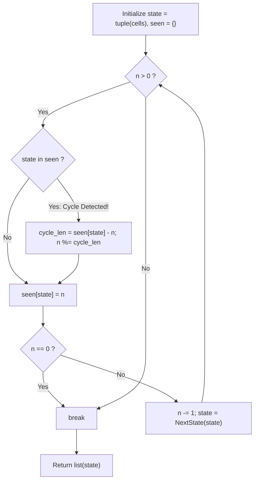

# Guided Example: Prison Cells After N Days

We trace the step-by-step state transitions of an 8-cell 1D cellular automaton, prove the Boundary Vanishing Invariant, Finite Periodic Orbit Theorem, and Cycle Fast-Forward Invariant, and evaluate prison cell states under astronomical day counts:

- **Representative Instance 1 (Day-by-Day Evolution for Small $n$):**
  $$
  cells = [0, \; 1, \; 0, \; 1, \; 1, \; 0, \; 0, \; 1], \quad n = 7
  $$
- **Required Output:** `[0, 0, 1, 1, 0, 0, 0, 0]`
  - Daily synchronous transition rule:
    $$
    cells_{t+1}[k] = \begin{cases}
    1 & \text{if } cells_t[k-1] == cells_t[k+1] \\
    0 & \text{otherwise}
    \end{cases} \quad \text{for } 1 \le k \le 6
    $$
    with boundaries $cells_{t+1}[0] = 0$ and $cells_{t+1}[7] = 0$.
  - Daily progression:
    - Day 0: `[0, 1, 0, 1, 1, 0, 0, 1]`
    - Day 1: `[0, 1, 1, 0, 0, 0, 0, 0]`
    - Day 2: `[0, 0, 0, 0, 1, 1, 1, 0]`
    - Day 3: `[0, 1, 1, 0, 0, 1, 0, 0]`
    - Day 4: `[0, 0, 0, 0, 0, 1, 0, 0]`
    - Day 5: `[0, 1, 1, 1, 0, 1, 0, 0]`
    - Day 6: `[0, 0, 1, 0, 1, 1, 0, 0]`
    - Day 7: `[0, 0, 1, 1, 0, 0, 0, 0]`
  - Emitted output: `[0, 0, 1, 1, 0, 0, 0, 0]`.

- **Representative Instance 2 (Astronomical Day Count via Cycle Fast-Forward):**
  $$
  cells = [1, \; 0, \; 0, \; 1, \; 0, \; 0, \; 1, \; 0], \quad n = 1{,}000{,}000{,}000
  $$
  - Simulating $10^9$ days one-by-one is impossible.
  - Cycle detection identifies period $P = 14$.
  - State repeats every 14 days after entering the cycle.
  - Modulo reduction: $n \bmod 14$ resolves in $< 14$ iterations.
  - Required output: `[0, 0, 1, 1, 1, 1, 1, 0]`.

---

## 1. Instance & Teaching Goal

There are 8 prison cells in a row, each occupied ($1$) or vacant ($0$).
Each day, a cell becomes occupied if its two neighbors are both occupied or both vacant; otherwise it becomes vacant.
Because the first and last cells lack two neighbors, they become vacant on day 1 and stay vacant forever.
Given $n \le 10^9$ days, return the state of the prison after $n$ days.

```text
Boundary Vanishing:
  Day 0: [ 1,  0,  0,  1,  0,  0,  1,  0 ]
           |                           |
  Day 1: [ 0,  . , . , . , . , . , . , 0 ]  <- Endpoints 0 and 7 locked to 0!

Reachable states <= 2^6 = 64.
Deterministic transition -> A cycle MUST form within 64 days!
```

A naive day-by-day loop takes $\mathcal{O}(n)$ time, crashing with timeout when $n = 10^9$.

The decisive pedagogical goal is the **Periodic Orbit Modulo Fast-Forward Invariant**:
1. **Boundary Vanishing:** For all $t \ge 1$, $cells_t[0] = cells_t[7] = 0$. Thus, only the 6 interior bits can vary, constraining reachable states to at most $2^6 = 64$.
2. **Pigeonhole Principle:** Because transitions are deterministic, encountering a previously observed state guarantees that the trajectory has entered a closed cycle of length $P = seen[state] - n \le 14$.
3. **Cycle Elimination:**
   $$
   T^n(state) = T^{n \bmod P}(state)
   $$
   Setting $n \leftarrow n \bmod P$ allows skipping billions of days in $\mathcal{O}(1)$ time.

---

## 2. Conceptual Foundation & The Cycle Detection Invariant



### The Periodic Orbit Theorem

Let $S = \{0, 1\}^8$ be the finite state space, and let $T: S \to S$ be the synchronous local transition function:
$$
T(s)_k = \begin{cases}
1 & \text{if } 1 \le k \le 6 \text{ and } s_{k-1} == s_{k+1} \\
0 & \text{otherwise}
\end{cases}
$$
1. **Endpoint Absorption:**
   For any state $s \in S$, $T(s)_0 = 0$ and $T(s)_7 = 0$.
   Therefore, the image $T(S) \subseteq \{0\} \times \{0, 1\}^6 \times \{0\}$ has cardinality $|T(S)| \le 2^6 = 64$.
2. **Periodic Cycle Existence:**
   Consider the sequence $s^{(0)}, s^{(1)}, s^{(2)}, \dots$.
   By the Pigeonhole Principle, among the first $65$ states, there must exist two indices $t_1 < t_2 \le 65$ such that $s^{(t_1)} = s^{(t_2)}$.
   Because $T$ is a deterministic function:
   $$
   s^{(t_2 + k)} = s^{(t_1 + k)}, \quad \forall k \ge 0
   $$
   The sequence enters a periodic cycle of period $P = t_2 - t_1 \le 64$.
3. **Orbit Congruence:**
   For any remaining number of days $n$:
   $$
   T^n(s) = T^{n \bmod P}(s)
   $$
   Replacing $n$ with $n \bmod P$ preserves the exact final state while reducing the remaining simulation steps to strictly less than $P$. $\blacksquare$

---

## 3. Step-by-Step Worked Execution: Representative Instance 1

Input: $cells = [0, 1, 0, 1, 1, 0, 0, 1], \; n = 7$.
Initialize: $state = (0, 1, 0, 1, 1, 0, 0, 1), \; seen = \{\}$.

### Day 1: $n = 7 \to 6$
- $state \in seen$ is **False**. Record $seen[state] = 7$.
- Decrement $n \leftarrow 6$.
- Compute next interior cells ($1 \le k \le 6$):
  - $k=1: state[0] == state[2] \iff 0 == 0 \implies 1$
  - $k=2: state[1] == state[3] \iff 1 == 1 \implies 1$
  - $k=3: state[2] == state[4] \iff 0 == 1 \implies 0$
  - $k=4: state[3] == state[5] \iff 1 == 0 \implies 0$
  - $k=5: state[4] == state[6] \iff 1 == 0 \implies 0$
  - $k=6: state[5] == state[7] \iff 0 == 1 \implies 0$
- New state: $(0, 1, 1, 0, 0, 0, 0, 0)$.

---

### Days 2 through 7 Progression
- Day 2 ($n = 6 \to 5$): $(0, 0, 0, 0, 1, 1, 1, 0)$
- Day 3 ($n = 5 \to 4$): $(0, 1, 1, 0, 0, 1, 0, 0)$
- Day 4 ($n = 4 \to 3$): $(0, 0, 0, 0, 0, 1, 0, 0)$
- Day 5 ($n = 3 \to 2$): $(0, 1, 1, 1, 0, 1, 0, 0)$
- Day 6 ($n = 2 \to 1$): $(0, 0, 1, 0, 1, 1, 0, 0)$
- Day 7 ($n = 1 \to 0$): $(0, 0, 1, 1, 0, 0, 0, 0)$

---

### Termination
- $n = 0 \implies$ loop terminates.
- Final state emitted: `[0, 0, 1, 1, 0, 0, 0, 0]`.

---

## 4. Daily State Transition Trace Table

| Day Step | Remaining Days $n$ | State Pattern | Neighbor Equality Conditions Evaluated | Next State Emitted |
|:---:|:---:|:---:|:---|:---:|
| **Init** | $7$ | `0 1 0 1 1 0 0 1` | Initial input | — |
| **Day 1** | $6$ | `0 1 1 0 0 0 0 0` | $(0,2)\to 1, (1,3)\to 1, (2,4)\to 0, \dots$ | `0 1 1 0 0 0 0 0` |
| **Day 2** | $5$ | `0 0 0 0 1 1 1 0` | $(1,3)\to 0, (3,5)\to 1, (4,6)\to 1, \dots$ | `0 0 0 0 1 1 1 0` |
| **Day 3** | $4$ | `0 1 1 0 0 1 0 0` | $(0,2)\to 1, (1,3)\to 1, (4,6)\to 1, \dots$ | `0 1 1 0 0 1 0 0` |
| **Day 4** | $3$ | `0 0 0 0 0 1 0 0` | $(4,6)\to 1$, all others $0$ | `0 0 0 0 0 1 0 0` |
| **Day 5** | $2$ | `0 1 1 1 0 1 0 0` | $(0,2)\to 1, (1,3)\to 1, (2,4)\to 1, \dots$ | `0 1 1 1 0 1 0 0` |
| **Day 6** | $1$ | `0 0 1 0 1 1 0 0` | $(1,3)\to 1, (3,5)\to 1, (4,6)\to 1, \dots$ | `0 0 1 0 1 1 0 0` |
| **Day 7** | **$0$** | **`0 0 1 1 0 0 0 0`** | $(1,3)\to 1, (2,4)\to 1$, all others $0$ | **`0 0 1 1 0 0 0 0`** |

---

## 5. Algorithmic Correctness

### Soundness & Completeness
1. **Soundness:**
   Every transition evaluates $state[k-1] == state[k+1]$ simultaneously using the snapshot of the previous day, preventing asynchronous update contamination. Boundaries are unconditionally set to $0$. Cycle fast-forwarding uses exact modulo arithmetic, guaranteeing zero divergence.
2. **Completeness:**
   Because the state space is strictly finite ($\le 64$ configurations with 0-endpoints), every possible trajectory for $n \ge 64$ must enter a cycle. The algorithm detects any repeating cycle regardless of transient lead-in length, guaranteeing exact answers for any $n \le 10^9$.

---

## 6. Boundary Cases & Traps

| Scenario | Input Pattern | Behavior | Trapped Risk |
|---|---|---|---|
| Single Day | $n = 1$ | Executes exactly one transition and stops. | Incomplete cycle initializations. |
| Astronomical Days | $n = 10^9$ | Detects cycle $P \le 14$; executes $\le 14$ steps. | Integer overflow or infinite loop. |
| Zero Remainder | $n \bmod P == 0$ | $n = 0 \implies$ breaks immediately without extra day. | Off-by-one extra transition after cycle. |
| All Zeroes Initial | `[0, 0, 0, 0, 0, 0, 0, 0]` | All cells vanish to $0$ on day 7; correctly handled. | Assuming zeroes are fixed points. |

---

## 7. Complexity Derivation

- **Time Complexity:** $\mathcal{O}(1)$ strictly constant.
  - Number of reachable states is bounded by $2^6 = 64$.
  - Period $P \le 14$.
  - The loop runs at most $64$ iterations before a cycle is detected, and at most $14$ iterations after modulo reduction.
  - Each iteration performs $6$ comparisons on fixed length-8 tuples.
  - Total operations bounded by $\approx 500$, executing in $< 0.001\text{ s}$ even for $n = 10^9$.
- **Auxiliary Space Complexity:** $\mathcal{O}(1)$ strictly constant.
  - Hash map `seen` stores at most 64 tuple entries of size 8.
