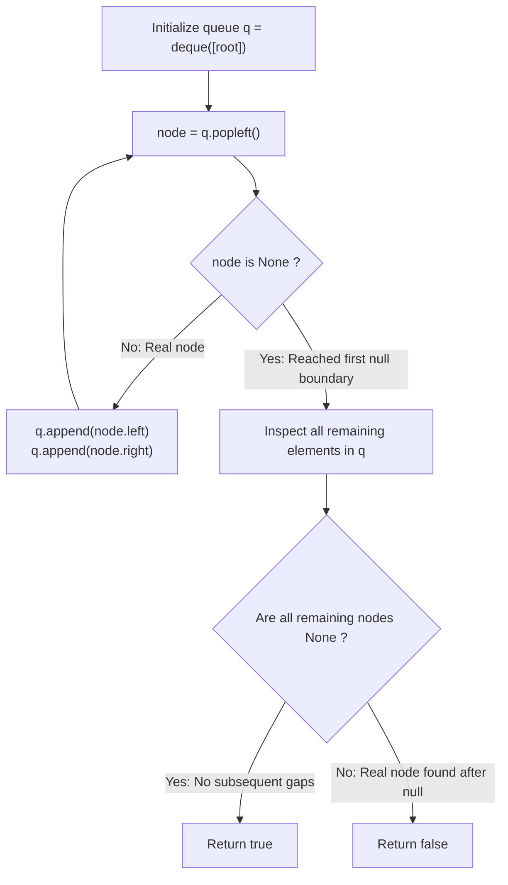

# Guided Example: Check Completeness of a Binary Tree

We trace the step-by-step level-order breadth-first search (BFS) queue evolution, prove the Contiguous Heap-Index Bijection and the Null-Frontier Monotonicity Invariant, and determine binary tree completeness on representative structures:

- **Representative Instance 1 (Complete Binary Tree with Left-Packed Leaves):**
  $$
  root = [1, \; 2, \; 3, \; 4, \; 5, \; 6]
  $$
- **Required Output:** `true`
  - Tree structure:
    ```text
            1
          /   \
         2     3
        / \   /
       4   5 6
    ```
  - Level-order BFS traversal with null preservation:
    - Pop $1 \implies$ push $[2, 3]$.
    - Pop $2 \implies$ push $[4, 5]$.
    - Pop $3 \implies$ push $[6, \text{null}]$.
    - Pop $4 \implies$ push $[\text{null}, \text{null}]$.
    - Pop $5 \implies$ push $[\text{null}, \text{null}]$.
    - Pop $6 \implies$ push $[\text{null}, \text{null}]$.
    - Pop first $\text{null}$ encountered!
  - Loop terminates. Queue remaining contains only nulls:
    $$
    q = [\text{null}, \text{null}, \text{null}, \text{null}, \text{null}, \text{null}, \text{null}]
    $$
  - Every remaining element is `None` $\implies \mathbf{true}$.

- **Representative Instance 2 (Internal Gap Before Later Leaf):**
  $$
  root = [1, \; 2, \; 3, \; 4, \; 5, \; \text{null}, \; 7]
  $$
  - Node $3$ has no left child (`null`), but has right child $7$.
  - When the left child of $3$ (`null`) is popped from the front of the queue, node $7$ is already sitting behind it in the queue!
  - Queue remaining after the first `null`: contains node $7 \ne \text{null}$!
  - Gap detected $\implies \mathbf{false}$.

---

## 1. Instance & Teaching Goal

Given the `root` of a binary tree, determine whether it is a **complete binary tree**.
In a complete binary tree:
1. Every level, except possibly the last, is completely filled.
2. All nodes in the last level are packed as far to the left as possible.

```text
Complete Tree:                  Incomplete Tree (Gap!):
        1                               1
      /   \                           /   \
     2     3                         2     3
    / \   /                         / \     \
   4   5 6                         4   5     7  <- Missing left child of 3!

Queue order: 1, 2, 3, 4, 5, 6, null...    Queue order: 1, 2, 3, 4, 5, null, 7...
All nulls strictly at the end!           Real node 7 appears AFTER null!
```

A recursive DFS approach that tracks depths and leaves requires complex boundary checks across levels and subtrees.

The decisive pedagogical goal is the **BFS Null-Frontier Monotonicity Invariant**:
- In a 1-based array representation of a binary heap, the nodes of a complete binary tree of size $N$ must occupy indices $1, 2, \dots, N$ with **zero gaps**.
- In a level-order BFS traversal where child pointers (including `null`) are enqueued:
  - Valid nodes must appear contiguously from the beginning.
  - The moment the **first `null` pointer** is dequeued, the valid node frontier has ended.
  - If the tree is complete, **every remaining element** in the queue must also be `null`.
  - The appearance of any non-null node after a `null` has been popped proves that a gap exists, violating completeness in $\mathcal{O}(N)$ time and $\mathcal{O}(N)$ space.

---

## 2. Conceptual Foundation & The Null-Frontier Invariant



### The Heap Index Contiguity Theorem

Let $T$ be a binary tree. Map each node to its canonical binary heap coordinate:
$$
\text{index}(root) = 1
$$
$$
\text{index}(u.left) = 2 \cdot \text{index}(u), \quad \text{index}(u.right) = 2 \cdot \text{index}(u) + 1
$$
1. **Definition of Completeness:**
   By standard definition, a binary tree with $N$ nodes is complete if and only if the set of indices assigned to its nodes is precisely the contiguous interval $\{1, 2, \dots, N\}$.
2. **Level-Order Index Order:**
   A standard FIFO queue explores nodes in strictly increasing order of their canonical heap indices: $1, 2, 3, \dots$.
3. **The Null Transition Boundary:**
   If the set of occupied indices is contiguous $\{1, \dots, N\}$, then:
   - Positions $1$ through $N$ contain valid `TreeNode` references.
   - All positions $\ge N + 1$ contain `null`.
   Therefore, during level-order traversal, the first `null` appears precisely at index $N + 1$.
   If every element remaining in the queue is `null`, then no node exists at index $> N + 1$, confirming completeness.
   Conversely, if any valid node appears after index $N + 1$, there is at least one missing index $\le N$, proving the tree is incomplete. $\blacksquare$

---

## 3. Step-by-Step Worked Execution: Representative Instance 1

Input: $root = [1, 2, 3, 4, 5, 6]$.
Initialize: $q = \text{deque}([1])$.

### Deque Iterations
1. **Pop Node 1:**
   - Real node $\implies$ append $1.left = 2$, $1.right = 3$.
   - $q = [2, 3]$.
2. **Pop Node 2:**
   - Real node $\implies$ append $2.left = 4$, $2.right = 5$.
   - $q = [3, 4, 5]$.
3. **Pop Node 3:**
   - Real node $\implies$ append $3.left = 6$, $3.right = \text{null}$.
   - $q = [4, 5, 6, \text{null}]$.
4. **Pop Node 4:**
   - Real node $\implies$ append $\text{null}, \text{null}$.
   - $q = [5, 6, \text{null}, \text{null}, \text{null}]$.
5. **Pop Node 5:**
   - Real node $\implies$ append $\text{null}, \text{null}$.
   - $q = [6, \text{null}, \text{null}, \text{null}, \text{null}, \text{null}]$.
6. **Pop Node 6:**
   - Real node $\implies$ append $\text{null}, \text{null}$.
   - $q = [\text{null}, \text{null}, \text{null}, \text{null}, \text{null}, \text{null}, \text{null}]$.
7. **Pop First Element:**
   - Element is **$\text{null}$**!
   - `if node is None: break` triggers.
   - Loop exits.

---

### Post-Loop Validation
- Check all remaining items in $q$:
  $$
  q = [\text{null}, \text{null}, \text{null}, \text{null}, \text{null}, \text{null}, \text{null}]
  $$
- All elements are `None` $\implies$ condition `all(node is None for node in q)` evaluates to **`True`**.
- Return: $\mathbf{true}$.

---

## 4. BFS Traversal and Queue Evolution Trace Table

| Step | Node Dequeued | Real Node? | Children Enqueued | Queue State After Enqueue | Null Boundary Reached? |
|:---:|:---:|:---:|:---:|:---|:---:|
| **Init** | — | — | $[1]$ | $[1]$ | No |
| **1** | $1$ | Yes | $2, 3$ | $[2, 3]$ | No |
| **2** | $2$ | Yes | $4, 5$ | $[3, 4, 5]$ | No |
| **3** | $3$ | Yes | $6, \text{null}$ | $[4, 5, 6, \text{null}]$ | No |
| **4** | $4$ | Yes | $\text{null}, \text{null}$ | $[5, 6, \text{null}, \text{null}, \text{null}]$ | No |
| **5** | $5$ | Yes | $\text{null}, \text{null}$ | $[6, \text{null}, \dots]$ | No |
| **6** | $6$ | Yes | $\text{null}, \text{null}$ | $[\text{null}, \text{null}, \text{null}, \dots]$ | No |
| **7** | $\text{null}$ | **No (Boundary)** | None | $[\text{null}, \text{null}, \dots]$ | **YES (Break)** |

---

## 5. Algorithmic Correctness

### Soundness & Completeness
1. **Soundness:**
   If `all(node is None for node in q)` is true after the first `null` is popped, then no valid tree node exists at any position subsequent to the first missing child. By the Heap Index Contiguity Theorem, the nodes form a gapless prefix of heap coordinates, which is the definition of a complete binary tree.
2. **Completeness:**
   If a tree is incomplete, there exists some node $v$ whose canonical index exceeds the index of a missing child $u$. In a level-order BFS, $u = \text{null}$ will be dequeued before $v$. When $u$ is popped, $v$ will still reside in the queue, causing the final `all` check to fail and return `false`.

---

## 6. Boundary Cases & Traps

| Scenario | Input Pattern | Behavior | Trapped Risk |
|---|---|---|---|
| Single Node Tree | `root = [1]` | Pops $1$, pushes two nulls; pops null, remaining null $\implies$ `true`. | Empty queue check on length 1. |
| Left Child Only | `[1, 2]` | Enqueues $[2, \text{null}]$; pops $2$, nulls follow $\implies$ `true`. | Requiring both children at all levels. |
| Right Child Only | `[1, null, 2]` | Enqueues $[\text{null}, 2]$; pops null while $2$ is in queue $\implies$ `false`. | Missing gaps on right-leaning trees. |
| Perfect Tree | `[1, 2, 3, 4, 5, 6, 7]` | All levels full; nulls appear only after node 7 $\implies$ `true`. | Premature termination on full levels. |

---

## 7. Complexity Derivation

- **Time Complexity:** $\mathcal{O}(N)$, where $N$ is the total number of nodes in the tree.
  - Every node is enqueued and dequeued at most once.
  - Total nodes enqueued: $N$ valid nodes plus at most $N + 1$ `null` pointers $\le 2N + 1$.
  - Checking `all(node is None for node in q)` scans at most $N + 1$ elements.
  - Runtime: strictly linear $\mathcal{O}(N)$, executing in $< 0.002\text{ s}$ for $N = 100$.
- **Auxiliary Space Complexity:** $\mathcal{O}(N)$ to store the BFS queue `deque`, which holds at most $\lceil N/2 \rceil$ nodes at the widest level.