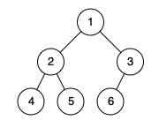
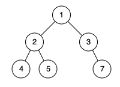

### 1. Description

Given the `root` of a binary tree, determine if it is a *complete binary tree*.

In a **<a href="http://en.wikipedia.org/wiki/Binary_tree#Types_of_binary_trees" target="_blank">complete binary tree</a>**, every level, except possibly the last, is completely filled, and all nodes in the last level are as far left as possible. It can have between `1` and $2^h$ nodes inclusive at the last level `h`.

### 2. Function Contract

**Methods**

- `TreeNode(val=0, left=None, right=None)`: Initializes the data structure.
- `isCompleteTree(root: Optional[TreeNode]) -> `bool``: Executes operation.

### 3. Examples

#### Example 1

- **Input:** `root = [1,2,3,4,5,6]`
- **Output:** `true`
- **Explanation:** Every level before the last is full (ie. levels with node-values {1} and {2, 3}), and all nodes in the last level ({4, 5, 6}) are as far left as possible.

#### Example 2

- **Input:** `root = [1,2,3,4,5,null,7]`
- **Output:** `false`
- **Explanation:** The node with value 7 isn't as far left as possible.

### 4. Constraints

- The number of nodes in the tree is in the range `[1, 100]`.

- $1 \le \text{Node.val} \le 1000$
