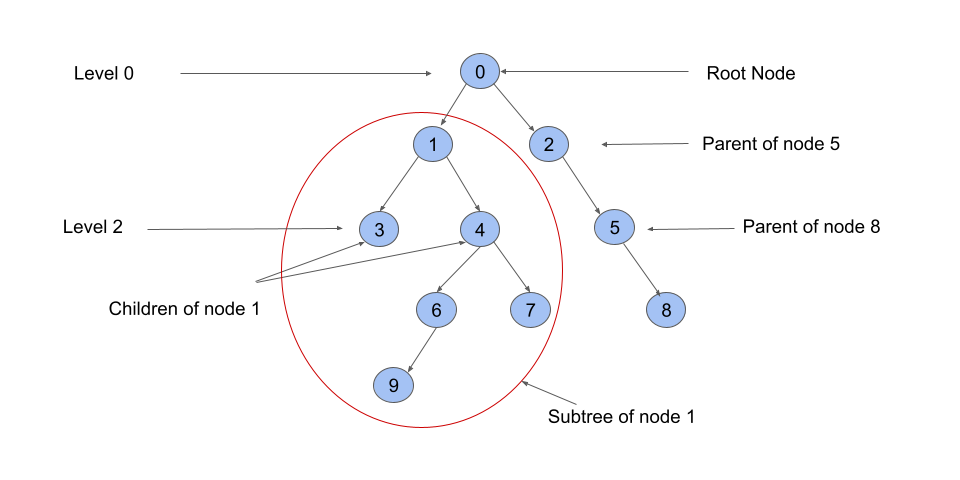
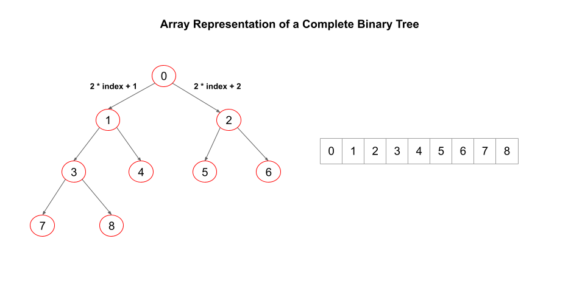
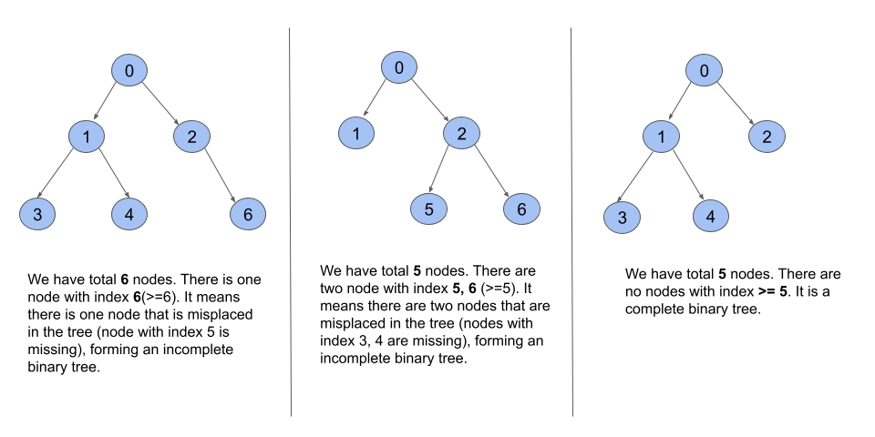

## Solution

---

### Overview

We are given the `root` of a binary tree and our task is to determine if it is a complete binary tree or not.

In a complete binary tree, every level except possibly the last is completely filled, and all nodes in the last level are as far left as possible. The last level can have between $1$ and $2^{h}$ nodes inclusive, where $h$ is the height of the tree.

Before moving on to the solution, consider some of the graph terminologies that will be used later:



1. **Child**: A node that is one edge further away from a given node in a rooted tree. In the above image, nodes `3, 4` are children of `1`, which is called the parent. (When we consider `0` as the root)
2. **Descendants**: Descendants of a node are children, children of children, and so on. In the above image, nodes `3, 4, 6, 7, 9` are all descendants of `1`.
3. **Subtree**: A subtree of a node `T` is a tree `S` consisting of a node `T` and all of its descendants in `T`. The subtree corresponding to the root node is the entire tree.
4. **Level**: The level of a node is the number of edges on the path from the root node to that node. Therefore, the root node has a level of `0`. If it has children, all of them have a level of `1`.

---

### Approach 1: Breadth First Search

#### Intuition

By analyzing the definition, we can see that a binary tree is complete if there is no node to the right of the first `null` node and no node at a greater level than the first `null` node.

It means that if we traverse the tree level by level from left to right and we come across a `null` node, all subsequent nodes in this traversal should be `null` as well (should not exist). The level-order traversal array of a complete binary tree will never have a `null` node in between non-null nodes.

Breadth-first search (BFS) traversal can be used to perform level-wise traversal. BFS is an algorithm for traversing or searching a graph. It traverses in a level-wise manner, i.e., all the nodes at the present level (say `l`) are explored before moving on to the nodes at the next level ($l + 1$), where a level's number is the distance from a starting node. BFS is implemented with a queue.

If you are not familiar with BFS traversal, we suggest you read our [Leetcode Explore Card](https://leetcode.com/explore/featured/card/graph/620/breadth-first-search-in-graph/).

We begin with the `root` node. We return `true` if `root` is `null` because the empty tree fits the definition of a complete binary tree. Otherwise, we initialize a boolean variable called `nullNodeFound` to keep track of whether or not we have seen a `null` node. We set it to `false` at the start.

We start a BFS traversal pushing `root` in the BFS queue. While the BFS queue is not empty, we fetch the front `node` in the queue. If $node = null$, we mark $nullNodeFound = true$. Otherwise, if $node \neq null$, we check if we have already visited a `null` node. If we've previously visited a `null` node and $node \neq null$, the given tree isn't a complete binary tree as we are encountering a node after visiting a `null` node. We return `false` in such a case.

If we haven't yet visited a `null` node and $node \neq null$, we push `node.left` and then `node.right` to iterate from left to right at each level.

We return `true` if we can traverse the entire tree without encountering a non-null node after a `null` node.

#### Algorithm

1. There is no node in the given tree if the `root` node is `null`. We return `true`.
2. Create a boolean variable `nullNodeFound` to track whether or not a `null` node has been visited yet. We initialize it to `false`.
3. Intiailize a `TreeNode` queue `q` and push `root` into it.
4. While the queue is not empty:
- Dequeue the first element `node` from the queue.
- If $node = null$, mark $nullNodeFound = true$.
- Otherwise, if `node` is not `null`, we check to see if we have previously visited a `null` node. If $nullNodeFound = true$, it means we have `node` which is not `null` after visiting a `null` node. As a result, we return `false` in such a case. Otherwise, if we have not visited a `null` node yet, we push `node.left` and then `node.right` into the queue.
5. We are able to traverse the entire tree without seeing a non-null node after a `null` node, we return `true`.

#### Implementation

```cpp
class Solution {
public:
    bool isCompleteTree(TreeNode* root) {
        if (root == nullptr) {
            return true;
        }

        bool nullNodeFound = false;
        queue<TreeNode*> q;
        q.push(root);

        while (!q.empty()) {
            TreeNode* node = q.front();
            q.pop();

            if (node == nullptr) {
                nullNodeFound = true;
            } else {
                if (nullNodeFound) {
                    return false;
                }
                q.push(node->left);
                q.push(node->right);
            }
        }
        return true;
    }
};
```

#### Complexity Analysis

Here $n$ is the number of nodes.

* Time complexity: $O(n)$.
- Each queue operation in the BFS algorithm takes $O(1)$ time, and a single node can only be pushed once, leading to $O(n)$ operations for $n$ nodes. Since we have directed edges, each edge can only be iterated once, resulting in $O(e)$ operations total while visiting all nodes, where $e$ is the number of edges. Because the given graph is a tree, there are $n - 1$ edges, so $O(n + e) = O(n)$.

* Space complexity: $O(n)$.
- The last or second last level would have the most nodes (the last level can have multiple null nodes) in a complete binary tree. Because we are iterating by level, the BFS queue will be most crowded when all of the nodes from the last level (or second last level) are in the queue.
- Assume we have a complete binary tree with height $h$ and a fully filled last level having $2^h$ nodes. All the nodes at each level add up to $1 + 2 + 4 + 8 +... + 2^h = n$. This implies that $2^{h + 1} - 1 = n$, and thus $2^h = (n + 1) / 2$. Because the last level $h$ has $2^h$ nodes, the BFS queue will have $(n + 1) / 2 = O(n)$ elements in the worst-case scenario.

---

### Approach 2: Depth First Search

#### Intuition

A complete binary tree has an interesting property that we can use to find the children and parents of any node.

A complete binary tree can be represented with an array. If the index of a node in the array is `i`, the element at index $2i + 1$ will be its `left` child and the element at index $2i + 2$ will be its `right` child. If there are a total of `n` nodes in a complete binary tree, it can be represented with an array where the nodes are ordered level by level, left to right. As we saw in the previous approach, there will be no `null` node between two non-null nodes.

Let's take a look at the following array representation of a complete binary tree:



This property can be used to solve the problem.

Starting with the root node and assigning it an index of `0`, we can use the above property to assign indices to all the other nodes in the tree. Let `n` represent the total number of nodes in the tree. As we saw above, the assigned index of every node must be smaller than or equal to `n` for the given tree to form a complete binary tree.

If the `index` of a `node` is greater or equal to `n`, it means a node is missing from the first `n` indices. In such a case, the tree is not a complete binary tree. The array representation of such a binary tree will have at least one `null` node in between non-null nodes.

If `index < n`, we proceed to its children. We use index as $2 * index + 1$ for the left child `node.left` and $2 * index + 2$ for the right child. Similarly, we determine whether or not the index of the both the children is greater than `n` or not.

Let's take a look at some visual examples:



For every `node`, we can recursively iterate over its `left` and `right` children and verify if the assigned indices are smaller than `n`. We can use a depth-first search to perform this recursive traversal.

In DFS, we use a recursive function to explore nodes as far as possible along each branch. Upon reaching the end of a branch, we backtrack to the previous node and continue exploring the next branches.

Once we encounter an unvisited node, we will take one of its neighbor nodes (if exists) as the next node on this branch. Recursively call the function to take the next node as the 'starting node' and solve the subproblem.

If you are new to Depth First Search, please see our [Leetcode Explore Card](https://leetcode.com/explore/featured/card/graph/619/depth-first-search-in-graph/3882/) for more information on it!

First, we do a simple DFS to determine the number of nodes `n`.

Next, we start another DFS with `root` as `node` and assigning an index of `0` to it. If $node = null$, we have an empty subtree of `node`. For this case, we return `true`. Otherwise, we examine whether $index \ge n$. If the index is greater or equal to `n`, we return `false`. Otherwise, we call dfs recursively for the left and right subtrees to see if any node in either subtree violates the complete binary tree property. To perform this recursion, we use $dfs(node->left, 2 * index + 1, n) \&\& dfs(node->right, 2 * index + 2, n)$.

#### Algorithm

1. Create a `countNodes` method that takes `root` as parameter. It returns the total number of nodes in the subtree of `root`.
2. Start a DFS traversal.
- We use a function `dfs` to perform the traversal. For each call, pass `node, index, n` as the parameters. `node` is a type of `TreeNode`  from which the DFS begins, `index` is the index of `node` in the complete binary tree and `n` is the total number of nodes in the given binary tree. We start (and return) with `dfs(root, 0, countNodes(root))`.
- If $node = null$, we return `true` because there is no node in this subtree.
- If $index \ge n$, it means we've a non-null node having `index` greater or equal to the number of nodes in the given tree which tells that the given tree is not a complete binary tree. We return `false`.
- We check the left and right subtrees of `node` recursively. For the left child, we call dfs with $\text{node.left}, 2 * index + 1, n$ and for the right child, we call dfs with $\text{node.right}, 2 * index + 2, n$. We join these two calls with the `&&` operator so that if any subtree violates the complete binary tree property, we return `false`.

#### Implementation

```cpp
class Solution {
public:
    int countNodes(TreeNode* root) {
        if (root == nullptr) {
            return 0;
        }
        return 1 + countNodes(root->left) + countNodes(root->right);
    }

    bool dfs(TreeNode* node, int index, int n) {
        if (node == nullptr) {
            return true;
        }
        // If index assigned to current node is greater or equal to the number of nodes
        // in tree, then the given tree is not a complete binary tree.
        if (index >= n) {
            return false;
        }
        // Recursively move to left and right subtrees.
        return dfs(node->left, 2 * index + 1, n) &&
               dfs(node->right, 2 * index + 2, n);
    }

    bool isCompleteTree(TreeNode* root) {
        return dfs(root, 0, countNodes(root));
    }
};
```

#### Complexity Analysis

Here $n$ is the number of nodes.

* Time complexity: $O(n)$.
- The `dfs` function visits each node once, which takes $O(n)$ time in total. Since we have directed edges, each edge can only be iterated once, resulting in $O(e)$ operations total while visiting all nodes, where $e$ is the number of edges. As mentioned in the previous approach, $O(e) = O(n)$ since the graph is a tree.

* Space complexity: $O(n)$.
- We are recursively calling dfs for the left child of a node first and moving from top to bottom. If we have traversed the left child of the node, we then call the dfs over its right child. So, from a node at level `l`, we only go to one node at $l + 1$, either its left or right child (and not both). As a result, the stack will contain at most one dfs call from each level. Hence, the dfs stack will grow to a height of $h$, where $h$ is the height of the tree. The worst-case scenario would be an incomplete binary with only each node just having a left child (called skewed tree). This is a `n` height tree, with $O(n)$ elements in the dfs stack.