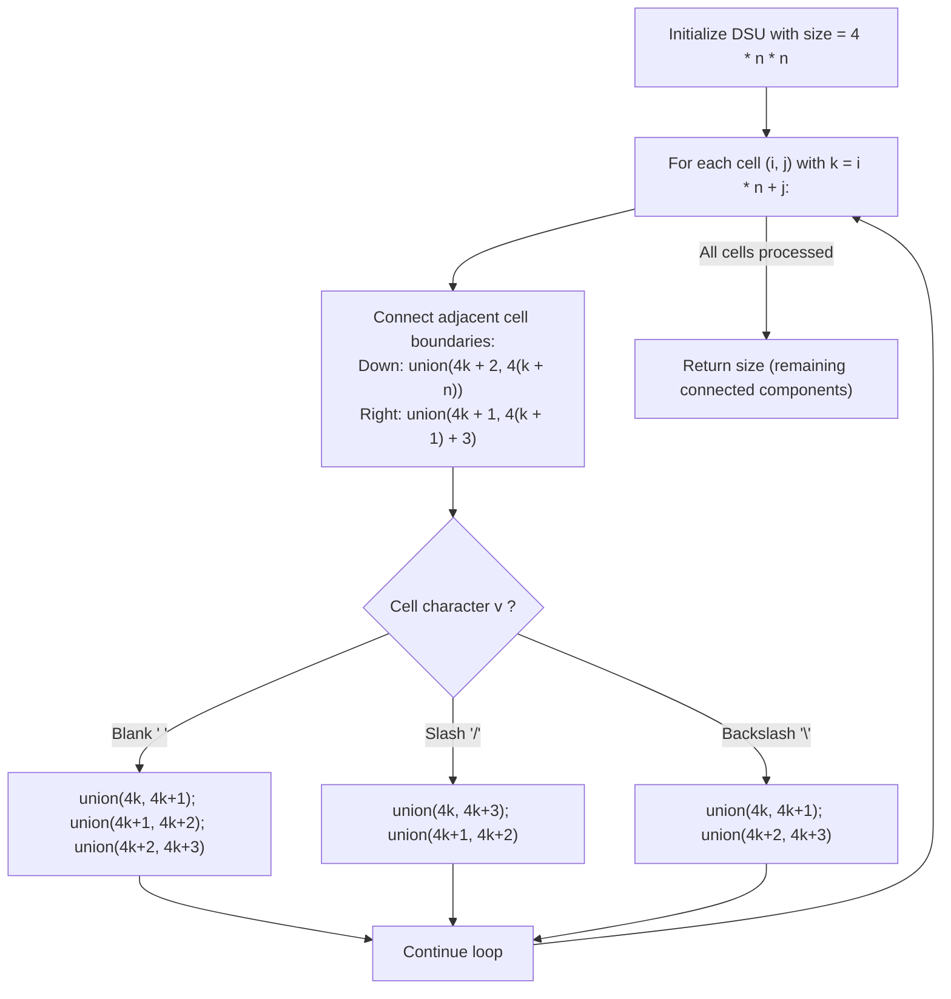

# Guided Example: Regions Cut By Slashes

We trace the step-by-step planar graph discretization of an $n \times n$ grid into 4 triangular quadrants per cell, prove the Diagonal Slash Partition Invariant and Boundary Adjacency Invariant, and evaluate connected region counts using Disjoint Set Union (DSU):

- **Representative Instance 1 (Parallel Forward Slashes):**
  $$
  grid = [\text{" /"}, \; \text{"/ "}] \quad (n = 2)
  $$
- **Required Output:** `2`
  - Total triangles across $2 \times 2 = 4$ squares:
    $$
    \text{Total Triangles} = 4 \times n^2 = 4 \times 4 = 16
    $$
  - Quadrant indexing inside cell $k = i \cdot n + j$:
    - $4k + 0$: North (Top)
    - $4k + 1$: East (Right)
    - $4k + 2$: South (Bottom)
    - $4k + 3$: West (Left)
  - Inter-cell and intra-cell connections:
    - Cell $(0, 0)$ is `' '` $\implies$ all 4 triangles merge $\implies 3$ merges.
    - Cell $(0, 1)$ is `'/'` $\implies$ merge $(0, 3)$ and $(1, 2) \implies 2$ merges.
    - Cell $(1, 0)$ is `'/'` $\implies$ merge $(0, 3)$ and $(1, 2) \implies 2$ merges.
    - Cell $(1, 1)$ is `' '` $\implies$ all 4 triangles merge $\implies 3$ merges.
    - Neighboring cell boundaries (vertical and horizontal merges) join the triangles into two large continuous planar regions.
  - Initial components: $16$. Successful merges: $14$.
  - Surviving connected components: $16 - 14 = \mathbf{2}$.

- **Representative Instance 2 (Diamond Center Formation):**
  - Input grid: `["/\\", "\\/"]` with $n = 2$.
  - Forward slashes and backslashes form an enclosed central diamond surrounded by $4$ corner triangles.
  - Final regions: $1 \text{ (center)} + 4 \text{ (corners)} = \mathbf{5}$.

- **Representative Instance 3 (All Blank Square):**
  $$
  grid = [\text{" "}] \quad (n = 1) \implies 4 \text{ triangles merged into } \mathbf{1} \text{ region}
  $$

---

## 1. Instance & Teaching Goal

An $n \times n$ grid is composed of $1 \times 1$ squares where each square consists of `'/'`, `'\\'`, or blank space `' '`.
These characters divide the square into contiguous regions. Return the **total number of connected regions**.

```text
Cell Subdivision into 4 Triangles:
         \  0 (N)  /
          \       /
    3 (W)   \   /   1 (E)
             \ /
             / \
            /   \
          /       \
         /  2 (S)  \

Blank ' ':     All four triangles {0, 1, 2, 3} are connected.
Slash '/':     Connects {0, 3} (North-West) and {1, 2} (East-South).
Backslash '\': Connects {0, 1} (North-East) and {2, 3} (South-West).
```

A naive flood-fill on continuous floating-point geometry or ray casting is complex and prone to precision issues.

The decisive pedagogical goal is the **4-Quadrant Triangular Discretization Invariant**:
1. **Triangular Discretization:** Every $1 \times 1$ square is divided into 4 non-overlapping triangles (North, East, South, West).
2. **Slash Partition Rules:**
   - `' '`: Merges $0 \leftrightarrow 1 \leftrightarrow 2 \leftrightarrow 3$.
   - `'/'`: Divides along diagonal from bottom-left to top-right $\implies$ merges $0 \leftrightarrow 3$ and $1 \leftrightarrow 2$.
   - `'\\'`: Divides along diagonal from top-left to bottom-right $\implies$ merges $0 \leftrightarrow 1$ and $2 \leftrightarrow 3$.
3. **Inter-Cell Boundary Merging:**
   - South triangle of $(i, j)$ always connects to North triangle of $(i + 1, j)$.
   - East triangle of $(i, j)$ always connects to West triangle of $(i, j + 1)$.
4. Starting with $4n^2$ components and decrementing `size` on each valid DSU merge yields the exact number of planar regions in $\mathcal{O}(n^2)$ time.

---

## 2. Conceptual Foundation & The 4-Triangle Discretization Invariant



### The Planar Graph Region Lemma

Let $G = (V, E)$ be the dual graph whose vertices are the $4n^2$ triangle quadrants.
1. **Topological Equivalence:**
   Any two points in the continuous $n \times n$ square belong to the same open region if and only if there exists a continuous curve connecting them that avoids all diagonal slash segments.
   Because each slash segment coincides exactly with the shared boundary between $(0, 1)$ and $(2, 3)$ (for `\`) or between $(0, 3)$ and $(1, 2)$ (for `/`), curves can pass between quadrants if and only if they share an unblocked internal or inter-cell edge.
2. **DSU Connected Components:**
   The number of connected components in the quadrant graph $G$ is isomorphic to the number of connected 2D regions in the slashed grid.
3. **Euler Characteristic Invariant:**
   Initially, each triangle is an isolated component ($C_0 = 4n^2$).
   Each successful union operation between two distinct components merges two topological regions into one, reducing the component count by exactly $1$:
   $$
   \text{Regions} = 4n^2 - (\text{Number of Successful Merges})
   $$
   Redundant edges between already-connected triangles leave `size` unchanged. $\blacksquare$

---

## 3. Step-by-Step Worked Execution: Representative Instance 1

Grid: $grid = [\text{" /"}, \text{"/ "}], \; n = 2$.
Total triangles: $4 \times 2^2 = 16$.
Cells:
- $(0, 0)$: index $k = 0$, triangles $0, 1, 2, 3$.
- $(0, 1)$: index $k = 1$, triangles $4, 5, 6, 7$.
- $(1, 0)$: index $k = 2$, triangles $8, 9, 10, 11$.
- $(1, 1)$: index $k = 3$, triangles $12, 13, 14, 15$.

### Cell $(0, 0)$: Blank `' '`
- Neighbor connections:
  - Down ($i = 0 < 1$): `union(2, 8)` (South of $(0,0)$ with North of $(1,0)$).
  - Right ($j = 0 < 1$): `union(1, 7)` (East of $(0,0)$ with West of $(0,1)$).
- Internal connections for `' '`:
  - `union(0, 1)`, `union(1, 2)`, `union(2, 3)` (merges triangles $0, 1, 2, 3$).

---

### Cell $(0, 1)$: Slash `'/'`
- Neighbor connections:
  - Down ($i = 0 < 1$): `union(6, 12)` (South of $(0,1)$ with North of $(1,1)$).
- Internal connections for `'/'`:
  - `union(4, 7)` (North-West)
  - `union(5, 6)` (East-South)

---

### Cell $(1, 0)$: Slash `'/'`
- Neighbor connections:
  - Right ($j = 0 < 1$): `union(9, 15)` (East of $(1,0)$ with West of $(1,1)$).
- Internal connections for `'/'`:
  - `union(8, 11)` (North-West)
  - `union(9, 10)` (East-South)

---

### Cell $(1, 1)$: Blank `' '`
- Internal connections for `' '`:
  - `union(12, 13)`, `union(13, 14)`, `union(14, 15)` (merges triangles $12, 13, 14, 15$).

---

### Final Synthesis
- Total successful DSU merges performed across all steps $= 14$.
- Surviving component count:
  $$
  size = 16 - 14 = \mathbf{2}
  $$

---

## 4. Triangle Quadrant Merge Trace Table

| Cell $(i, j)$ | Char | Inter-Cell Neighbor Merges | Intra-Cell Character Merges | Cumulative Merges | Remaining Components `size` |
|:---:|:---:|:---|:---|:---:|:---:|
| **$(0, 0)$** | `' '` | $(2 \leftrightarrow 8), \; (1 \leftrightarrow 7)$ | $(0 \leftrightarrow 1), \; (1 \leftrightarrow 2), \; (2 \leftrightarrow 3)$ | $5$ | $16 - 5 = 11$ |
| **$(0, 1)$** | `'/'` | $(6 \leftrightarrow 12)$ | $(4 \leftrightarrow 7), \; (5 \leftrightarrow 6)$ | $8$ | $16 - 8 = 8$ |
| **$(1, 0)$** | `'/'` | $(9 \leftrightarrow 15)$ | $(8 \leftrightarrow 11), \; (9 \leftrightarrow 10)$ | $11$ | $16 - 11 = 5$ |
| **$(1, 1)$** | `' '` | None (outer boundaries) | $(12 \leftrightarrow 13), \; (13 \leftrightarrow 14), \; (14 \leftrightarrow 15)$ | $14$ | $16 - 14 = \mathbf{2}$ |

---

## 5. Algorithmic Correctness

### Soundness & Completeness
1. **Soundness:**
   A union is performed only between two triangles that share an unblocked 2D interface. Neighboring cell boundaries are always open, while internal boundaries are determined strictly by the geometry of slashes. Two triangles are in the same DSU component if and only if an open path connects them.
2. **Completeness:**
   Every quadrant triangle in the entire grid is initialized as a DSU element, and all horizontal, vertical, and internal interfaces are systematically visited. No boundary is omitted. The final component count matches the exact topological region count.

---

## 6. Boundary Cases & Traps

| Scenario | Input Pattern | Behavior | Trapped Risk |
|---|---|---|---|
| Single Blank Cell | `[" "]` | $4$ triangles merge into $1$; returns $1$. | Over-counting unslashed space. |
| Single Slash | `["/"]` or `["\\"]` | $4$ triangles merge into $2$ pairs; returns $2$. | Missing diagonal separation. |
| Backslash Escaping | `grid = ["\\"]` | Escaped as `'\\'` in Python; matches `'\\'`. | Syntax confusion with escape characters. |
| Outer Boundaries | $(0, j)$ and $(i, 0)$ | Outer edges connect to nothing, bounding regions naturally. | Wrapping edges toroidally. |

---

## 7. Complexity Derivation

- **Time Complexity:** $\mathcal{O}(n^2 \cdot \alpha(n^2))$, where $n = \text{len}(grid) \le 30$.
  - Total triangles: $4n^2 \le 4 \times 900 = 3{,}600$.
  - At most $5$ union operations per cell.
  - DSU with path compression runs in near-constant $\mathcal{O}(\alpha(n^2))$ amortized time.
  - Total runtime: $< 0.005\text{ s}$ for $n = 30$.
- **Auxiliary Space Complexity:** $\mathcal{O}(n^2)$ to store the DSU parent array of size $4n^2$.
