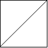
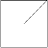
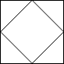

### 1. Description

An `n x n` grid is composed of `1 x 1` squares where each `1 x 1` square consists of a `'/'`, `'\'`, or blank space `' '`. These characters divide the square into contiguous regions.

Given the grid `grid` represented as a string array, return *the number of regions*.

Note that backslash characters are escaped, so a `'\'` is represented as `'\\'`.

### 2. Function Contract

**Inputs**

- `grid`: Input parameter (`List[str]`).

**Return value**

- Returns `int`.

### 3. Examples

#### Example 1

- **Input:** `grid = [" /","/ "]`
- **Output:** `2`

#### Example 2

- **Input:** `grid = [" /"," "]`
- **Output:** `1`

#### Example 3

- **Input:** `grid = ["/\\","\\/"]`
- **Output:** `5`
- **Explanation:** Recall that because \ characters are escaped, "\\/" refers to \/, and "/\\" refers to /\.

### 4. Constraints

- $n = \text{grid.length} = \text{grid}[i].length$

- $1 \le n \le 30$

- $\text{grid}[i][j]$ is either `'/'`, `'\'`, or `' '`.
