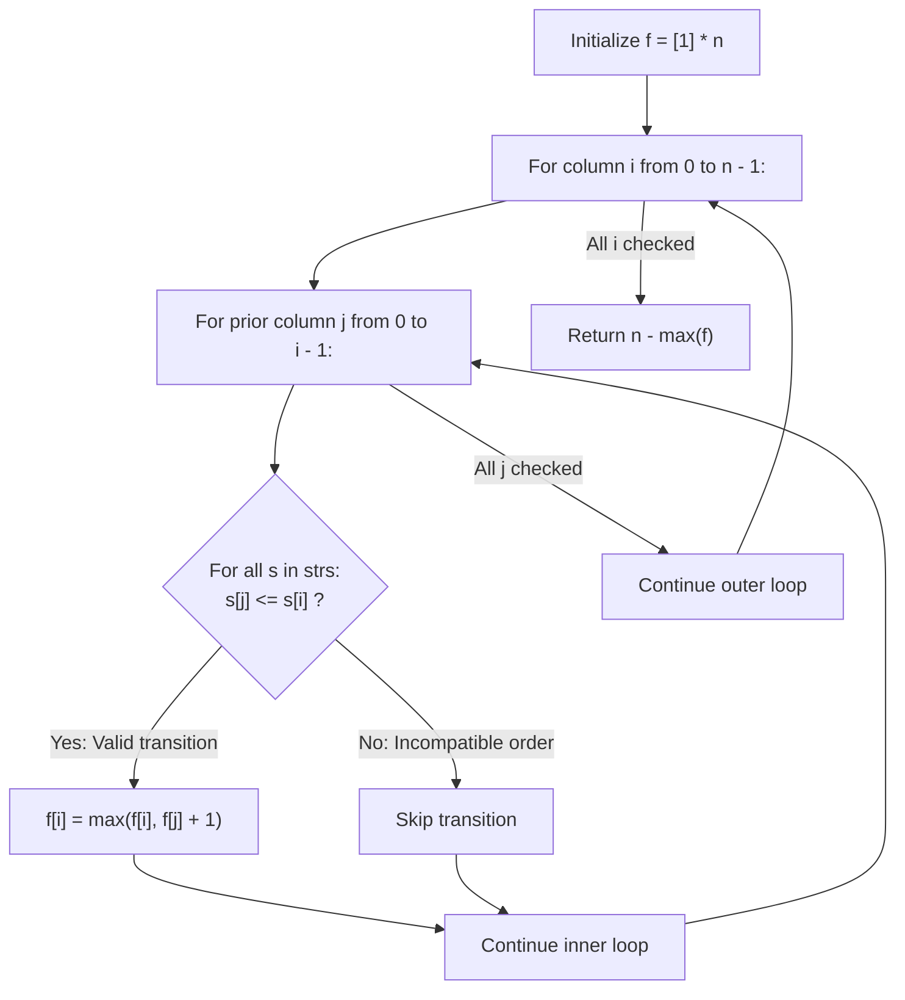

# Guided Example: Delete Columns to Make Sorted III

We trace the step-by-step dynamic programming evaluation of multi-row non-decreasing column subsequences, prove the Deletion-Subsequence Duality Theorem and Multi-Row Compatibility Invariant, and calculate optimal column deletion counts across representative string matrices:

- **Representative Instance 1 (Two Rows with Selective Subsequence Matching):**
  $$
  strs = [\text{"babca"}, \; \text{"bbazb"}] \quad (m = 2 \text{ rows}, \; n = 5 \text{ columns})
  $$
- **Required Output:** `3`
  - Columns index mapping:
    - Col 0: `('b', 'b')`
    - Col 1: `('a', 'b')`
    - Col 2: `('b', 'a')`
    - Col 3: `('c', 'z')`
    - Col 4: `('a', 'b')`
  - Pairwise column compatibility check $\forall s \in strs, \; s[j] \le s[i]$:
    - Col 0 to Col 3: $'b' \le 'c'$ (Row 0) and $'b' \le 'z'$ (Row 1) $\implies$ **Valid transition!**
      - Subsequence $[0, 3]$ has length $2$.
    - Col 1 to Col 3: $'a' \le 'c'$ and $'b' \le 'z' \implies$ **Valid transition!**
      - Subsequence $[1, 3]$ has length $2$.
    - Col 2 to Col 3: $'b' \le 'c'$ and $'a' \le 'z' \implies$ **Valid transition!**
      - Subsequence $[2, 3]$ has length $2$.
    - No 3-column subsequence is valid for both rows simultaneously.
  - Maximum kept columns: $\max(f) = 2$.
  - Minimum deletions: $n - \max(f) = 5 - 2 = \mathbf{3}$.

- **Representative Instance 2 (Strictly Descending Single Row):**
  $$
  strs = [\text{"edcba"}] \quad (n = 5)
  $$
  - No pair $j < i$ satisfies $s[j] \le s[i]$ because $e > d > c > b > a$.
  - Every column has $f[i] = 1$. Maximum kept columns: $1$.
  - Minimum deletions: $5 - 1 = \mathbf{4}$.

- **Representative Instance 3 (All Rows Sorted Initially):**
  $$
  strs = [\text{"ghi"}, \; \text{"def"}, \; \text{"abc"}] \quad (n = 3)
  $$
  - Every adjacent column pair is non-decreasing across all rows.
  - Retain all $3$ columns $\implies \text{deletions} = 3 - 3 = \mathbf{0}$.

---

## 1. Instance & Teaching Goal

You are given an array of $m$ strings `strs`, each of length $n$.
Delete the **minimum number of column indices** such that, after deletions, **every single remaining row** is sorted in non-decreasing alphabetical order:
$$
s[0] \le s[1] \le \dots \le s[k - 1], \quad \forall s \in strs
$$

```text
Row 0: b a b c a
Row 1: b b a z b
       ^     ^
       |     |
Keep Col 0 ('b','b') and Col 3 ('c','z'):
Row 0: "b" <= "c"  (Sorted!)
Row 1: "b" <= "z"  (Sorted!)

Kept Columns = 2  ==>  Deletions = 5 - 2 = 3!
```

Testing all $2^n$ column subsets is exponential ($\approx 1.1 \times 10^{30}$ for $n = 100$).

The decisive pedagogical goal is the **Multi-Row LIS Duality Invariant**:
1. **Duality:** Minimizing deleted columns is mathematically equivalent to **maximizing retained columns**:
   $$
   \min(\text{Deletions}) = n - \max(\text{Length of Valid Retained Subsequence})
   $$
2. **Multi-Row Compatibility Invariant:** Column $j$ can immediately precede column $i$ ($j < i$) in a retained sequence if and only if **every** string satisfies $s[j] \le s[i]$.
3. **Dynamic Programming Recurrence:**
   $$
   f[i] = 1 + \max_{\{j < i : \forall s, s[j] \le s[i]\}} f[j]
   $$
   This generalized Longest Non-Decreasing Subsequence over $m$ rows computes the exact global minimum in polynomial $\mathcal{O}(m \cdot n^2)$ time.

---

## 2. Conceptual Foundation & The Multi-Row Subsequence Invariant



### The Multi-Row LIS Theorem

Let $\mathcal{C} = (c_1, c_2, \dots, c_k)$ be a sequence of strictly increasing column indices: $0 \le c_1 < c_2 < \dots < c_k < n$.
1. **Validity Condition:**
   The columns $\mathcal{C}$ form a valid surviving configuration if and only if:
   $$
   s[c_p] \le s[c_{p+1}], \quad \forall 1 \le p < k, \quad \forall s \in strs
   $$
2. **Optimal Substructure:**
   If $\mathcal{C}$ is an optimal valid column sequence ending at index $c_k = i$, then $(c_1, \dots, c_{k-1})$ must be an optimal valid column sequence ending at $c_{k-1} = j$, where $j < i$ satisfies $s[j] \le s[i]$ across all $s \in strs$.
3. **Completeness of Recurrence:**
   Let $f[i]$ be the length of the longest valid column subsequence ending at column $i$.
   Since any non-empty subsequence has at least length $1$ (a single column), $f[i] \ge 1$.
   The recurrence $f[i] = \max(1, \max_{j < i, \text{valid}} (f[j] + 1))$ evaluates every compatible predecessor column, guaranteeing that $\max_{0 \le i < n} f[i]$ is the maximal number of columns that can be preserved. $\blacksquare$

---

## 3. Step-by-Step Worked Execution: Representative Instance 1

$strs = [\text{"babca"}, \text{"bbazb"}], \; m = 2, n = 5$.
Initialize: $f = [1, 1, 1, 1, 1]$.

### Column $i = 0$ (`'b', 'b'`)
- No prior columns $\implies f[0] = 1$.

---

### Column $i = 1$ (`'a', 'b'`)
- Prior $j = 0$: compare Col 0 (`'b', 'b'`) to Col 1 (`'a', 'b'`).
  - Row 0: $'b' \le 'a'$ is **False** ($'b' > 'a'$).
  - Incompatible.
- Result: $f[1] = 1$.

---

### Column $i = 2$ (`'b', 'a'`)
- Prior $j = 0$: Col 0 (`'b', 'b'`) vs Col 2 (`'b', 'a'`).
  - Row 1: $'b' \le 'a'$ is **False**.
- Prior $j = 1$: Col 1 (`'a', 'b'`) vs Col 2 (`'b', 'a'`).
  - Row 1: $'b' \le 'a'$ is **False**.
- Result: $f[2] = 1$.

---

### Column $i = 3$ (`'c', 'z'`)
- Prior $j = 0$ (`'b', 'b'`):
  - Row 0: $'b' \le 'c'$ (True).
  - Row 1: $'b' \le 'z'$ (True).
  - Compatible! $f[3] = \max(1, f[0] + 1) = \max(1, 1 + 1) = \mathbf{2}$.
- Prior $j = 1$ (`'a', 'b'`):
  - Row 0: $'a' \le 'c'$ (True); Row 1: $'b' \le 'z'$ (True).
  - Compatible! $f[3] = \max(2, f[1] + 1) = \max(2, 2) = \mathbf{2}$.
- Prior $j = 2$ (`'b', 'a'`):
  - Row 0: $'b' \le 'c'$ (True); Row 1: $'a' \le 'z'$ (True).
  - Compatible! $f[3] = \max(2, f[2] + 1) = \mathbf{2}$.
- Result: $f[3] = 2$.

---

### Column $i = 4$ (`'a', 'b'`)
- Prior $j = 0$: Row 0 has $'b' > 'a'$ (False).
- Prior $j = 1$: Row 0 has $'a' \le 'a'$, Row 1 has $'b' \le 'b'$ (True).
  - Compatible! $f[4] = \max(1, f[1] + 1) = \mathbf{2}$.
- Prior $j = 2$: Row 0 has $'b' > 'a'$ (False).
- Prior $j = 3$: Row 0 has $'c' > 'a'$ (False).
- Result: $f[4] = 2$.

---

### Final Table & Output
- DP array: $f = [1, 1, 1, 2, 2]$.
- Maximum kept columns: $\max(f) = 2$.
- Minimum deletions required:
  $$
  n - \max(f) = 5 - 2 = \mathbf{3}
  $$

---

## 4. Multi-Row Column DP Trace Table

| Col $i$ | Vector $(strs[0][i], strs[1][i])$ | Predecessor $j$ Tested | Compatibility Check $\forall s: s[j] \le s[i]$ | Valid? | DP Value $f[i]$ |
|:---:|:---:|:---:|:---|:---:|:---:|
| **$0$** | `('b', 'b')` | — | Base element | — | $1$ |
| **$1$** | `('a', 'b')` | $j = 0$ | Row 0: $'b' > 'a'$ | No | $1$ |
| **$2$** | `('b', 'a')` | $j = 0, 1$ | Row 1: $'b' > 'a'$ | No | $1$ |
| **$3$** | `('c', 'z')` | $j = 0$<br>$j = 1$<br>$j = 2$ | $'b' \le 'c' \land 'b' \le 'z'$<br>$'a' \le 'c' \land 'b' \le 'z'$<br>$'b' \le 'c' \land 'a' \le 'z'$ | **Yes**<br>**Yes**<br>**Yes** | $\mathbf{2}$ |
| **$4$** | `('a', 'b')` | $j = 1$ | $'a' \le 'a' \land 'b' \le 'b'$ | **Yes** | $\mathbf{2}$ |

---

## 5. Algorithmic Correctness

### Soundness & Completeness
1. **Soundness:**
   A transition $f[j] \to f[i]$ is accepted only if $s[j] \le s[i]$ holds for all strings $s \in strs$. Thus, any subsequence reconstructed by following optimal predecessors is guaranteed to be non-decreasing across all rows.
2. **Completeness:**
   The nested loops evaluate all pairs $0 \le j < i < n$. By induction, $f[i]$ contains the maximum length of any valid column subsequence ending at $i$. Taking the maximum over all $i$ exhausts all valid ending positions, proving that $n - \max(f)$ is the exact global minimum deletions.

---

## 6. Boundary Cases & Traps

| Scenario | Input Pattern | Behavior | Trapped Risk |
|---|---|---|---|
| Single Column | `strs = ["a"]` | $n = 1 \implies f = [1] \implies 1 - 1 = 0$. | Array bounds or negative answer. |
| Single Row | `strs = ["edcba"]` | Reduces to standard 1D LIS; returns $5 - 1 = 4$. | Over-generalizing to empty set. |
| All Characters Equal | `strs = ["aaaa", "aaaa"]` | Every $s[j] \le s[i]$ is true; $f[i] = i + 1 \implies 0$ deletions. | Strict vs non-strict inequality ($<$ vs $\le$). |
| Conflicting Rows | `["ab", "ba"]` | Row 0 wants col 0 before 1; Row 1 wants col 1 before 0; returns $1$. | Assuming mutual compatibility. |

---

## 7. Complexity Derivation

- **Time Complexity:** $\mathcal{O}(m \cdot n^2)$, where $m = \text{len}(strs)$ and $n = \text{len}(strs[0])$.
  - There are $\binom{n}{2} \approx \frac{n^2}{2}$ column pairs $(j, i)$.
  - For each pair, checking compatibility takes $\mathcal{O}(m)$ character comparisons across all strings.
  - Total operations: at most $m \cdot \frac{n^2}{2}$. For $m = 100, n = 100$, operations $\approx 5 \times 10^5$, executing in $< 0.04\text{ s}$.
- **Auxiliary Space Complexity:** $\mathcal{O}(n)$ to store the 1D dynamic programming table $f$ of length $n$.