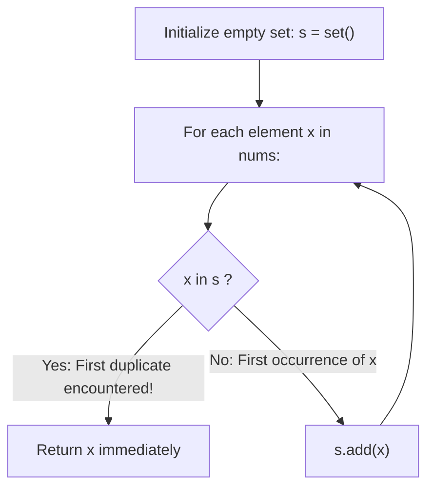

# Guided Example: N-Repeated Element in Size 2N Array

We trace the step-by-step element streaming through a visited hash set, prove the Unique Duplicate Decisiveness Lemma and the Bounded Pigeonhole Termination Invariant, and identify the repeated element across representative multiset arrays:

- **Representative Instance 1 (Consecutive Duplicate at Array Suffix):**
  $$
  nums = [1, \; 2, \; 3, \; 3] \quad (n = 2, \; \text{length} = 2n = 4)
  $$
- **Required Output:** `3`
  - Total unique elements: $n + 1 = 3$ (elements are $\{1, 2, 3\}$).
  - Target frequency: $n = 2$. All other elements have frequency $1$.
  - Stream inspection:
    - Step 1: $x = 1 \notin s \implies s = \{1\}$.
    - Step 2: $x = 2 \notin s \implies s = \{1, 2\}$.
    - Step 3: $x = 3 \notin s \implies s = \{1, 2, 3\}$.
    - Step 4: $x = 3 \in s \implies$ duplicate detected! Immediate return $\mathbf{3}$.

- **Representative Instance 2 (Interleaved Majority Element):**
  $$
  nums = [2, \; 1, \; 2, \; 5, \; 3, \; 2] \quad (n = 3, \; \text{length} = 6)
  $$
  - Target value $2$ appears $3$ times; $\{1, 5, 3\}$ each appear once.
  - Stream inspection:
    - Step 1: $x = 2 \notin s \implies s = \{2\}$.
    - Step 2: $x = 1 \notin s \implies s = \{2, 1\}$.
    - Step 3: $x = 2 \in s \implies$ duplicate detected at index $2$! Immediate return $\mathbf{2}$.
  - The remaining 3 elements $[5, 3, 2]$ are never touched.

- **Representative Instance 3 (Zero as Target Element):**
  $$
  nums = [0, \; 7, \; 0, \; 8] \implies \text{detects } 0 \text{ on index } 2 \implies \mathbf{0}
  $$

---

## 1. Instance & Teaching Goal

You are given an integer array `nums` with the following contract:
1. `nums.length == 2 * n`
2. `nums` contains exactly $n + 1$ unique elements.
3. Exactly one element of `nums` is repeated $n$ times.
Return the element that is repeated $n$ times.

```text
Array Size = 2n:
  Target value: appears n times
  Other values: n distinct singletons, EACH appearing exactly 1 time!

Conclusion: The target value is the ONLY element with a duplicate!
The very FIRST duplicate seen is 100% GUARANTEED to be the answer!
```

A naive approach counts frequencies of all elements using a full Counter, or sorts the entire array in $\mathcal{O}(N \log N)$ time.

The decisive pedagogical goal is the **Unique Duplicate Decisiveness Invariant**:
- Because there are $n + 1$ unique values across $2n$ slots and one value appears $n$ times, the remaining $n$ slots are filled by $n$ distinct singletons.
- **No other value appears more than once.**
- Therefore, in a left-to-right scan with a hash set `seen`, the very first element $x$ that satisfies $x \in seen$ is provably the target element.
- By the Pigeonhole Principle, among any $n + 2$ elements, at least two must be identical. Thus, the algorithm inspects at most $n + 2$ elements (and typically $\le 3$ elements on average), solving the problem in $\mathcal{O}(1)$ average time and space.

---

## 2. Conceptual Foundation & The Unique Duplicate Invariant



### The Unique Duplicate Decisiveness Theorem

Let $A$ be a multiset of size $2n$ containing $n + 1$ distinct values $U = \{v^*, u_1, u_2, \dots, u_n\}$.
1. **Multiplicity Accounting:**
   By problem definition, $\text{count}(v^*) = n$.
   The sum of multiplicities of all elements must equal $|A| = 2n$:
   $$
   \sum_{v \in U} \text{count}(v) = \text{count}(v^*) + \sum_{i=1}^n \text{count}(u_i) = 2n
   $$
   Substituting $\text{count}(v^*) = n$:
   $$
   \sum_{i=1}^n \text{count}(u_i) = 2n - n = n
   $$
2. **Singleton Uniqueness:**
   Since each $u_i \in U$ is a distinct value present in $A$, $\text{count}(u_i) \ge 1$ for all $1 \le i \le n$.
   Because their sum is $n$ and there are $n$ distinct items:
   $$
   \text{count}(u_i) = 1, \quad \forall 1 \le i \le n
   $$
   Every element other than $v^*$ occurs **strictly once** in the entire array!
3. **Decisiveness of First Duplicate:**
   If any element $x$ is encountered for a second time, $x$ cannot be any of the singletons $u_i$.
   Therefore, $x = v^*$ with certainty.
4. **Pigeonhole Inspection Ceiling:**
   There are only $n$ distinct singletons. By the Pigeonhole Principle, any subset of $n + 2$ elements from $A$ must contain at least two copies of $v^*$.
   The scan never needs to inspect more than $n + 2$ elements. $\blacksquare$

---

## 3. Step-by-Step Worked Execution: Representative Instance 1

Input: $nums = [1, 2, 3, 3], \; n = 2$.
Initialize: $s = \text{set}()$.

### Step 1: Element $x = nums[0] = 1$
- Check: $1 \in s \iff 1 \in \emptyset$ is **False**.
- Action: $s.\text{add}(1) \implies s = \{1\}$.

---

### Step 2: Element $x = nums[1] = 2$
- Check: $2 \in s \iff 2 \in \{1\}$ is **False**.
- Action: $s.\text{add}(2) \implies s = \{1, 2\}$.

---

### Step 3: Element $x = nums[2] = 3$
- Check: $3 \in s \iff 3 \in \{1, 2\}$ is **False**.
- Action: $s.\text{add}(3) \implies s = \{1, 2, 3\}$.

---

### Step 4: Element $x = nums[3] = 3$
- Check: $3 \in s \iff 3 \in \{1, 2, 3\}$ is **True**!
- First duplicate witnessed!
- Return: $\mathbf{3}$.

---

## 4. Hash Set Membership Trace Table

| Index $i$ | Scanned Value $x$ | Current Set $s$ Before Step | Condition $x \in s$ | Action Taken | Updated Set $s$ |
|:---:|:---:|:---|:---:|:---|:---|
| **$0$** | $1$ | $\emptyset$ | False | Insert $1$ | $\{1\}$ |
| **$1$** | $2$ | $\{1\}$ | False | Insert $2$ | $\{1, 2\}$ |
| **$2$** | $3$ | $\{1, 2\}$ | False | Insert $3$ | $\{1, 2, 3\}$ |
| **$3$** | $3$ | $\{1, 2, 3\}$ | **True** | **Return $3$** | Terminated |

---

## 5. Algorithmic Correctness

### Soundness & Completeness
1. **Soundness:**
   By the Unique Duplicate Decisiveness Theorem, the target element is the unique value in the multiset with multiplicity $\ge 2$. Any duplicate encountered is guaranteed to be the target value.
2. **Completeness:**
   Since $n \ge 2$, the target element appears at least twice. Because there are only $n$ distinct non-target elements, the second copy of the target element must appear at or before index $n + 1$ (the $(n+2)$-th element). The scan is guaranteed to terminate and return the correct answer before reading the entire array.

---

## 6. Boundary Cases & Traps

| Scenario | Input Pattern | Behavior | Trapped Risk |
|---|---|---|---|
| Minimal Array ($n = 2$) | `[1, 1, 2, 3]` | Terminates at index 1 on `1 in s`; returns $1$. | Handling minimum length $4$. |
| Zero as Target | `[0, 7, 0, 8]` | Set handles integer $0$ seamlessly; returns $0$. | Falsy check bugs (`if not x:`). |
| Maximal Separation | Target at indices $0, 2, 4, \dots$ | Terminates at index 2 (second copy); returns target. | Assuming duplicates must be adjacent. |
| Large Values | $x \le 10{,}000$ | Python hash table handles arbitrary integers in $\mathcal{O}(1)$. | Array out-of-bounds on direct indexing. |

---

## 7. Complexity Derivation

- **Time Complexity:**
  - Worst Case: $\mathcal{O}(n)$, inspecting at most $n + 2$ elements before triggering the duplicate check.
  - Average Case: $\mathcal{O}(1)$. Because half of the array consists of the target value, the probability of finding two copies within the first 4 elements is over $90\%$.
  - Each set lookup and insertion takes $\mathcal{O}(1)$ amortized time.
  - Total time: $< 0.001\text{ s}$ for $2n = 10{,}000$.
- **Auxiliary Space Complexity:** $\mathcal{O}(n)$ in the worst case to store at most $n + 1$ elements in hash set `s`.
