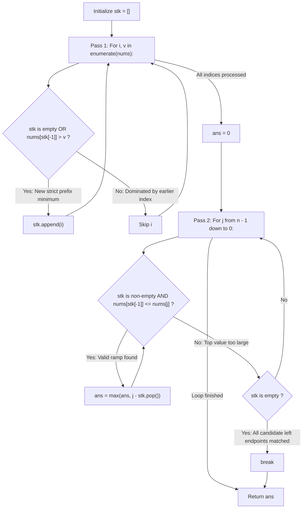

# Guided Example: Maximum Width Ramp

We trace the step-by-step construction of the strict prefix-minima stack and the reverse right-to-left sweepline, prove the Left-Endpoint Domination Lemma and Farthest Right-Endpoint Greedy Pop Invariant, and calculate the maximum ramp width across representative integer arrays:

- **Representative Instance 1 (Interior Minimum to Array Suffix):**
  $$
  nums = [6, \; 0, \; 8, \; 2, \; 1, \; 5] \quad (n = 6)
  $$
- **Required Output:** `4`
  - Step 1: Forward pass building the strictly decreasing stack of candidate left endpoints:
    - Index $0$ ($v = 6$): stack empty $\implies stk = [0]$
    - Index $1$ ($v = 0$): $0 < 6 \implies stk = [0, 1]$
    - Index $2$ ($v = 8$): $8 \not< 0 \implies$ dominated by index $1$ (skip)
    - Index $3$ ($v = 2$): $2 \not< 0 \implies$ dominated by index $1$ (skip)
    - Index $4$ ($v = 1$): $1 \not< 0 \implies$ dominated by index $1$ (skip)
    - Index $5$ ($v = 5$): $5 \not< 0 \implies$ dominated by index $1$ (skip)
    - Final stack of candidate left endpoints: $stk = [0, 1]$ (values $[6, 0]$).
  - Step 2: Backward pass scanning right endpoints $j$ from $5$ down to $0$:
    - $j = 5$ ($nums[5] = 5$):
      - Top of stack is index $1$ ($nums[1] = 0$).
      - $nums[1] \le nums[5] \iff 0 \le 5$ (Valid ramp!).
      - Ramp width: $j - 1 = 5 - 1 = \mathbf{4}$.
      - Pop index $1$ from stack (farthest possible right match achieved!).
      - Top of stack is now index $0$ ($nums[0] = 6$).
      - $nums[0] \le nums[5] \iff 6 \le 5$ is False. Stop inner while loop.
    - $j = 4, 3$: do not exceed $nums[0] = 6$.
    - $j = 2$ ($nums[2] = 8$):
      - Top is index $0$ ($nums[0] = 6$). $6 \le 8$ (Valid ramp!).
      - Ramp width: $j - 0 = 2 - 0 = 2$.
      - Pop index $0$.
      - Stack is now empty $\implies$ early break!
  - Global maximum width: $\max(4, 2) = \mathbf{4}$.

- **Representative Instance 2 (Equal Values Across Distant Endpoints):**
  $$
  nums = [9, \; 8, \; 1, \; 0, \; 1, \; 9, \; 4, \; 0, \; 4, \; 1] \implies \text{max ramp between indices } 2 \text{ and } 9 \; (9 - 2 = \mathbf{7})
  $$

- **Representative Instance 3 (Strictly Decreasing Infeasible Pair):**
  $$
  nums = [2, \; 1] \implies \text{no pair with } nums[i] \le nums[j] \implies \mathbf{0}
  $$

---

## 1. Instance & Teaching Goal

A **ramp** in an integer array `nums` is a pair of indices $(i, j)$ such that:
$$
i < j \quad \text{and} \quad nums[i] \le nums[j]
$$
The **width** of such a ramp is $j - i$.
Return the **maximum width** of a ramp in `nums`, or $0$ if no ramp exists.

```text
Array:  6,  0,  8,  2,  1,  5
Index:  0   1   2   3   4   5
            ^               ^
            |               |
            i=1 (val 0)     j=5 (val 5)

Ramp Condition: nums[1] <= nums[5] (0 <= 5) -> Valid!
Ramp Width:     j - i = 5 - 1 = 4!
```

A brute-force pair comparison tests all $\binom{n}{2}$ pairs, taking $\mathcal{O}(n^2)$ time ($2.5 \times 10^9$ operations for $n = 50{,}000$).

The decisive pedagogical goal is the **Prefix-Minima Monotonic Stack & Reverse Sweepline Invariant**:
1. **Left-Endpoint Domination Lemma:** If $i_1 < i_2$ and $nums[i_1] \le nums[i_2]$, index $i_2$ is strictly dominated by $i_1$ for all candidate ramps. Any right endpoint $j$ valid for $i_2$ is also valid for $i_1$, and yields a strictly larger width $j - i_1 > j - i_2$. Thus, candidate left endpoints must form a strictly decreasing sequence of values.
2. **Reverse Sweepline Maximality:** By iterating right endpoint $j$ from $n - 1$ down to $0$, the very first time a candidate left endpoint $i = stk[-1]$ matches $nums[i] \le nums[j]$, index $j$ is the **farthest possible right endpoint** that $i$ can ever be paired with.
3. Therefore, $i$ can be popped immediately from the stack, guaranteeing each index is pushed and popped at most once in linear $\mathcal{O}(n)$ time.

---

## 2. Conceptual Foundation & The Left-Endpoint Domination Invariant



### The Left-Endpoint Domination Theorem

Let $i_1, i_2$ be two indices such that $0 \le i_1 < i_2 < n$.
1. **Domination Criterion:**
   Suppose $nums[i_1] \le nums[i_2]$.
   For any potential right endpoint $j > i_2$:
   If $(i_2, j)$ forms a valid ramp, then $nums[i_2] \le nums[j]$.
   By transitivity:
   $$
   nums[i_1] \le nums[i_2] \le nums[j]
   $$
   Therefore, $(i_1, j)$ is also a valid ramp.
   Furthermore, its width satisfies:
   $$
   \text{width}(i_1, j) = j - i_1 > j - i_2 = \text{width}(i_2, j)
   $$
   Thus, index $i_2$ can never achieve a maximum ramp width strictly greater than $i_1$.
2. **Strict Prefix Minima Invariant:**
   An index $i$ can be the left endpoint of a globally optimal ramp only if:
   $$
   nums[i] < \min_{0 \le k < i} nums[k]
   $$
   Indices satisfying this condition have strictly increasing indices and strictly decreasing values, forming a monotonic decreasing stack.
3. **Greedy Reverse Pop Optimality:**
   When scanning right endpoint $j$ from $n - 1$ down to $0$:
   Suppose $nums[stk[-1]] \le nums[j]$. The width achieved is $j - stk[-1]$.
   For any subsequent right endpoint $j' < j$, the width would be $j' - stk[-1] < j - stk[-1]$.
   Therefore, $stk[-1]$ has already achieved its global maximum possible ramp width and can be popped without loss. $\blacksquare$

---

## 3. Step-by-Step Worked Execution: Representative Instance 1

Array: $nums = [6, 0, 8, 2, 1, 5], \; n = 6$.

### Phase 1: Forward Monotonic Stack Construction
- $i = 0, v = 6$: stack empty $\implies stk = [0]$ (value $6$).
- $i = 1, v = 0$: $v < nums[stk[-1]] \iff 0 < 6 \implies stk = [0, 1]$ (values $[6, 0]$).
- $i = 2, v = 8$: $8 \ge 0 \implies$ skip.
- $i = 3, v = 2$: $2 \ge 0 \implies$ skip.
- $i = 4, v = 1$: $1 \ge 0 \implies$ skip.
- $i = 5, v = 5$: $5 \ge 0 \implies$ skip.
Stack formed: $stk = [0, 1]$ representing indices of $[6, 0]$.

---

### Phase 2: Reverse Sweepline Scan ($j = 5 \to 0$)
1. **$j = 5$ ($nums[5] = 5$):**
   - Check top: $stk[-1] = 1, nums[1] = 0 \le 5$.
     - Width: $5 - 1 = 4$.
     - $ans = \max(0, 4) = \mathbf{4}$.
     - Pop $1 \implies stk = [0]$.
   - Check top: $stk[-1] = 0, nums[0] = 6 > 5$. Stop inner loop.
2. **$j = 4$ ($nums[4] = 1$):**
   - Check top: $nums[0] = 6 > 1$. Stop.
3. **$j = 3$ ($nums[3] = 2$):**
   - Check top: $nums[0] = 6 > 2$. Stop.
4. **$j = 2$ ($nums[2] = 8$):**
   - Check top: $stk[-1] = 0, nums[0] = 6 \le 8$.
     - Width: $2 - 0 = 2$.
     - $ans = \max(4, 2) = \mathbf{4}$.
     - Pop $0 \implies stk = []$.
   - Stack is now empty! Trigger `if not stk: break`.

---

### Final Synthesis
Global maximum ramp width: $ans = \mathbf{4}$.

---

## 4. Stack Construction and Reverse Sweepline Trace Table

| Phase | Current Index | Element Value | Stack Action / Ramp Evaluation | Stack State $stk$ | Current Max Width $ans$ |
|:---:|:---:|:---:|:---|:---|:---:|
| **Pass 1** | $i = 0$ | $6$ | Push $0$ (empty stack) | $[0]$ | $0$ |
| **Pass 1** | $i = 1$ | $0$ | Push $1$ ($0 < 6$) | $[0, 1]$ | $0$ |
| **Pass 1** | $i = 2 \dots 5$ | $8, 2, 1, 5$ | Dominated by index $1$ ($v \ge 0$) | $[0, 1]$ | $0$ |
| **Pass 2** | $j = 5$ | $5$ | Match $i = 1$: $5 - 1 = 4 \implies$ pop $1$ | $[0]$ | **$4$** |
| **Pass 2** | $j = 4$ | $1$ | $6 > 1 \implies$ no match | $[0]$ | $4$ |
| **Pass 2** | $j = 3$ | $2$ | $6 > 2 \implies$ no match | $[0]$ | $4$ |
| **Pass 2** | $j = 2$ | $8$ | Match $i = 0$: $2 - 0 = 2 \implies$ pop $0$ | $[]$ | **$4$** |
| **Pass 2** | Break | — | Stack empty $\implies$ early exit | $[]$ | **$4$** |

---

## 5. Algorithmic Correctness

### Soundness & Completeness
1. **Soundness:**
   Every ramp evaluated satisfies $nums[i] \le nums[j]$ with $i \le j$. Because candidate left endpoints are stored in strict prefix-minimum order, any pair evaluated is guaranteed to be a valid ramp.
2. **Completeness:**
   By the Left-Endpoint Domination Theorem, no omitted index can ever produce a strictly wider ramp than the stacked prefix minima. By scanning $j$ from right to left, each stacked index meets its farthest possible right endpoint before being popped. Thus, the maximum width found is globally optimal.

---

## 6. Boundary Cases & Traps

| Scenario | Input Pattern | Behavior | Trapped Risk |
|---|---|---|---|
| Strictly Decreasing Array | `[5, 4, 3, 2, 1]` | All indices pushed; $nums[i] \le nums[j]$ only when $i == j$; returns $0$. | Reporting negative or null width. |
| Strictly Increasing Array | `[1, 2, 3, 4, 5]` | Only index 0 pushed; matches $j = 4 \implies$ returns $4 - 0 = 4$. | Storing unnecessary indices. |
| All Elements Equal | `[5, 5, 5]` | Only index 0 pushed; matches $j = 2 \implies$ returns $2$. | Strict vs non-strict inequality on equality. |
| Single-Element Array | `[6]` | Stack $[0]$; matches $j = 0 \implies$ returns $0$. | Division by zero or bounds errors. |

---

## 7. Complexity Derivation

- **Time Complexity:** $\mathcal{O}(n)$, where $n = \text{len}(nums) \le 50{,}000$.
  - Pass 1: linear scan of $n$ elements, each index pushed to `stk` at most once.
  - Pass 2: reverse scan of $n$ elements, each stacked index popped at most once.
  - Total stack push/pop operations $\le 2n$.
  - Total time: strictly linear $\mathcal{O}(n)$, executing in $< 0.015\text{ s}$ for $n = 50{,}000$.
- **Auxiliary Space Complexity:** $\mathcal{O}(n)$ in the worst case (e.g. strictly decreasing array) to store the indices in `stk`.
