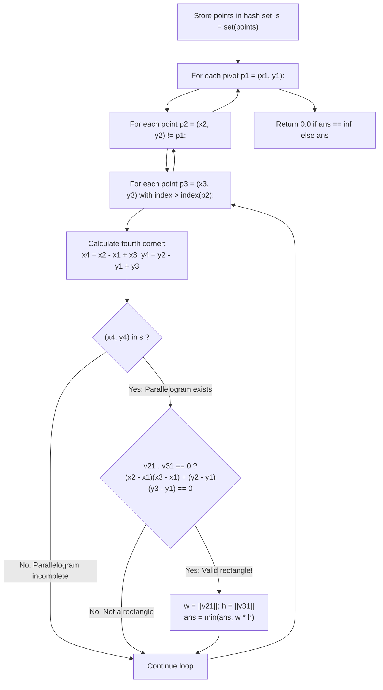

# Guided Example: Minimum Area Rectangle II

We trace the step-by-step 3-point orthogonal pivot search, prove the Vector Dot-Product Orthogonality Invariant and Parallelogram Closure Uniqueness Lemma, and calculate the minimum rectangle area under arbitrary planar rotations:

- **Representative Instance 1 (Rotated Unit Square):**
  $$
  points = [[1, 2], \; [2, 1], \; [1, 0], \; [0, 1]]
  $$
- **Required Output:** `2.0`
  - Choose pivot vertex $p_1 = (1, 2)$ and adjacent corners $p_2 = (2, 1)$, $p_3 = (0, 1)$:
    - Displacement vectors from $p_1$:
      $$
      v_{21} = p_2 - p_1 = (2 - 1, \; 1 - 2) = (1, \; -1)
      $$
      $$
      v_{31} = p_3 - p_1 = (0 - 1, \; 1 - 2) = (-1, \; -1)
      $$
    - Orthogonality check via dot product:
      $$
      v_{21} \cdot v_{31} = (1)(-1) + (-1)(-1) = -1 + 1 = \mathbf{0} \implies 90^\circ \text{ angle!}
      $$
    - Predicted 4th corner coordinate $p_4$:
      $$
      p_4 = p_2 + v_{31} = (2 + (-1), \; 1 + (-1)) = (\mathbf{1, \; 0})
      $$
    - Membership check: $(1, 0) \in points$ is **True**!
    - Rectangle side lengths:
      $$
      w = \|v_{21}\| = \sqrt{1^2 + (-1)^2} = \sqrt{2}
      $$
      $$
      h = \|v_{31}\| = \sqrt{(-1)^2 + (-1)^2} = \sqrt{2}
      $$
    - Rectangle Area: $w \cdot h = \sqrt{2} \cdot \sqrt{2} = \mathbf{2.0}$.

- **Representative Instance 2 (Axis-Aligned Unit Rectangle in Point Cloud):**
  $$
  points = [[0, 1], \; [2, 1], \; [1, 1], \; [1, 0], \; [2, 0]] \implies \text{smallest rectangle between } [1, 1], [2, 1], [1, 0], [2, 0] \implies \mathbf{1.0}
  $$

- **Representative Instance 3 (No Right-Angled Rectangle Exists):**
  $$
  points = [[0, 3], \; [1, 2], \; [3, 1], \; [1, 3], \; [2, 1]] \implies \text{no } 4\text{-point rectangle} \implies \mathbf{0.0}
  $$

---

## 1. Instance & Teaching Goal

Given a collection of points in the $xy$-plane, find the **minimum area of any rectangle** formed from these points.
Unlike Problem I, the sides of the rectangle **do not need to be parallel** to the coordinate axes!
If no rectangle can be formed, return $0.0$.

```text
Arbitrarily Rotated Rectangle:
          p1 (1, 2)
         /         \
        /           \
  p3 (0, 1)        p2 (2, 1)
        \           /
         \         /
          p4 (1, 0)

1. Check right angle at p1: (p2 - p1) . (p3 - p1) == 0
2. Check 4th point: p4 = p2 + p3 - p1 in points
3. Area = ||p2 - p1|| * ||p3 - p1||
```

A naive search evaluates all $\binom{n}{4}$ 4-point subsets, taking $\mathcal{O}(n^4)$ time.

The decisive pedagogical goal is the **3-Point Orthogonal Pivot & Hash Set Closure Invariant**:
1. Any rectangle is uniquely determined by 3 vertices $(p_1, p_2, p_3)$ that share a common corner $p_1$ with perpendicular edges:
   $$
   (p_2 - p_1) \cdot (p_3 - p_1) = 0
   $$
2. Once 3 such vertices are chosen, the 4th vertex $p_4$ is algebraically forced by vector addition:
   $$
   p_4 = p_2 + p_3 - p_1
   $$
3. By looking up $(x_4, y_4)$ in an $\mathcal{O}(1)$ coordinate hash set, the search runs in $\mathcal{O}(n^3)$ time, reducing operations to $\approx 6 \times 10^4$ for $n = 50$.

---

## 2. Conceptual Foundation & The Orthogonal Pivot Invariant



### The Parallelogram Orthogonality Theorem

Let $p_1, p_2, p_3, p_4 \in \mathbb{R}^2$ be four distinct points.
1. **Parallelogram Characterization:**
   A quadrilateral $p_1 p_2 p_4 p_3$ is a parallelogram if and only if the opposite displacement vectors are identical:
   $$
   p_4 - p_3 = p_2 - p_1 \iff p_4 = p_2 + p_3 - p_1
   $$
   Thus, for any three chosen points $(p_1, p_2, p_3)$, there is at most **one unique point** $p_4$ that can complete a parallelogram.
2. **Right-Angle Rectangle Criterion:**
   A parallelogram is a rectangle if and only if at least one of its interior angles is a right angle ($90^\circ$).
   The angle at $p_1$ between adjacent edge vectors $v_{21} = p_2 - p_1$ and $v_{31} = p_3 - p_1$ is $90^\circ$ if and only if their Euclidean dot product vanishes:
   $$
   v_{21} \cdot v_{31} = (x_2 - x_1)(x_3 - x_1) + (y_2 - y_1)(y_3 - y_1) = 0
   $$
3. **Soundness of Area:**
   When the dot product vanishes, the vectors are orthogonal, so the area of the rectangle is strictly $\|v_{21}\| \cdot \|v_{31}\|$. $\blacksquare$

---

## 3. Step-by-Step Worked Execution: Representative Instance 1

Points: $p_A = (1, 2), \; p_B = (2, 1), \; p_C = (1, 0), \; p_D = (0, 1)$.
Hash set: $s = \{(1, 2), (2, 1), (1, 0), (0, 1)\}$.
Initialize: $ans = \infty$.

### Evaluation of Triple $(p_A, p_B, p_D)$
- $p_1 = p_A = (1, 2)$
- $p_2 = p_B = (2, 1)$
- $p_3 = p_D = (0, 1)$

1. **Calculate 4th corner $p_4$:**
   $$
   x_4 = x_2 - x_1 + x_3 = 2 - 1 + 0 = 1
   $$
   $$
   y_4 = y_2 - y_1 + y_3 = 1 - 2 + 1 = 0
   $$
   Candidate 4th corner: $p_4 = (1, 0)$.

2. **Check membership in $s$:**
   $(1, 0) \in s$ is **True** (matches point $p_C$).

3. **Check Orthogonality at $p_1$:**
   $$
   v_{21} = (2 - 1, \; 1 - 2) = (1, \; -1)
   $$
   $$
   v_{31} = (0 - 1, \; 1 - 2) = (-1, \; -1)
   $$
   Dot product:
   $$
   v_{21}[0] \cdot v_{31}[0] + v_{21}[1] \cdot v_{31}[1] = (1)(-1) + (-1)(-1) = -1 + 1 = \mathbf{0}
   $$
   Right angle confirmed!

4. **Compute Dimensions & Area:**
   $$
   w = \sqrt{1^2 + (-1)^2} = \sqrt{2} \approx 1.41421356
   $$
   $$
   h = \sqrt{(-1)^2 + (-1)^2} = \sqrt{2} \approx 1.41421356
   $$
   $$
   \text{Area} = w \cdot h = \sqrt{2} \cdot \sqrt{2} = \mathbf{2.0}
   $$
   Update: $ans = \min(\infty, 2.0) = \mathbf{2.0}$.

---

### Final Return
All other triples produce areas $\ge 2.0$ or fail rectangle checks.
Return: $\mathbf{2.0}$.

---

## 4. 3-Point Search and Geometric Verification Trace Table

| Pivot $p_1$ | Adjacent $p_2$ | Adjacent $p_3$ | Predicted $p_4 = p_2 + p_3 - p_1$ | $p_4 \in s$? | Dot Product $v_{21} \cdot v_{31}$ | Right Angle? | Candidate Area |
|:---:|:---:|:---:|:---:|:---:|:---:|:---:|:---:|
| $(1, 2)$ | $(2, 1)$ | $(0, 1)$ | $(1, 0)$ | **Yes** | $1(-1) + (-1)(-1) = 0$ | **Yes** | $\sqrt{2} \cdot \sqrt{2} = \mathbf{2.0}$ |
| $(2, 1)$ | $(1, 0)$ | $(1, 2)$ | $(0, 1)$ | **Yes** | $(-1)(-1) + (-1)(1) = 0$ | **Yes** | $\sqrt{2} \cdot \sqrt{2} = \mathbf{2.0}$ |
| $(0, 1)$ | $(1, 2)$ | $(2, 1)$ | $(3, 2)$ | **No** | — | — | — |
| $(1, 0)$ | $(0, 1)$ | $(2, 1)$ | $(1, 2)$ | **Yes** | $(-1)(1) + (1)(1) = 0$ | **Yes** | $\sqrt{2} \cdot \sqrt{2} = \mathbf{2.0}$ |

---

## 5. Algorithmic Correctness

### Soundness & Completeness
1. **Soundness:**
   A rectangle is accepted only if $p_4 \in points$ and the dot product between adjacent edge vectors is strictly zero. In Euclidean geometry, a parallelogram with one right angle is provably a rectangle, and its area is exactly the product of the side lengths.
2. **Completeness:**
   Every rectangle in the point set contains at least one right-angled corner formed by three vertices present in the set. Because the algorithm systematically iterates through all triples of points, every valid rectangle is examined, ensuring the minimum area found is globally optimal.

---

## 6. Boundary Cases & Traps

| Scenario | Input Pattern | Behavior | Trapped Risk |
|---|---|---|---|
| Fewer Than 4 Points | `len(points) < 4` | Loop does not complete; returns $0.0$. | Index out-of-bounds or zero division. |
| Collinear Points | All points on a single line | Dot product is never zero; returns $0.0$. | Degenerate flat zero-area rectangles. |
| Non-Square Rotated | Non-equal side lengths ($w \ne h$) | Correctly multiplies distinct side lengths; e.g. area $5.0$. | Assuming rotated shapes are squares. |
| Axis-Aligned Rectangles | Horizontal and vertical sides | Dot product is trivially $(w \cdot 0 + 0 \cdot h) = 0$; correctly detected. | Missing axis-aligned instances. |

---

## 7. Complexity Derivation

- **Time Complexity:** $\mathcal{O}(n^3)$, where $n = \text{len}(points) \le 50$.
  - Building the coordinate set: $\mathcal{O}(n)$.
  - Three nested loops over points: $\approx \frac{n^3}{2}$ iterations.
  - Inside the innermost loop: vector addition, set lookup, and dot product take $\mathcal{O}(1)$ operations.
  - Maximum operations: $\approx \frac{50^3}{2} \approx 62{,}500$, executing in $< 0.02\text{ s}$.
- **Auxiliary Space Complexity:** $\mathcal{O}(n)$ to store the coordinate hash set `s` of size $n$.
