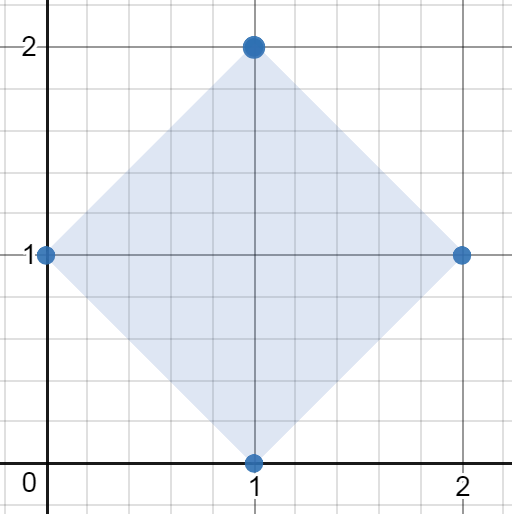
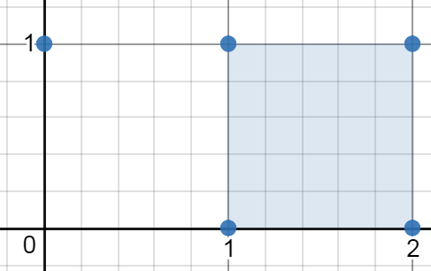
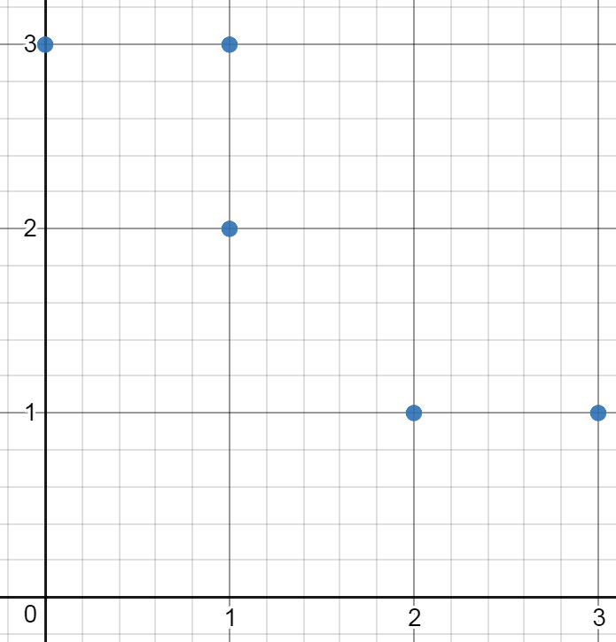

### 1. Description

You are given an array of points in the **X-Y** plane `points` where $\text{points}[i] = [x_{i}, y_{i}]$.

Return *the minimum area of any rectangle formed from these points, with sides **not necessarily parallel** to the X and Y axes*. If there is not any such rectangle, return `0`.

Answers within $10^{-5}$ of the actual answer will be accepted.

### 2. Function Contract

**Inputs**

- `points`: Input parameter (`List[List[int]]`).

**Return value**

- Returns `float`.

### 3. Examples

#### Example 1

- **Input:** $points = [[1,2],[2,1],[1,0],[0,1]]$
- **Output:** `2.00000`
- **Explanation:** The minimum area rectangle occurs at [1,2],[2,1],[1,0],[0,1], with an area of 2.

#### Example 2

- **Input:** $points = [[0,1],[2,1],[1,1],[1,0],[2,0]]$
- **Output:** `1.00000`
- **Explanation:** The minimum area rectangle occurs at [1,0],[1,1],[2,1],[2,0], with an area of 1.

#### Example 3

- **Input:** $points = [[0,3],[1,2],[3,1],[1,3],[2,1]]$
- **Output:** `0`
- **Explanation:** There is no possible rectangle to form from these points.

### 4. Constraints

- $1 \le \text{points.length} \le 50$

- $\text{points}[i].length = 2$

- $0 \le x_{i}, y_{i} \le 4 * 10^{4}$

- All the given points are **unique**.
