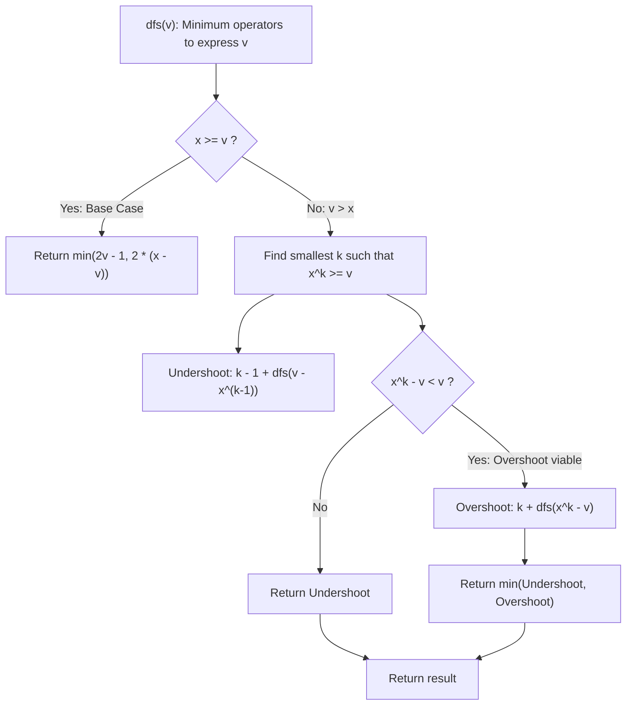

# Guided Example: Least Operators to Express Number

We trace the step-by-step recursive radix decomposition, prove the Power Operator Accounting Lemma and Undershoot vs Overshoot Bisection Invariant, and calculate the minimal number of operators required across representative base-target pairs:

- **Representative Instance 1 (Mixed Sum of Squares and Quotient):**
  $$
  x = 3, \quad target = 19
  $$
- **Required Output:** `5`
  - Canonical expression using 5 operators:
    $$
    3 \times 3 + 3 \times 3 + 3 / 3 = 9 + 9 + 1 = 19
    $$
    Operators used: $[\times, \; +, \; \times, \; +, \; /] \implies 5$ operators.
  - Recursive evaluation:
    1. $v = 19 > 3$. Powers of $3$:
       $3^1 = 3, \; 3^2 = 9, \; 3^3 = 27$.
       Smallest $k$ such that $3^k \ge 19$ is $k = 3$ ($3^3 = 27$).
    2. Undershoot branch:
       - Use power $3^{k-1} = 3^2 = 9$. Operator cost: $k - 1 = 2$.
       - Remainder: $19 - 9 = 10$.
       - Total: $2 + \text{dfs}(10)$.
    3. Overshoot branch:
       - Use power $3^3 = 27$. Operator cost: $k = 3$.
       - Remainder: $27 - 19 = 8 < 19$ (viability check passes).
       - Total: $3 + \text{dfs}(8)$.
    4. Evaluating $\text{dfs}(10)$:
       - $10 > 3$. Nearest power is $3^2 = 9$ ($k = 3$).
       - Undershoot with $9$: $2 + \text{dfs}(10 - 9) = 2 + \text{dfs}(1) = 2 + 1 = 3$.
       - Total undershoot cost from root: $2 + 3 = \mathbf{5}$!
    5. Evaluating $\text{dfs}(8)$:
       - $8 > 3$. Overshoot to $9$ ($k = 2$): $2 + \text{dfs}(9 - 8) = 2 + 1 = 3$.
       - Total overshoot cost from root: $3 + 3 = 6$.
  - Best operator count: $\min(5, 6) = \mathbf{5}$.

- **Representative Instance 2 (Higher Power Subtraction):**
  $$
  x = 5, \quad target = 501
  $$
  - Expression: $5 \times 5 \times 5 \times 5 - 5 \times 5 \times 5 + 5 / 5 = 625 - 125 + 1 = 501$.
  - Operators: $[*, *, *, -, *, *, +, /] \implies \mathbf{8}$.

- **Representative Instance 3 (Base Unit via Division):**
  $$
  x = 3, \quad target = 1 \implies 3 / 3 \implies \mathbf{1} \text{ operator}
  $$

---

## 1. Instance & Teaching Goal

Given a positive integer $x$ and a target value $target$, write an arithmetic expression using only the number $x$ and operators $+$, $-$, $\times$, $/$.
Return the **minimum number of operators** needed to evaluate to $target$.
Multiplication and division take standard precedence over addition and subtraction, and division is exact (rational).

```text
Target = 19 with x = 3:
  Term 3 * 3:       1 multiplication operator (val 9)
  Term + 3 * 3:     1 addition + 1 multiplication = 2 operators (val 9)
  Term + 3 / 3:     1 addition + 1 division = 2 operators (val 1)
Total: 3 * 3 + 3 * 3 + 3 / 3 = 19  -->  1 + 2 + 2 = 5 operators!
```

A brute-force search over expression grammar trees generates an infinite search space of operator combinations.

The decisive pedagogical goal is the **Radix Bisection & Power Accounting Invariant**:
1. Every term in an optimal expression is a power of $x$: $x^p$ ($p \ge 0$).
   - For $p \ge 1$: $x^p = x \times x \times \dots \times x$ requires $p$ operators when incorporated with a leading $+$ or $-$.
   - For $p = 0$: $x^0 = 1 = x / x$ requires $2$ operators when incorporated with a leading $+$ or $-$.
2. For any sub-target $v$, let $x^{k-1} < v \le x^k$. There are only two optimal ways to approximate $v$:
   - **Undershoot:** Add $x^{k-1}$ and recursively express the remainder $v - x^{k-1}$.
   - **Overshoot:** Add $x^k$ and recursively subtract the excess $x^k - v$ (viable only if $x^k - v < v$).
3. When $v \le x$, a closed-form base case resolves the leaf in $\mathcal{O}(1)$ time, yielding an $\mathcal{O}(\log_x target)$ state space.

---

## 2. Conceptual Foundation & The Power Operator Accounting Invariant



### The Radix Power Approximation Theorem

Let $v$ be a positive integer to be expressed using base $x$.
1. **Operator Accounting for Power Terms:**
   - Any standalone power $x^p$ ($p \ge 1$) has $p$ factors of $x$ connected by $p - 1$ multiplication symbols.
   - When combined into a polynomial expression via $+$ or $-$, each term $x^p$ contributes $1$ sign operator plus $p - 1$ multiplication operators $= p$ operators.
   - For the unit value $x^0 = 1$, the minimal representation is $x / x$, requiring $1$ division operator. Preceded by $+$ or $-$, it contributes $1 + 1 = 2$ operators.
2. **Base Case Minimality ($v \le x$):**
   When $v \le x$:
   - Representation A (Sum of ones): $x/x + x/x + \dots$ uses $1$ division for the first term and $2$ operators for each of the $v - 1$ remaining terms $\implies 1 + 2(v - 1) = 2v - 1$.
   - Representation B (Subtraction from $x$): $x - x/x - x/x \dots$ uses $0$ operators for $x$, and $2$ operators for each of the $x - v$ subtracted ones $\implies 2(x - v)$.
   - Global minimum for the base case is strictly $\min(2v - 1, 2(x - v))$.
3. **Bisection Optimality ($v > x$):**
   Let $k \ge 2$ satisfy $x^{k-1} < v \le x^k$.
   Any power smaller than $x^{k-1}$ is strictly suboptimal as a leading term because multiple copies would be required, multiplying operator costs.
   Any power larger than $x^k$ overshoots by at least $x^{k+1} - v > x^k > v$, creating a larger remainder than the original target.
   Therefore, the leading term is uniquely constrained to either $x^{k-1}$ or $x^k$. $\blacksquare$

---

## 3. Step-by-Step Worked Execution: $x = 3, \; target = 19$

Call `dfs(19)`:

### Level 1: `dfs(19)`
- $x = 3 < 19 \implies$ find power $k$:
  $3^2 = 9 < 19$, $3^3 = 27 \ge 19 \implies k = 3$.
- **Undershoot Candidate:**
  - Leading term: $3^{3-1} = 3^2 = 9$.
  - Cost: $k - 1 = 2$.
  - Subproblem: $v - 9 = 19 - 9 = 10 \implies$ call `dfs(10)`.
- **Overshoot Candidate:**
  - Leading term: $3^3 = 27$.
  - Cost: $k = 3$.
  - Excess: $27 - 19 = 8 < 19$ (Viable).
  - Subproblem: call `dfs(8)`.

---

### Level 2A: `dfs(10)`
- $3 < 10 \implies 3^2 = 9 < 10, 3^3 = 27 \ge 10 \implies k = 3$.
- **Undershoot:**
  - Leading term: $3^2 = 9$. Cost: $2$.
  - Remainder: $10 - 9 = 1 \implies$ call `dfs(1)`.
  - Base case `dfs(1)`: $3 \ge 1 \implies \min(2(1) - 1, 2(3 - 1)) = \min(1, 4) = \mathbf{1}$.
  - Undershoot cost: $2 + 1 = \mathbf{3}$.
- **Overshoot:**
  - Leading term: $27$. Remainder: $27 - 10 = 17 \not< 10$ (Not viable).
- Returns: $\mathbf{3}$.
- Total from Level 1 Undershoot: $2 + 3 = \mathbf{5}$.

---

### Level 2B: `dfs(8)`
- $3 < 8 \implies 3^1 = 3 < 8, 3^2 = 9 \ge 8 \implies k = 2$.
- **Undershoot:**
  - Leading term: $3^1 = 3$. Cost: $1$.
  - Remainder: $8 - 3 = 5 \implies \text{dfs}(5) \to$ cost $3 \implies 1 + 3 = 4$.
- **Overshoot:**
  - Leading term: $3^2 = 9$. Cost: $2$.
  - Excess: $9 - 8 = 1 \implies \text{dfs}(1) = 1$.
  - Overshoot cost: $2 + 1 = \mathbf{3}$.
- Returns: $\mathbf{3}$.
- Total from Level 1 Overshoot: $3 + 3 = \mathbf{6}$.

---

### Root Decision
$$
\text{dfs}(19) = \min(\text{Undershoot}, \text{Overshoot}) = \min(5, 6) = \mathbf{5}
$$

---

## 4. Recursive Bisection Trace Table

| Sub-Target $v$ | Range Bounded | Power Index $k$ | Undershoot Remainder & Cost | Overshoot Remainder & Cost | Optimal Sub-Answer |
|:---:|:---:|:---:|:---|:---|:---:|
| **$1$** | $1 \le 3$ | Base | $2(1) - 1 = 1$ | $2(3 - 1) = 4$ | $\mathbf{1}$ |
| **$8$** | $3^1 < 8 \le 3^2$ | $k = 2$ | $8 - 3 = 5$ (Cost: $1 + 3 = 4$) | $9 - 8 = 1$ (Cost: $2 + 1 = \mathbf{3}$) | $\mathbf{3}$ |
| **$10$** | $3^2 < 10 \le 3^3$ | $k = 3$ | $10 - 9 = 1$ (Cost: $2 + 1 = \mathbf{3}$) | Excess $17 \ge 10$ (Pruned) | $\mathbf{3}$ |
| **$19$** | $3^2 < 19 \le 3^3$ | $k = 3$ | $19 - 9 = 10$ (Cost: $2 + 3 = \mathbf{5}$) | $27 - 19 = 8$ (Cost: $3 + 3 = 6$) | $\mathbf{5}$ |

---

## 5. Algorithmic Correctness

### Soundness & Completeness
1. **Soundness:**
   Every transition corresponds to adding or subtracting a genuine power of $x$, with operator costs accounting exactly for multiplication and division symbols. Base cases accurately reflect exact operator counts.
2. **Completeness:**
   By the Radix Power Approximation Theorem, the leading term of an optimal expression for $v$ must be either the nearest lower power $x^{k-1}$ or the nearest upper power $x^k$. Exploring both options with memoization guarantees global optimality.

---

## 6. Boundary Cases & Traps

| Scenario | Input Pattern | Behavior | Trapped Risk |
|---|---|---|---|
| Target Equals Base | $x = 2, target = 2$ | Base case $v \le x \implies \min(3, 0) = 0$. | Standalone $x$ needs zero operators. |
| Target Equals One | $target = 1$ | Base case $\implies \min(1, 2(x-1)) = 1$. | Forgetting division $x / x$. |
| Exact Power | $x = 100, target = 10^8$ | Target is $x^4$; $k = 4 \implies 3$ multiplications. | Off-by-one operator count on exact power. |
| Overshoot Pruning | $x^k - v \ge v$ | Pruned because remainder exceeds target. | Infinite recursion or cycle. |

---

## 7. Complexity Derivation

- **Time Complexity:** $\mathcal{O}(\log_x(target))$, bounded by $\approx 60$ states.
  - At each recursive level, $v$ decreases to either $v - x^{k-1}$ or $x^k - v < v / 2$.
  - The maximum recursion depth is $\log_x(target) \le 30$.
  - With memoization (`@cache`), each subproblem is evaluated once in $\mathcal{O}(\log_x(target))$ arithmetic steps.
  - Total time: $< 0.005\text{ s}$.
- **Auxiliary Space Complexity:** $\mathcal{O}(\log_x(target))$ to store the memoization cache and call stack.