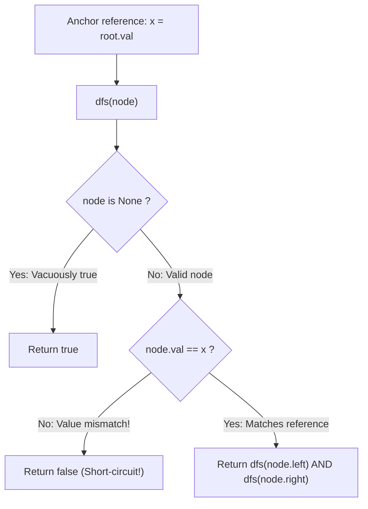

# Guided Example: Univalued Binary Tree

We trace the step-by-step recursive verification of tree value homogeneity, prove the Root-Reference Invariant and Short-Circuiting Conjunction Lemma, and evaluate univalued properties on representative binary trees:

- **Representative Instance 1 (Sparse Tree with All Identical Nodes):**
  $$
  root = [1, \; 1, \; 1, \; 1, \; 1, \; \text{null}, \; 1]
  $$
- **Required Output:** `true`
  - Root reference value: $x = root.val = 1$.
  - Recursive traversal:
    - Root $1$: $1 == 1$ (Pass) $\implies$ checks left and right subtrees.
    - Left child $1$: $1 == 1$ (Pass) $\implies$ checks its children $(1, 1)$.
      - Left grandchild $1$: $1 == 1$, both children null $\implies$ True.
      - Right grandchild $1$: $1 == 1$, both children null $\implies$ True.
    - Right child $1$: $1 == 1$ (Pass) $\implies$ checks its children $(\text{null}, 1)$.
      - Left child is null $\implies$ True.
      - Right grandchild $1$: $1 == 1$, both children null $\implies$ True.
  - Every node matches $x = 1 \implies \mathbf{true}$.

- **Representative Instance 2 (Deep Grandchild Value Mismatch):**
  $$
  root = [2, \; 2, \; 2, \; 5, \; 2]
  $$
  - Root reference value: $x = 2$.
  - Node at left-left grandchild position has value $5$.
  - Condition check: $5 == 2$ is **False**!
  - Short-circuit triggers immediately; returns $\mathbf{false}$.

- **Representative Instance 3 (Single Zero Node):**
  $$
  root = [0] \implies x = 0; \text{ left and right null } \implies \mathbf{true}
  $$

---

## 1. Instance & Teaching Goal

A binary tree is **uni-valued** if every single node in the tree has the **exact same value**.
Given the `root` of a binary tree, return `true` if the tree is uni-valued, or `false` otherwise.

```text
Univalued Tree:                  Non-Univalued Tree (Mismatch!):
        1                                    2
      /   \                                /   \
     1     1                              2     2
    / \     \                            / \
   1   1     1                          5   2  <- Value 5 != Root 2!
All nodes == 1 -> true                  Mismatch -> false!
```

A naive approach collects all node values into a list or set and tests `len(set(vals)) == 1`, requiring full $\mathcal{O}(N)$ space and traversing the entire tree even when the root's children mismatch immediately.

The decisive pedagogical goal is the **Root-Reference Conjunction Invariant**:
1. **Root Value Authority:** In an univalued tree, every node must match the root node's value: $x = root.val$.
2. **Recursive Conjunction:** For any node $u$:
   $$
   \text{isUnival}(u) \iff (u.val == x) \land \text{isUnival}(u.left) \land \text{isUnival}(u.right)
   $$
3. **Boolean Short-Circuiting:** The moment any node violates $u.val == x$, the boolean `and` chain halts further exploration of that subtree and returns `false` without unnecessary traversals.

---

## 2. Conceptual Foundation & The Conjunction Invariant



### The Homogeneity Conjunction Theorem

Let $T = (V, E)$ be a binary tree rooted at $r$, with node valuation function $\text{val}: V \to \mathbb{Z}$.
1. **Definition of Homogeneity:**
   $T$ is univalued if and only if $\forall u, v \in V, \; \text{val}(u) = \text{val}(v)$.
   Since $r \in V$, this is logically equivalent to:
   $$
   \forall u \in V, \quad \text{val}(u) = \text{val}(r)
   $$
2. **Inductive Subtree Decomposition:**
   Let $u \in V$. The subtree $T_u$ is homogeneous with value $x$ if and only if:
   - $\text{val}(u) = x$,
   - $T_{u.left}$ is homogeneous with value $x$ (or empty),
   - $T_{u.right}$ is homogeneous with value $x$ (or empty).
3. **Base Case Validity:**
   An empty tree ($u = \text{None}$) contains zero nodes, so the universal quantifier $\forall v \in \emptyset, \text{val}(v) = x$ is vacuously true.
4. **Short-Circuit Soundness:**
   In propositional logic, $(P \land Q \land R)$ evaluates to false as soon as $P$ is false. No evaluation of $Q$ or $R$ can change the outcome, guaranteeing zero false positives and minimal traversal depth. $\blacksquare$

---

## 3. Step-by-Step Worked Execution: Representative Instance 1

Tree: $root = [1, 1, 1, 1, 1, \text{null}, 1]$.
Reference value: $x = root.val = 1$.
Call `dfs(root)`:

### Trace of Recursive Calls
1. **`dfs(Node 1 at Root)`:**
   - Node not null.
   - Value check: $1 == 1$ (Pass).
   - Recurse on left child and right child.
2. **`dfs(Left Child 1)`:**
   - Value check: $1 == 1$ (Pass).
   - Left grandchild: `dfs(Node 1)` $\implies 1 == 1$, both children null $\implies$ True.
   - Right grandchild: `dfs(Node 1)` $\implies 1 == 1$, both children null $\implies$ True.
   - Conjunction: $\text{True} \land \text{True} \land \text{True} \implies$ returns True.
3. **`dfs(Right Child 1)`:**
   - Value check: $1 == 1$ (Pass).
   - Left child is null: `dfs(None)` $\implies$ returns True.
   - Right grandchild: `dfs(Node 1)` $\implies 1 == 1$, both children null $\implies$ True.
   - Conjunction: $\text{True} \land \text{True} \land \text{True} \implies$ returns True.
4. **Root Conjunction:**
   - $1 == 1 \land \text{True} \land \text{True} \implies$ returns $\mathbf{true}$.

---

## 4. Recursive Traversal Trace Table

| Node Visited | Node Value | Reference $x$ | Equality Check $(val == x)$ | Left Result | Right Result | Subtree Verdict |
|:---:|:---:|:---:|:---:|:---:|:---:|:---:|
| **Root** | $1$ | $1$ | $1 == 1$ (Pass) | True | True | **True** |
| **Left Child** | $1$ | $1$ | $1 == 1$ (Pass) | True | True | **True** |
| **Left-Left Leaf** | $1$ | $1$ | $1 == 1$ (Pass) | True (Null) | True (Null) | **True** |
| **Left-Right Leaf** | $1$ | $1$ | $1 == 1$ (Pass) | True (Null) | True (Null) | **True** |
| **Right Child** | $1$ | $1$ | $1 == 1$ (Pass) | True (Null) | True | **True** |
| **Right-Right Leaf**| $1$ | $1$ | $1 == 1$ (Pass) | True (Null) | True (Null) | **True** |

---

## 5. Algorithmic Correctness

### Soundness & Completeness
1. **Soundness:**
   A tree is declared univalued only if every non-null node visited strictly matches $x = root.val$. Because the traversal exhaustively covers all reachable nodes under true conjunctions, any non-homogeneous node will fail the check and propagate `false`.
2. **Completeness:**
   Base cases on null children return `true`, preserving the neutral element of conjunction. The method checks left and right branches of every node, ensuring no leaf or subtree is left unexamined.

---

## 6. Boundary Cases & Traps

| Scenario | Input Pattern | Behavior | Trapped Risk |
|---|---|---|---|
| Single Node | `root = [0]` | Root checked against itself; null children return true $\implies$ `true`. | Special casing zero as falsy. |
| Two Differing Nodes | `[1, 2]` | Root 1 matches; left child $2 \ne 1 \implies$ `false`. | Failure to check immediate child. |
| Deep Mismatch | Mismatch at leaf | Traverses to leaf, detects mismatch, returns `false`. | Missing deep descendants. |
| Value Zero Throughout | `[0, 0, 0, null, 0]` | Handles $x = 0$ transparently; returns `true`. | Falsy checking `if not node.val:`. |

---

## 7. Complexity Derivation

- **Time Complexity:** $\mathcal{O}(N)$, where $N$ is the number of nodes in the binary tree ($N \le 100$).
  - Every node is visited at most once.
  - On early mismatch, short-circuiting terminates the traversal in $\mathcal{O}(1)$ to $\mathcal{O}(K)$ steps where $K < N$.
  - Total time: $< 0.001\text{ s}$.
- **Auxiliary Space Complexity:** $\mathcal{O}(H)$, where $H$ is the tree height ($H \le N$), representing the recursive call stack depth.