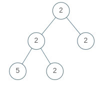

### 1. Description

A binary tree is **uni-valued** if every node in the tree has the same value.

Given the `root` of a binary tree, return `true`* if the given tree is **uni-valued**, or *`false`* otherwise.*

### 2. Function Contract

- `n`: Input parameter.
- Returns expected result.

### 3. Examples

#### Example 1

- **Input:** `root = [1,1,1,1,1,null,1]`
- **Output:** `true`
#### Example 2

- **Input:** `root = [2,2,2,5,2]`
- **Output:** `false`

### 4. Constraints

- The number of nodes in the tree is in the range `[1, 100]`.

- $0 \le \text{Node.val} < 100$