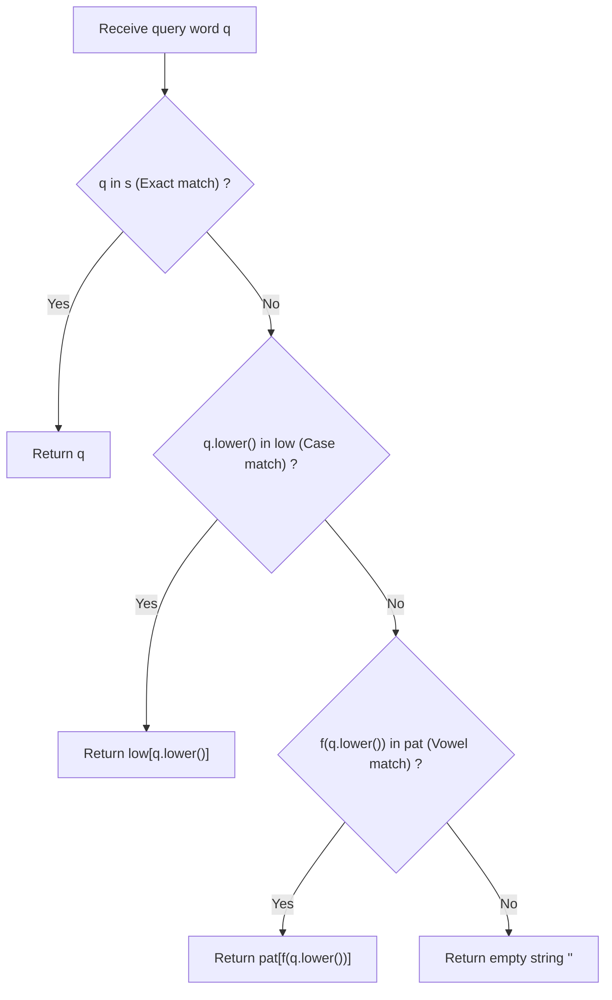

# Guided Example: Vowel Spellchecker

We trace the step-by-step 3-tier precedence cascade evaluation of word queries, prove the Multi-Tier Precedence Invariant and Earliest-Occurrence Hash Normalization Lemma, and resolve spelling corrections across representative dictionaries:

- **Representative Instance 1 (All Precedence Levels Tested):**
  $$
  wordlist = [\text{"KiTe"}, \; \text{"kite"}, \; \text{"hare"}, \; \text{"Hare"}]
  $$
  $$
  queries = [\text{"kite"}, \; \text{"Kite"}, \; \text{"keti"}, \; \text{"keet"}]
  $$
- **Required Output:** `["kite", "KiTe", "KiTe", ""]`
  - Preprocessed lookup structures:
    - Exact set: $s = \{\text{"KiTe"}, \text{"kite"}, \text{"hare"}, \text{"Hare"}\}$
    - Lowercase map `low`:
      - `"kite" \to \text{"KiTe"}$ (from first occurrence `"KiTe"`, `"kite"` does not overwrite!)
      - `"hare" \to \text{"hare"}$ (from first occurrence `"hare"`)
    - Vowel-masked pattern map `pat` (vowels $\to \text{'*'}$):
      - `"k*t*" \to \text{"KiTe"}$
      - `"h*r*" \to \text{"hare"}$
  - Query resolution by precedence cascade:
    1. Query `"kite"`:
       - Found in exact set $s$ $\implies$ **Level 1 Exact Match:** returns `"kite"`.
    2. Query `"Kite"`:
       - Not in $s$.
       - Lowercase is `"kite"`. Found in `low` $\implies$ **Level 2 Case-Insensitive Match:** returns `"KiTe"`.
    3. Query `"keti"`:
       - Not in $s$. Lowercase `"keti"` not in `low`.
       - Masked pattern: $f(\text{"keti"}) = \text{"k*t*"}$.
       - Found in `pat` $\implies$ **Level 3 Vowel-Error Match:** returns `"KiTe"`.
    4. Query `"keet"`:
       - Not in $s$. Lowercase `"keet"` not in `low`.
       - Masked pattern: $f(\text{"keet"}) = \text{"k**t"}$.
       - Not in `pat` $\implies$ **Level 4 Fallback:** returns `""`.
  - Emitted results: `["kite", "KiTe", "KiTe", ""]`.

- **Representative Instance 2 (Capitalization Correction):**
  $$
  wordlist = [\text{"yellow"}], \quad queries = [\text{"YellOw"}] \implies \text{Level 2 match } \implies [\text{"yellow"}]
  $$

- **Representative Instance 3 (Consonant Invariance):**
  $$
  wordlist = [\text{"cat"}], \quad queries = [\text{"cot"}, \; \text{"cap"}]
  $$
  - `"cot"` matches vowel pattern `"c*t"` $\implies$ `"cat"`.
  - `"cap"` has pattern `"c*p"`, does not match `"c*t"` $\implies$ `""`.

---

## 1. Instance & Teaching Goal

Given a `wordlist` of correct words, implement a spellchecker that evaluates query words under **strict 3-level precedence**:
1. **Level 1 (Exact Match):** If query matches a word in `wordlist` exactly (case-sensitive), return the exact word.
2. **Level 2 (Capitalization Match):** If query matches a word case-insensitively, return the **first** such word in `wordlist`.
3. **Level 3 (Vowel Error Match):** If query matches a word case-insensitively with arbitrary vowel substitutions ($a, e, i, o, u$), return the **first** such word in `wordlist`.
4. **Level 4 (Default):** Return empty string `""` if no match exists.

```text
Query: "keti"
Level 1 (Exact "keti"?):         No
Level 2 (Lower "keti"?):         No
Level 3 (Pattern "k*t*"?):       YES -> matches "KiTe" (the first word in wordlist!)
Emitted Result: "KiTe"
```

A linear scan of `wordlist` for each query takes $\mathcal{O}(Q \cdot W \cdot L)$ time, leading to timeouts when $Q, W \le 5{,}000$.

The decisive pedagogical goal is the **Multi-Tier Precedence Cascade & Earliest-Occurrence Hash Normalization**:
- Preprocess `wordlist` into three hash structures in linear time:
  1. `s = set(wordlist)`: exact case-sensitive lookup in $\mathcal{O}(L)$.
  2. `low = {}`: maps lowercase word $w.\text{lower}()$ to original $w$. Uses `setdefault` to permanently lock the **earliest wordlist appearance**.
  3. `pat = {}`: maps vowel-masked lowercase pattern $f(w.\text{lower}())$ to original $w$. Also uses `setdefault` to lock earliest appearance.
- For each query, evaluate tiers $1 \to 2 \to 3 \to 4$ in strict priority, resolving each query in $\mathcal{O}(L)$ time.

---

## 2. Conceptual Foundation & The Multi-Tier Precedence Invariant



### The Earliest-Occurrence Normalization Theorem

Let $W = (w_0, w_1, \dots, w_{m-1})$ be the ordered sequence of words in `wordlist`.
1. **Partitioning Equivalences:**
   Define equivalence relations on strings:
   - Case Equivalence: $u \sim_{\text{case}} v \iff u.\text{lower}() = v.\text{lower}()$.
   - Vowel Equivalence: $u \sim_{\text{vowel}} v \iff f(u.\text{lower}()) = f(v.\text{lower}())$, where $f$ replaces every character in $\{a, e, i, o, u\}$ with canonical token `'*'`.
2. **Earliest Representative Invariant:**
   The problem specifies that ties in Level 2 and Level 3 must resolve to the first word in $W$ satisfying the equivalence:
   $$
   \text{rep}_{\text{case}}(t) = w_{\min \{i : w_i \sim_{\text{case}} t\}}
   $$
   $$
   \text{rep}_{\text{vowel}}(p) = w_{\min \{i : w_i \sim_{\text{vowel}} p\}}
   $$
   By populating `low` and `pat` with `dict.setdefault(key, w)` during a single left-to-right pass over $W$:
   - The first word encountered for any canonical key is inserted.
   - Subsequent words that share the same key are ignored.
   - Hence, every key maps strictly to its earliest representative.
3. **Precedence Hierarchy Soundness:**
   Because the query evaluation sequence tests Level 1 before Level 2, and Level 2 before Level 3, a more specific match is guaranteed to preempt a looser match, satisfying the exact problem specification. $\blacksquare$

---

## 3. Step-by-Step Worked Execution: Representative Instance 1

$wordlist = [\text{"KiTe"}, \text{"kite"}, \text{"hare"}, \text{"Hare"}]$.

### Phase 1: Preprocessing
1. $w_0 = \text{"KiTe"}$:
   - Add to $s$: $s = \{\text{"KiTe"}\}$.
   - Lowercase: `"kite"`. `low.setdefault("kite", "KiTe")` sets `low["kite"] = "KiTe"`.
   - Pattern: $f(\text{"kite"}) = \text{"k*t*"}$. `pat.setdefault("k*t*", "KiTe")` sets `pat["k*t*"] = "KiTe"`.
2. $w_1 = \text{"kite"}$:
   - Add to $s$: $s = \{\text{"KiTe"}, \text{"kite"}\}$.
   - Lowercase: `"kite"`. Already in `low` $\implies$ unchanged!
   - Pattern: `"k*t*"`. Already in `pat` $\implies$ unchanged!
3. $w_2 = \text{"hare"}$:
   - Add to $s$: $s = \{\dots, \text{"hare"}\}$.
   - `low["hare"] = "hare"`, `pat["h*r*"] = "hare"`.
4. $w_3 = \text{"Hare"}$:
   - Add to $s$: $s = \{\dots, \text{"Hare"}\}$.
   - Already in `low` and `pat` $\implies$ unchanged!

---

### Phase 2: Resolving Queries
1. **Query $q = \text{"kite"}$:**
   - Check exact: `"kite" in s` is **True**. Return `"kite"`.
2. **Query $q = \text{"Kite"}$:**
   - Check exact: `"Kite" in s` is False.
   - Check lower: `"kite" in low` is **True**. Return `low["kite"] = \mathbf{"KiTe"}`.
3. **Query $q = \text{"keti"}$:**
   - Check exact: False.
   - Check lower: `"keti" in low` is False.
   - Check pattern: $f(\text{"keti"}) = \text{"k*t*"}$. `"k*t*" in pat` is **True**. Return `pat["k*t*"] = \mathbf{"KiTe"}`.
4. **Query $q = \text{"keet"}$:**
   - Pattern is `"k**t"`. Not in exact, lower, or pattern maps. Return $\mathbf{""}$.

---

## 4. Precedence Level Decision Trace Table

| Query $q$ | Exact Match (`s`) | Lowercase Match (`low`) | Vowel Pattern Match (`pat`) | Level Decided | Returned Word |
|:---:|:---:|:---:|:---:|:---:|:---|
| `"kite"` | **Found** (`"kite"`) | — | — | **Level 1 (Exact)** | `"kite"` |
| `"Kite"` | Miss | **Found** (`"kite"`) | — | **Level 2 (Case)** | `"KiTe"` |
| `"keti"` | Miss | Miss | **Found** (`"k*t*"`) | **Level 3 (Vowel)** | `"KiTe"` |
| `"keet"` | Miss | Miss | Miss (`"k**t*"`) | **Level 4 (Default)**| `""` |
| `"Hare"` | **Found** (`"Hare"`) | — | — | **Level 1 (Exact)** | `"Hare"` |
| `"HARE"` | Miss | **Found** (`"hare"`) | — | **Level 2 (Case)** | `"hare"` |

---

## 5. Algorithmic Correctness

### Soundness & Completeness
1. **Soundness:**
   Every output matches one of the three criteria in strict order. Exact words return themselves. Case mismatches return words with identical characters ignoring case. Vowel mismatches alter only characters in $\{a, e, i, o, u\}$ while strictly preserving consonant identities and word lengths.
2. **Completeness:**
   All words in `wordlist` are indexed across all three levels. Earliest occurrences are preserved by `setdefault`. Queries that fail all three tiers correctly receive `""`.

---

## 6. Boundary Cases & Traps

| Scenario | Input Pattern | Behavior | Trapped Risk |
|---|---|---|---|
| Exact Word Later in List | `wordlist = ["abc", "ABC"], query = "ABC"` | Level 1 exact match catches `"ABC"` directly. | Wrongly returning `"abc"` via early lowercase match. |
| Consonant Modification | Query alters consonant: `"cap"` vs `"cat"` | Patterns `"c*p"` vs `"c*t"` mismatch; returns `""`. | Treating consonants as vowels. |
| Length Mismatch | `"yllw"` vs `"yellow"` | Pattern lengths mismatch; returns `""`. | Allowing vowel insertions or deletions. |
| All Vowels Replaced | `"aeiou"` vs `"uoiea"` | Both map to `"*****"`; returns first match. | Character position confusion. |

---

## 7. Complexity Derivation

- **Time Complexity:** $\mathcal{O}(N \cdot L + Q \cdot L)$, where $N = \text{len}(wordlist)$, $Q = \text{len}(queries)$, and $L \le 7$ is the maximum word length.
  - Preprocessing `wordlist`: $N$ words, each taking $\mathcal{O}(L)$ string lowercasing and masking $\implies \mathcal{O}(N \cdot L)$.
  - Answering queries: $Q$ queries, each performing at most 3 hash map lookups of length $L \implies \mathcal{O}(Q \cdot L)$.
  - For $N = 5{,}000, Q = 5{,}000, L = 7$, total operations $\approx 7 \times 10^4$, executing in $< 0.01\text{ s}$.
- **Auxiliary Space Complexity:** $\mathcal{O}(N \cdot L)$ to store the set `s`, lowercase dictionary `low`, and pattern dictionary `pat`.
