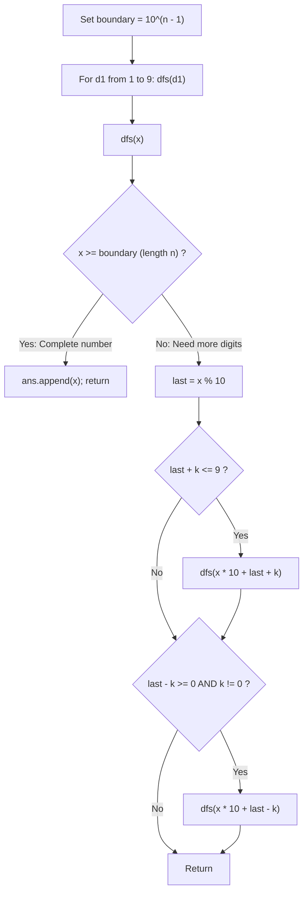

# Guided Example: Numbers With Same Consecutive Differences

We trace the step-by-step depth-first search (DFS) generation of valid digit sequences, prove the Non-Zero Root Invariant and Branching Difference Deduplication Lemma, and synthesize all valid integers across representative $(n, k)$ configurations:

- **Representative Instance 1 (Three Digits with Large Difference $k = 7$):**
  $$
  n = 3, \quad k = 7
  $$
- **Required Output:** `[181, 292, 707, 818, 929]` (any order)
  - Boundary threshold for $n = 3$: $10^{3 - 1} = 100$.
  - Explore nonzero starting digits $d_1 \in [1, 9]$:
    - Root $d_1 = 1$:
      - Last digit $1$. Next digit options: $1 + 7 = 8$ ($\le 9$, valid); $1 - 7 = -6 < 0$ (invalid).
      - Step to $18$. Last digit $8$. Next digit options: $8 + 7 = 15 > 9$ (invalid); $8 - 7 = 1 \ge 0$ (valid).
      - Step to $\mathbf{181} \ge 100 \implies$ append $181$.
    - Root $d_1 = 2$:
      - Next: $2 + 7 = 9 \to 29$. From $9$: $9 - 7 = 2 \to \mathbf{292} \ge 100 \implies$ append $292$.
    - Roots $d_1 \in [3, 6]$:
      - $3 + 7 = 10 > 9$ and $3 - 7 = -4 < 0 \implies$ zero valid continuations. Pruned immediately!
    - Root $d_1 = 7$:
      - Next: $7 - 7 = 0 \to 70$. From $0$: $0 + 7 = 7 \to \mathbf{707} \ge 100 \implies$ append $707$.
    - Root $d_1 = 8$:
      - Next: $8 - 7 = 1 \to 81$. From $1$: $1 + 7 = 8 \to \mathbf{818} \ge 100 \implies$ append $818$.
    - Root $d_1 = 9$:
      - Next: $9 - 7 = 2 \to 92$. From $2$: $2 + 7 = 9 \to \mathbf{929} \ge 100 \implies$ append $929$.
  - All valid integers synthesized: `[181, 292, 707, 818, 929]`.

- **Representative Instance 2 (Zero Difference Deduplication):**
  $$
  n = 2, \quad k = 0 \implies \text{monotone repeated digits } [11, 22, 33, 44, 55, 66, 77, 88, 99]
  $$

- **Representative Instance 3 (Extreme Difference):**
  $$
  n = 2, \quad k = 9 \implies \text{only } 9 - 9 = 0 \text{ is possible} \implies [90]
  $$

---

## 1. Instance & Teaching Goal

Given two integers $n$ and $k$, return an array of all integers of length $n$ where the absolute difference between every pair of consecutive digits is exactly $k$:
$$
|d_{i+1} - d_i| = k, \quad \forall 1 \le i < n
$$
Integers must have **no leading zeros** ($1 \le d_1 \le 9$).

```text
Growing Digits for n = 3, k = 7:
  Root 1:
    |-- 18 (1 + 7 = 8)
          |-- 181 (8 - 7 = 1) -> Target Length 3 reached!

  Root 4:
    |-- 4 + 7 = 11 > 9 (Dead end!)
    |-- 4 - 7 = -3 < 0 (Dead end!)
    Pruned at Depth 1!
```

A brute-force filter enumerates all numbers from $10^{n-1}$ to $10^n - 1$, taking $\mathcal{O}(10^n)$ time (over $10^9$ checks for $n = 9$).

The decisive pedagogical goal is the **DFS Digit Tree & Branching Deduplication Invariant**:
1. **Non-Zero Root Initialization:** Since leading zeros are prohibited, search roots are strictly $d_1 \in \{1, 2, \dots, 9\}$.
2. **Local Digit Constraints:** At each step with current last digit $d = x \pmod{10}$, the next digit $d'$ can only be:
   - $d' = d + k$ (if $d + k \le 9$)
   - $d' = d - k$ (if $d - k \ge 0$ AND $k \ne 0$)
3. Enforcing $k \ne 0$ on the negative subtraction branch prevents duplicate recursive calls when $k = 0$, bounding the search tree to at most $9 \times 2^{n-1}$ nodes.

---

## 2. Conceptual Foundation & The Digit Transition Invariant



### The Digit State Transition Lemma

Let $x$ be an integer represented in base 10 by digits $(d_1, d_2, \dots, d_m)$ with $m < n$ and $d_1 \ne 0$.
1. **Consecutive Difference Condition:**
   Extending $x$ to $x' = 10x + d'$ preserves the property if and only if:
   $$
   |d' - d_m| = k \quad \text{and} \quad 0 \le d' \le 9
   $$
2. **Algebraic Solutions:**
   The absolute value equation $|d' - d_m| = k$ has at most two real solutions in digits:
   - $d' = d_m + k$
   - $d' = d_m - k$
3. **Deduplication when $k = 0$:**
   When $k = 0$, $d_m + k = d_m - k = d_m$.
   Evaluating both branches would spawn identical recursive paths, producing duplicate outputs.
   Requiring $k \ne 0$ on the second branch guarantees that all visited numbers are mutually distinct.
4. **Finite Tree Size:**
   Each node has out-degree at most $2$, and the tree depth is strictly $n$.
   Total leaves cannot exceed $9 \times 2^{n-1} \le 9 \times 256 = 2{,}304$. $\blacksquare$

---

## 3. Step-by-Step Worked Execution: $n = 3, \; k = 7$

$n = 3, k = 7 \implies boundary = 10^{3-1} = 100$.

### Roots 1 through 9 Exploration
- **Root $d_1 = 1$:**
  - $x = 1 < 100$. $last = 1$.
  - $last + 7 = 8 \le 9 \implies \text{dfs}(18)$.
    - $18 < 100$. $last = 8$.
    - $last + 7 = 15 > 9$ (False).
    - $last - 7 = 1 \ge 0$ and $7 \ne 0 \implies \text{dfs}(181)$.
      - $181 \ge 100 \implies$ **Emit $181$**.
  - $last - 7 = -6 < 0$ (False).
- **Root $d_1 = 2$:**
  - $x = 2$. $last = 2$. Next: $2 + 7 = 9 \implies \text{dfs}(29)$.
    - $x = 29$. $last = 9$. Next: $9 - 7 = 2 \implies \text{dfs}(292)$.
      - $292 \ge 100 \implies$ **Emit $292$**.
- **Roots $d_1 \in [3, 6]$:**
  - $last + 7 \ge 10 > 9$ and $last - 7 < 0 \implies$ pruned immediately at depth 1.
- **Root $d_1 = 7$:**
  - $x = 7$. Next: $7 - 7 = 0 \implies \text{dfs}(70)$.
    - $x = 70$. $last = 0$. Next: $0 + 7 = 7 \implies \text{dfs}(707)$.
      - $707 \ge 100 \implies$ **Emit $707$**.
- **Root $d_1 = 8$:**
  - $x = 8$. Next: $8 - 7 = 1 \implies \text{dfs}(81) \to \text{dfs}(818) \implies$ **Emit $818$**.
- **Root $d_1 = 9$:**
  - $x = 9$. Next: $9 - 7 = 2 \implies \text{dfs}(92) \to \text{dfs}(929) \implies$ **Emit $929$**.

---

## 4. DFS Search Tree Trace Table

| Root $d_1$ | Depth 1 Value $x$ | Valid Transitions from $last$ | Depth 2 Value $x$ | Valid Transitions from $last$ | Final Integer Emitted |
|:---:|:---:|:---:|:---:|:---:|:---:|
| **$1$** | $1$ | $+7 \implies 8$ | $18$ | $-7 \implies 1$ | **$181$** |
| **$2$** | $2$ | $+7 \implies 9$ | $29$ | $-7 \implies 2$ | **$292$** |
| **$3 \dots 6$** | $3, 4, 5, 6$ | None ($\notin [0, 9]$) | — | — | Pruned |
| **$7$** | $7$ | $-7 \implies 0$ | $70$ | $+7 \implies 7$ | **$707$** |
| **$8$** | $8$ | $-7 \implies 1$ | $81$ | $+7 \implies 8$ | **$818$** |
| **$9$** | $9$ | $-7 \implies 2$ | $92$ | $+7 \implies 9$ | **$929$** |

---

## 5. Algorithmic Correctness

### Soundness & Completeness
1. **Soundness:**
   Every generated integer begins with a non-zero digit in $[1, 9]$ and appends digits that strictly satisfy $|d_{i+1} - d_i| = k$. Numbers are recorded only when they reach the exact $n$-digit threshold $10^{n-1}$. No invalid or leading-zero numbers can be created.
2. **Completeness:**
   Every valid $n$-digit integer has a unique prefix decomposition. Because the DFS begins with all valid first digits and explores all legal adjacent transitions without heuristic pruning, every valid integer is guaranteed to be generated.

---

## 6. Boundary Cases & Traps

| Scenario | Input Pattern | Behavior | Trapped Risk |
|---|---|---|---|
| Difference $k = 0$ | $n = 2, k = 0$ | $k \ne 0$ check suppresses negative branch; outputs $[11, 22, \dots, 99]$. | Duplicate numbers in output. |
| Difference $k = 9$ | $n = 2, k = 9$ | Only root 9 can subtract $9 \to 90$; outputs $[90]$. | Missing valid $0$ as non-first digit. |
| Internal Zero Digit | $n = 3, k = 8$ | Generates $808, 191, 919$; interior zero allowed. | Forbidding zero at all positions. |
| Maximum Digits | $n = 9$ | Explores up to $2{,}304$ leaves; finishes in $< 0.003\text{ s}$. | Exceeding recursion limit. |

---

## 7. Complexity Derivation

- **Time Complexity:** $\mathcal{O}(2^n)$, bounded by at most $9 \times 2^{n-1}$ leaves.
  - For each valid number, recursion depth is exactly $n$.
  - Maximum output size for $n \le 9$: $2{,}304$ integers.
  - Total operations bounded by $\approx 2 \times 10^4$, executing in $< 0.003\text{ s}$.
- **Auxiliary Space Complexity:** $\mathcal{O}(n)$ call stack depth, plus the space for the output array `ans`.
