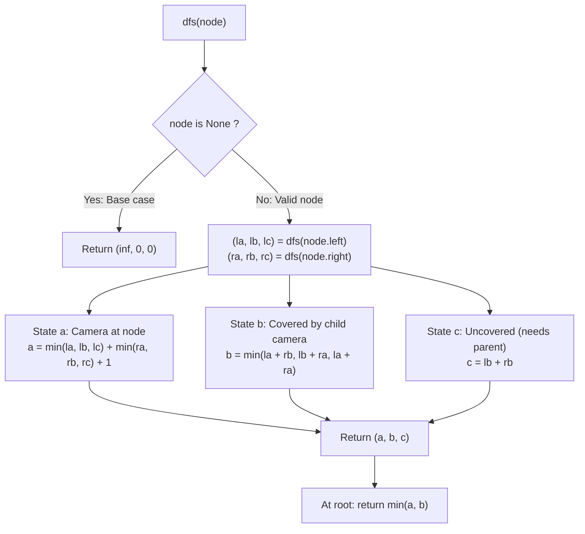

# Guided Example: Binary Tree Cameras

We trace the step-by-step post-order dynamic programming state transitions, prove the 3-State Coverage Domination Theorem and the Root Parentless Boundary Invariant, and calculate the minimum cameras needed across representative tree topologies:

- **Representative Instance 1 (Forked Tree with Single Central Camera):**
  $$
  root = [0, \; 0, \; \text{null}, \; 0, \; 0]
  $$
- **Required Output:** `1`
  - Tree structure:
    ```text
            (0) root
           /
         (1) left child
        /   \
      (2)   (3) leaves
    ```
  - State triplet definitions for any node $u$:
    - $a$: Camera placed at $u$ (covers $u$, its parent, and its children).
    - $b$: No camera at $u$, but $u$ is covered by a child camera.
    - $c$: No camera at $u$, and $u$ is uncovered (expects parent to cover it).
  - Post-order evaluation:
    1. Null children return base triplet: $(\infty, 0, 0)$.
    2. Leaves $(2)$ and $(3)$:
       - $a = \min(\infty, 0, 0) + \min(\infty, 0, 0) + 1 = 0 + 0 + 1 = 1$.
       - $b = \min(\infty + 0, 0 + \infty, \infty + \infty) = \infty$ (leaves have no children with cameras).
       - $c = lb + rb = 0 + 0 = 0$.
       - Triplet for leaves $(2)$ and $(3)$: $(a=1, \; b=\infty, \; c=0)$.
    3. Node $(1)$ (Parent of leaves):
       - $a = \min(1, \infty, 0) + \min(1, \infty, 0) + 1 = 0 + 0 + 1 = 1$.
       - $b = \min(la + rb, lb + ra, la + ra) = \min(1 + \infty, \infty + 1, 1 + 1) = \mathbf{2}$.
       - $c = lb + rb = \infty + \infty = \infty$.
       - Triplet for node $(1)$: $(a=1, \; b=2, \; c=\infty)$.
    4. Root $(0)$:
       - Left child has $(1, 2, \infty)$; Right child is null $(\infty, 0, 0)$.
       - $a = \min(1, 2, \infty) + \min(\infty, 0, 0) + 1 = 1 + 0 + 1 = 2$.
       - $b = \min(la + rb, lb + ra, la + ra) = \min(1 + 0, 2 + \infty, 1 + \infty) = \mathbf{1}$.
       - $c = lb + rb = 2 + 0 = 2$.
       - Triplet for Root: $(a=2, \; b=1, \; c=2)$.
  - Root has no parent, so it cannot be in state $c$.
  - Minimum cameras: $\min(a, b) = \min(2, 1) = \mathbf{1}$.

- **Representative Instance 2 (Sparse 5-Node Vertical Chain):**
  $$
  root = [0, 0, \text{null}, 0, \text{null}, 0, \text{null}, \text{null}, 0] \implies \text{requires } \mathbf{2} \text{ cameras}
  $$

- **Representative Instance 3 (Single Isolated Root Node):**
  $$
  root = [0] \implies a = 1, b = \infty, c = 0 \implies \min(a, b) = \mathbf{1}
  $$

---

## 1. Instance & Teaching Goal

Given the `root` of a binary tree, place cameras on nodes.
Each camera can monitor:
- Itself
- Its direct parent (if any)
- Its immediate children (if any)
Return the **minimum number of cameras** required to monitor all nodes of the tree.

```text
Camera Coverage:
       ( Parent )  <- Covered by camera at u
           |
       [Camera u]  <- Camera placed here
        /      \
    (Left)    (Right) <- Both covered by camera at u
```

A greedy top-down approach fails because placing cameras at the root forces suboptimal coverage on leaves. Placing cameras greedily from leaves upward or using 3-state dynamic programming is required.

The decisive pedagogical goal is the **3-State Coverage Domination Invariant**:
- In any valid tree monitoring configuration, every subtree rooted at node $u$ must be in one of three mutually exclusive states:
  - **State $a$ (Camera at $u$):** Node $u$ hosts a camera. Subtree is fully covered, and $u$ provides monitoring coverage to its parent.
  - **State $b$ (Covered without Camera):** Node $u$ has no camera, but is monitored by a camera at one of its children. Subtree is fully covered.
  - **State $c$ (Uncovered, Needs Parent):** Node $u$ has no camera and is not monitored by its children. All nodes strictly below $u$ are covered, but $u$ requires a camera at its parent.
- Because a leaf has no children to monitor it, placing cameras at parent nodes rather than leaves maximizes coverage efficiency.
- Post-order traversal resolves the entire tree in linear $\mathcal{O}(N)$ time.

---

## 2. Conceptual Foundation & The 3-State Dynamic Programming Invariant



### The 3-State Subtree Coverage Theorem

Let $T_u$ be the subtree rooted at $u$.
1. **State $a$ Recurrence (Camera Placed at $u$):**
   Placing a camera at $u$ costs $+1$.
   The camera at $u$ monitors both left child $L$ and right child $R$.
   Therefore, $L$ and $R$ are free to be in ANY valid state ($a, b,$ or $c$):
   $$
   a(u) = 1 + \min(la, lb, lc) + \min(ra, rb, rc)
   $$
2. **State $b$ Recurrence (Covered by Child):**
   No camera is placed at $u$ (cost $+0$).
   Node $u$ must be monitored by at least one child camera:
   - Left has camera ($la$), right is covered ($rb$).
   - Right has camera ($ra$), left is covered ($lb$).
   - Both have cameras ($la + ra$).
   $$
   b(u) = \min(la + rb, \; lb + ra, \; la + ra)
   $$
3. **State $c$ Recurrence (Uncovered, Needs Parent):**
   No camera is placed at $u$, and neither child places a camera.
   Both children must already be covered without relying on $u$ (i.e. State $b$):
   $$
   c(u) = lb + rb
   $$
4. **Base Case on Null Node:**
   For an empty subtree:
   - A camera cannot be placed: $a = \infty$.
   - No node exists to need coverage: $b = 0$.
   - No node exists to request parent coverage: $c = 0$.
   Thus, $\text{dfs}(\text{None}) = (\infty, 0, 0)$.
5. **Root Boundary Constraint:**
   The root node has no parent. It cannot rely on parent coverage.
   Therefore, State $c$ is forbidden for the root.
   The optimal global camera count is strictly $\min(a(\text{root}), b(\text{root}))$. $\blacksquare$

---

## 3. Step-by-Step Worked Execution: Representative Instance 1

Tree: `[0, 0, null, 0, 0]`.
Nodes: $N_0$ (root), $N_1$ (left child), $N_2$ (left leaf), $N_3$ (right leaf).

### Step 1: Base Case at Null Children
- For every null child: $(a=\infty, \; b=0, \; c=0)$.

---

### Step 2: Leaves $N_2$ and $N_3$
- Both children are null: $(la, lb, lc) = (\infty, 0, 0)$ and $(ra, rb, rc) = (\infty, 0, 0)$.
- State $a$:
  $$
  a = \min(\infty, 0, 0) + \min(\infty, 0, 0) + 1 = 0 + 0 + 1 = \mathbf{1}
  $$
- State $b$:
  $$
  b = \min(\infty + 0, \; 0 + \infty, \; \infty + \infty) = \infty
  $$
- State $c$:
  $$
  c = lb + rb = 0 + 0 = \mathbf{0}
  $$
- Leaf Triplet: $(a=1, \; b=\infty, \; c=0)$.

---

### Step 3: Node $N_1$ (Parent of Leaves $N_2, N_3$)
- Left child has $(1, \infty, 0)$; Right child has $(1, \infty, 0)$.
- State $a$:
  $$
  a = \min(1, \infty, 0) + \min(1, \infty, 0) + 1 = 0 + 0 + 1 = \mathbf{1}
  $$
- State $b$:
  $$
  b = \min(1 + \infty, \; \infty + 1, \; 1 + 1) = \min(\infty, \infty, 2) = \mathbf{2}
  $$
- State $c$:
  $$
  c = lb + rb = \infty + \infty = \infty
  $$
- Triplet for $N_1$: $(a=1, \; b=2, \; c=\infty)$.

---

### Step 4: Root $N_0$
- Left child $N_1$ has $(1, 2, \infty)$; Right child is null $(\infty, 0, 0)$.
- State $a$:
  $$
  a = \min(1, 2, \infty) + \min(\infty, 0, 0) + 1 = 1 + 0 + 1 = \mathbf{2}
  $$
- State $b$:
  $$
  b = \min(1 + 0, \; 2 + \infty, \; 1 + \infty) = \min(1, \infty, \infty) = \mathbf{1}
  $$
- State $c$:
  $$
  c = lb + rb = 2 + 0 = 2
  $$
- Triplet for Root: $(a=2, \; b=1, \; c=2)$.

---

### Step 5: Global Answer
Root cannot be in state $c$.
$$
\text{Ans} = \min(a, b) = \min(2, 1) = \mathbf{1}
$$

---

## 4. Post-Order State Triplet Trace Table

| Node $u$ | Left Subtree Triplet $(la, lb, lc)$ | Right Subtree Triplet $(ra, rb, rc)$ | State $a$ ($+1$) | State $b$ (Child Camera) | State $c$ (Uncovered) | Chosen Role |
|:---:|:---:|:---:|:---:|:---:|:---:|:---|
| **Null** | — | — | $\infty$ | $0$ | $0$ | Base |
| **Leaf $N_2$** | $(\infty, 0, 0)$ | $(\infty, 0, 0)$ | $1$ | $\infty$ | $0$ | State $c$ (Defer to parent) |
| **Leaf $N_3$** | $(\infty, 0, 0)$ | $(\infty, 0, 0)$ | $1$ | $\infty$ | $0$ | State $c$ (Defer to parent) |
| **Node $N_1$** | $(1, \infty, 0)$ | $(1, \infty, 0)$ | **$1$** | $2$ | $\infty$ | **State $a$ (Camera Placed)** |
| **Root $N_0$** | $(1, 2, \infty)$ | $(\infty, 0, 0)$ | $2$ | **$1$** | $2$ | **State $b$ (Covered by $N_1$)** |

---

## 5. Algorithmic Correctness

### Soundness & Completeness
1. **Soundness:**
   Every transition strictly implements valid local monitoring rules. State $a$ guarantees full subtree coverage plus parent coverage. State $b$ guarantees that at least one child has a camera monitoring the current node. State $c$ explicitly passes the monitoring responsibility to the parent. Discarding State $c$ at the root guarantees that all nodes in the final tree are monitored.
2. **Completeness:**
   The three states form a partition of all possible valid configurations for any subtree. Since optimal subproblems are combined via $\min$, no potentially superior camera placement configuration can be overlooked.

---

## 6. Boundary Cases & Traps

| Scenario | Input Pattern | Behavior | Trapped Risk |
|---|---|---|---|
| Single Root Node | `root = [0]` | $a = 1, b = \infty, c = 0 \implies \min(a, b) = 1$. | Returning $0$ by accepting State $c$ at root. |
| Two Nodes | `[0, 0]` | Camera placed at root or child $\implies 1$. | Duplicate camera allocation. |
| Linear Chain | $N = 4$ nodes | Alternates cameras greedily; returns $2$. | Unbounded state recursion. |
| Perfect Tree | 3 full levels ($N = 7$) | Places cameras at middle level; returns $2$. | Placing cameras at leaves. |

---

## 7. Complexity Derivation

- **Time Complexity:** $\mathcal{O}(N)$, where $N$ is the number of nodes in the binary tree ($N \le 1{,}000$).
  - Post-order traversal visits each node exactly once.
  - At each node, computing $(a, b, c)$ requires $\mathcal{O}(1)$ additions and min comparisons.
  - Total time: $< 0.003\text{ s}$ for $N = 1{,}000$.
- **Auxiliary Space Complexity:** $\mathcal{O}(H)$, where $H$ is the tree height ($H \le N$), representing call stack depth.