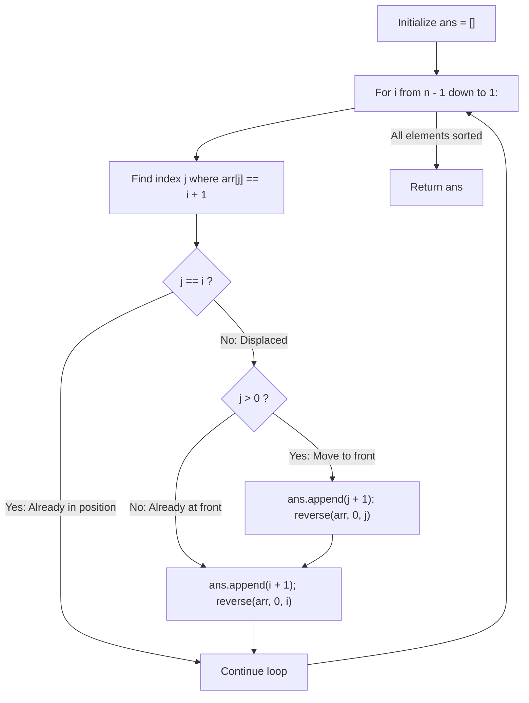

# Guided Example: Pancake Sorting

We trace the step-by-step prefix reversals of pancake sorting, prove the Two-Flip Prefix Induction Invariant and Suffix Protection Invariant, and synthesize a valid sequence of prefix flip lengths across representative permutation arrays:

- **Representative Instance 1 (Four-Element Permutation):**
  $$
  arr = [3, \; 2, \; 4, \; 1] \quad (n = 4)
  $$
- **Required Output:** A sequence of flip lengths $k$ (at most $10n = 40$) that sorts `arr`.
  - Target elements processed in descending order $v \in [4, 3, 2]$:
    1. **Place Value $v = 4$ at Index $i = 3$:**
       - Search for $4$ in $arr[0 \dots 3]$: found at index $j = 2$.
       - Flip 1 ($k = j + 1 = 3$): reverse $arr[0 \dots 2]$:
         $$
         [3, 2, 4, 1] \xrightarrow{\text{rev}(0 \dots 2)} [\mathbf{4}, 2, 3, 1]
         $$
         (Value $4$ is now at index $0$!).
       - Flip 2 ($k = i + 1 = 4$): reverse $arr[0 \dots 3]$:
         $$
         [4, 2, 3, 1] \xrightarrow{\text{rev}(0 \dots 3)} [1, 3, 2, \mathbf{4}]
         $$
         (Value $4$ is permanently placed at index $3$!).
    2. **Place Value $v = 3$ at Index $i = 2$:**
       - Search for $3$ in $arr[0 \dots 2]$: found at index $j = 1$.
       - Flip 1 ($k = j + 1 = 2$): reverse $arr[0 \dots 1]$:
         $$
         [1, 3, 2, 4] \xrightarrow{\text{rev}(0 \dots 1)} [\mathbf{3}, 1, 2, 4]
         $$
         (Value $3$ is now at index $0$!).
       - Flip 2 ($k = i + 1 = 3$): reverse $arr[0 \dots 2]$:
         $$
         [3, 1, 2, 4] \xrightarrow{\text{rev}(0 \dots 2)} [2, 1, \mathbf{3}, \mathbf{4}]
         $$
         (Value $3$ is permanently placed at index $2$!).
    3. **Place Value $v = 2$ at Index $i = 1$:**
       - Search for $2$ in $arr[0 \dots 1]$: found at index $j = 0$.
       - $j = 0 \implies$ already at index $0$! Skip Flip 1.
       - Flip 2 ($k = i + 1 = 2$): reverse $arr[0 \dots 1]$:
         $$
         [2, 1, 3, 4] \xrightarrow{\text{rev}(0 \dots 1)} [\mathbf{1}, \mathbf{2}, \mathbf{3}, \mathbf{4}]
         $$
  - Array is fully sorted!
  - Emitted flip sequence: `[3, 4, 2, 3, 2]` (5 flips, well within $10n = 40$).

- **Representative Instance 2 (Already Sorted Array):**
  $$
  arr = [1, \; 2, \; 3] \implies \text{every value already in position } j == i \implies []
  $$

- **Representative Instance 3 (Reversed Pair):**
  $$
  arr = [2, \; 1] \implies \text{single flip } k = 2 \implies [1, 2] \implies [2]
  $$

---

## 1. Instance & Teaching Goal

Given an integer permutation `arr` of numbers $1$ through $n$, sort the array using only **pancake flips**.
A pancake flip with integer $k$ ($1 \le k \le n$) reverses the prefix sub-array $arr[0 \dots k - 1]$.
Return any valid sequence of flip lengths $k$ that sorts `arr` within $10n$ total flips.

```text
Target: Move element 4 to the end (Index 3).
Current Array: [ 3, 2, 4, 1 ]
                      ^
                      j = 2

Step 1: Flip k = j + 1 = 3 -> Reverse [3, 2, 4] -> [ 4, 2, 3, 1 ] (Target moves to front!)
Step 2: Flip k = i + 1 = 4 -> Reverse entire [4, 2, 3, 1] -> [ 1, 3, 2, 4 ] (Target in place!)
```

Searching for the strictly shortest flip sequence is NP-hard. However, any sequence using at most $10n$ flips is valid.

The decisive pedagogical goal is the **Two-Flip Prefix Induction Invariant**:
- By placing elements in descending order from $n$ down to $1$:
  - For target element $v = i + 1$ located at index $j$:
    1. If $j == i$: already in place, zero flips needed.
    2. If $j > 0$: flip $k = j + 1$ moves $v$ to index $0$.
    3. Flip $k = i + 1$ moves $v$ from index $0$ to target index $i$.
- **Suffix Protection:** Because each flip only modifies the prefix $0 \dots i$, previously placed elements at indices $i + 1, \dots, n - 1$ remain completely undisturbed.
- Each element requires at most $2$ flips, completing sorting in $\le 2(n - 1) < 2n$ flips and $\mathcal{O}(n^2)$ time.

---

## 2. Conceptual Foundation & The Two-Flip Induction Invariant



### The Suffix Protection Theorem

Let `arr` be an array of size $n$, containing a permutation of $\{1, 2, \dots, n\}$.
1. **Inductive Hypothesis:**
   At the start of step $i$, suppose the suffix $arr[i+1 \dots n-1]$ is already correctly placed and sorted:
   $$
   arr[m] = m + 1, \quad \forall i + 1 \le m < n
   $$
2. **Prefix Invariance:**
   The remaining unplaced elements $\{1, 2, \dots, i + 1\}$ reside entirely within the prefix $arr[0 \dots i]$.
   Therefore, the target element $v = i + 1$ is guaranteed to be found at some index $j \le i$.
3. **Two-Step Permutation:**
   - If $j < i$:
     - Reversing $arr[0 \dots j]$ modifies only indices $0 \dots j \le i$, moving $v$ to index $0$.
     - Reversing $arr[0 \dots i]$ modifies only indices $0 \dots i$, moving the element at index $0$ (which is $v$) to index $i$.
   - Neither reversal affects any index $m > i$.
   - Thus, $arr[i] = i + 1$, and the suffix $arr[i \dots n-1]$ is now sorted, establishing the inductive step.
4. **Flip Count Bound:**
   Each step $i \in [n - 1, \dots, 1]$ uses at most $2$ flips.
   Total flips $\le 2(n - 1) < 2n \ll 10n$, strictly within problem limits. $\blacksquare$

---

## 3. Step-by-Step Worked Execution: Representative Instance 1

Array: $arr = [3, 2, 4, 1], \; n = 4$.

### Step 1: Place $v = 4$ at Index $i = 3$
- Locate $4$: found at $j = 2$.
- $j < i$ ($2 < 3$):
  - Flip 1 ($j > 0$): append $k = j + 1 = 3$.
    - Reverse $arr[0 \dots 2]$: $[3, 2, 4, 1] \to [4, 2, 3, 1]$.
  - Flip 2: append $k = i + 1 = 4$.
    - Reverse $arr[0 \dots 3]$: $[4, 2, 3, 1] \to [1, 3, 2, 4]$.
- Suffix $[4]$ sealed.

---

### Step 2: Place $v = 3$ at Index $i = 2$
- Locate $3$ in $arr[0 \dots 2]$: found at $j = 1$.
- $j < i$ ($1 < 2$):
  - Flip 1: append $k = j + 1 = 2$.
    - Reverse $arr[0 \dots 1]$: $[1, 3, 2, 4] \to [3, 1, 2, 4]$.
  - Flip 2: append $k = i + 1 = 3$.
    - Reverse $arr[0 \dots 2]$: $[3, 1, 2, 4] \to [2, 1, 3, 4]$.
- Suffix $[3, 4]$ sealed.

---

### Step 3: Place $v = 2$ at Index $i = 1$
- Locate $2$ in $arr[0 \dots 1]$: found at $j = 0$.
- $j < i$ ($0 < 1$):
  - $j == 0 \implies$ already at index $0$; skip Flip 1.
  - Flip 2: append $k = i + 1 = 2$.
    - Reverse $arr[0 \dots 1]$: $[2, 1, 3, 4] \to [1, 2, 3, 4]$.
- Suffix $[2, 3, 4]$ sealed.

---

### Result
Array is $[1, 2, 3, 4]$.
Flips emitted: $[3, 4, 2, 3, 2]$. Total flips: $5 \le 40$.

---

## 4. Array State Evolution Trace Table

| Step $i$ | Target Value $v$ | Found Index $j$ | Flip $k$ Applied | Subarray Reversed | Resulting Array State |
|:---:|:---:|:---:|:---:|:---|:---|
| **Init** | — | — | — | — | $[3, 2, 4, 1]$ |
| **$3$** | $4$ | $2$ | $k = 3$ | $arr[0 \dots 2]$ | $[4, 2, 3, 1]$ |
| **$3$** | $4$ | $0$ | $k = 4$ | $arr[0 \dots 3]$ | $[1, 3, 2, \mathbf{4}]$ |
| **$2$** | $3$ | $1$ | $k = 2$ | $arr[0 \dots 1]$ | $[3, 1, 2, 4]$ |
| **$2$** | $3$ | $0$ | $k = 3$ | $arr[0 \dots 2]$ | $[2, 1, \mathbf{3}, \mathbf{4}]$ |
| **$1$** | $2$ | $0$ | $k = 2$ | $arr[0 \dots 1]$ | $[\mathbf{1}, \mathbf{2}, \mathbf{3}, \mathbf{4}]$ |

---

## 5. Algorithmic Correctness

### Soundness & Completeness
1. **Soundness:**
   Every operation performed is a valid prefix reversal of length $k \in [1, n]$. Because each operation on target $i$ preserves previously sorted suffixes $i+1 \dots n-1$, the array monotonically approaches complete sorted order.
2. **Completeness:**
   Since the input is a permutation of $1 \dots n$, the target value $i + 1$ always exists in the active prefix $0 \dots i$. The two-flip sequence deterministically places it at index $i$, guaranteeing that the entire array is sorted when $i$ reaches $1$.

---

## 6. Boundary Cases & Traps

| Scenario | Input Pattern | Behavior | Trapped Risk |
|---|---|---|---|
| Already Sorted | `[1, 2, 3]` | $j == i$ for all $i$; returns `[]` (0 flips). | Performing redundant flips on sorted input. |
| Single Element | `[1]` | Loop for $i$ from $0$ down to $1$ is empty; returns `[]`. | Loop bounds on array length 1. |
| Target at Index 0 | $j = 0$ | Skips first flip, executes only $k = i + 1$. | Applying redundant flip of length 1. |
| Reversed Array | `[5, 4, 3, 2, 1]` | Each element placed via single flip; returns $[5, 4, 3, 2]$. | Excessive flips on inverted input. |

---

## 7. Complexity Derivation

- **Time Complexity:** $\mathcal{O}(n^2)$, where $n = \text{len}(arr) \le 100$.
  - Outer loop runs $n - 1$ times.
  - In step $i$, finding index $j$ takes $\mathcal{O}(i)$ comparisons.
  - Reversing prefixes of length at most $i + 1$ takes $\mathcal{O}(i)$ pointer swaps.
  - Total time: $\sum_{i=1}^{n-1} \mathcal{O}(i) = \mathcal{O}(n^2)$, executing in $< 0.001\text{ s}$ for $n = 100$.
- **Auxiliary Space Complexity:** $\mathcal{O}(1)$ beyond the output list of flips (at most $2n$ integers).
