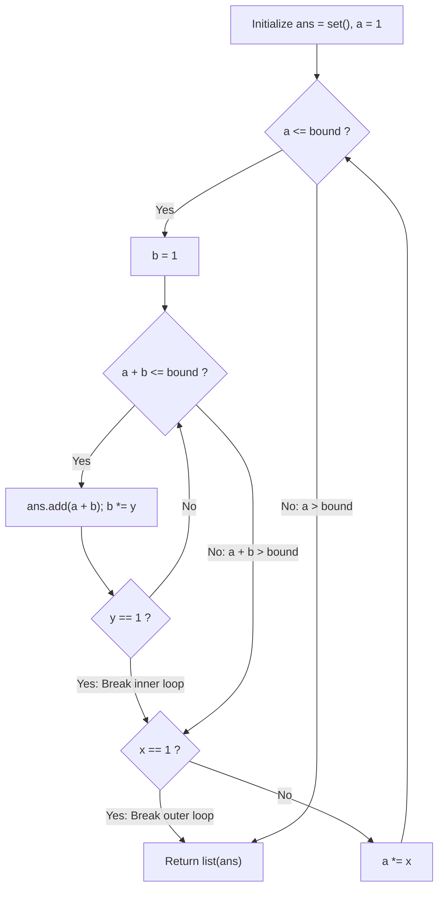

# Guided Example: Powerful Integers

We trace the step-by-step enumeration of exponential power pairs, prove the Bounded Logarithmic Search Theorem and the Unit-Base Degeneracy Break Invariant, and synthesize all unique powerful integers across representative parameter sets:

- **Representative Instance 1 (Powers of Two and Three with Bound Ten):**
  $$
  x = 2, \quad y = 3, \quad bound = 10
  $$
- **Required Output:** `[2, 3, 4, 5, 7, 9, 10]` (any order)
  - Eligible powers of $x = 2$ ($a = 2^i \le 10$):
    $$
    a \in [2^0, \; 2^1, \; 2^2, \; 2^3] = [1, \; 2, \; 4, \; 8]
    $$
  - Eligible powers of $y = 3$ ($b = 3^j \le 10$):
    $$
    b \in [3^0, \; 3^1, \; 3^2] = [1, \; 3, \; 9]
    $$
  - Pairwise summation where $a + b \le 10$:
    - For $a = 1$:
      - $b = 1 \implies 1 + 1 = \mathbf{2} \le 10$ (Keep)
      - $b = 3 \implies 1 + 3 = \mathbf{4} \le 10$ (Keep)
      - $b = 9 \implies 1 + 9 = \mathbf{10} \le 10$ (Keep)
    - For $a = 2$:
      - $b = 1 \implies 2 + 1 = \mathbf{3} \le 10$ (Keep)
      - $b = 3 \implies 2 + 3 = \mathbf{5} \le 10$ (Keep)
      - $b = 9 \implies 2 + 9 = 11 > 10$ (Exceeds bound, inner loop breaks)
    - For $a = 4$:
      - $b = 1 \implies 4 + 1 = 5 \le 10$ (Duplicate of $2 + 3$, deduplicated)
      - $b = 3 \implies 4 + 3 = \mathbf{7} \le 10$ (Keep)
      - $b = 9 \implies 4 + 9 = 13 > 10$ (Break)
    - For $a = 8$:
      - $b = 1 \implies 8 + 1 = \mathbf{9} \le 10$ (Keep)
      - $b = 3 \implies 8 + 3 = 11 > 10$ (Break)
  - Set of unique powerful integers: $\{2, 3, 4, 5, 7, 9, 10\}$.

- **Representative Instance 2 (Unit Base Degeneracy):**
  $$
  x = 1, \quad y = 1, \quad bound = 2
  $$
  - Powers of $1$ are identically $1$.
  - Only possible sum: $1^0 + 1^0 = 1 + 1 = \mathbf{2}$.
  - Result: `[2]`.

- **Representative Instance 3 (Bound Below Minimum Possible Sum):**
  $$
  x = 2, \quad y = 3, \quad bound = 1 \implies \min(x^i + y^j) = 1 + 1 = 2 > 1 \implies []
  $$

---

## 1. Instance & Teaching Goal

Given three integers $x$, $y$, and $bound$, return a list of all **powerful integers** $\le bound$.
An integer is powerful if it can be represented as:
$$
x^i + y^j \quad \text{for some integers } i \ge 0, \; j \ge 0
$$
Each value in the returned list must be unique.

```text
Grid of Exponent Sums (x = 2, y = 3, bound = 10):
        b = 1 (3^0)   b = 3 (3^1)   b = 9 (3^2)
a = 1       2             4            10
a = 2       3             5           (11 > 10)
a = 4       5             7           (13 > 10)
a = 8       9            (11 > 10)    (17 > 10)

Valid Unique Integers <= 10: {2, 3, 4, 5, 7, 9, 10}
```

Because $i, j \ge 0$, an unbounded search over exponents risks an infinite loop, especially when $x = 1$ or $y = 1$ where $1^k = 1$ never exceeds $bound$.

The decisive pedagogical goal is the **Bounded Logarithmic Search & Unit-Base Break Invariant**:
1. **Exponential Boundedness:** When $x \ge 2$, $x^i$ grows strictly exponentially. The number of powers of $x \le bound$ is at most $\lfloor \log_x bound \rfloor + 1 \le 20$ for $bound \le 10^6$.
2. **Unit-Base Cycle Elimination:** When $x = 1$ (or $y = 1$), multiplying by the base never increases the value ($1 \times 1 = 1$). An explicit check (`if x == 1: break` and `if y == 1: break`) terminates the loop after examining the single distinct power $1^0 = 1$.
3. **Hash Set Deduplication:** Inserting all valid sums into a hash set automatically collapses duplicate representations into unique values.

---

## 2. Conceptual Foundation & The Unit-Base Break Invariant



### The Logarithmic Bounded Enumeration Theorem

Let $x, y \ge 1$ and $bound \ge 0$.
1. **Lower Bound of Powers:**
   Since $i, j \ge 0$, $x^i \ge 1$ and $y^j \ge 1$.
   Therefore, any powerful integer satisfies:
   $$
   x^i + y^j \ge 1 + 1 = 2
   $$
   If $bound < 2$, no integer can satisfy $x^i + y^j \le bound$. The set of answers is strictly empty.
2. **Upper Bound on Exponents for $b \ge 2$:**
   If $x \ge 2$:
   $$
   x^i + y^j \le bound \implies x^i < bound \implies i \le \log_x(bound)
   $$
   For $bound = 10^6$, $\log_2(10^6) < 20$.
   The outer while loop runs at most $20$ iterations. Similarly, the inner while loop runs at most $20$ iterations.
3. **Degeneracy of Base $1$:**
   If $x = 1$, $1^i = 1$ for all $i \ge 0$. The set of distinct powers is $\{1\}$.
   Executing the loop with $a = 1$ and breaking immediately explores all distinct powers of $x$ in exactly $1$ iteration.
   The same applies to $y = 1$.
4. **Total State Space:**
   In all cases, the total number of pairs $(a, b)$ evaluated is at most $20 \times 20 = 400$, guaranteeing termination in $\mathcal{O}(\log_x(bound) \cdot \log_y(bound))$ operations. $\blacksquare$

---

## 3. Step-by-Step Worked Execution: Representative Instance 1

$x = 2, y = 3, bound = 10$.
Initialize: $ans = \text{set}(), \; a = 1$.

### Outer Iteration 1: $a = 1$ ($2^0$)
- $a = 1 \le 10$.
- Inner loop $b$:
  - $b = 1$: $a + b = 1 + 1 = 2 \le 10 \implies ans = \{2\}$; $b \leftarrow 3$.
  - $b = 3$: $a + b = 1 + 3 = 4 \le 10 \implies ans = \{2, 4\}$; $b \leftarrow 9$.
  - $b = 9$: $a + b = 1 + 9 = 10 \le 10 \implies ans = \{2, 4, 10\}$; $b \leftarrow 27$.
  - $b = 27$: $1 + 27 = 28 > 10 \implies$ inner loop breaks.
- Advance: $x \ne 1 \implies a \leftarrow 1 \times 2 = \mathbf{2}$.

---

### Outer Iteration 2: $a = 2$ ($2^1$)
- $a = 2 \le 10$.
- Inner loop $b$:
  - $b = 1$: $2 + 1 = 3 \le 10 \implies ans = \{2, 4, 10, 3\}$; $b \leftarrow 3$.
  - $b = 3$: $2 + 3 = 5 \le 10 \implies ans = \{2, 4, 10, 3, 5\}$; $b \leftarrow 9$.
  - $b = 9$: $2 + 9 = 11 > 10 \implies$ breaks.
- Advance: $a \leftarrow 2 \times 2 = \mathbf{4}$.

---

### Outer Iteration 3: $a = 4$ ($2^2$)
- $a = 4 \le 10$.
- Inner loop $b$:
  - $b = 1$: $4 + 1 = 5 \le 10 \implies 5 \in ans$; $b \leftarrow 3$.
  - $b = 3$: $4 + 3 = 7 \le 10 \implies ans = \{2, 4, 10, 3, 5, 7\}$; $b \leftarrow 9$.
  - $b = 9$: $4 + 9 = 13 > 10 \implies$ breaks.
- Advance: $a \leftarrow 4 \times 2 = \mathbf{8}$.

---

### Outer Iteration 4: $a = 8$ ($2^3$)
- $a = 8 \le 10$.
- Inner loop $b$:
  - $b = 1$: $8 + 1 = 9 \le 10 \implies ans = \{2, 4, 10, 3, 5, 7, 9\}$; $b \leftarrow 3$.
  - $b = 3$: $8 + 3 = 11 > 10 \implies$ breaks.
- Advance: $a \leftarrow 8 \times 2 = \mathbf{16}$.

---

### Outer Iteration 5: $a = 16 > 10$
- Outer loop terminates.
- Final set converted to list: `[2, 3, 4, 5, 7, 9, 10]`.

---

## 4. Power Pair Evaluation Trace Table

| Power $a = x^i$ | Power $b = y^j$ | Sum $a + b$ | Check $a + b \le bound$ | Set Insertion | Updated Set Size |
|:---:|:---:|:---:|:---:|:---|:---:|
| $1$ | $1$ | $2$ | $2 \le 10$ (Pass) | Add $2$ | $1$ |
| $1$ | $3$ | $4$ | $4 \le 10$ (Pass) | Add $4$ | $2$ |
| $1$ | $9$ | $10$ | $10 \le 10$ (Pass) | Add $10$ | $3$ |
| $2$ | $1$ | $3$ | $3 \le 10$ (Pass) | Add $3$ | $4$ |
| $2$ | $3$ | $5$ | $5 \le 10$ (Pass) | Add $5$ | $5$ |
| $4$ | $1$ | $5$ | $5 \le 10$ (Pass) | Duplicate $5$ | $5$ |
| $4$ | $3$ | $7$ | $7 \le 10$ (Pass) | Add $7$ | $6$ |
| $8$ | $1$ | $9$ | $9 \le 10$ (Pass) | Add $9$ | $7$ |

---

## 5. Algorithmic Correctness

### Soundness & Completeness
1. **Soundness:**
   Every generated element is of the form $x^i + y^j$ with $i, j \ge 0$, and is added only when $a + b \le bound$. Deduplication via hash set guarantees that each valid powerful integer appears at most once in the output.
2. **Completeness:**
   Since powers are non-decreasing, once $a + b > bound$, all subsequent $b$ for the same $a$ will also exceed $bound$. Similarly, once $a > bound$, all subsequent $a$ will exceed $bound$. No valid pair $(a, b)$ with $a + b \le bound$ can be missed.

---

## 6. Boundary Cases & Traps

| Scenario | Input Pattern | Behavior | Trapped Risk |
|---|---|---|---|
| Both Bases Equal One | $x = 1, y = 1, bound = 2$ | Both loops break after one iteration; outputs `[2]`. | Infinite loop when base is 1. |
| One Base Equal One | $x = 1, y = 2, bound = 10$ | Outer loop breaks after $a = 1$; outputs $[2, 3, 5, 9]$. | Infinite loop on single base 1. |
| Bound Below Minimum | $bound = 1$ | While loop condition fails; returns `[]`. | Adding 1 when bound is 1. |
| Duplicate Collisions | $x = 2, y = 2$ | Many overlapping powers; set retains unique sums. | Duplicate values in list. |

---

## 7. Complexity Derivation

- **Time Complexity:** $\mathcal{O}(\log_x(bound) \cdot \log_y(bound))$ for $x, y \ge 2$.
  - At most $\lfloor \log_x bound \rfloor + 1$ distinct powers of $x$.
  - At most $\lfloor \log_y bound \rfloor + 1$ distinct powers of $y$.
  - For $bound \le 10^6$, maximum iterations $\le 20 \times 20 = 400$.
  - Each set insertion is $\mathcal{O}(1)$.
  - Total time: $< 0.001\text{ s}$.
- **Auxiliary Space Complexity:** $\mathcal{O}(\log_x(bound) \cdot \log_y(bound))$ to store the unique values in hash set `ans` (at most 400 integers).
