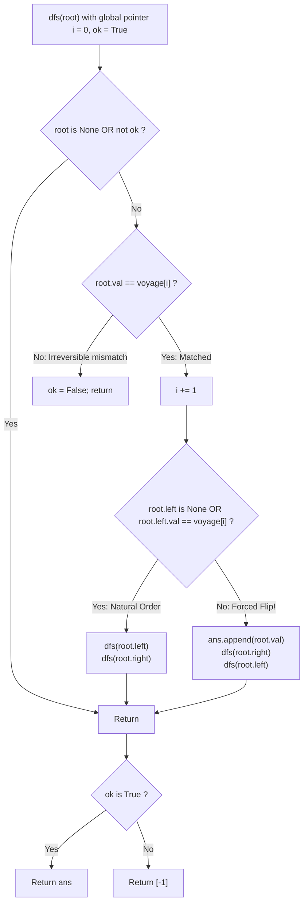

# Guided Example: Flip Binary Tree To Match Preorder Traversal

We trace the step-by-step recursive pre-order synchronization with the voyage array, prove the Root Pre-Order Anchor Invariant and Forced Flip Lemma, and determine the minimal set of flipped nodes across representative tree-voyage pairs:

- **Representative Instance 1 (Root Child Inversion):**
  $$
  root = [1, \; 2, \; 3], \quad voyage = [1, \; 3, \; 2]
  $$
- **Required Output:** `[1]`
  - Tree structure before flip:
    ```text
          (1)
         /   \
       (2)   (3)
    ```
  - Pre-order traversal pointer tracking:
    - Step 1: Visit root node $1$. Pointer $i = 0$.
      - Check: $root.val == voyage[0] \iff 1 == 1$ (Pass).
      - Advance pointer: $i \leftarrow 1$. Target is now $voyage[1] = 3$.
    - Step 2: Examine left child $2$:
      - $root.left.val = 2 \ne voyage[1] = 3$.
      - In standard pre-order, the left child must be traversed next. Because $2 \ne 3$, leaving the children unflipped would immediately fail!
      - Action: **Forced Flip at Node 1!**
        - Record flip: `ans.append(1)`.
        - Swap traversal order: visit right child $3$ first, then left child $2$.
    - Step 3: Visit right child $3$:
      - Check: $3 == voyage[1]$ ($3 == 3$, Pass).
      - Advance pointer: $i \leftarrow 2$. Target is now $voyage[2] = 2$.
      - Both children of $3$ are null $\implies$ return.
    - Step 4: Visit left child $2$:
      - Check: $2 == voyage[2]$ ($2 == 2$, Pass).
      - Advance pointer: $i \leftarrow 3$.
      - Both children of $2$ are null $\implies$ return.
  - All $3$ nodes matched successfully.
  - Return: `[1]`.

- **Representative Instance 2 (Root Mismatch Infeasible):**
  $$
  root = [1, \; 2], \quad voyage = [2, \; 1]
  $$
  - $root.val = 1 \ne voyage[0] = 2$.
  - Flips only swap left and right children of a node; a flip can never alter the root's own value.
  - Pre-order match is impossible $\implies \mathbf{[-1]}$.

- **Representative Instance 3 (Already Conforming Traversal):**
  $$
  root = [1, \; 2, \; 3], \quad voyage = [1, \; 2, \; 3] \implies \text{no flips required} \implies \mathbf{[]}
  $$

---

## 1. Instance & Teaching Goal

Given the `root` of a binary tree with $n$ uniquely valued nodes ($1$ to $n$) and a permutation `voyage` of $1$ to $n$, flip the minimum number of nodes so that the pre-order traversal of the tree matches `voyage`.
A flip at node $u$ swaps its left and right subtrees.
Return the list of values of flipped nodes, or `[-1]` if no sequence of flips can match `voyage`.

```text
Unflipped Pre-order:  [ 1,  2,  3 ]  != voyage [ 1,  3,  2 ]
Flip at Node 1:
        1                        1
      /   \      FLIP (1)      /   \
     2     3     ======>      3     2

Flipped Pre-order:    [ 1,  3,  2 ]  == voyage [ 1,  3,  2 ] -> MATCH!
```

A brute-force approach explores all $2^N$ flip combinations across the $N$ nodes.

The decisive pedagogical goal is the **Greedy Pre-Order Synchronization & Forced Flip Invariant**:
1. **Pre-Order Anchor:** The first node visited in any pre-order traversal of subtree $u$ is $u$ itself. Thus, $u.val == voyage[i]$ is mandatory.
2. **Forced Flip Decision:** After visiting $u$, the next token in `voyage` must be the root of the first child traversed.
   - If $u.left$ exists and $u.left.val == voyage[i]$, we must traverse $u.left$ then $u.right$ (unflipped).
   - If $u.left$ exists and $u.left.val \ne voyage[i]$, unflipped traversal is impossible! We are strictly **forced to flip** $u$, appending $u.val$ to `ans` and traversing $u.right$ before $u.left$.
3. If at any step the current node fails to match $voyage[i]$, the entire search aborts and returns `[-1]`.

---

## 2. Conceptual Foundation & The Forced Flip Invariant



### The Forced Flip Theorem

Let $T_u$ be a subtree rooted at $u$, and let $voyage[i \dots i + |T_u| - 1]$ be the remaining desired pre-order sequence.
1. **Pre-Order Precedence:**
   By definition of pre-order traversal, $u$ must be the first element evaluated in $T_u$.
   Therefore, $u.val = voyage[i]$ is a necessary condition for equivalence. If $u.val \ne voyage[i]$, no flips within $T_u$ can change $u$'s position, making equivalence impossible.
2. **Deterministic Child Orientation:**
   After matching $u$, pointer advances to $i + 1$.
   The next element in `voyage` must be the root of whichever child subtree is visited first.
   - If $u.left$ exists and $u.left.val = voyage[i+1]$:
     The left child matches the upcoming token. Visiting $u.right$ first would require $u.right.val = voyage[i+1]$, but node values are strictly unique ($u.right.val \ne u.left.val$). Hence, flipping $u$ would fail, so $u$ must remain unflipped.
   - If $u.left$ exists and $u.left.val \ne voyage[i+1]$:
     Leaving $u$ unflipped would require $u.left.val = voyage[i+1]$, which is false.
     Thus, flipping $u$ is the **only viable choice**.
3. **Optimality:**
   Because every flip decision is uniquely determined by the next required value in `voyage`, the greedy strategy achieves the strictly minimal number of flips without backtracking. $\blacksquare$

---

## 3. Step-by-Step Worked Execution: Representative Instance 1

Tree: $root = [1, 2, 3], \; voyage = [1, 3, 2]$.
Initialize: $ans = [], \; i = 0, \; ok = \text{True}$.
Call `dfs(Node 1)`:

### Trace of Traversal
1. **At Root $1$ ($i = 0$):**
   - Check: $1 == voyage[0]$ ($1 == 1$, Match).
   - Advance: $i \leftarrow 1$.
   - Left child exists: $root.left.val = 2$.
   - Compare with $voyage[1] = 3$:
     $$
     root.left.val = 2 \ne 3
     $$
   - Decision: **Flip Node 1**.
     - `ans.append(1)`.
     - Call `dfs(root.right)` (Node 3), then `dfs(root.left)` (Node 2).
2. **At Right Child $3$ ($i = 1$):**
   - Check: $3 == voyage[1]$ ($3 == 3$, Match).
   - Advance: $i \leftarrow 2$.
   - $3.left$ is null $\implies$ traverse children (both null, return).
3. **At Left Child $2$ ($i = 2$):**
   - Check: $2 == voyage[2]$ ($2 == 2$, Match).
   - Advance: $i \leftarrow 3$.
   - $2.left$ is null $\implies$ traverse children (both null, return).

---

### Final Evaluation
- $ok$ is **True**.
- Emitted flips: `ans = [1]`.

---

## 4. Pre-Order Pointer Synchronization Trace Table

| Recursion Step | Active Node | Desired $voyage[i]$ | Value Check | Child Comparison | Action Taken | Updated Pointer $i$ | Cumulative Flips `ans` |
|:---:|:---:|:---:|:---:|:---|:---|:---:|:---:|
| **$1$** | Node $1$ | $voyage[0] = 1$ | $1 == 1$ (Pass) | $root.left (2) \ne voyage[1] (3)$ | **Flip Node 1** | $1$ | `[1]` |
| **$2$** | Node $3$ | $voyage[1] = 3$ | $3 == 3$ (Pass) | Left is null | No flip | $2$ | `[1]` |
| **$3$** | Node $2$ | $voyage[2] = 2$ | $2 == 2$ (Pass) | Left is null | No flip | $3$ | `[1]` |

---

## 5. Algorithmic Correctness

### Soundness & Completeness
1. **Soundness:**
   Every flip is performed only when the left child cannot match the next required element in `voyage`. If a node's value does not match $voyage[i]$, $ok$ is set to `False` and `[-1]` is returned, ensuring zero false positives.
2. **Completeness:**
   Because all node values in the tree are distinct, the required child orientation is uniquely forced at each branch. The algorithm explores the only viable orientation, guaranteeing that if a valid flip sequence exists, it is found with the minimal number of flips.

---

## 6. Boundary Cases & Traps

| Scenario | Input Pattern | Behavior | Trapped Risk |
|---|---|---|---|
| Root Mismatch | `root = [1, 2], voyage = [2, 1]` | $1 \ne 2 \implies ok = \text{False}$; returns `[-1]`. | Attempting to flip parent of root. |
| Already Sorted | `root = [1, 2, 3], voyage = [1, 2, 3]` | Left matches $voyage[1]$; returns `[]`. | Performing redundant flips. |
| Subtree Boundary Mismatch | Inner child structure incompatible | Later node fails $u.val == voyage[i]$; returns `[-1]`. | Overwriting mismatched indices. |
| Single Node Tree | `root = [1], voyage = [1]` | Matches root, no children; returns `[]`. | Array out-of-bounds on index 1. |

---

## 7. Complexity Derivation

- **Time Complexity:** $\mathcal{O}(N)$, where $N$ is the number of nodes in the binary tree ($N \le 100$).
  - Each tree node is visited exactly once during the pre-order traversal.
  - At each node, constant-time operations compare values and advance pointer $i$.
  - Total time: $< 0.001\text{ s}$ for $N = 100$.
- **Auxiliary Space Complexity:** $\mathcal{O}(H)$, where $H$ is the height of the tree ($H \le N$), representing the depth of the recursive call stack.